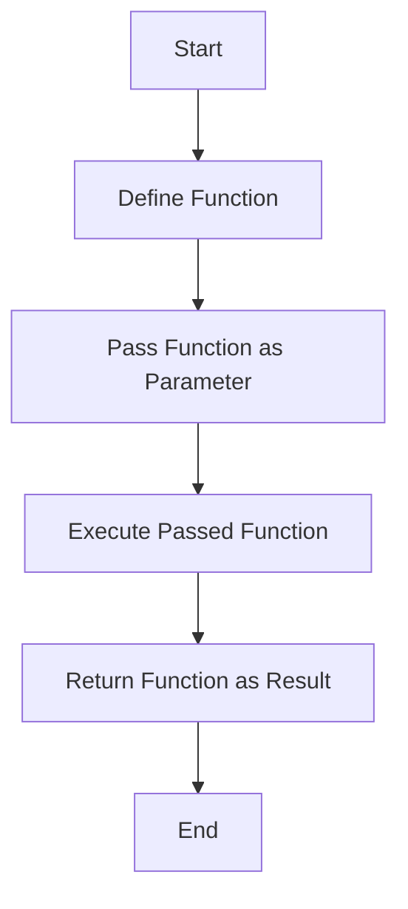

## 10.2 Higher-Order Functions and Closures

In the realm of Swift programming, higher-order functions and closures are powerful tools that enable developers to write more concise, expressive, and flexible code. By mastering these concepts, you can significantly enhance your ability to build robust and scalable applications. This section will delve into the intricacies of higher-order functions and closures, illustrating their use through detailed explanations and practical examples.

### Understanding Higher-Order Functions

**Higher-order functions** are functions that can take other functions as parameters or return them as results. This capability allows for a high degree of flexibility and abstraction in coding, enabling developers to create more modular and reusable code.

#### Implementing Higher-Order Functions

1. **Parameters and Returns**: Higher-order functions can accept functions as parameters and return functions as results. This is particularly useful for creating customizable and reusable components.

   ```swift
   // A higher-order function that takes a function as a parameter
   func performOperation(_ operation: (Int, Int) -> Int, on a: Int, and b: Int) -> Int {
       return operation(a, b)
   }

   // Example usage with a closure
   let sum = performOperation({ $0 + $1 }, on: 5, and: 3)
   print(sum) // Output: 8
   ```

2. **Closures**: Closures are self-contained blocks of functionality that can be passed around and used in your code. They are similar to functions, but with more concise syntax and the ability to capture values from their surrounding context.

   ```swift
   // A simple closure that adds two numbers
   let addClosure: (Int, Int) -> Int = { (a, b) in
       return a + b
   }

   // Using the closure
   let result = addClosure(4, 6)
   print(result) // Output: 10
   ```

3. **Capturing Values**: Closures can capture and store references to variables and constants from the surrounding context in which they are defined. This is known as **capturing values**.

   ```swift
   func makeIncrementer(incrementAmount: Int) -> () -> Int {
       var total = 0
       let incrementer: () -> Int = {
           total += incrementAmount
           return total
       }
       return incrementer
   }

   let incrementByTwo = makeIncrementer(incrementAmount: 2)
   print(incrementByTwo()) // Output: 2
   print(incrementByTwo()) // Output: 4
   ```

### Use Cases and Examples

Higher-order functions and closures are versatile tools that can be applied in various scenarios:

1. **Event Handling**: Use closures as callbacks or completion handlers to manage asynchronous tasks or events.

   ```swift
   func fetchData(completion: @escaping (Result<Data, Error>) -> Void) {
       // Simulate a network request
       DispatchQueue.global().async {
           let data = Data() // Assume this is the fetched data
           completion(.success(data))
       }
   }

   fetchData { result in
       switch result {
       case .success(let data):
           print("Data fetched: \\(data)")
       case .failure(let error):
           print("Error: \\(error)")
       }
   }
   ```

2. **Algorithm Customization**: Inject different functions to alter the behavior of an algorithm without modifying its structure.

   ```swift
   func filterArray(_ array: [Int], using condition: (Int) -> Bool) -> [Int] {
       return array.filter(condition)
   }

   let numbers = [1, 2, 3, 4, 5, 6]
   let evenNumbers = filterArray(numbers, using: { $0 % 2 == 0 })
   print(evenNumbers) // Output: [2, 4, 6]
   ```

3. **Functional Operations**: Swift's standard library provides a suite of higher-order functions such as `map`, `filter`, and `reduce` that work seamlessly with closures.

   ```swift
   let names = ["Alice", "Bob", "Charlie"]
   let uppercasedNames = names.map { $0.uppercased() }
   print(uppercasedNames) // Output: ["ALICE", "BOB", "CHARLIE"]

   let numbers = [1, 2, 3, 4, 5]
   let sum = numbers.reduce(0, +)
   print(sum) // Output: 15
   ```

### Visualizing Higher-Order Functions and Closures

To better understand how higher-order functions and closures work, let's visualize their interaction using a flowchart:



**Figure 1**: Flowchart illustrating the process of using higher-order functions in Swift.

### Key Participants

- **Function Parameters**: Functions that are passed as arguments to other functions.
- **Returned Functions**: Functions that are returned from other functions.
- **Closures**: Inline functions that capture values from their surrounding context.

### Applicability

Higher-order functions and closures are applicable in scenarios where you need:

- **Customizable behavior**: Modify the behavior of a function without altering its core logic.
- **Asynchronous operations**: Manage callbacks and completion handlers effectively.
- **Functional programming**: Leverage the power of functional programming paradigms in Swift.

### Swift Unique Features

Swift's syntax for closures is concise and expressive, allowing for inline function definitions and capturing values with ease. The language's emphasis on safety and performance makes it an ideal choice for implementing higher-order functions.

### Differences and Similarities

While higher-order functions and closures are related, it's important to distinguish between them:

- **Higher-order functions** are a broader concept that encompasses functions taking or returning other functions.
- **Closures** are a specific type of inline function that can capture values from their context.

### Try It Yourself

To deepen your understanding, try modifying the code examples provided. Experiment with different closure expressions, capture lists, and higher-order function implementations. For instance, create a closure that captures an external variable and modifies it within the closure.

### Key Takeaways

- **Higher-order functions** enhance code modularity and flexibility by allowing functions to be passed as parameters or returned as results.
- **Closures** are powerful tools for encapsulating functionality and capturing values from their surrounding context.
- **Use cases** for higher-order functions and closures include event handling, algorithm customization, and functional operations.

### References and Links

For further reading on higher-order functions and closures, consider exploring the following resources:

- [Swift Programming Language Guide](https://developer.apple.com/documentation/swift)
- [Swift.org Documentation](https://swift.org/documentation/)
- [Ray Wenderlich's Swift Tutorials](https://www.raywenderlich.com/ios/learn)

### Embrace the Journey

Remember, mastering higher-order functions and closures is a journey that will empower you to write more elegant and efficient Swift code. Continue experimenting, stay curious, and enjoy the process of learning and applying these powerful concepts in your projects.

## Quiz Time!



### What is a higher-order function?

- [x] A function that takes other functions as parameters or returns them as results.
- [ ] A function that only performs mathematical operations.
- [ ] A function that can only be used with closures.
- [ ] A function that is always asynchronous.

> **Explanation:** Higher-order functions can take other functions as parameters or return them as results, allowing for more flexible and reusable code.

### How do closures capture values?

- [x] By retaining references to variables from their surrounding context.
- [ ] By copying the values of variables at the time of closure creation.
- [ ] By ignoring external variables.
- [ ] By creating new instances of variables.

> **Explanation:** Closures capture and store references to variables from their surrounding context, allowing them to retain and manipulate these values.

### Which of the following is a use case for higher-order functions?

- [x] Event handling with callbacks.
- [ ] Only performing mathematical calculations.
- [ ] Creating static variables.
- [ ] Writing documentation.

> **Explanation:** Higher-order functions are used in event handling, allowing for callbacks and completion handlers to manage asynchronous tasks or events.

### What is the purpose of the `map` function in Swift?

- [x] To transform each element in a collection using a closure.
- [ ] To filter elements from a collection.
- [ ] To sort elements in a collection.
- [ ] To find a specific element in a collection.

> **Explanation:** The `map` function in Swift applies a closure to each element in a collection, transforming them into a new collection.

### How can you modify the behavior of an algorithm using higher-order functions?

- [x] By injecting different functions into the algorithm.
- [ ] By rewriting the entire algorithm.
- [ ] By changing the data types used.
- [ ] By using only built-in functions.

> **Explanation:** Higher-order functions allow you to inject different functions into an algorithm, altering its behavior without modifying its structure.

### What is a closure in Swift?

- [x] A self-contained block of functionality that can capture values from its context.
- [ ] A type of class in Swift.
- [ ] A built-in Swift function.
- [ ] A method of handling errors.

> **Explanation:** A closure is a self-contained block of functionality that can capture and store references to variables from its surrounding context.

### What does the `reduce` function do in Swift?

- [x] It combines elements of a collection into a single value using a closure.
- [ ] It removes elements from a collection.
- [ ] It duplicates elements in a collection.
- [ ] It sorts elements in a collection.

> **Explanation:** The `reduce` function combines elements of a collection into a single value by applying a closure that specifies how to combine elements.

### What is the syntax for defining a closure in Swift?

- [x] `{ (parameters) -> ReturnType in statements }`
- [ ] `func(parameters) -> ReturnType { statements }`
- [ ] `[parameters] -> ReturnType { statements }`
- [ ] `closure(parameters) -> ReturnType { statements }`

> **Explanation:** The syntax for defining a closure in Swift is `{ (parameters) -> ReturnType in statements }`, which allows for concise inline function definitions.

### Can closures be used as return types in Swift functions?

- [x] True
- [ ] False

> **Explanation:** Closures can be used as return types in Swift functions, allowing functions to return encapsulated blocks of functionality.

### What is the benefit of using higher-order functions in Swift?

- [x] They enable more modular and reusable code.
- [ ] They make code execution faster.
- [ ] They simplify syntax for loops.
- [ ] They eliminate the need for variables.

> **Explanation:** Higher-order functions enable more modular and reusable code by allowing functions to be passed as parameters or returned as results, enhancing flexibility and abstraction.




