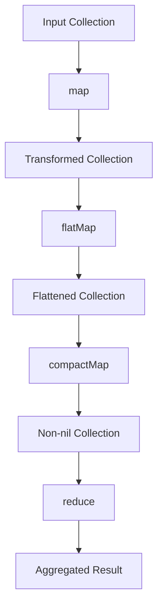

## 10.3 Map, FlatMap, CompactMap, and Reduce

In the realm of Swift programming, functional programming patterns such as `map`, `flatMap`, `compactMap`, and `reduce` offer powerful ways to manipulate collections. These methods allow developers to write concise and expressive code, transforming and processing data in a declarative manner. Let's dive into each of these methods, exploring their intent, implementation, and practical use cases.

### Intent

The primary intent of using `map`, `flatMap`, `compactMap`, and `reduce` is to transform and process collections in a declarative and concise manner. These methods enable developers to:

- **Implement Functional Collection Methods**:
  - **`map`**: Apply a function to each element in a collection.
  - **`flatMap`**: Flatten a collection of collections.
  - **`compactMap`**: Transform elements and remove `nil` values.
  - **`reduce`**: Aggregate values into a single result.

### Implementing Functional Collection Methods

#### Map

The `map` function is used to apply a transformation to each element in a collection. It returns a new array containing the results of applying the provided closure to each element.

**Example**: Suppose we have an array of integers, and we want to square each number.

```swift
let numbers = [1, 2, 3, 4, 5]
let squaredNumbers = numbers.map { $0 * $0 }
print(squaredNumbers) // Output: [1, 4, 9, 16, 25]
```

In this example, the closure `{ $0 * $0 }` is applied to each element of the `numbers` array, resulting in a new array of squared numbers.

#### FlatMap

The `flatMap` function is used when you have a collection of collections and you want to flatten it into a single collection. It also applies a transformation to each element.

**Example**: Consider an array of arrays, and we want to flatten it into a single array.

```swift
let nestedNumbers = [[1, 2, 3], [4, 5, 6], [7, 8, 9]]
let flatNumbers = nestedNumbers.flatMap { $0 }
print(flatNumbers) // Output: [1, 2, 3, 4, 5, 6, 7, 8, 9]
```

In this example, `flatMap` flattens the nested arrays into a single array.

#### CompactMap

The `compactMap` function is used to transform elements of a collection and remove any `nil` values from the result. This is particularly useful when dealing with optional values.

**Example**: Suppose we have an array of strings representing numbers, and we want to convert them to integers, ignoring any non-numeric strings.

```swift
let stringNumbers = ["1", "2", "three", "4", "five"]
let validNumbers = stringNumbers.compactMap { Int($0) }
print(validNumbers) // Output: [1, 2, 4]
```

In this example, `compactMap` converts the strings to integers and filters out any `nil` values resulting from non-numeric strings.

#### Reduce

The `reduce` function is used to combine all elements of a collection into a single value. It takes an initial value and a closure that specifies how to combine elements.

**Example**: Let's calculate the sum of an array of integers.

```swift
let numbers = [1, 2, 3, 4, 5]
let sum = numbers.reduce(0, +)
print(sum) // Output: 15
```

In this example, `reduce` starts with an initial value of `0` and combines each element of the array using the `+` operator to calculate the sum.

### Use Cases and Examples

#### Data Transformation

Functional methods like `map` are ideal for transforming data. For instance, converting an array of model objects into a different representation.

**Example**: Transform an array of `User` objects into an array of usernames.

```swift
struct User {
    let name: String
    let age: Int
}

let users = [User(name: "Alice", age: 30), User(name: "Bob", age: 25)]
let usernames = users.map { $0.name }
print(usernames) // Output: ["Alice", "Bob"]
```

#### Flattening Data

When dealing with nested data structures, `flatMap` simplifies the process by flattening the collection.

**Example**: Flatten an array of optional arrays.

```swift
let nestedOptionalNumbers: [[Int]?] = [[1, 2, 3], nil, [4, 5], nil, [6]]
let flatNumbers = nestedOptionalNumbers.flatMap { $0 ?? [] }
print(flatNumbers) // Output: [1, 2, 3, 4, 5, 6]
```

#### Aggregation

The `reduce` method is perfect for aggregating values, such as calculating totals or concatenating strings.

**Example**: Concatenate an array of strings into a single sentence.

```swift
let words = ["Swift", "is", "a", "powerful", "language."]
let sentence = words.reduce("") { $0 + " " + $1 }
print(sentence) // Output: " Swift is a powerful language."
```

### Try It Yourself

Experiment with these functional methods by modifying the code examples. Try changing the initial values in `reduce` or using different transformations in `map` and `compactMap`.

### Visualizing Functional Collection Methods

To better understand how these methods work, consider the following diagram illustrating the flow of data through `map`, `flatMap`, `compactMap`, and `reduce`.



This diagram represents the sequence of transformations and aggregations applied to a collection using these functional methods.

### References and Links

For further reading on Swift's functional programming capabilities, consider exploring the following resources:

- [Swift.org](https://swift.org/documentation/)
- [Apple Developer Documentation](https://developer.apple.com/documentation/swift)
- [Swift by Sundell](https://www.swiftbysundell.com/)

### Knowledge Check

Before we conclude, let's reinforce our understanding with a few questions and exercises.

1. What is the primary difference between `map` and `flatMap`?
2. How does `compactMap` handle `nil` values?
3. Write a `reduce` function to calculate the product of an array of numbers.

### Embrace the Journey

Remember, mastering these functional programming patterns is just the beginning. As you progress, you'll discover even more ways to leverage Swift's powerful collection methods. Keep experimenting, stay curious, and enjoy the journey!

### Quiz Time!



### What does the `map` function do in Swift?

- [x] Applies a transformation to each element in a collection.
- [ ] Flattens a collection of collections.
- [ ] Removes `nil` values from a collection.
- [ ] Aggregates values into a single result.

> **Explanation:** The `map` function applies a transformation to each element in a collection, resulting in a new collection with transformed elements.

### Which function would you use to flatten a nested array?

- [ ] map
- [x] flatMap
- [ ] compactMap
- [ ] reduce

> **Explanation:** The `flatMap` function is used to flatten a collection of collections into a single collection.

### How does `compactMap` differ from `map`?

- [x] It removes `nil` values from the resulting collection.
- [ ] It applies a transformation to each element.
- [ ] It aggregates values into a single result.
- [ ] It flattens a collection of collections.

> **Explanation:** `compactMap` not only applies a transformation but also removes `nil` values from the resulting collection.

### What is the purpose of the `reduce` function?

- [ ] To apply a transformation to each element.
- [ ] To flatten a collection of collections.
- [ ] To remove `nil` values from a collection.
- [x] To aggregate values into a single result.

> **Explanation:** The `reduce` function aggregates values from a collection into a single result using a specified closure.

### Which method would you use to transform an array of optional integers, removing `nil` values?

- [ ] map
- [ ] flatMap
- [x] compactMap
- [ ] reduce

> **Explanation:** `compactMap` is used to transform elements and remove `nil` values from a collection.

### What is the initial value in a `reduce` function used for?

- [x] It serves as the starting point for the aggregation.
- [ ] It determines the transformation applied to each element.
- [ ] It specifies the elements to be flattened.
- [ ] It removes `nil` values from the collection.

> **Explanation:** The initial value in a `reduce` function serves as the starting point for the aggregation process.

### Which function would you use to convert an array of strings to an array of integers, ignoring non-numeric strings?

- [ ] map
- [ ] flatMap
- [x] compactMap
- [ ] reduce

> **Explanation:** `compactMap` can be used to convert an array of strings to integers while ignoring non-numeric strings by removing `nil` values.

### What is the result of using `flatMap` on an array of arrays?

- [ ] A collection with transformed elements.
- [x] A single flattened array.
- [ ] An array with `nil` values removed.
- [ ] An aggregated single value.

> **Explanation:** `flatMap` results in a single flattened array from an array of arrays.

### True or False: `reduce` can be used to concatenate strings in an array.

- [x] True
- [ ] False

> **Explanation:** `reduce` can indeed be used to concatenate strings in an array by specifying a closure that combines strings.

### Which function would you use to apply a transformation and remove `nil` values in one step?

- [ ] map
- [ ] flatMap
- [x] compactMap
- [ ] reduce

> **Explanation:** `compactMap` is designed to apply a transformation and remove `nil` values in one step.


