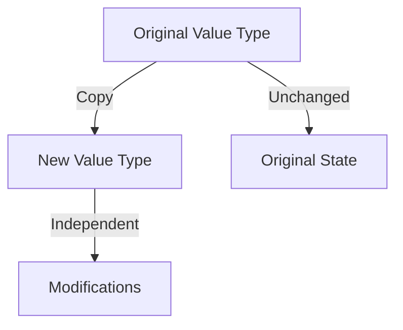

## 10.4 Immutability and Value Types in Functional Programming

In the realm of functional programming, immutability and value types are fundamental concepts that help create robust, scalable, and maintainable software. By leveraging these principles, developers can simplify code reasoning, enhance thread safety, and ensure predictable behavior. In Swift, these concepts are elegantly supported through its language features, making it a powerful tool for functional programming.

### Intent

The primary intent of using immutability and value types in functional programming is to prevent unintended side effects and simplify reasoning about code. By ensuring that data structures do not change state after they are created, developers can build applications that are easier to understand, test, and maintain.

### Implementing Immutability

#### Value Types: Structs and Enums

In Swift, value types are implemented using structs and enums. These types are copied when they are assigned to a new variable or constant, or when they are passed to a function. This behavior ensures that each instance of a value type is independent of others, which is a cornerstone of immutability.

```swift
struct Point {
    var x: Int
    var y: Int
}

let pointA = Point(x: 0, y: 0)
var pointB = pointA
pointB.x = 10

print(pointA.x) // Outputs: 0
print(pointB.x) // Outputs: 10
```

In the above example, `pointB` is a copy of `pointA`. Modifying `pointB` does not affect `pointA`, demonstrating the independent nature of value types.

#### Constants: Declare Variables with `let`

Swift allows you to declare constants using the `let` keyword. Once a constant is initialized, its value cannot be changed, reinforcing the concept of immutability.

```swift
let fixedValue = 42
// fixedValue = 50 // Error: Cannot assign to value: 'fixedValue' is a 'let' constant
```

Using constants wherever possible helps ensure that data remains unchanged, reducing the risk of bugs due to unintended modifications.

#### Copying: Understanding How Value Types Are Copied

When dealing with value types, it's crucial to understand the copying mechanism. Each assignment or function call involving a value type results in a new copy, ensuring that the original data remains unchanged.

```swift
struct Rectangle {
    var width: Int
    var height: Int
}

let rect1 = Rectangle(width: 5, height: 10)
var rect2 = rect1

rect2.width = 15

print(rect1.width) // Outputs: 5
print(rect2.width) // Outputs: 15
```

In this example, modifying `rect2` does not affect `rect1`, as they are independent copies.

### Use Cases and Examples

#### Thread Safety: Avoid Synchronization Issues

Immutability naturally enhances thread safety. Since immutable objects cannot be modified, they can be shared across multiple threads without the risk of synchronization issues.

```swift
struct ImmutableData {
    let data: String
}

let sharedData = ImmutableData(data: "Thread-safe data")

DispatchQueue.concurrentPerform(iterations: 10) { index in
    print("\\(index): \\(sharedData.data)")
}
```

In this example, `sharedData` can be safely accessed by multiple threads without any synchronization mechanisms.

#### Predictable Behavior: Ensure Data Isn't Modified Unexpectedly

Immutable data structures lead to predictable behavior, as their state cannot change unexpectedly. This predictability simplifies debugging and reasoning about code.

```swift
struct User {
    let name: String
    let age: Int
}

let user = User(name: "Alice", age: 30)
// user.age = 31 // Error: Cannot assign to property: 'age' is a 'let' constant
```

Here, the `User` struct ensures that once a user is created, their `name` and `age` remain constant, preventing accidental modifications.

#### State Management: Keep Previous States Intact

Immutability is particularly useful in state management, where keeping track of previous states is essential for features like undo functionality or time travel debugging.

```swift
struct GameState {
    let score: Int
    let level: Int
}

var history: [GameState] = []

var currentState = GameState(score: 0, level: 1)
history.append(currentState)

currentState = GameState(score: 10, level: 1)
history.append(currentState)

currentState = GameState(score: 20, level: 2)
history.append(currentState)

print(history) // Outputs: [GameState(score: 0, level: 1), GameState(score: 10, level: 1), GameState(score: 20, level: 2)]
```

In this example, each game state is stored in a history array, allowing us to access previous states without risk of modification.

### Visualizing Immutability and Value Types

To better understand how immutability and value types work, let's visualize the process of copying value types using a diagram.



**Diagram Description**: This diagram illustrates how a value type is copied. The original value type is copied to create a new instance, which can be modified independently without affecting the original state.

### Swift Unique Features

Swift's emphasis on value types and immutability aligns well with functional programming principles. The language's design encourages the use of structs and enums, which are inherently value types. Additionally, Swift's powerful type system and syntax make it easy to work with immutable data structures.

#### Differences and Similarities

While immutability is a common concept in many programming languages, Swift's approach with value types offers unique benefits. Compared to reference types (such as classes), value types in Swift provide a clear distinction between shared and independent data, reducing the complexity of managing state and ensuring data integrity.

### Try It Yourself

To reinforce your understanding of immutability and value types, try modifying the code examples provided. Experiment with creating your own structs and enums, and observe how they behave when copied and modified. Consider implementing a simple state management system using immutable data structures.

### References and Links

- [Swift Language Guide - Structures and Classes](https://docs.swift.org/swift-book/LanguageGuide/ClassesAndStructures.html)
- [Swift Language Guide - Enumerations](https://docs.swift.org/swift-book/LanguageGuide/Enumerations.html)
- [Swift Language Guide - Properties](https://docs.swift.org/swift-book/LanguageGuide/Properties.html)

### Knowledge Check

1. Explain the benefits of using immutable data structures in functional programming.
2. Describe how value types are copied in Swift.
3. Provide an example of a use case where immutability enhances thread safety.
4. Discuss how immutability can aid in state management and debugging.

### Embrace the Journey

Remember, mastering immutability and value types in Swift is just the beginning of your journey into functional programming. As you continue to explore these concepts, you'll discover new ways to build efficient, reliable, and maintainable software. Keep experimenting, stay curious, and enjoy the journey!

## Quiz Time!



### What is the primary intent of using immutability and value types in functional programming?

- [x] To prevent unintended side effects and simplify reasoning about code.
- [ ] To allow for dynamic changes in data structures.
- [ ] To improve runtime performance by modifying data in place.
- [ ] To enable the use of global variables.

> **Explanation:** The primary intent of using immutability and value types is to prevent unintended side effects and simplify reasoning about code by ensuring data structures do not change state after creation.

### How are value types implemented in Swift?

- [x] Using structs and enums.
- [ ] Using classes and protocols.
- [ ] Using global variables and constants.
- [ ] Using functions and closures.

> **Explanation:** In Swift, value types are implemented using structs and enums, which are copied when assigned to a new variable or constant.

### What keyword is used in Swift to declare constants?

- [x] `let`
- [ ] `var`
- [ ] `const`
- [ ] `static`

> **Explanation:** The `let` keyword is used in Swift to declare constants, ensuring that once a constant is initialized, its value cannot be changed.

### What is one advantage of using immutable data structures in multithreaded environments?

- [x] They enhance thread safety by avoiding synchronization issues.
- [ ] They allow for faster data processing.
- [ ] They enable dynamic data changes across threads.
- [ ] They reduce memory usage by sharing data.

> **Explanation:** Immutable data structures enhance thread safety by avoiding synchronization issues, as they cannot be modified once created.

### How does Swift ensure that value types remain independent when copied?

- [x] By creating a new copy for each assignment or function call.
- [ ] By using reference counting.
- [ ] By sharing the same memory location.
- [ ] By using global locks.

> **Explanation:** Swift ensures that value types remain independent by creating a new copy for each assignment or function call, preventing changes to the original data.

### Which of the following is a use case for immutability in state management?

- [x] Keeping previous states intact for debugging or undo functionality.
- [ ] Allowing dynamic changes to application state.
- [ ] Sharing state across multiple components.
- [ ] Reducing memory usage by minimizing copies.

> **Explanation:** Immutability is useful in state management for keeping previous states intact, which is essential for debugging or implementing undo functionality.

### What is the effect of modifying a copied value type in Swift?

- [x] It does not affect the original value type.
- [ ] It updates the original value type.
- [ ] It creates a reference to the original value type.
- [ ] It merges changes into the original value type.

> **Explanation:** Modifying a copied value type in Swift does not affect the original value type, as each copy is independent.

### Why is immutability important for predictable behavior in software?

- [x] It ensures that data isn't modified unexpectedly, simplifying debugging.
- [ ] It allows for runtime modifications of data structures.
- [ ] It enables dynamic state changes in applications.
- [ ] It reduces the need for error handling.

> **Explanation:** Immutability ensures that data isn't modified unexpectedly, which simplifies debugging and reasoning about code.

### Which Swift feature aligns well with functional programming principles?

- [x] Emphasis on value types and immutability.
- [ ] Use of global variables and dynamic typing.
- [ ] Extensive use of reference types and inheritance.
- [ ] Support for dynamic memory allocation.

> **Explanation:** Swift's emphasis on value types and immutability aligns well with functional programming principles, promoting robust and maintainable software.

### True or False: In Swift, modifying a constant declared with `let` is allowed.

- [ ] True
- [x] False

> **Explanation:** False. In Swift, modifying a constant declared with `let` is not allowed, as `let` ensures the value remains constant after initialization.




