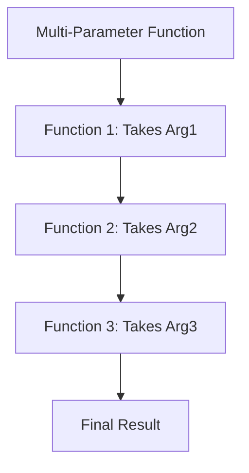

## 10.5 Currying and Partial Application

In the realm of functional programming, currying and partial application are powerful techniques that allow us to write more modular and reusable code. These patterns enable us to break down functions with multiple parameters into a series of single-parameter functions, enhancing flexibility and composability in our Swift applications.

### Intent

The primary intent of currying and partial application is to transform functions to allow for more flexible usage. By breaking down multi-parameter functions into sequences of single-parameter functions, we can create more modular code. This approach not only simplifies function composition but also enables the creation of specialized versions of functions with preset parameters.

### Implementing Currying

Currying is the process of transforming a function that takes multiple arguments into a series of functions that each take a single argument. In Swift, this can be achieved by defining a function that returns another function. Let's explore how to implement currying in Swift.

#### Function Chains

To implement currying, we create a function that returns another function, which in turn accepts the next argument. This chain continues until all arguments are consumed, and the final result is computed. Here's a simple example:

```swift
// A function that adds three numbers
func addThreeNumbers(a: Int, b: Int, c: Int) -> Int {
    return a + b + c
}

// Curried version of the same function
func curriedAdd(a: Int) -> (Int) -> (Int) -> Int {
    return { b in
        return { c in
            return a + b + c
        }
    }
}

// Usage of the curried function
let addPartially = curriedAdd(a: 1)
let addMore = addPartially(2)
let result = addMore(3) // result is 6
```

In this example, `curriedAdd` is a curried version of the `addThreeNumbers` function. It returns a series of functions, each accepting one argument, until all arguments are provided.

#### Partial Application

Partial application is a related concept where we fix some arguments of a function and return a new function that takes the remaining arguments. This technique is useful for creating specialized functions with preset parameters.

```swift
// A function that multiplies three numbers
func multiply(a: Int, b: Int, c: Int) -> Int {
    return a * b * c
}

// Partial application to fix the first argument
func partiallyApplyMultiply(a: Int) -> (Int, Int) -> Int {
    return { b, c in
        return multiply(a: a, b: b, c: c)
    }
}

// Usage of the partially applied function
let multiplyByTwo = partiallyApplyMultiply(a: 2)
let result = multiplyByTwo(3, 4) // result is 24
```

In this example, `partiallyApplyMultiply` fixes the first argument of the `multiply` function, creating a new function that multiplies any two numbers by 2.

### Use Cases and Examples

Currying and partial application have numerous practical applications in Swift development. Let's explore some common use cases and examples.

#### Customizable Functions

Currying and partial application allow us to create specialized versions of functions with preset parameters, making them highly customizable. For example, we can create a logging function with a fixed log level:

```swift
enum LogLevel {
    case info, warning, error
}

func logMessage(level: LogLevel, message: String) {
    print("[\\(level)] \\(message)")
}

// Partial application to fix the log level
func logWithLevel(level: LogLevel) -> (String) -> Void {
    return { message in
        logMessage(level: level, message: message)
    }
}

// Usage of the partially applied logging function
let infoLogger = logWithLevel(level: .info)
infoLogger("This is an informational message.")
```

In this example, `logWithLevel` creates a logger with a fixed log level, allowing us to easily log messages at that level.

#### Event Handling

In event-driven programming, currying and partial application can be used to pass partially applied functions as callbacks. This technique simplifies event handling by allowing us to pre-configure event handlers with specific parameters.

```swift
func handleEvent(event: String, handler: (String) -> Void) {
    handler(event)
}

// Partially applied event handler
func createEventHandler(prefix: String) -> (String) -> Void {
    return { event in
        print("\\(prefix): \\(event)")
    }
}

// Usage of the partially applied event handler
let warningHandler = createEventHandler(prefix: "Warning")
handleEvent(event: "Low battery", handler: warningHandler)
```

In this example, `createEventHandler` creates a handler with a fixed prefix, which is then used to handle events with that prefix.

#### Functional Libraries

Currying and partial application are foundational techniques in building functional libraries. They enable the creation of abstractions over common patterns, making the libraries more flexible and reusable.

```swift
// A function to filter an array based on a predicate
func filterArray<T>(_ array: [T], predicate: (T) -> Bool) -> [T] {
    return array.filter(predicate)
}

// Curried version to fix the predicate
func curriedFilter<T>(predicate: @escaping (T) -> Bool) -> ([T]) -> [T] {
    return { array in
        return filterArray(array, predicate: predicate)
    }
}

// Usage of the curried filter function
let isEven = { (number: Int) -> Bool in number % 2 == 0 }
let filterEvens = curriedFilter(predicate: isEven)
let numbers = [1, 2, 3, 4, 5, 6]
let evenNumbers = filterEvens(numbers) // evenNumbers is [2, 4, 6]
```

In this example, `curriedFilter` creates a reusable filter function with a fixed predicate, allowing us to filter arrays with that predicate.

### Visualizing Currying and Partial Application

To better understand currying and partial application, let's visualize the process using a flowchart. This diagram illustrates the transformation of a multi-parameter function into a series of single-parameter functions.



In this flowchart, we see how a function with multiple parameters is broken down into a chain of single-parameter functions, each taking one argument and returning the next function in the chain.

### Swift Unique Features

Swift provides several unique features that make currying and partial application particularly effective. These include:

- **Closure Syntax**: Swift's concise closure syntax simplifies the creation of curried and partially applied functions.
- **Type Inference**: Swift's powerful type inference system reduces the need for explicit type annotations in curried functions.
- **Functional Programming Support**: Swift's support for functional programming paradigms, such as higher-order functions and immutability, complements currying and partial application.

### Differences and Similarities

Currying and partial application are often confused, but they have distinct differences:

- **Currying**: Transforms a multi-parameter function into a series of single-parameter functions.
- **Partial Application**: Fixes some arguments of a function, returning a new function that takes the remaining arguments.

Both techniques enhance modularity and reusability, but they serve different purposes in function transformation.

### Try It Yourself

To deepen your understanding of currying and partial application, try experimenting with the code examples provided. Here are some suggestions:

- Modify the `curriedAdd` function to handle four parameters instead of three.
- Create a partially applied function for a different operation, such as subtraction or division.
- Implement a curried version of a function that processes strings, such as concatenation or formatting.

### Knowledge Check

Before moving on, let's review some key takeaways:

- Currying transforms functions to take one argument at a time, enhancing modularity.
- Partial application fixes some arguments, creating specialized functions.
- Both techniques are foundational in functional programming and enable flexible code composition.

Remember, mastering these techniques takes practice. As you continue to explore Swift's functional programming capabilities, you'll discover new ways to apply currying and partial application in your projects.

## Quiz Time!



### What is the primary intent of currying in functional programming?

- [x] To transform multi-parameter functions into sequences of single-parameter functions
- [ ] To optimize the performance of functions
- [ ] To simplify error handling in functions
- [ ] To enable asynchronous execution of functions

> **Explanation:** Currying is intended to transform multi-parameter functions into sequences of single-parameter functions, enhancing modularity and reusability.

### How does partial application differ from currying?

- [x] Partial application fixes some arguments and returns a function needing the remaining ones
- [ ] Partial application transforms functions to take one argument at a time
- [ ] Partial application is used to handle errors in functions
- [ ] Partial application is a technique for optimizing function execution

> **Explanation:** Partial application fixes some arguments of a function and returns a new function that takes the remaining arguments, unlike currying which transforms functions to take one argument at a time.

### Which Swift feature simplifies the creation of curried and partially applied functions?

- [x] Closure Syntax
- [ ] Automatic Reference Counting
- [ ] Protocol Extensions
- [ ] Optionals

> **Explanation:** Swift's concise closure syntax simplifies the creation of curried and partially applied functions.

### In the provided example, what is the result of `addMore(3)`?

- [x] 6
- [ ] 5
- [ ] 9
- [ ] 3

> **Explanation:** The curried function `addMore` takes the third argument `3` and adds it to the previously provided arguments `1` and `2`, resulting in `6`.

### What is a common use case for partial application in Swift?

- [x] Creating specialized versions of functions with preset parameters
- [ ] Handling memory management
- [ ] Simplifying error handling
- [ ] Optimizing network requests

> **Explanation:** Partial application is often used to create specialized versions of functions with preset parameters, enhancing flexibility and reusability.

### Which of the following is a benefit of using currying in functional programming?

- [x] Enhanced modularity and reusability of code
- [ ] Improved error handling
- [ ] Increased execution speed
- [ ] Simplified memory management

> **Explanation:** Currying enhances modularity and reusability by transforming functions into sequences of single-parameter functions.

### What does the `curriedFilter` function in the example do?

- [x] Creates a reusable filter function with a fixed predicate
- [ ] Optimizes the filtering process
- [ ] Handles errors during filtering
- [ ] Manages memory during filtering

> **Explanation:** The `curriedFilter` function creates a reusable filter function with a fixed predicate, allowing arrays to be filtered with that predicate.

### What is the result of `multiplyByTwo(3, 4)` in the partial application example?

- [x] 24
- [ ] 12
- [ ] 8
- [ ] 6

> **Explanation:** The partially applied function `multiplyByTwo` multiplies the numbers `3` and `4` by the fixed argument `2`, resulting in `24`.

### True or False: Currying and partial application are the same concepts.

- [ ] True
- [x] False

> **Explanation:** Currying and partial application are related but distinct concepts. Currying transforms functions to take one argument at a time, while partial application fixes some arguments and returns a function needing the remaining ones.

### Which of the following is NOT a use case for currying and partial application?

- [ ] Customizable Functions
- [ ] Event Handling
- [ ] Functional Libraries
- [x] Memory Management

> **Explanation:** Currying and partial application are not typically used for memory management. They are used for creating customizable functions, handling events, and building functional libraries.



Remember, this is just the beginning. As you progress, you'll build more complex and interactive applications using these techniques. Keep experimenting, stay curious, and enjoy the journey!


