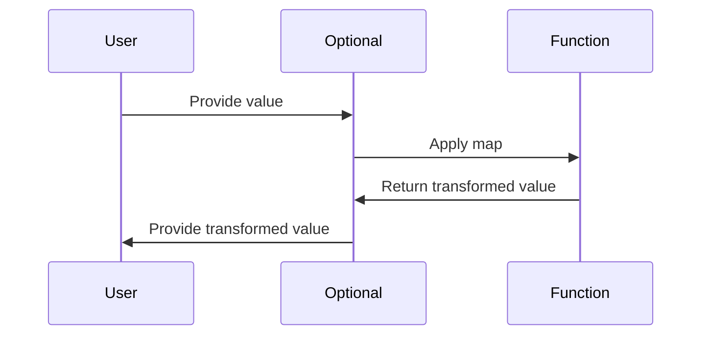

## 10.6 Monads and Functors in Swift

In the world of functional programming, **Monads** and **Functors** are powerful abstractions that allow developers to work with computations in a context. These concepts are particularly useful for handling optionality, error propagation, and asynchronous operations. In this section, we will explore how to implement and utilize Functors and Monads in Swift, providing you with the tools to write more expressive and robust code.

### Intent

The primary intent of using Monads and Functors in Swift is to work with computations that are wrapped in a context. This could be dealing with optional values, managing asynchronous tasks, or chaining operations that may fail. By leveraging these patterns, we can create code that is both elegant and maintainable.

### Implementing Functors

#### **`map` Function**

A Functor is a type that implements a `map` function, allowing you to apply a function to a value within a context without altering the context itself. In Swift, common examples of Functors include Optionals, Arrays, and Results.

##### **Optionals as Functors**

Optionals in Swift are a natural example of Functors. The `map` function on an Optional allows you to transform the contained value if it exists.

```swift
let optionalValue: Int? = 5
let result = optionalValue.map { $0 * 2 }
// result is Optional(10)
```

In this example, we use `map` to double the value inside the Optional if it exists. If the Optional is `nil`, the `map` function simply returns `nil`.

##### **Arrays as Functors**

Arrays in Swift also conform to the Functor pattern. The `map` function applies a given transformation to each element in the array.

```swift
let numbers = [1, 2, 3, 4, 5]
let doubledNumbers = numbers.map { $0 * 2 }
// doubledNumbers is [2, 4, 6, 8, 10]
```

Here, `map` is used to double each number in the array, demonstrating how Functors can be used for element-wise transformations.

##### **Results as Functors**

The `Result` type in Swift is another example of a Functor, often used for error handling. The `map` function allows you to transform the success value while preserving the error.

```swift
let successResult: Result<Int, Error> = .success(10)
let transformedResult = successResult.map { $0 * 2 }
// transformedResult is Result.success(20)
```

This example shows how `map` can be used to transform the success value of a `Result`, maintaining the error context if present.

### Implementing Monads

#### **`flatMap` Function**

Monads extend the concept of Functors by providing a `flatMap` function, which is used to chain operations that return values within the same context. This is particularly useful for avoiding nested contexts, such as `Optional<Optional<T>>`.

##### **Chaining Operations**

The `flatMap` function allows you to compose sequences of computations with embedded contexts, effectively flattening them into a single context.

###### **Optionals with `flatMap`**

```swift
let optionalNumber: Int? = 5
let result = optionalNumber.flatMap { number in
    return number > 0 ? Optional(number * 2) : nil
}
// result is Optional(10)
```

In this example, `flatMap` is used to perform a transformation that itself returns an Optional, avoiding the creation of a nested Optional.

###### **Results with `flatMap`**

```swift
let successResult: Result<Int, Error> = .success(10)
let finalResult = successResult.flatMap { value in
    return value > 5 ? .success(value * 2) : .failure(NSError(domain: "", code: 1, userInfo: nil))
}
// finalResult is Result.success(20)
```

Here, `flatMap` is used to chain a computation that could potentially fail, allowing for seamless error propagation.

### Use Cases and Examples

#### **Error Handling**

Monads are particularly useful for error handling, allowing you to chain operations that may fail using the `Result` type.

```swift
func divide(_ dividend: Int, by divisor: Int) -> Result<Int, Error> {
    guard divisor != 0 else {
        return .failure(NSError(domain: "DivisionError", code: 0, userInfo: nil))
    }
    return .success(dividend / divisor)
}

let result = divide(10, by: 2).flatMap { quotient in
    divide(quotient, by: 2)
}
// result is Result.success(2)
```

In this example, we chain two division operations, handling potential division errors gracefully.

#### **Asynchronous Programming**

Monads can also be applied to manage sequences of asynchronous tasks, such as those using `Promise` or `Future` patterns.

```swift
func fetchData() -> Future<Data, Error> {
    // Simulating an asynchronous data fetch
}

func parseData(_ data: Data) -> Future<ParsedData, Error> {
    // Simulating data parsing
}

let parsedDataFuture = fetchData().flatMap { data in
    parseData(data)
}
// parsedDataFuture is a Future<ParsedData, Error>
```

This example shows how `flatMap` can be used to chain asynchronous operations, maintaining a clean and readable flow.

#### **Data Transformation**

When processing data with potential nils or multiple values, Monads provide a structured way to handle these scenarios.

```swift
let jsonData: Data? = fetchJSONData()
let parsedData = jsonData.flatMap { data in
    try? JSONDecoder().decode(MyModel.self, from: data)
}
// parsedData is Optional<MyModel>
```

Here, `flatMap` is used to decode JSON data if it exists, avoiding the need for nested optionals.

### Visualizing Monads and Functors

To better understand the flow of computations using Monads and Functors, let's visualize the process using a sequence diagram.



This diagram illustrates how a value is passed through an Optional context using the `map` function, resulting in a transformed value.

### Swift Unique Features

Swift's strong type system and support for higher-order functions make it an ideal language for implementing Monads and Functors. The language's emphasis on safety and expressiveness allows developers to leverage these patterns effectively.

#### **Key Swift Features**

- **Optionals**: Swift's built-in support for Optionals provides a natural context for Functors and Monads.
- **Result Type**: The `Result` type simplifies error handling, allowing for clean chaining of operations.
- **Higher-Order Functions**: Functions like `map` and `flatMap` are integral to Swift's standard library, enabling functional programming patterns.

### Design Considerations

When using Monads and Functors in Swift, consider the following:

- **Context Management**: Ensure that operations are appropriately chained to maintain context.
- **Error Propagation**: Use Monads to handle errors gracefully, avoiding the need for extensive error checking.
- **Readability**: While Monads and Functors can simplify code, ensure that their use does not obscure the logic.

### Differences and Similarities

Monads and Functors are often confused due to their similar nature. The key distinction is that Functors provide a `map` function, while Monads extend this with `flatMap`, allowing for chaining of operations within the same context.

### Try It Yourself

Experiment with the provided code examples by modifying the transformation functions or contexts. Try chaining different operations and observe how Monads and Functors handle the computations.

### Knowledge Check

- Explain the difference between `map` and `flatMap`.
- Describe a scenario where Monads can simplify error handling.
- How can Monads be used in asynchronous programming?

### Embrace the Journey

Remember, mastering Monads and Functors is a journey. As you explore these concepts, you'll gain a deeper understanding of functional programming in Swift. Keep experimenting, stay curious, and enjoy the journey!

---

## Quiz Time!



### What is the primary intent of using Monads and Functors in Swift?

- [x] To work with computations in a context
- [ ] To replace object-oriented programming
- [ ] To simplify syntax
- [ ] To improve performance

> **Explanation:** Monads and Functors allow developers to handle computations that are wrapped in a context, such as optionals or asynchronous tasks.

### Which function is associated with Functors?

- [x] map
- [ ] flatMap
- [ ] filter
- [ ] reduce

> **Explanation:** Functors implement the `map` function to apply a transformation to values within a context.

### What does the `flatMap` function do?

- [x] Chains operations that return values in the same context
- [ ] Filters values in a collection
- [ ] Maps values to a new collection
- [ ] Reduces values to a single result

> **Explanation:** `flatMap` is used to chain operations that return values in the same context, effectively flattening nested contexts.

### Which Swift type is an example of a Functor?

- [x] Optional
- [ ] Dictionary
- [ ] Set
- [ ] Tuple

> **Explanation:** Optionals in Swift are Functors because they implement the `map` function to transform contained values.

### How can Monads be used in error handling?

- [x] By chaining operations that may fail using the `Result` type
- [ ] By ignoring errors
- [ ] By throwing exceptions
- [ ] By logging errors

> **Explanation:** Monads allow for chaining operations that may fail, using the `Result` type to propagate errors gracefully.

### What is a key Swift feature that supports Monads?

- [x] Optionals
- [ ] Dictionaries
- [ ] Sets
- [ ] Tuples

> **Explanation:** Swift's Optionals provide a natural context for implementing Monads.

### Which function extends Functors into Monads?

- [x] flatMap
- [ ] map
- [ ] filter
- [ ] reduce

> **Explanation:** Monads extend Functors by providing the `flatMap` function for chaining operations.

### In which programming paradigm are Monads and Functors primarily used?

- [x] Functional Programming
- [ ] Object-Oriented Programming
- [ ] Procedural Programming
- [ ] Logical Programming

> **Explanation:** Monads and Functors are key concepts in functional programming, allowing for context-aware computations.

### True or False: Monads can simplify asynchronous programming in Swift.

- [x] True
- [ ] False

> **Explanation:** Monads can be used to manage sequences of asynchronous tasks, simplifying the flow of asynchronous programming.

### True or False: Functors can handle error propagation.

- [ ] True
- [x] False

> **Explanation:** While Functors can transform values within a context, Monads are specifically used for chaining operations that may include error propagation.


