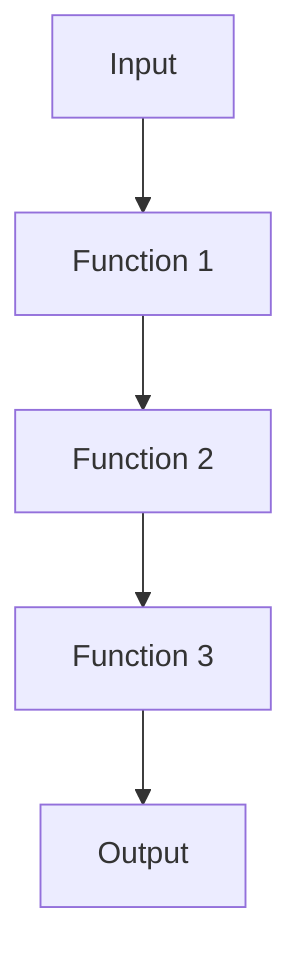

## 10.8 Composition and Function Chaining

In the realm of functional programming, composition and function chaining are essential techniques that allow developers to build complex operations by combining simpler functions. These techniques enhance modularity, code reuse, and readability, making your Swift code more elegant and maintainable. In this section, we'll dive deep into the concepts of function composition and chaining, explore their use cases, and provide practical examples to solidify your understanding.

### Intent

The primary intent of composition and function chaining is to create complex functions by composing simpler ones. This approach not only enhances modularity and code reuse but also leads to more readable and maintainable code. By leveraging these techniques, you can build robust data pipelines, layer behaviors in server-side applications, and configure user interfaces efficiently.

### Implementing Function Composition

Function composition is a fundamental concept in functional programming that involves combining two or more functions to produce a new function. In Swift, we can implement function composition using operator overloads, chaining syntax, and partial functions.

#### Operator Overloads

Swift allows you to define custom operators, which can be particularly useful for function composition. By creating a custom operator, you can compose functions in a more readable and concise manner.

```swift
// Define a custom operator for function composition
infix operator >>> : AdditionPrecedence

// Implement the custom operator
func >>> <A, B, C>(lhs: @escaping (A) -> B, rhs: @escaping (B) -> C) -> (A) -> C {
    return { x in rhs(lhs(x)) }
}

// Example functions
func double(_ x: Int) -> Int {
    return x * 2
}

func increment(_ x: Int) -> Int {
    return x + 1
}

// Compose functions using the custom operator
let doubleThenIncrement = double >>> increment

// Use the composed function
let result = doubleThenIncrement(3) // Output: 7
```

In this example, we define a custom operator `>>>` that composes two functions. The `doubleThenIncrement` function is created by composing `double` and `increment`, demonstrating how operator overloads can simplify function composition.

#### Chaining Syntax

Function chaining is a technique where multiple operations are performed in sequence, each operation being applied to the result of the previous one. This approach is particularly useful for creating fluent interfaces.

```swift
// Define a struct with chaining methods
struct NumberManipulator {
    var value: Int

    func double() -> NumberManipulator {
        return NumberManipulator(value: self.value * 2)
    }

    func increment() -> NumberManipulator {
        return NumberManipulator(value: self.value + 1)
    }
}

// Use method chaining
let result = NumberManipulator(value: 3)
    .double()
    .increment()
    .value // Output: 7
```

In this example, `NumberManipulator` provides methods that return a new instance of itself, allowing us to chain method calls. This chaining syntax enhances readability and allows for a more expressive way to perform sequential operations.

#### Partial Functions

Partial functions are functions that are derived from another function by fixing some of its arguments. This technique is useful for creating specialized functions from more general ones.

```swift
// Define a function with multiple parameters
func multiply(_ x: Int, by y: Int) -> Int {
    return x * y
}

// Create a partial function
let double = { multiply($0, by: 2) }

// Use the partial function
let result = double(3) // Output: 6
```

In this example, we define a `multiply` function and create a partial function `double` by fixing one of its arguments. This allows us to reuse the `multiply` logic in a more specific context.

### Use Cases and Examples

Function composition and chaining have numerous practical applications in Swift development. Let's explore some common use cases and provide examples to illustrate their utility.

#### Data Pipelines

Data pipelines often involve a series of transformations applied to data. Function composition is ideal for building such pipelines, as it allows you to chain together multiple transformations in a clear and concise manner.

```swift
// Define data transformation functions
func filterEvenNumbers(_ numbers: [Int]) -> [Int] {
    return numbers.filter { $0 % 2 == 0 }
}

func squareNumbers(_ numbers: [Int]) -> [Int] {
    return numbers.map { $0 * $0 }
}

// Compose functions to create a data pipeline
let processNumbers = filterEvenNumbers >>> squareNumbers

// Use the composed function
let numbers = [1, 2, 3, 4, 5]
let result = processNumbers(numbers) // Output: [4, 16]
```

In this example, we compose `filterEvenNumbers` and `squareNumbers` to create a data pipeline that filters and squares numbers. This approach makes the pipeline easy to read and modify.

#### Middleware

In server-side applications, middleware functions are used to layer behaviors such as logging, authentication, and error handling. Function composition can be used to chain these middleware functions together.

```swift
// Define middleware functions
func logRequest(_ request: String) -> String {
    print("Logging request: \\(request)")
    return request
}

func authenticateRequest(_ request: String) -> String {
    print("Authenticating request: \\(request)")
    return request
}

// Compose middleware functions
let processRequest = logRequest >>> authenticateRequest

// Use the composed middleware
let request = "GET /api/data"
let processedRequest = processRequest(request)
```

In this example, we compose `logRequest` and `authenticateRequest` to create a middleware chain that logs and authenticates requests. This modular approach simplifies the management of middleware.

#### UI Configuration

Function chaining is particularly useful for configuring UI elements, allowing you to chain configuration methods to set up a UI component in a fluent and readable manner.

```swift
import UIKit

// Define a custom UIView subclass with chaining methods
class ConfigurableView: UIView {
    func setBackgroundColor(_ color: UIColor) -> ConfigurableView {
        self.backgroundColor = color
        return self
    }

    func setCornerRadius(_ radius: CGFloat) -> ConfigurableView {
        self.layer.cornerRadius = radius
        return self
    }
}

// Use method chaining to configure a view
let view = ConfigurableView()
    .setBackgroundColor(.blue)
    .setCornerRadius(10)
```

In this example, `ConfigurableView` provides methods that return `self`, allowing us to chain configuration calls. This approach makes UI setup more concise and expressive.

### Visualizing Function Composition

To better understand function composition, let's visualize how functions are composed to create a new function.



In this diagram, each function takes the output of the previous function as its input, illustrating the flow of data through a composed function.

### Swift Unique Features

Swift's strong type system and support for higher-order functions make it an excellent language for implementing function composition and chaining. Here are some unique features of Swift that enhance these techniques:

- **Type Inference**: Swift's type inference allows you to write concise and readable code without explicitly specifying types in many cases.
- **Generics**: Swift's generics enable you to write flexible and reusable functions that can operate on any type.
- **Higher-Order Functions**: Swift supports higher-order functions, allowing you to pass functions as arguments, return them from other functions, and store them in variables.

### Design Considerations

When implementing function composition and chaining, consider the following:

- **Readability**: While chaining and composition can make code more concise, ensure that it remains readable and understandable.
- **Error Handling**: Consider how errors will be handled in a composed or chained function, especially in asynchronous or network operations.
- **Performance**: Be aware of the performance implications of chaining multiple operations, particularly in performance-critical applications.

### Differences and Similarities

Function composition and chaining are often confused with each other, but they have distinct differences:

- **Function Composition**: Involves combining functions to create a new function, focusing on the transformation of data.
- **Function Chaining**: Involves calling methods in sequence on an object, focusing on the configuration or modification of an object.

Both techniques aim to improve code modularity and readability, but they are applied in different contexts.

### Try It Yourself

Now that we've covered the basics, try experimenting with the examples provided. Modify the functions, add new transformations, or create your own chaining methods. Remember, practice is key to mastering these concepts.

### Knowledge Check

Before we wrap up, let's summarize the key takeaways:

- Function composition and chaining enhance modularity, code reuse, and readability.
- Operator overloads, chaining syntax, and partial functions are useful techniques for implementing composition.
- Common use cases include data pipelines, middleware, and UI configuration.
- Swift's type system, generics, and higher-order functions make it well-suited for these techniques.

## Quiz Time!



### What is the primary intent of function composition and chaining?

- [x] To build complex functions by composing simpler ones
- [ ] To increase the performance of functions
- [ ] To make functions immutable
- [ ] To create functions with side effects

> **Explanation:** The primary intent is to build complex functions by composing simpler ones, enhancing modularity and code reuse.

### Which Swift feature allows you to define custom operators for function composition?

- [x] Operator Overloads
- [ ] Protocol Extensions
- [ ] Generics
- [ ] Type Inference

> **Explanation:** Operator overloads in Swift allow you to define custom operators, which can be used for function composition.

### What is a common use case for function composition?

- [x] Data Pipelines
- [ ] Memory Management
- [ ] UI Rendering
- [ ] Network Requests

> **Explanation:** Function composition is commonly used in data pipelines to process data through a series of transformations.

### In function chaining, what is typically returned by each method?

- [x] The object itself
- [ ] A new object of a different type
- [ ] A boolean value
- [ ] A string message

> **Explanation:** In function chaining, each method typically returns the object itself, allowing for sequential method calls.

### What is a partial function?

- [x] A function derived by fixing some arguments of another function
- [ ] A function that is only partially implemented
- [ ] A function that returns a partial result
- [ ] A function that is asynchronous

> **Explanation:** A partial function is derived by fixing some arguments of another function, creating a specialized version.

### Which Swift feature enhances the flexibility of function composition?

- [x] Generics
- [ ] Closures
- [ ] Extensions
- [ ] Protocols

> **Explanation:** Generics enhance the flexibility of function composition by allowing functions to operate on any type.

### What is a key consideration when using function chaining?

- [x] Readability
- [ ] Memory Usage
- [ ] Compilation Time
- [ ] Syntax Complexity

> **Explanation:** Readability is a key consideration to ensure that chained methods remain understandable.

### How does Swift's type inference benefit function composition?

- [x] By allowing concise and readable code
- [ ] By increasing execution speed
- [ ] By reducing memory usage
- [ ] By enabling dynamic typing

> **Explanation:** Swift's type inference allows for concise and readable code, beneficial for function composition.

### Which of the following is NOT a difference between function composition and chaining?

- [x] Both aim to improve code modularity and readability
- [ ] Function composition focuses on data transformation
- [ ] Function chaining focuses on object configuration
- [ ] Function composition creates a new function

> **Explanation:** Both techniques aim to improve code modularity and readability, which is not a difference but a similarity.

### True or False: Function composition and chaining are only applicable in functional programming.

- [ ] True
- [x] False

> **Explanation:** False. While they are fundamental to functional programming, they can be applied in various programming paradigms.



Remember, mastering composition and function chaining in Swift is a journey. Keep experimenting, stay curious, and enjoy the process of building more modular and reusable code!


