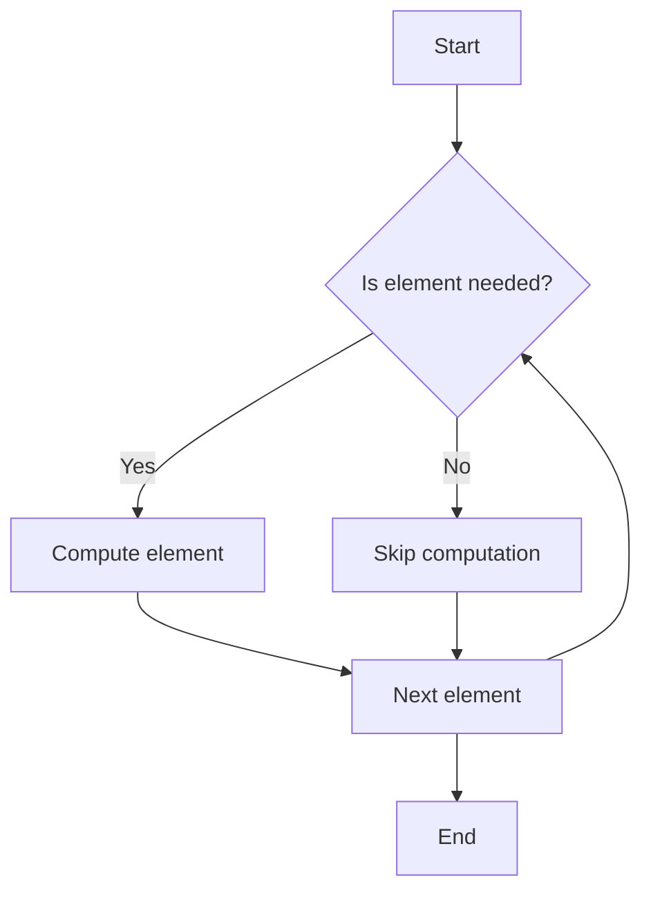

## 10.9 Lazy Evaluation and Sequences

In the realm of functional programming, lazy evaluation is a powerful concept that allows us to defer computation until it's absolutely necessary. This strategy can lead to significant performance improvements, especially when dealing with large data sets or resource-intensive operations. In this section, we will delve into the world of lazy evaluation and sequences in Swift, exploring how they can be harnessed to create efficient, scalable applications.

### Intent

The primary intent of lazy evaluation is to improve performance by postponing computations until their results are required. This can be particularly beneficial in scenarios where not all data is needed, or when working with infinite sequences. By understanding and implementing lazy evaluation, we can optimize resource usage and enhance the responsiveness of our applications.

### Implementing Lazy Sequences

#### The `lazy` Keyword

Swift provides a built-in way to implement lazy evaluation in collections through the `lazy` keyword. When applied to a collection, it transforms the collection into a lazy sequence, deferring computations until the elements are accessed.

```swift
let numbers = [1, 2, 3, 4, 5]
let lazyNumbers = numbers.lazy.map { $0 * 2 }

// Computation happens here, when elements are accessed
for number in lazyNumbers {
    print(number)
}
```

**Explanation**: In this example, the `map` operation is deferred until the elements of `lazyNumbers` are accessed in the loop. This can save computation time and resources when dealing with large collections.

#### Custom Lazy Sequences

To create custom lazy sequences, we need to implement the `Sequence` and `IteratorProtocol` protocols. This allows us to define how elements are generated and accessed lazily.

```swift
struct FibonacciSequence: Sequence {
    func makeIterator() -> FibonacciIterator {
        return FibonacciIterator()
    }
}

struct FibonacciIterator: IteratorProtocol {
    private var current = 0
    private var nextValue = 1

    mutating func next() -> Int? {
        let result = current
        current = nextValue
        nextValue = result + nextValue
        return result
    }
}

let fibonacci = FibonacciSequence().lazy.prefix(10)
for number in fibonacci {
    print(number)
}
```

**Explanation**: Here, we define a `FibonacciSequence` that generates Fibonacci numbers lazily. The `FibonacciIterator` handles the logic for generating the sequence. The use of `lazy` and `prefix` ensures that only the first 10 numbers are computed.

#### Infinite Sequences

Infinite sequences are sequences that can generate values indefinitely. They are particularly useful in scenarios where data is processed as it becomes available, such as streaming data.

```swift
struct InfiniteSequence: Sequence {
    func makeIterator() -> InfiniteIterator {
        return InfiniteIterator()
    }
}

struct InfiniteIterator: IteratorProtocol {
    private var current = 0

    mutating func next() -> Int? {
        defer { current += 1 }
        return current
    }
}

let infiniteNumbers = InfiniteSequence().lazy
for number in infiniteNumbers.prefix(5) {
    print(number)
}
```

**Explanation**: The `InfiniteSequence` generates an infinite sequence of integers. By using `lazy` and `prefix`, we can limit the number of elements processed, preventing an infinite loop.

### Use Cases and Examples

#### Performance Optimization

Lazy evaluation can significantly enhance performance by avoiding unnecessary computations. Consider a scenario where we need to filter and map a large array:

```swift
let largeArray = Array(1...1000000)
let lazyFilteredArray = largeArray.lazy.filter { $0 % 2 == 0 }.map { $0 * 2 }

for number in lazyFilteredArray.prefix(10) {
    print(number)
}
```

**Explanation**: By using `lazy`, the filter and map operations are deferred, and only the necessary elements are processed. This reduces the computational overhead, especially with large datasets.

#### Data Streaming

Lazy sequences are ideal for data streaming, where data is processed as it becomes available. This approach is common in network operations or real-time data processing.

```swift
func streamData() -> AnySequence<Int> {
    return AnySequence { () -> AnyIterator<Int> in
        var current = 0
        return AnyIterator {
            defer { current += 1 }
            return current < 100 ? current : nil
        }
    }
}

let dataStream = streamData().lazy
for data in dataStream {
    print(data)
}
```

**Explanation**: The `streamData` function generates a sequence of data lazily, simulating a data stream. The sequence processes data as it becomes available, making it suitable for real-time applications.

#### Resource Management

Lazy evaluation can help manage resources more efficiently by reducing memory usage. When computations are deferred, memory is only allocated for elements that are actually needed.

```swift
let largeDataSet = Array(repeating: "Data", count: 1000000)
let lazyDataSet = largeDataSet.lazy.filter { $0 == "Data" }

for data in lazyDataSet.prefix(5) {
    print(data)
}
```

**Explanation**: In this example, the lazy filter operation ensures that only the necessary elements are processed, reducing the memory footprint of the application.

### Visualizing Lazy Evaluation

To better understand how lazy evaluation works, let's visualize the process using a flowchart:



**Description**: This flowchart illustrates the decision-making process in lazy evaluation. Elements are only computed if they are needed, otherwise, the computation is skipped, optimizing resource usage.

### Try It Yourself

Experiment with the provided code examples by modifying the conditions or operations. Try creating your own custom lazy sequences or infinite sequences to gain a deeper understanding of lazy evaluation in Swift.

### References and Links

- [Swift Documentation on Lazy Sequences](https://developer.apple.com/documentation/swift/lazysequence)
- [Swift.org - The Swift Programming Language](https://swift.org/documentation/)
- [Functional Programming in Swift](https://www.objc.io/books/functional-swift/)

### Knowledge Check

- What is lazy evaluation and how does it improve performance?
- How can you implement a custom lazy sequence in Swift?
- What are the benefits of using infinite sequences?
- How does lazy evaluation help in resource management?

### Embrace the Journey

Remember, mastering lazy evaluation and sequences is just the beginning of optimizing your Swift applications. As you continue to explore functional programming patterns, you'll discover even more ways to enhance performance and efficiency. Keep experimenting, stay curious, and enjoy the journey!

## Quiz Time!



### What is the primary intent of lazy evaluation in Swift?

- [x] To defer computation until it's needed
- [ ] To execute all computations immediately
- [ ] To simplify code syntax
- [ ] To increase memory usage

> **Explanation:** Lazy evaluation defers computation until the result is required, improving performance and efficiency.

### How can you create a lazy sequence in Swift?

- [x] By using the `lazy` keyword
- [ ] By using the `eager` keyword
- [ ] By using the `defer` keyword
- [ ] By using the `immediate` keyword

> **Explanation:** The `lazy` keyword in Swift transforms a collection into a lazy sequence, deferring computations.

### What protocols must be implemented to create a custom lazy sequence?

- [x] `Sequence` and `IteratorProtocol`
- [ ] `Collection` and `Indexable`
- [ ] `LazySequence` and `LazyIterator`
- [ ] `Streamable` and `Iterable`

> **Explanation:** To create a custom lazy sequence, implement the `Sequence` and `IteratorProtocol` protocols.

### What is an infinite sequence?

- [x] A sequence that can generate values indefinitely
- [ ] A sequence with a fixed number of elements
- [ ] A sequence that stops after a certain condition
- [ ] A sequence that repeats the same value

> **Explanation:** An infinite sequence generates values indefinitely, often used in streaming data scenarios.

### How does lazy evaluation optimize resource usage?

- [x] By reducing memory footprint
- [ ] By increasing computation speed
- [ ] By storing all elements in memory
- [ ] By processing all elements at once

> **Explanation:** Lazy evaluation reduces memory usage by only computing elements when needed.

### What is a common use case for lazy sequences?

- [x] Data streaming
- [ ] Immediate computation
- [ ] Static data processing
- [ ] Memory expansion

> **Explanation:** Lazy sequences are ideal for data streaming, where data is processed as it becomes available.

### How does the `lazy` keyword affect a collection in Swift?

- [x] It defers computations
- [ ] It duplicates the collection
- [ ] It sorts the collection
- [ ] It filters the collection

> **Explanation:** The `lazy` keyword defers computations in a collection until the elements are accessed.

### What is the benefit of using `prefix` with a lazy sequence?

- [x] It limits the number of elements processed
- [ ] It sorts the sequence
- [ ] It duplicates the sequence
- [ ] It filters the sequence

> **Explanation:** Using `prefix` with a lazy sequence limits the number of elements processed, preventing infinite loops.

### Can lazy evaluation be used with infinite sequences?

- [x] True
- [ ] False

> **Explanation:** Lazy evaluation is particularly useful with infinite sequences, as it processes elements on-demand.

### What is a key advantage of lazy evaluation in Swift?

- [x] Improved performance through deferred computation
- [ ] Increased complexity in code
- [ ] Immediate execution of all operations
- [ ] Higher memory usage

> **Explanation:** Lazy evaluation improves performance by deferring computation, optimizing resource usage.


