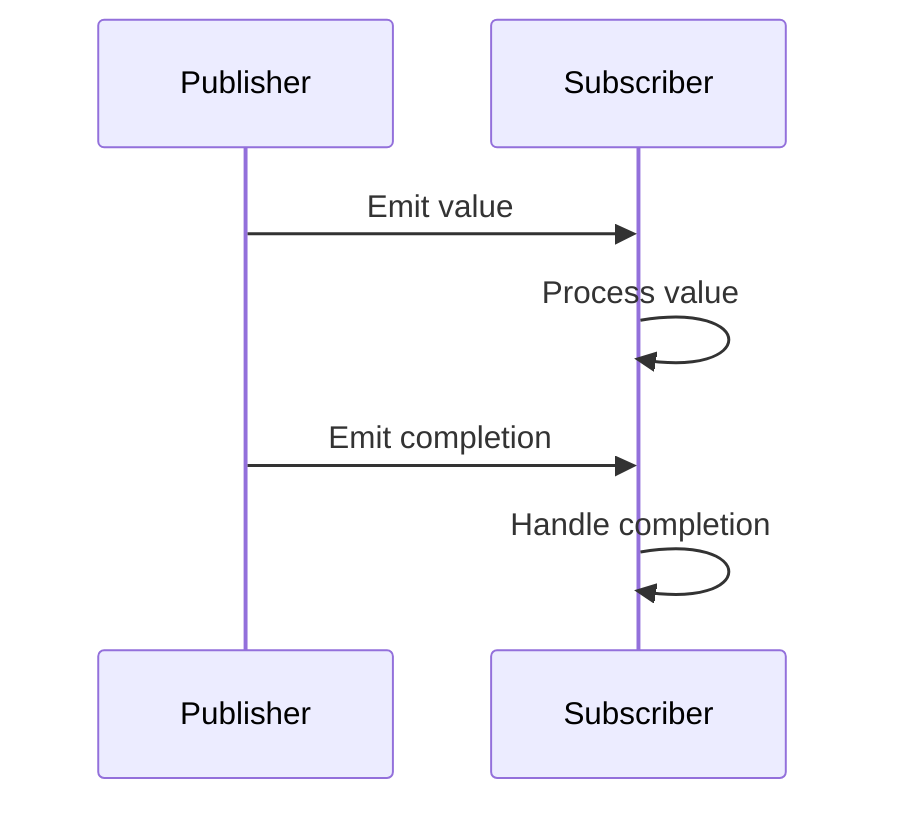

## 11.1 Introduction to Reactive Programming

Reactive programming has emerged as a powerful paradigm for handling asynchronous data streams and building responsive applications in modern software development. In this section, we will delve into the core concepts of reactive programming, focusing on how they can be applied in Swift to create efficient, scalable, and maintainable applications. We will explore event streams, observables, subscribers, and the integration of functional programming principles to form Functional Reactive Programming (FRP).

### Understanding Reactive Programming

Reactive programming is a declarative programming paradigm concerned with data streams and the propagation of change. It allows developers to express dynamic behavior in applications, making it easier to handle asynchronous data flows.

#### Core Concepts

1. **Event Streams**: 
   - Event streams represent sequences of events ordered in time. These events can be anything from user interactions, network responses, or even changes in data. In reactive programming, we treat these events as first-class citizens, allowing us to compose and transform them seamlessly.

2. **Observables**: 
   - Observables are the heart of reactive programming. They represent data that can be observed over time. An observable emits items to its observers, who react accordingly. Observables can emit zero or more events, and they can also emit error notifications or completion signals.

3. **Subscribers**: 
   - Subscribers are entities that listen to observables. They react to the data emitted by observables, allowing developers to define how the application should respond to changes in data. Subscribers can also handle errors and completion signals emitted by observables.

4. **Functional Reactive Programming (FRP)**:
   - FRP is a combination of functional programming and reactive programming. It emphasizes the use of pure functions to transform data streams, promoting immutability and composability. FRP allows developers to build complex data flows from simple, reusable components, leading to cleaner and more maintainable code.

### Benefits of Reactive Programming

1. **Asynchronous Data Handling**:
   - Reactive programming simplifies the handling of asynchronous data flows. By treating data as streams, developers can easily manage complex asynchronous operations, such as network requests, user interactions, and real-time updates.

2. **Clean Code**:
   - Reactive programming reduces the complexity of state management. By focusing on data streams and transformations, developers can avoid the pitfalls of mutable state and side effects, leading to cleaner and more predictable code.

3. **Composability**:
   - Reactive programming promotes composability by allowing developers to build complex data flows from simple, reusable components. This makes it easier to manage and extend applications, as new features can be added by composing existing components.

### Reactive Programming in Swift

Swift, with its strong type system and emphasis on safety, is well-suited for reactive programming. The language's features, such as closures, generics, and protocol-oriented programming, align well with the principles of reactive programming.

#### Observables in Swift

In Swift, observables can be implemented using various libraries, such as Combine, RxSwift, or ReactiveSwift. These libraries provide the necessary tools to create and manage observables, allowing developers to build reactive applications with ease.

Here is a simple example of creating an observable using Combine:

```swift
import Combine

// Create a publisher that emits integers
let publisher = [1, 2, 3, 4, 5].publisher

// Create a subscriber that prints the received values
let subscriber = publisher.sink(receiveCompletion: { completion in
    switch completion {
    case .finished:
        print("Finished")
    case .failure(let error):
        print("Error: \\(error)")
    }
}, receiveValue: { value in
    print("Received value: \\(value)")
})
```

In this example, we create a publisher that emits a sequence of integers. We then create a subscriber that listens to the publisher and prints the received values. The subscriber also handles the completion event, printing a message when the publisher finishes emitting values.

#### Functional Reactive Programming in Swift

Functional Reactive Programming (FRP) in Swift leverages the language's functional programming features to create reactive applications. By using pure functions and immutability, developers can build complex data flows that are easy to understand and maintain.

Here is an example of using FRP in Swift with Combine:

```swift
import Combine

// Create a publisher that emits integers
let numbers = [1, 2, 3, 4, 5].publisher

// Use map to transform the values
let transformedNumbers = numbers.map { $0 * 2 }

// Create a subscriber that prints the transformed values
let subscriber = transformedNumbers.sink(receiveCompletion: { completion in
    print("Completed with: \\(completion)")
}, receiveValue: { value in
    print("Transformed value: \\(value)")
})
```

In this example, we use the `map` function to transform the emitted values by multiplying them by 2. The transformed values are then printed by the subscriber. This demonstrates the power of FRP, as we can easily transform data streams using pure functions.

### Visualizing Reactive Programming

To better understand the flow of data in reactive programming, let's visualize the process using a sequence diagram.



In this diagram, we see the interaction between a publisher and a subscriber. The publisher emits values and a completion signal, which the subscriber processes accordingly. This visual representation helps clarify the flow of data in reactive programming.

### Try It Yourself

Experiment with the code examples provided above. Try modifying the publisher to emit different types of data, such as strings or custom objects. Use different operators, like `filter` or `reduce`, to transform the data streams. By experimenting with these concepts, you'll gain a deeper understanding of reactive programming in Swift.

### References and Further Reading

To explore reactive programming further, consider the following resources:
- [Combine Documentation](https://developer.apple.com/documentation/combine)
- [RxSwift GitHub Repository](https://github.com/ReactiveX/RxSwift)
- [Functional Reactive Programming in Swift](https://www.raywenderlich.com/books/combine-asynchronous-programming-with-swift/v2.0)

### Knowledge Check

As you progress through this section, consider the following questions to test your understanding:
- What are the key components of reactive programming?
- How do observables and subscribers interact in a reactive system?
- What are the benefits of using reactive programming in Swift?

### Embrace the Journey

Remember, mastering reactive programming is a journey. As you explore these concepts and apply them in your projects, you'll develop a deeper understanding of how to build responsive and resilient applications. Keep experimenting, stay curious, and enjoy the process!

## Quiz Time!



### What is the primary focus of reactive programming?

- [x] Handling asynchronous data streams
- [ ] Managing database transactions
- [ ] Simplifying UI design
- [ ] Enhancing security protocols

> **Explanation:** Reactive programming focuses on handling asynchronous data streams and the propagation of change.

### What is an observable in reactive programming?

- [x] A data source that can be observed over time
- [ ] A function that processes data
- [ ] A static value in a program
- [ ] A UI component in Swift

> **Explanation:** An observable is a data source that can be observed over time, emitting values and events.

### What role do subscribers play in reactive programming?

- [x] They react to data emitted by observables
- [ ] They manage memory allocation
- [ ] They handle user input
- [ ] They optimize network requests

> **Explanation:** Subscribers react to data emitted by observables and define how the application should respond to changes.

### What is Functional Reactive Programming (FRP)?

- [x] A combination of functional programming and reactive programming
- [ ] A method for optimizing database queries
- [ ] A design pattern for UI components
- [ ] A security protocol for web applications

> **Explanation:** FRP combines functional programming and reactive programming to create responsive and resilient applications.

### Which Swift feature aligns well with reactive programming?

- [x] Closures
- [ ] Pointers
- [ ] Macros
- [ ] Goto statements

> **Explanation:** Closures in Swift align well with reactive programming by allowing developers to define inline functions for handling data streams.

### How does reactive programming benefit asynchronous data handling?

- [x] It simplifies the management of complex asynchronous operations
- [ ] It increases the complexity of code
- [ ] It reduces the need for error handling
- [ ] It eliminates the need for network requests

> **Explanation:** Reactive programming simplifies the management of complex asynchronous operations by treating data as streams.

### What is the main advantage of composability in reactive programming?

- [x] Building complex data flows from simple, reusable components
- [ ] Reducing the size of the codebase
- [ ] Eliminating the need for testing
- [ ] Enhancing the visual design of applications

> **Explanation:** Composability allows developers to build complex data flows from simple, reusable components, making it easier to manage and extend applications.

### Which operator is used in FRP to transform data streams?

- [x] map
- [ ] join
- [ ] split
- [ ] append

> **Explanation:** The `map` operator is used in FRP to transform data streams by applying a function to each emitted value.

### True or False: Reactive programming is only applicable to UI development.

- [ ] True
- [x] False

> **Explanation:** False. Reactive programming is applicable to various domains, including UI development, networking, and real-time data processing.

### What is the purpose of a completion signal in reactive programming?

- [x] To indicate that an observable has finished emitting values
- [ ] To start a new data stream
- [ ] To reset the application state
- [ ] To trigger a security check

> **Explanation:** A completion signal indicates that an observable has finished emitting values, allowing subscribers to perform any necessary cleanup or final actions.



---

By exploring reactive programming and its principles, you are now equipped with the knowledge to build responsive and resilient applications in Swift. Continue to experiment with these concepts, and you'll find new ways to enhance your development process. Happy coding!


