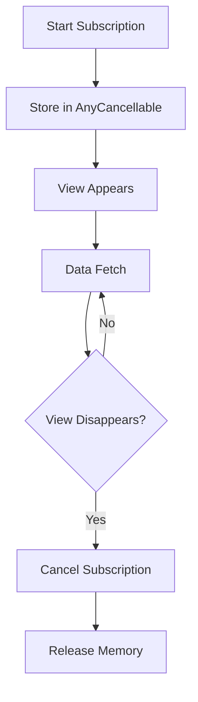

## 11.10 Memory Management in Reactive Programming

In the realm of reactive programming, efficient memory management is crucial to ensure that your applications remain performant and do not suffer from memory leaks or unnecessary resource consumption. This section will guide you through the essential concepts of managing memory in reactive programming using Swift, with a focus on the Combine framework and SwiftUI.

### Subscription Lifecycle

In reactive programming, subscriptions are the backbone of data flow. Understanding how to manage them effectively is key to maintaining optimal application performance.

#### `AnyCancellable`: Storing and Managing Subscriptions

In Combine, subscriptions are represented by the `AnyCancellable` type. These are used to manage the lifecycle of a subscription, ensuring that resources are released when they are no longer needed.

```swift
import Combine

class DataFetcher {
    var cancellables = Set<AnyCancellable>()
    
    func fetchData() {
        URLSession.shared.dataTaskPublisher(for: URL(string: "https://api.example.com/data")!)
            .sink(receiveCompletion: { completion in
                switch completion {
                case .finished:
                    print("Finished fetching data")
                case .failure(let error):
                    print("Error fetching data: \\(error)")
                }
            }, receiveValue: { data, response in
                print("Received data: \\(data)")
            })
            .store(in: &cancellables)
    }
}
```

In this example, `store(in:)` is used to add the `AnyCancellable` to a set, ensuring that the subscription is retained for the duration of the `DataFetcher` instance.

#### Automatic Cancellation: Leveraging `onDisappear` and View Lifecycle in SwiftUI

SwiftUI provides a declarative way to manage view lifecycles, which can be leveraged to automatically cancel subscriptions when views disappear.

```swift
import SwiftUI
import Combine

struct ContentView: View {
    @State private var data: String = ""
    private var cancellable: AnyCancellable?

    var body: some View {
        Text(data)
            .onAppear {
                cancellable = URLSession.shared.dataTaskPublisher(for: URL(string: "https://api.example.com/data")!)
                    .map { data, _ in String(data: data, encoding: .utf8) ?? "" }
                    .replaceError(with: "Error fetching data")
                    .assign(to: \.data, on: self)
            }
            .onDisappear {
                cancellable?.cancel()
            }
    }
}
```

Here, the subscription is automatically cancelled when the view disappears, preventing potential memory leaks from lingering subscriptions.

### Avoiding Memory Leaks

Memory leaks can occur when references are not properly managed, leading to increased memory usage and potential application crashes.

#### Retain Cycles: Using `[weak self]` and `[unowned self]` in Closures

Retain cycles are a common source of memory leaks in Swift, especially when using closures. Using `[weak self]` or `[unowned self]` can help break these cycles.

```swift
class NetworkManager {
    var cancellable: AnyCancellable?

    func fetchData() {
        cancellable = URLSession.shared.dataTaskPublisher(for: URL(string: "https://api.example.com/data")!)
            .sink(receiveCompletion: { [weak self] completion in
                guard let self = self else { return }
                switch completion {
                case .finished:
                    print("Finished fetching data")
                case .failure(let error):
                    print("Error fetching data: \\(error)")
                }
            }, receiveValue: { [weak self] data, response in
                guard let self = self else { return }
                print("Received data: \\(data)")
            })
    }
}
```

By capturing `self` as weak, we ensure that the closure does not hold a strong reference to the `NetworkManager` instance, allowing it to be deallocated when no longer needed.

#### Subscription Cleanup: Cancelling Subscriptions When No Longer Needed

It's important to cancel subscriptions when they are no longer needed to free up resources.

```swift
class ViewModel {
    var cancellables = Set<AnyCancellable>()

    func setupBindings() {
        NotificationCenter.default.publisher(for: UIApplication.didEnterBackgroundNotification)
            .sink { [weak self] _ in
                self?.cleanup()
            }
            .store(in: &cancellables)
    }

    func cleanup() {
        cancellables.forEach { $0.cancel() }
        cancellables.removeAll()
    }
}
```

In this example, we cancel all subscriptions when the application enters the background, ensuring that no unnecessary work is done while the app is not active.

### Debugging Tools

Debugging memory issues can be challenging, but with the right tools, you can identify and resolve problems efficiently.

#### Instruments: Profiling Memory Usage

Xcode's Instruments tool is invaluable for profiling memory usage and identifying leaks. Use the "Leaks" and "Allocations" instruments to monitor your application's memory footprint.

#### Combine Identifiers: Tracing Subscriptions with Unique IDs

Combine provides a way to assign unique identifiers to subscriptions, which can be useful for tracing and debugging.

```swift
let publisher = Just("Hello, Combine!")
    .handleEvents(receiveSubscription: { subscription in
        print("Subscription ID: \\(subscription.combineIdentifier)")
    })
    .sink { value in
        print("Received value: \\(value)")
    }
```

By logging the `combineIdentifier`, you can trace the lifecycle of a subscription, helping you identify where issues may be occurring.

### Visualizing Memory Management in Reactive Programming

To better understand the flow of memory management in reactive programming, let's visualize the subscription lifecycle and memory management strategies.



**Description:** This diagram illustrates the lifecycle of a subscription in a SwiftUI view. It begins with storing the subscription in an `AnyCancellable`, proceeds to data fetching, and ends with cancelling the subscription and releasing memory when the view disappears.

### Try It Yourself

To solidify your understanding, try modifying the code examples above. For instance, experiment with different lifecycle events in SwiftUI to see how they affect subscription management. Try introducing a retain cycle and use Instruments to detect it.

### Knowledge Check

- How does `AnyCancellable` help manage subscriptions?
- Why is it important to use `[weak self]` in closures?
- How can Instruments help identify memory leaks?
- What role does `combineIdentifier` play in debugging?

### Embrace the Journey

Remember, mastering memory management in reactive programming is a journey. As you continue to explore and experiment, you'll develop a deeper understanding of how to build efficient, leak-free applications. Keep pushing the boundaries, stay curious, and enjoy the process!

## Quiz Time!



### What is the purpose of `AnyCancellable` in Combine?

- [x] To manage the lifecycle of a subscription
- [ ] To store data fetched from a network
- [ ] To create new publishers
- [ ] To handle errors in Combine

> **Explanation:** `AnyCancellable` is used to manage the lifecycle of a subscription, ensuring that resources are released when they are no longer needed.

### How can you prevent retain cycles in closures?

- [x] By using `[weak self]` or `[unowned self]`
- [ ] By using strong references
- [ ] By avoiding closures altogether
- [ ] By storing closures in a global variable

> **Explanation:** Using `[weak self]` or `[unowned self]` prevents retain cycles by not holding strong references to `self` within closures.

### What does the `combineIdentifier` help with?

- [x] Tracing and debugging subscriptions
- [ ] Creating new subscriptions
- [ ] Managing memory allocation
- [ ] Handling errors

> **Explanation:** The `combineIdentifier` is used to trace and debug subscriptions by providing a unique identifier for each subscription.

### Which tool can be used to profile memory usage in Xcode?

- [x] Instruments
- [ ] Debugger
- [ ] Console
- [ ] SwiftLint

> **Explanation:** Instruments is a tool in Xcode used for profiling memory usage and identifying leaks.

### What happens when a SwiftUI view disappears?

- [x] Subscriptions can be automatically cancelled
- [ ] Data fetching continues indefinitely
- [ ] The application crashes
- [ ] Memory is automatically increased

> **Explanation:** When a SwiftUI view disappears, subscriptions can be automatically cancelled to prevent memory leaks.

### Why is it important to cancel subscriptions when they are no longer needed?

- [x] To free up resources and prevent memory leaks
- [ ] To increase the application's memory usage
- [ ] To ensure data fetching continues
- [ ] To create new subscriptions

> **Explanation:** Cancelling subscriptions when they are no longer needed frees up resources and prevents memory leaks.

### What is a common source of memory leaks in Swift?

- [x] Retain cycles
- [ ] Using `AnyCancellable`
- [ ] Assigning values to properties
- [ ] Using strong references

> **Explanation:** Retain cycles are a common source of memory leaks in Swift, often occurring when closures hold strong references to `self`.

### How can you automatically manage subscriptions in SwiftUI?

- [x] By using `onAppear` and `onDisappear`
- [ ] By storing subscriptions in a global variable
- [ ] By using strong references
- [ ] By avoiding Combine

> **Explanation:** In SwiftUI, you can automatically manage subscriptions using `onAppear` and `onDisappear` lifecycle events.

### What is the role of `store(in:)` in Combine?

- [x] To store subscriptions in a collection for management
- [ ] To fetch data from the network
- [ ] To create new publishers
- [ ] To handle errors

> **Explanation:** `store(in:)` is used to store subscriptions in a collection, allowing for easy management and cancellation.

### True or False: Using `[unowned self]` is always safer than `[weak self]`.

- [ ] True
- [x] False

> **Explanation:** `[unowned self]` assumes `self` will always be available, which can lead to crashes if `self` is deallocated. `[weak self]` is generally safer as it allows for `self` to be nil.




