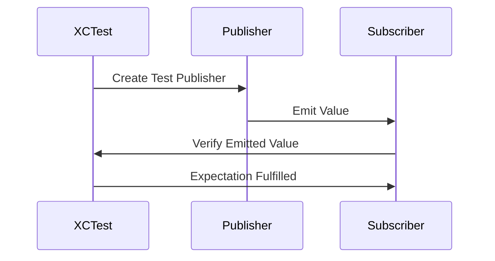

## 11.11 Testing Reactive Code

Reactive programming in Swift, particularly with the Combine framework, allows developers to handle asynchronous data streams with ease. However, testing reactive code can present unique challenges due to its asynchronous and event-driven nature. In this section, we will explore strategies for effectively testing reactive code, including unit testing strategies, mocking publishers, and debugging techniques.

### Unit Testing Strategies

Unit testing is a fundamental practice in software development that ensures individual components of your code work as expected. When it comes to reactive programming, unit testing involves verifying that your publishers emit the expected values under various conditions.

#### Test Schedulers: Controlling Time and Execution Order

One of the key challenges in testing reactive code is controlling the timing and order of events. This is where test schedulers come into play. Test schedulers allow you to simulate the passage of time and control the execution order of events, making it easier to test time-dependent code.

```swift
import Combine
import XCTest

class ReactiveTests: XCTestCase {
    var cancellables: Set<AnyCancellable> = []

    func testDelayedPublisher() {
        let expectation = self.expectation(description: "Delayed publisher emits value")
        let testScheduler = DispatchQueue.test

        let publisher = Just("Hello, world!")
            .delay(for: .seconds(5), scheduler: testScheduler)
            .eraseToAnyPublisher()

        publisher
            .sink(receiveCompletion: { _ in },
                  receiveValue: { value in
                      XCTAssertEqual(value, "Hello, world!")
                      expectation.fulfill()
                  })
            .store(in: &cancellables)

        testScheduler.advance(by: .seconds(5))
        waitForExpectations(timeout: 1, handler: nil)
    }
}
```

In this example, we use a test scheduler to control the timing of a delayed publisher. By advancing the scheduler, we can simulate the passage of time and verify that the publisher emits the expected value.

#### Expectations: Verifying That Publishers Emit Expected Values

Expectations in XCTest are used to verify that certain conditions are met within a specified timeframe. When testing reactive code, you can use expectations to verify that publishers emit the expected values.

```swift
import Combine
import XCTest

class ReactiveTests: XCTestCase {
    var cancellables: Set<AnyCancellable> = []

    func testPublisherEmitsExpectedValue() {
        let expectation = self.expectation(description: "Publisher emits expected value")

        let publisher = Just("Swift")
            .eraseToAnyPublisher()

        publisher
            .sink(receiveCompletion: { _ in },
                  receiveValue: { value in
                      XCTAssertEqual(value, "Swift")
                      expectation.fulfill()
                  })
            .store(in: &cancellables)

        waitForExpectations(timeout: 1, handler: nil)
    }
}
```

In this test, we create an expectation that the publisher will emit the value "Swift". The test will pass if the expectation is fulfilled within the specified timeout.

### Mocking Publishers

Mocking is a technique used to simulate the behavior of complex components or external dependencies in a controlled manner. In the context of reactive programming, mocking publishers can help you test how your code responds to different data streams.

#### Creating Test Publishers: Simulating Data Streams

To test how your code handles different data streams, you can create test publishers that simulate various scenarios, such as success, failure, or delayed emissions.

```swift
import Combine

struct MockPublisher {
    static func successPublisher() -> AnyPublisher<String, Never> {
        return Just("Success")
            .eraseToAnyPublisher()
    }

    static func failurePublisher() -> AnyPublisher<String, Error> {
        return Fail(error: NSError(domain: "", code: -1, userInfo: nil))
            .eraseToAnyPublisher()
    }
}
```

In this example, we define a `MockPublisher` struct with two static methods: `successPublisher` and `failurePublisher`. These methods return publishers that simulate successful and failed data streams, respectively.

#### Injecting Dependencies: Decoupling Code to Allow for Testing

Dependency injection is a design pattern that allows you to decouple components in your code, making it easier to test them in isolation. By injecting dependencies, such as publishers, into your code, you can replace them with mock implementations during testing.

```swift
import Combine

protocol DataService {
    func fetchData() -> AnyPublisher<String, Error>
}

class ViewModel {
    private let dataService: DataService

    init(dataService: DataService) {
        self.dataService = dataService
    }

    func loadData() -> AnyPublisher<String, Error> {
        return dataService.fetchData()
    }
}
```

In this example, we define a `DataService` protocol and a `ViewModel` class that depends on it. By injecting a `DataService` implementation into the `ViewModel`, we can replace it with a mock implementation during testing.

### Debugging

Debugging reactive code can be challenging due to its asynchronous nature. However, there are techniques that can help you troubleshoot and identify issues in your reactive code.

#### Print Operators: Logging Events for Troubleshooting

Print operators in Combine allow you to log events as they pass through the data stream. This can be useful for understanding the flow of data and identifying where things might be going wrong.

```swift
import Combine

let publisher = Just("Debugging")
    .print("Publisher")
    .sink(receiveCompletion: { _ in },
          receiveValue: { value in
              print("Received value: \\(value)")
          })
```

In this example, we use the `print` operator to log events from the publisher. The output will show each event as it passes through the stream, providing insight into the data flow.

#### Error Handling: Testing Failure Scenarios

Testing how your code handles errors is crucial for building robust applications. Combine provides operators that allow you to handle errors gracefully and test failure scenarios.

```swift
import Combine
import XCTest

class ErrorHandlingTests: XCTestCase {
    var cancellables: Set<AnyCancellable> = []

    func testErrorHandling() {
        let expectation = self.expectation(description: "Error is handled")

        let publisher = Fail<String, Error>(error: NSError(domain: "", code: -1, userInfo: nil))
            .catch { _ in Just("Recovered") }
            .eraseToAnyPublisher()

        publisher
            .sink(receiveCompletion: { _ in },
                  receiveValue: { value in
                      XCTAssertEqual(value, "Recovered")
                      expectation.fulfill()
                  })
            .store(in: &cancellables)

        waitForExpectations(timeout: 1, handler: nil)
    }
}
```

In this test, we simulate a failure scenario using a `Fail` publisher and handle the error using the `catch` operator. The test verifies that the error is handled and the publisher emits a recovery value.

### Visualizing Reactive Code Testing

To better understand the flow of data and events in reactive code, let's visualize a simple reactive testing scenario using a sequence diagram.



This diagram illustrates the interaction between a test, a publisher, and a subscriber. The test creates a test publisher, which emits a value to the subscriber. The subscriber verifies the emitted value and fulfills the test expectation.

### Try It Yourself

To deepen your understanding of testing reactive code, try modifying the code examples provided. Experiment with different test scenarios, such as:

- Changing the delay duration in the `testDelayedPublisher` example.
- Simulating different error types in the `testErrorHandling` example.
- Creating additional mock publishers with varying data streams.

By experimenting with these examples, you'll gain a better understanding of how to test and debug reactive code in Swift.

### Knowledge Check

Before we wrap up, let's summarize the key takeaways from this section:

- **Test Schedulers** allow you to control time and execution order in reactive tests.
- **Expectations** are used to verify that publishers emit expected values.
- **Mocking Publishers** helps simulate different data streams for testing.
- **Dependency Injection** decouples code, making it easier to test.
- **Print Operators** and **Error Handling** are essential for debugging reactive code.

Remember, testing reactive code is an essential skill for building robust applications. Keep practicing and experimenting with different testing strategies to master this skill.

## Quiz Time!



### What is the purpose of using test schedulers in reactive code testing?

- [x] To control time and execution order.
- [ ] To log events for debugging.
- [ ] To handle errors gracefully.
- [ ] To simulate data streams.

> **Explanation:** Test schedulers allow you to control the timing and order of events, making it easier to test time-dependent code.

### How can you verify that a publisher emits expected values in a test?

- [ ] By using print operators.
- [x] By using expectations.
- [ ] By using dependency injection.
- [ ] By using mock publishers.

> **Explanation:** Expectations in XCTest are used to verify that certain conditions are met within a specified timeframe.

### What is the role of mocking publishers in testing reactive code?

- [ ] To log events for debugging.
- [x] To simulate different data streams.
- [ ] To handle errors gracefully.
- [ ] To control time and execution order.

> **Explanation:** Mocking publishers allows you to simulate various scenarios, such as success, failure, or delayed emissions, for testing.

### How does dependency injection help in testing reactive code?

- [x] By decoupling components for easier testing.
- [ ] By logging events for debugging.
- [ ] By controlling time and execution order.
- [ ] By simulating data streams.

> **Explanation:** Dependency injection allows you to replace dependencies with mock implementations during testing, making it easier to test components in isolation.

### Which operator in Combine can be used to log events for troubleshooting?

- [x] print
- [ ] map
- [ ] catch
- [ ] flatMap

> **Explanation:** The `print` operator in Combine allows you to log events as they pass through the data stream.

### What is the purpose of the `catch` operator in Combine?

- [ ] To log events for debugging.
- [ ] To simulate data streams.
- [x] To handle errors gracefully.
- [ ] To control time and execution order.

> **Explanation:** The `catch` operator allows you to handle errors by providing an alternative publisher.

### How can you simulate a failure scenario in a test?

- [ ] By using a test scheduler.
- [ ] By using a print operator.
- [x] By using a Fail publisher.
- [ ] By using dependency injection.

> **Explanation:** A `Fail` publisher can be used to simulate a failure scenario in a test.

### What is the benefit of using expectations in reactive code testing?

- [ ] To log events for debugging.
- [x] To verify that publishers emit expected values.
- [ ] To handle errors gracefully.
- [ ] To control time and execution order.

> **Explanation:** Expectations are used to verify that publishers emit the expected values within a specified timeframe.

### Which technique helps decouple components in reactive code for easier testing?

- [x] Dependency Injection
- [ ] Print Operators
- [ ] Test Schedulers
- [ ] Mock Publishers

> **Explanation:** Dependency injection helps decouple components, making it easier to test them in isolation.

### True or False: Print operators in Combine can be used to simulate data streams.

- [ ] True
- [x] False

> **Explanation:** Print operators are used to log events for debugging, not to simulate data streams.



Remember, this is just the beginning. As you progress, you'll build more complex and interactive applications. Keep experimenting, stay curious, and enjoy the journey!


