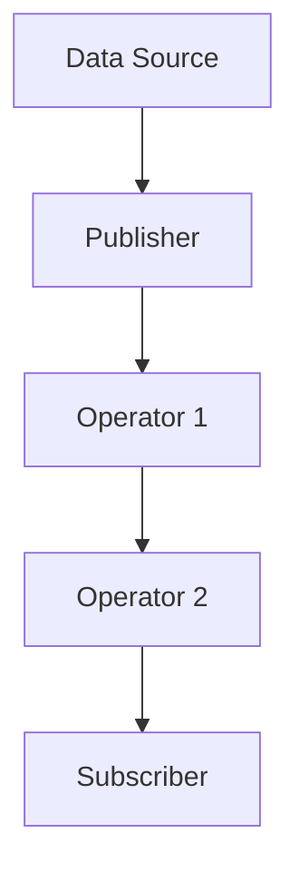

## 11.12 Best Practices and Common Pitfalls

Reactive programming in Swift, primarily facilitated by Apple's Combine framework, is a powerful paradigm that allows developers to handle asynchronous data streams with ease. However, mastering it requires a keen understanding of best practices and awareness of common pitfalls. In this section, we will explore how to effectively use reactive programming in Swift, ensuring your code is efficient, maintainable, and free from common errors.

### Best Practices

#### Modular Streams

**Explain the Concept**: Building modular streams involves creating small, reusable publishers and subscribers that can be easily composed to form complex data flows. This modularity enhances code readability and maintainability.

**Provide Code Example**:

```swift
import Combine

// Define a simple publisher for fetching user data
func fetchUserDataPublisher(userId: String) -> AnyPublisher<User, Error> {
    // Simulate a network request
    return Just(User(id: userId, name: "John Doe"))
        .setFailureType(to: Error.self)
        .eraseToAnyPublisher()
}

// Define a subscriber to handle the user data
let userDataSubscriber = Subscribers.Sink<User, Error>(
    receiveCompletion: { completion in
        switch completion {
        case .finished:
            print("User data fetch completed.")
        case .failure(let error):
            print("Error fetching user data: \\(error)")
        }
    },
    receiveValue: { user in
        print("Received user data: \\(user)")
    }
)

// Use the publisher and subscriber
let userId = "12345"
fetchUserDataPublisher(userId: userId)
    .subscribe(userDataSubscriber)
```

**Highlight Key Lines**: Note how the `fetchUserDataPublisher` function is a modular component that can be reused across different parts of the application.

**Try It Yourself**: Modify the `fetchUserDataPublisher` to simulate different types of data fetching, such as fetching posts or comments, and observe how easily you can swap out the subscriber logic.

#### Readability Over Cleverness

**Explain the Concept**: While reactive programming can lead to concise code, it is crucial to prioritize readability. Clever, but obscure, reactive chains can become maintenance nightmares.

**Provide Code Example**:

```swift
import Combine

// A complex reactive chain
let complexChain = [1, 2, 3, 4, 5]
    .publisher
    .map { $0 * 2 }
    .filter { $0 % 3 == 0 }
    .sink(receiveCompletion: { _ in },
          receiveValue: { print("Value: \\($0)") })

// A more readable version
let numbers = [1, 2, 3, 4, 5].publisher
let doubledNumbers = numbers.map { $0 * 2 }
let filteredNumbers = doubledNumbers.filter { $0 % 3 == 0 }
let subscription = filteredNumbers.sink(
    receiveCompletion: { _ in },
    receiveValue: { print("Value: \\($0)") }
)
```

**Highlight Key Lines**: The second example breaks down the reactive chain into smaller, named components, making it easier to understand and maintain.

**Try It Yourself**: Refactor a complex reactive chain in your codebase into smaller, named components and observe the improvement in readability.

#### Documentation

**Explain the Concept**: Reactive chains can become complex, and without proper documentation, they can be difficult to understand. Commenting on complex reactive chains ensures that future developers (or yourself) can easily grasp the logic.

**Provide Code Example**:

```swift
import Combine

let dataStream = [1, 2, 3, 4, 5].publisher
    .map { number in
        // Double the number
        return number * 2
    }
    .filter { number in
        // Only allow numbers divisible by 3
        return number % 3 == 0
    }
    .sink(receiveCompletion: { completion in
        // Handle completion
        print("Stream completed with: \\(completion)")
    }, receiveValue: { value in
        // Handle each value
        print("Received value: \\(value)")
    })
```

**Highlight Key Lines**: Each transformation step in the reactive chain is commented, explaining the purpose and logic behind it.

**Try It Yourself**: Go through your reactive code and add comments explaining each transformation step. This practice will help you and others understand the code better in the future.

### Common Pitfalls

#### Overusing Combine

**Explain the Concept**: While Combine is a powerful tool, it is not always the right choice for every problem. Overusing reactive programming can lead to unnecessary complexity and performance issues.

**Provide Code Example**:

```swift
import Combine

// Overuse example: Using Combine for simple data transformation
let simpleArray = [1, 2, 3, 4, 5]
let transformedArray = simpleArray.publisher
    .map { $0 * 2 }
    .collect()
    .sink(receiveValue: { print($0) })

// Better alternative: Use Swift's map directly
let betterTransformedArray = simpleArray.map { $0 * 2 }
print(betterTransformedArray)
```

**Highlight Key Lines**: The second example shows a simpler and more efficient way to achieve the same result without using Combine.

**Try It Yourself**: Identify areas in your code where Combine is used unnecessarily and refactor them to use simpler, more direct approaches.

#### Ignoring Memory Management

**Explain the Concept**: Combine uses reference types, which can lead to memory leaks and retain cycles if not managed properly. It's crucial to understand and apply proper memory management techniques.

**Provide Code Example**:

```swift
import Combine

class ViewModel {
    var cancellables = Set<AnyCancellable>()
    
    func fetchData() {
        let publisher = Just("Data")
        publisher
            .sink(receiveValue: { data in
                print("Received data: \\(data)")
            })
            .store(in: &cancellables)
    }
}

let viewModel = ViewModel()
viewModel.fetchData()
```

**Highlight Key Lines**: The `cancellables` set is used to store subscriptions, ensuring they are properly cancelled and released when no longer needed.

**Try It Yourself**: Implement a similar pattern in your reactive code to manage subscriptions and prevent memory leaks.

#### Complexity

**Explain the Concept**: Reactive programming can lead to complex data flows that are difficult to understand and maintain. It's essential to keep your reactive chains as simple as possible.

**Provide Code Example**:

```swift
import Combine

// Complex chain
let complexPublisher = [1, 2, 3, 4, 5].publisher
    .map { $0 * 2 }
    .filter { $0 % 3 == 0 }
    .flatMap { Just($0).delay(for: .seconds(1), scheduler: RunLoop.main) }
    .sink(receiveCompletion: { _ in }, receiveValue: { print("Value: \\($0)") })

// Simpler alternative
let simplePublisher = [1, 2, 3, 4, 5].publisher
    .map { $0 * 2 }
    .filter { $0 % 3 == 0 }
    .sink(receiveCompletion: { _ in }, receiveValue: { print("Value: \\($0)") })
```

**Highlight Key Lines**: The simpler alternative avoids unnecessary complexity, making the data flow easier to understand.

**Try It Yourself**: Review your reactive code and simplify any overly complex chains. This practice will make your codebase more maintainable and easier to debug.

### Visualizing Reactive Programming

To better understand the flow of data in reactive programming, let's visualize a typical reactive data flow using Mermaid.js:



**Description**: This diagram represents a simple reactive data flow where data from a source is passed through a publisher, transformed by operators, and finally consumed by a subscriber.

### References and Links

- [Apple's Combine Documentation](https://developer.apple.com/documentation/combine)
- [Reactive Programming with Combine](https://www.raywenderlich.com/books/combine-asynchronous-programming-with-swift/v2.0)
- [Swift Memory Management](https://developer.apple.com/documentation/swift/swift_standard_library/memory_management)

### Knowledge Check

- **Pose Questions**: What are the benefits of modular streams in reactive programming? How can overusing Combine lead to performance issues? Why is memory management crucial in reactive programming?

- **Exercises**: Refactor a complex reactive chain in your project to improve readability. Implement a memory management strategy for your Combine subscriptions.

### Embrace the Journey

Remember, mastering reactive programming in Swift is a journey. As you progress, you'll build more efficient and maintainable applications. Keep experimenting, stay curious, and enjoy the process!

---

## Quiz Time!



### What is a key benefit of building modular streams in reactive programming?

- [x] Enhances code readability and maintainability.
- [ ] Increases the complexity of the code.
- [ ] Reduces the need for documentation.
- [ ] Makes the code run faster.

> **Explanation:** Modular streams allow for easier composition and reuse, making the codebase more readable and maintainable.

### Why should you prioritize readability over cleverness in reactive programming?

- [x] To ensure the code is maintainable and understandable.
- [ ] To impress other developers with complex code.
- [ ] To reduce the need for comments.
- [ ] To make the code run faster.

> **Explanation:** Readable code is easier to maintain and understand, reducing the risk of errors and making it easier for other developers to work with.

### What is a common pitfall when using Combine?

- [x] Overusing it for simple tasks.
- [ ] Using it for asynchronous programming.
- [ ] Documenting reactive chains.
- [ ] Managing memory effectively.

> **Explanation:** Overusing Combine for simple tasks can lead to unnecessary complexity and performance issues.

### How can you prevent memory leaks in Combine?

- [x] Use a cancellables set to manage subscriptions.
- [ ] Avoid using Combine altogether.
- [ ] Use global variables for subscriptions.
- [ ] Rely on automatic memory management.

> **Explanation:** Storing subscriptions in a cancellables set ensures they are properly cancelled and released when no longer needed.

### What should you do if you encounter a complex reactive chain?

- [x] Break it down into smaller, named components.
- [ ] Add more operators to simplify it.
- [ ] Remove all comments to reduce clutter.
- [ ] Increase the number of subscribers.

> **Explanation:** Breaking down complex chains into smaller components improves readability and maintainability.

### What is a potential consequence of ignoring memory management in reactive programming?

- [x] Memory leaks and retain cycles.
- [ ] Faster code execution.
- [ ] Simpler code structure.
- [ ] Automatic optimization by the compiler.

> **Explanation:** Ignoring memory management can lead to memory leaks and retain cycles, which can degrade performance and cause crashes.

### Why is documentation important in reactive programming?

- [x] To explain complex reactive chains and ensure future maintainability.
- [ ] To increase the length of the codebase.
- [ ] To reduce the need for testing.
- [ ] To make the code run faster.

> **Explanation:** Documentation helps explain the logic behind complex reactive chains, making the code easier to understand and maintain.

### What is the purpose of using operators in a reactive chain?

- [x] To transform and filter data as it flows through the chain.
- [ ] To increase the complexity of the chain.
- [ ] To reduce the number of subscribers.
- [ ] To make the code run faster.

> **Explanation:** Operators are used to transform and filter data, allowing for complex data manipulations within a reactive chain.

### How can you simplify a complex reactive chain?

- [x] By breaking it down into smaller, named components.
- [ ] By adding more operators to the chain.
- [ ] By removing all comments.
- [ ] By increasing the number of subscribers.

> **Explanation:** Simplifying a complex chain by breaking it down into smaller components improves readability and maintainability.

### Reactive programming in Swift is primarily facilitated by which framework?

- [x] Combine
- [ ] UIKit
- [ ] SwiftUI
- [ ] Foundation

> **Explanation:** Combine is the primary framework for reactive programming in Swift, allowing developers to handle asynchronous data streams efficiently.




