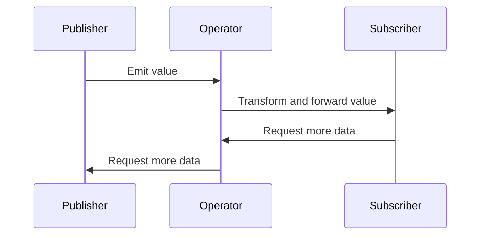

## 11.2 The Combine Framework in Swift

Reactive programming has become an essential paradigm in modern software development, especially in handling asynchronous events. Apple's Combine framework is a powerful tool for dealing with such events through reactive streams. In this section, we'll delve into the core components of Combine, explore its integration with Swift, and provide practical examples to help you harness its full potential.

### **Overview of Combine**

Combine is Apple's native framework designed to handle asynchronous events by processing values over time. It allows developers to work with reactive streams, providing a declarative Swift API to handle complex asynchronous tasks. Combine is particularly useful for managing data flow and event handling in applications, making it a perfect fit for iOS and macOS development.

### **Key Components of Combine**

To effectively use Combine, it's important to understand its key components: Publishers, Subscribers, Operators, and Schedulers.

#### **1. Publishers**

Publishers are the heart of the Combine framework. They are responsible for emitting a sequence of values over time. A publisher can emit zero or more values and eventually complete or fail with an error.

**Example:**

```swift
import Combine

let myPublisher = Just("Hello, Combine!")
myPublisher
    .sink { completion in
        switch completion {
        case .finished:
            print("Finished successfully!")
        case .failure(let error):
            print("Failed with error: \\(error)")
        }
    } receiveValue: { value in
        print("Received value: \\(value)")
    }
```

In this example, the `Just` publisher emits a single value and then completes.

#### **2. Subscribers**

Subscribers receive and react to the values emitted by publishers. They define how to handle incoming data and completion events.

**Example:**

```swift
import Combine

let mySubscriber = Subscribers.Sink<String, Never>(
    receiveCompletion: { completion in
        print("Completion: \\(completion)")
    },
    receiveValue: { value in
        print("Value: \\(value)")
    }
)

myPublisher.subscribe(mySubscriber)
```

Here, `Subscribers.Sink` is a simple subscriber that processes values and completion events.

#### **3. Operators**

Operators are used to transform, filter, and manipulate data streams. They allow you to build complex data processing pipelines.

**Example:**

```swift
import Combine

let numbers = [1, 2, 3, 4, 5]
let publisher = numbers.publisher

publisher
    .map { $0 * 2 }
    .filter { $0 > 5 }
    .sink { value in
        print("Filtered value: \\(value)")
    }
```

In this example, the `map` operator doubles each number, and the `filter` operator removes numbers less than or equal to 5.

#### **4. Schedulers**

Schedulers control the execution context of streams, determining when and where to execute code. They are crucial for managing threading and ensuring that UI updates occur on the main thread.

**Example:**

```swift
import Combine

let queue = DispatchQueue(label: "com.example.myQueue")
let publisher = Just("Hello, Combine!")

publisher
    .subscribe(on: queue)
    .receive(on: DispatchQueue.main)
    .sink { value in
        print("Received on main thread: \\(value)")
    }
```

This example demonstrates how to specify the execution context for a publisher using schedulers.

### **Integration with Swift**

Combine is designed to integrate seamlessly with Swift, providing compatibility with UIKit and SwiftUI, robust error handling, and efficient memory management.

#### **UIKit and SwiftUI Compatibility**

Combine works well with both UIKit and SwiftUI, allowing you to bind data streams directly to UI components.

**SwiftUI Example:**

```swift
import SwiftUI
import Combine

struct ContentView: View {
    @State private var text = ""
    private var cancellable: AnyCancellable?

    var body: some View {
        VStack {
            TextField("Enter text", text: $text)
            Text("You typed: \\(text)")
        }
        .onAppear {
            let publisher = NotificationCenter.default.publisher(for: UITextField.textDidChangeNotification)
            cancellable = publisher
                .compactMap { $0.object as? UITextField }
                .map { $0.text ?? "" }
                .assign(to: \.text, on: self)
        }
    }
}
```

In this SwiftUI example, a `TextField` is bound to a Combine publisher that listens for text changes.

#### **Error Handling**

Combine provides built-in mechanisms for managing errors in streams, allowing you to handle failures gracefully.

**Example:**

```swift
import Combine

enum MyError: Error {
    case exampleError
}

let failingPublisher = Fail<String, MyError>(error: .exampleError)

failingPublisher
    .catch { error in
        Just("Recovered from error")
    }
    .sink { value in
        print("Value: \\(value)")
    }
```

This example uses the `catch` operator to recover from an error by providing a fallback value.

#### **Memory Management**

Combine uses `AnyCancellable` to manage the lifecycle of subscriptions, ensuring that resources are released when no longer needed.

**Example:**

```swift
import Combine

var cancellables = Set<AnyCancellable>()

let publisher = ["A", "B", "C"].publisher

publisher
    .sink { value in
        print("Received: \\(value)")
    }
    .store(in: &cancellables)
```

In this example, subscriptions are stored in a `Set` of `AnyCancellable` to manage their lifecycle.

### **Visualizing Combine's Workflow**

To better understand how Combine components interact, let's visualize the workflow using a Mermaid.js sequence diagram.



**Description:** This diagram illustrates the flow of data from a publisher through an operator to a subscriber, highlighting the reactive nature of Combine.

### **Try It Yourself**

To solidify your understanding of Combine, try modifying the code examples provided. For instance, experiment with different operators, such as `reduce` or `combineLatest`, to see how they affect data streams. Additionally, try integrating Combine with a real-world API to fetch and display data in a SwiftUI or UIKit application.

### **Further Reading and Resources**

For more information on the Combine framework, consider exploring the following resources:

- [Apple's Combine Documentation](https://developer.apple.com/documentation/combine)
- [Swift by Sundell: Combine](https://www.swiftbysundell.com/articles/combine/)
- [Ray Wenderlich's Combine Tutorial](https://www.raywenderlich.com/books/combine-asynchronous-programming-with-swift)

### **Knowledge Check**

Before moving on, ensure you understand the key concepts of Combine, including publishers, subscribers, operators, and schedulers. Test your knowledge with the following quiz.

## Quiz Time!



### What is the primary purpose of the Combine framework in Swift?

- [x] To handle asynchronous events through reactive streams
- [ ] To replace the UIKit framework
- [ ] To manage memory more efficiently
- [ ] To simplify network requests

> **Explanation:** Combine is designed to handle asynchronous events through reactive streams, providing a declarative API for processing values over time.

### Which component of Combine is responsible for emitting values over time?

- [x] Publisher
- [ ] Subscriber
- [ ] Operator
- [ ] Scheduler

> **Explanation:** Publishers are responsible for emitting values over time in the Combine framework.

### What is the role of a Subscriber in Combine?

- [x] To receive and react to values emitted by a Publisher
- [ ] To transform data streams
- [ ] To control the execution context of streams
- [ ] To manage memory

> **Explanation:** Subscribers receive and react to values emitted by publishers, defining how to handle incoming data and completion events.

### Which operator would you use to transform data in a Combine stream?

- [x] map
- [ ] sink
- [ ] assign
- [ ] store

> **Explanation:** The `map` operator is used to transform data in a Combine stream.

### How does Combine ensure that resources are released when no longer needed?

- [x] By using AnyCancellable to manage the lifecycle of subscriptions
- [ ] By automatically freeing memory
- [ ] By using the map operator
- [ ] By using the sink operator

> **Explanation:** Combine uses `AnyCancellable` to manage the lifecycle of subscriptions, ensuring resources are released when no longer needed.

### What is the purpose of a Scheduler in Combine?

- [x] To control the execution context of streams
- [ ] To emit values over time
- [ ] To receive and react to values
- [ ] To transform data streams

> **Explanation:** Schedulers control the execution context of streams, determining when and where to execute code.

### Which Combine component allows you to handle errors in a stream?

- [x] catch
- [ ] map
- [ ] sink
- [ ] assign

> **Explanation:** The `catch` operator allows you to handle errors in a stream by providing a fallback value or alternative publisher.

### How can you bind a Combine publisher to a SwiftUI view?

- [x] By using the assign operator to update a @State property
- [ ] By using the sink operator
- [ ] By using the map operator
- [ ] By using a Scheduler

> **Explanation:** You can bind a Combine publisher to a SwiftUI view by using the `assign` operator to update a `@State` property.

### True or False: Combine is only compatible with SwiftUI.

- [ ] True
- [x] False

> **Explanation:** Combine is compatible with both UIKit and SwiftUI, allowing seamless integration with UI frameworks.

### Which of the following is NOT a key component of Combine?

- [ ] Publisher
- [ ] Subscriber
- [ ] Operator
- [x] Controller

> **Explanation:** Controller is not a key component of Combine. The key components are Publisher, Subscriber, Operator, and Scheduler.



Remember, mastering Combine is a journey. As you continue to experiment and apply these concepts, you'll unlock new possibilities for handling asynchronous events in your Swift applications. Stay curious and enjoy the process!


