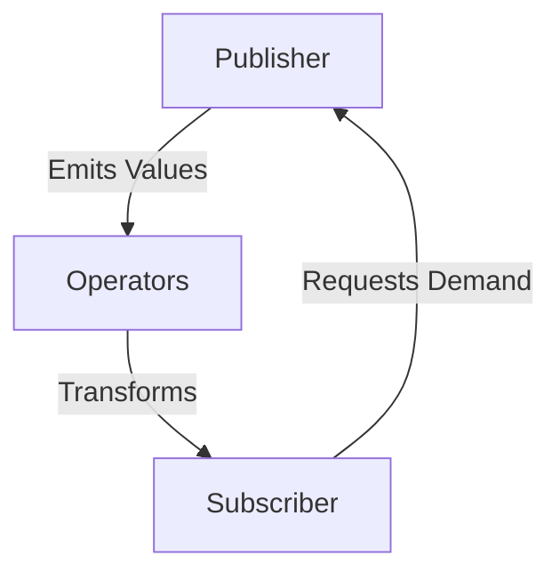

## 11.3 Publishers, Subscribers, and Operators

In the world of reactive programming, Swift's Combine framework stands out as a powerful tool for managing asynchronous events and data streams. At the heart of this framework are three fundamental components: **Publishers**, **Subscribers**, and **Operators**. Understanding these elements is crucial for mastering Combine and building robust, reactive applications in Swift.

### Publishers

**Publishers** are the source of data in Combine. They emit a sequence of values over time to subscribers. Let's explore the different types of publishers and how they work.

#### Types of Publishers

1. **Just**: Emits a single value and then completes. It's useful for testing or when you have a single value to work with.

   ```swift
   import Combine

   let justPublisher = Just(42)
   justPublisher.sink { value in
       print("Received value: \\(value)")
   }
   ```

2. **Future**: Emits a single value or an error in the future. It's ideal for wrapping asynchronous operations.

   ```swift
   func fetchData() -> Future<String, Error> {
       return Future { promise in
           // Simulate an asynchronous task
           DispatchQueue.global().asyncAfter(deadline: .now() + 1) {
               promise(.success("Data fetched"))
           }
       }
   }

   let futurePublisher = fetchData()
   futurePublisher.sink(receiveCompletion: { completion in
       print("Completed with: \\(completion)")
   }, receiveValue: { value in
       print("Received value: \\(value)")
   })
   ```

3. **PassthroughSubject**: A publisher you can manually send values through. It's useful for bridging imperative code with Combine.

   ```swift
   let subject = PassthroughSubject<String, Never>()
   subject.send("Hello, Combine!")
   ```

4. **CurrentValueSubject**: Similar to `PassthroughSubject`, but it also stores the current value, which new subscribers will receive upon subscription.

   ```swift
   let currentValueSubject = CurrentValueSubject<Int, Never>(0)
   currentValueSubject.send(10)
   ```

#### Creating Custom Publishers

Sometimes, the built-in publishers aren't enough, and you need to create custom publishers to suit specific needs. Implementing a custom publisher involves conforming to the `Publisher` protocol.

```swift
struct CustomPublisher: Publisher {
   typealias Output = Int
   typealias Failure = Never

   func receive<S>(subscriber: S) where S : Subscriber, CustomPublisher.Failure == S.Failure, CustomPublisher.Output == S.Input {
       let subscription = CustomSubscription(subscriber: subscriber)
       subscriber.receive(subscription: subscription)
   }
}

class CustomSubscription<S: Subscriber>: Subscription where S.Input == Int, S.Failure == Never {
   private var subscriber: S?

   init(subscriber: S) {
       self.subscriber = subscriber
   }

   func request(_ demand: Subscribers.Demand) {
       // Send values to the subscriber
       _ = subscriber?.receive(1)
       _ = subscriber?.receive(2)
       _ = subscriber?.receive(3)
       subscriber?.receive(completion: .finished)
   }

   func cancel() {
       subscriber = nil
   }
}
```

#### Multicasting

Multicasting allows a single publisher to share its subscription with multiple subscribers, reducing resource usage. Use `Multicast` or `share()` operator for this purpose.

```swift
let multicastPublisher = Just("Hello").multicast { PassthroughSubject<String, Never>() }
let subscriber1 = multicastPublisher.sink { print("Subscriber 1 received: \\($0)") }
let subscriber2 = multicastPublisher.sink { print("Subscriber 2 received: \\($0)") }
multicastPublisher.connect()
```

### Subscribers

**Subscribers** receive values from publishers. They define how to handle incoming data and completion events.

#### Subscriber Protocol

The `Subscriber` protocol requires defining methods to handle subscription, input, and completion.

```swift
struct IntSubscriber: Subscriber {
   typealias Input = Int
   typealias Failure = Never

   func receive(subscription: Subscription) {
       subscription.request(.unlimited) // Request unlimited values
   }

   func receive(_ input: Int) -> Subscribers.Demand {
       print("Received value: \\(input)")
       return .none // No additional demand
   }

   func receive(completion: Subscribers.Completion<Never>) {
       print("Completed with: \\(completion)")
   }
}
```

#### Sink and Assign Subscribers

Combine provides convenient subscribers like `sink` and `assign`.

- **Sink**: Allows you to handle values and completion with closures.

  ```swift
  let sinkSubscriber = Just("Hello, Sink!")
      .sink(receiveCompletion: { completion in
          print("Completed with: \\(completion)")
      }, receiveValue: { value in
          print("Received value: \\(value)")
      })
  ```

- **Assign**: Automatically assigns incoming values to a property.

  ```swift
  class MyClass: ObservableObject {
      @Published var text: String = ""
  }

  let myObject = MyClass()
  let assignSubscriber = Just("Hello, Assign!")
      .assign(to: \.text, on: myObject)
  ```

#### Demand and Backpressure

Demand and backpressure control the flow of data between publishers and subscribers, preventing overload.

- **Demand**: Specifies how many values a subscriber can handle at a time.

  ```swift
  struct LimitedSubscriber: Subscriber {
      typealias Input = Int
      typealias Failure = Never

      func receive(subscription: Subscription) {
          subscription.request(.max(3)) // Request only 3 values
      }

      func receive(_ input: Int) -> Subscribers.Demand {
          print("Received value: \\(input)")
          return .none
      }

      func receive(completion: Subscribers.Completion<Never>) {
          print("Completed with: \\(completion)")
      }
  }
  ```

### Operators

**Operators** are methods that allow you to transform, combine, and manipulate data streams.

#### Transforming Data

Operators like `map`, `flatMap`, and `filter` help transform data.

- **Map**: Transforms each value emitted by a publisher.

  ```swift
  let numbers = [1, 2, 3, 4, 5]
  _ = numbers.publisher
      .map { $0 * 2 }
      .sink { print("Transformed value: \\($0)") }
  ```

- **FlatMap**: Flattens nested publishers into a single stream.

  ```swift
  func fetchValue(for number: Int) -> AnyPublisher<String, Never> {
      return Just("Value for \\(number)").eraseToAnyPublisher()
  }

  _ = [1, 2, 3].publisher
      .flatMap { fetchValue(for: $0) }
      .sink { print("Fetched: \\($0)") }
  ```

- **Filter**: Filters values based on a predicate.

  ```swift
  _ = numbers.publisher
      .filter { $0 % 2 == 0 }
      .sink { print("Even number: \\($0)") }
  ```

#### Combining Streams

Combine multiple publishers into a single stream using operators like `combineLatest`, `merge`, and `zip`.

- **CombineLatest**: Emits a tuple of the latest values from multiple publishers.

  ```swift
  let publisher1 = Just(1)
  let publisher2 = Just("A")

  _ = publisher1.combineLatest(publisher2)
      .sink { print("Combined: \\($0), \\($1)") }
  ```

- **Merge**: Combines multiple publishers into one, emitting values as they arrive.

  ```swift
  let publisher3 = [1, 2, 3].publisher
  let publisher4 = [4, 5, 6].publisher

  _ = publisher3.merge(with: publisher4)
      .sink { print("Merged value: \\($0)") }
  ```

- **Zip**: Combines publishers, emitting tuples of values from each when all have emitted.

  ```swift
  _ = publisher1.zip(publisher2)
      .sink { print("Zipped: \\($0), \\($1)") }
  ```

#### Error Handling Operators

Handle errors in streams with operators like `catch` and `retry`.

- **Catch**: Provides a fallback publisher in case of an error.

  ```swift
  let failingPublisher = Fail<Int, Error>(error: NSError(domain: "", code: -1, userInfo: nil))

  _ = failingPublisher
      .catch { _ in Just(0) }
      .sink { print("Recovered value: \\($0)") }
  ```

- **Retry**: Attempts to re-subscribe to a publisher after a failure.

  ```swift
  _ = failingPublisher
      .retry(3)
      .sink(receiveCompletion: { completion in
          print("Completion: \\(completion)")
      }, receiveValue: { value in
          print("Received: \\(value)")
      })
  ```

#### Scheduling Operators

Manage execution threads using `receive(on:)` and `subscribe(on:)`.

- **Receive(on:)**: Specifies the scheduler for downstream operations.

  ```swift
  _ = [1, 2, 3].publisher
      .receive(on: DispatchQueue.main)
      .sink { print("Received on main thread: \\($0)") }
  ```

- **Subscribe(on:)**: Specifies the scheduler for upstream operations.

  ```swift
  _ = [1, 2, 3].publisher
      .subscribe(on: DispatchQueue.global())
      .sink { print("Subscribed on background thread: \\($0)") }
  ```

### Visualizing Publishers, Subscribers, and Operators

To better understand how these components interact, let's visualize the flow of data in a simple Combine pipeline:



**Diagram Description**: This diagram illustrates the flow of data in a Combine pipeline. The publisher emits values, which pass through operators for transformation, and are finally received by the subscriber. The subscriber can request demand, influencing the publisher's emission of values.

### Try It Yourself

Experiment with the code examples provided. Try modifying the publishers, adding more operators, or changing the demand in subscribers to see how the behavior changes. This hands-on approach will deepen your understanding of Combine's capabilities.

### Knowledge Check

- **What is the role of a publisher in Combine?**
- **How does a subscriber request data from a publisher?**
- **What is the purpose of the `map` operator?**
- **How can you handle errors in a data stream?**

### Embrace the Journey

Remember, mastering Combine is a journey. With each example, you're building a solid foundation in reactive programming. Keep experimenting, stay curious, and enjoy the process!

## Quiz Time!



### What is a Publisher in Swift's Combine framework?

- [x] A source of data that emits values over time.
- [ ] A mechanism to handle errors in Combine.
- [ ] A type that transforms data in Combine.
- [ ] A type that requests data from a source.

> **Explanation:** A Publisher is responsible for emitting values over time to its subscribers in the Combine framework.

### Which of the following is a type of Publisher in Combine?

- [x] Just
- [ ] Sink
- [ ] Assign
- [ ] Demand

> **Explanation:** Just is a type of Publisher that emits a single value and then completes.

### What is the role of a Subscriber in Combine?

- [x] To receive values and completion from a Publisher.
- [ ] To transform data emitted by a Publisher.
- [ ] To handle errors in a data stream.
- [ ] To combine multiple data streams into one.

> **Explanation:** A Subscriber receives values and completion events from a Publisher.

### Which operator would you use to transform data in a Combine pipeline?

- [x] map
- [ ] zip
- [ ] catch
- [ ] merge

> **Explanation:** The `map` operator is used to transform each value emitted by a Publisher.

### How can you handle errors in a Combine data stream?

- [x] Using the `catch` operator.
- [ ] Using the `map` operator.
- [x] Using the `retry` operator.
- [ ] Using the `zip` operator.

> **Explanation:** The `catch` operator provides a fallback Publisher in case of an error, while `retry` attempts to re-subscribe after a failure.

### What does the `combineLatest` operator do?

- [x] Emits a tuple of the latest values from multiple publishers.
- [ ] Merges multiple publishers into one.
- [ ] Transforms data emitted by a publisher.
- [ ] Handles errors in a data stream.

> **Explanation:** The `combineLatest` operator emits a tuple containing the latest values from multiple publishers.

### What is the purpose of the `receive(on:)` operator?

- [x] To specify the scheduler for downstream operations.
- [ ] To specify the scheduler for upstream operations.
- [ ] To transform data in a Combine pipeline.
- [ ] To handle errors in a data stream.

> **Explanation:** The `receive(on:)` operator specifies the scheduler for downstream operations, determining where the subscriber receives the data.

### Which operator allows you to flatten nested publishers into a single stream?

- [x] flatMap
- [ ] map
- [ ] filter
- [ ] zip

> **Explanation:** The `flatMap` operator is used to flatten nested publishers into a single stream.

### True or False: The `assign` subscriber automatically assigns incoming values to a property.

- [x] True
- [ ] False

> **Explanation:** The `assign` subscriber is designed to automatically assign incoming values to a specified property of an object.




