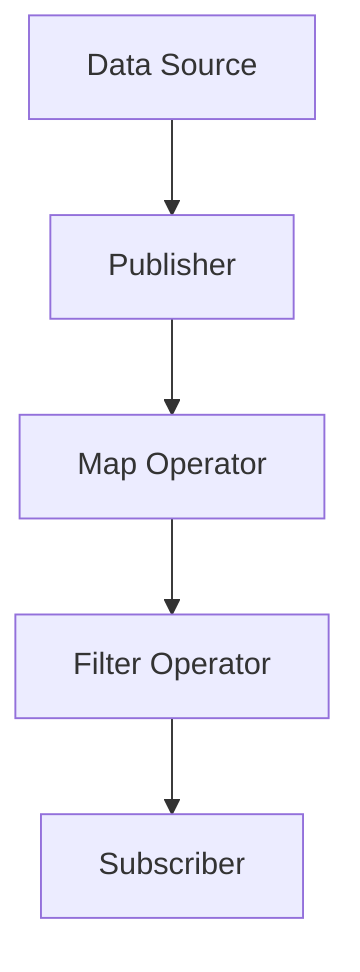

## 11.4 Modeling Asynchronous Data Streams

In the rapidly evolving world of software development, the ability to handle asynchronous data efficiently is crucial. Asynchronous programming allows applications to perform tasks in parallel, making them more responsive and efficient. In Swift, the Combine framework offers a powerful paradigm for modeling asynchronous data streams, enabling developers to build reactive applications that are both robust and scalable.

### Understanding Asynchronous Programming Challenges

Before diving into Combine, it's essential to understand the challenges associated with asynchronous programming:

- **Timing Issues**: Asynchronous operations can complete at unpredictable times, making it difficult to manage the sequence of operations.
- **Race Conditions**: These occur when multiple operations access shared resources concurrently, leading to unpredictable outcomes.
- **Callback Hell**: Nested callbacks can make code difficult to read and maintain, leading to a phenomenon known as "callback hell."

### Using Combine to Model Asynchronous Streams

Combine is a framework introduced by Apple that provides a declarative Swift API for processing values over time. It allows developers to work with asynchronous data streams in a more structured and readable manner.

#### Network Calls: Wrapping `URLSession` Data Tasks in Publishers

One of the most common use cases for asynchronous programming is handling network requests. Combine makes it easy to wrap `URLSession` data tasks in publishers, allowing you to handle network responses reactively.

```swift
import Combine
import Foundation

// Define a simple model
struct Post: Codable {
    let id: Int
    let title: String
}

// Create a function to fetch posts
func fetchPosts() -> AnyPublisher<[Post], Error> {
    let url = URL(string: "https://jsonplaceholder.typicode.com/posts")!
    return URLSession.shared.dataTaskPublisher(for: url)
        .map(\.data)
        .decode(type: [Post].self, decoder: JSONDecoder())
        .receive(on: DispatchQueue.main)
        .eraseToAnyPublisher()
}

// Usage
let cancellable = fetchPosts()
    .sink(receiveCompletion: { completion in
        switch completion {
        case .finished:
            print("Finished fetching posts.")
        case .failure(let error):
            print("Error fetching posts: \\(error)")
        }
    }, receiveValue: { posts in
        print("Received posts: \\(posts)")
    })
```

In this example, we define a `fetchPosts` function that returns a publisher. This publisher wraps a `URLSession` data task, maps the response data, decodes it into an array of `Post` objects, and finally delivers the results on the main thread.

#### User Interface Events: Responding to User Actions in a Reactive Way

Combine can also be used to handle user interface events reactively. By integrating Combine with SwiftUI or UIKit, you can respond to user actions in a more declarative manner.

```swift
import Combine
import UIKit

class ViewController: UIViewController {
    private var button: UIButton!
    private var cancellables: Set<AnyCancellable> = []

    override func viewDidLoad() {
        super.viewDidLoad()

        button = UIButton(type: .system)
        button.setTitle("Tap Me", for: .normal)
        button.translatesAutoresizingMaskIntoConstraints = false
        view.addSubview(button)

        NSLayoutConstraint.activate([
            button.centerXAnchor.constraint(equalTo: view.centerXAnchor),
            button.centerYAnchor.constraint(equalTo: view.centerYAnchor)
        ])

        button.publisher(for: .touchUpInside)
            .sink { _ in
                print("Button was tapped!")
            }
            .store(in: &cancellables)
    }
}
```

In this example, we use Combine to subscribe to the `touchUpInside` event of a `UIButton`. When the button is tapped, the closure passed to `sink` is executed, printing a message to the console.

#### Timers and Notifications: Creating Time-Based or System Event Publishers

Combine also provides a way to create publishers for timers and notifications, allowing you to react to time-based or system events.

```swift
import Combine
import Foundation

// Timer publisher example
let timerPublisher = Timer.publish(every: 1.0, on: .main, in: .common).autoconnect()
let timerCancellable = timerPublisher
    .sink { _ in
        print("Timer fired!")
    }

// Notification publisher example
let notificationPublisher = NotificationCenter.default.publisher(for: UIApplication.didBecomeActiveNotification)
let notificationCancellable = notificationPublisher
    .sink { notification in
        print("App became active: \\(notification)")
    }
```

In these examples, we create a timer publisher that fires every second and a notification publisher that reacts when the application becomes active. Both publishers are subscribed to with a `sink`, allowing us to handle the events as they occur.

### Best Practices for Modeling Asynchronous Data Streams

To effectively model asynchronous data streams with Combine, consider the following best practices:

#### Chaining Publishers: Creating Data Pipelines

Combine allows you to chain multiple publishers together, creating complex data pipelines. This makes it easy to transform data as it flows through the stream.

```swift
let numbers = [1, 2, 3, 4, 5]
let numberPublisher = numbers.publisher

let cancellable = numberPublisher
    .map { $0 * 2 }
    .filter { $0 > 5 }
    .sink { value in
        print("Received value: \\(value)")
    }
```

In this example, we create a publisher from an array of numbers, map each number to its double, filter out values less than or equal to 5, and finally print the resulting values.

#### Error Propagation: Handling Errors Gracefully Throughout the Stream

Error handling is a critical aspect of any asynchronous operation. Combine provides several operators to handle errors gracefully, such as `catch` and `retry`.

```swift
fetchPosts()
    .catch { error in
        Just([]) // Return an empty array on error
    }
    .sink(receiveCompletion: { completion in
        switch completion {
        case .finished:
            print("Finished fetching posts.")
        case .failure(let error):
            print("Error fetching posts: \\(error)")
        }
    }, receiveValue: { posts in
        print("Received posts: \\(posts)")
    })
```

In this example, we use the `catch` operator to handle errors by returning an empty array, allowing the stream to continue without interruption.

#### Resource Management: Avoiding Memory Leaks with Proper Cancellation

Proper resource management is essential to avoid memory leaks in reactive programming. Combine provides the `AnyCancellable` type to manage the lifecycle of subscriptions.

```swift
var cancellables: Set<AnyCancellable> = []

fetchPosts()
    .sink(receiveCompletion: { _ in },
          receiveValue: { _ in })
    .store(in: &cancellables)
```

By storing cancellables in a set, you can easily manage their lifecycle and ensure they are canceled when no longer needed.

### Visualizing Asynchronous Data Streams

To better understand how asynchronous data streams work in Combine, let's visualize a simple data pipeline using a flowchart.



In this diagram, the data source emits values to a publisher, which then passes them through a map operator, a filter operator, and finally to a subscriber. This visual representation helps clarify the flow of data through the stream.

### References and Links

For further reading and a deeper dive into Combine and reactive programming in Swift, consider the following resources:

- [Apple's Combine Documentation](https://developer.apple.com/documentation/combine)
- [Swift by Sundell: Introduction to Combine](https://www.swiftbysundell.com/articles/introducing-combine/)
- [Ray Wenderlich: Combine Framework Tutorial](https://www.raywenderlich.com/books/combine-asynchronous-programming-with-swift/v1.0)

### Knowledge Check

To reinforce your understanding of modeling asynchronous data streams with Combine, consider the following questions:

1. What are the key challenges of asynchronous programming?
2. How does Combine help in handling network requests?
3. What is the role of `AnyCancellable` in Combine?
4. How can you handle errors in a Combine data stream?
5. What is the purpose of the `map` operator in Combine?

### Embrace the Journey

Remember, mastering asynchronous data streams is a journey. As you continue to explore Combine, you'll discover new ways to build reactive applications that are both efficient and scalable. Keep experimenting, stay curious, and enjoy the process of learning and growth!

## Quiz Time!



### What are the key challenges of asynchronous programming?

- [x] Timing issues, race conditions, and callback hell
- [ ] Slow network connections and limited bandwidth
- [ ] Lack of user interaction and engagement
- [ ] High memory consumption and CPU usage

> **Explanation:** Asynchronous programming challenges include timing issues, race conditions, and callback hell, which can complicate code management and execution flow.

### How does Combine help in handling network requests?

- [x] By wrapping `URLSession` data tasks in publishers
- [ ] By directly modifying the HTTP request headers
- [ ] By caching network responses locally
- [ ] By encrypting network data

> **Explanation:** Combine wraps `URLSession` data tasks in publishers, allowing developers to handle network responses reactively.

### What is the role of `AnyCancellable` in Combine?

- [x] To manage the lifecycle of subscriptions and prevent memory leaks
- [ ] To encrypt data streams for secure transmission
- [ ] To convert synchronous code to asynchronous
- [ ] To optimize network bandwidth usage

> **Explanation:** `AnyCancellable` is used in Combine to manage the lifecycle of subscriptions and ensure proper cancellation to prevent memory leaks.

### How can you handle errors in a Combine data stream?

- [x] Using operators like `catch` and `retry`
- [ ] By ignoring errors and continuing execution
- [ ] By logging errors to a file
- [ ] By converting errors to warnings

> **Explanation:** Combine provides operators like `catch` and `retry` to handle errors gracefully within a data stream.

### What is the purpose of the `map` operator in Combine?

- [x] To transform values emitted by a publisher
- [ ] To filter out unwanted values from a stream
- [ ] To combine multiple streams into one
- [ ] To split a stream into multiple sub-streams

> **Explanation:** The `map` operator in Combine is used to transform values emitted by a publisher, allowing for data manipulation within the stream.

### How can you create a timer publisher in Combine?

- [x] Using `Timer.publish(every:on:in:)` and `autoconnect()`
- [ ] By manually updating a variable at regular intervals
- [ ] By using a loop with a delay
- [ ] By creating a separate thread for timing

> **Explanation:** In Combine, you can create a timer publisher using `Timer.publish(every:on:in:)` and `autoconnect()` to automatically start the timer.

### How does Combine handle user interface events?

- [x] By integrating with UI components to respond to events reactively
- [ ] By polling for UI changes at regular intervals
- [ ] By using static event handlers
- [ ] By directly modifying UI elements

> **Explanation:** Combine integrates with UI components to respond to events reactively, allowing for a more declarative approach to UI event handling.

### Which operator in Combine is used to filter values?

- [x] `filter`
- [ ] `map`
- [ ] `reduce`
- [ ] `merge`

> **Explanation:** The `filter` operator in Combine is used to filter values emitted by a publisher based on a specified condition.

### What is the benefit of chaining publishers in Combine?

- [x] It allows for creating complex data pipelines
- [ ] It reduces the overall execution time
- [ ] It simplifies error handling
- [ ] It increases network bandwidth

> **Explanation:** Chaining publishers in Combine allows for creating complex data pipelines, enabling data transformation and manipulation as it flows through the stream.

### True or False: Combine can only be used for network requests.

- [ ] True
- [x] False

> **Explanation:** False. Combine can be used for a variety of asynchronous tasks, including network requests, UI events, timers, and notifications.




