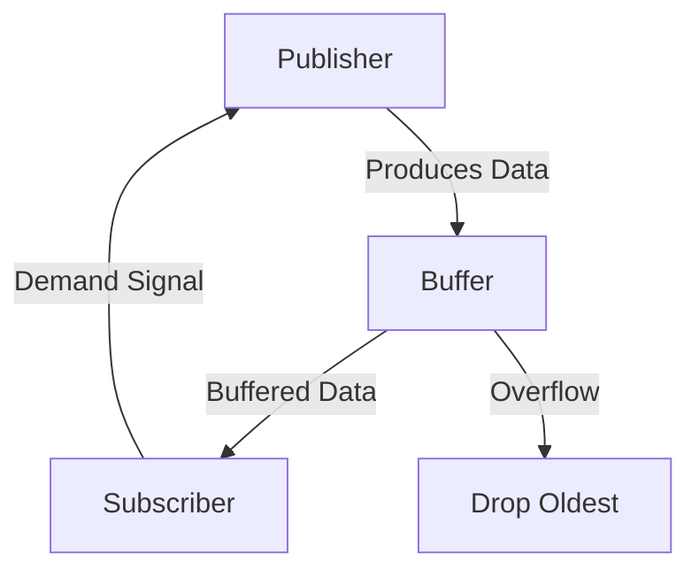

## 11.5 Handling Backpressure and Demand in Swift Reactive Programming

In the realm of reactive programming, especially when working with Swift's Combine framework, managing the flow of data between publishers and subscribers is crucial. This process involves handling backpressure and demand effectively to ensure that data is processed efficiently without overwhelming the system. Let's delve into the concepts of backpressure and demand, explore techniques to manage them, and provide practical examples to solidify your understanding.

### Understanding Backpressure

**Backpressure** occurs when a data producer (publisher) generates data faster than a consumer (subscriber) can process it. This mismatch can lead to resource exhaustion, increased latency, or even application crashes if not managed properly. In reactive streams, handling backpressure is essential to maintain system stability and performance.

#### Key Concepts

- **Publisher**: An entity that produces a stream of data over time.
- **Subscriber**: An entity that consumes the data produced by the publisher.
- **Demand**: The amount of data a subscriber is willing to receive from a publisher at any given time.

### Managing Demand

Managing demand involves controlling the flow of data from the publisher to the subscriber. By specifying how much data a subscriber can handle, we can prevent overwhelming the system. Let's explore some strategies to manage demand effectively.

#### Requesting Data

Subscribers can specify the amount of data they can handle by using demand signals. This is achieved through the `request(_:)` method, where a subscriber indicates how many elements it can process. This approach allows for fine-grained control over data flow and helps prevent backpressure.

```swift
import Combine

let publisher = (1...100).publisher
let subscriber = Subscribers.Sink<Int, Never>(
    receiveCompletion: { completion in
        print("Completed with: \\(completion)")
    },
    receiveValue: { value in
        print("Received value: \\(value)")
    }
)

publisher
    .sink(receiveCompletion: subscriber.receiveCompletion, receiveValue: subscriber.receiveValue)
```

In this example, the subscriber can specify the number of elements it can handle at a time, thus managing the demand effectively.

#### Buffering Strategies

Buffering is a technique used to manage overflow when the publisher produces data faster than the subscriber can consume. The `buffer` operator in Combine allows you to specify a maximum buffer size and a strategy for handling overflow.

```swift
publisher
    .buffer(size: 10, prefetch: .byRequest, whenFull: .dropOldest)
    .sink(receiveCompletion: subscriber.receiveCompletion, receiveValue: subscriber.receiveValue)
```

Here, the `buffer` operator is used to store up to 10 elements. If the buffer is full, the oldest elements are dropped, ensuring that the subscriber is not overwhelmed.

#### Throttle and Debounce

Throttle and debounce are techniques used to control the rate of data flow. Throttling limits the number of events processed in a given time frame, while debouncing ensures that only the final event in a rapid sequence is processed.

```swift
publisher
    .throttle(for: .seconds(1), scheduler: RunLoop.main, latest: true)
    .sink(receiveCompletion: subscriber.receiveCompletion, receiveValue: subscriber.receiveValue)
```

In this example, the `throttle` operator is used to limit the data flow to one event per second, ensuring that the subscriber is not overwhelmed by rapid data production.

### Techniques for Handling Backpressure

Handling backpressure effectively involves applying demand signals, using prefetching strategies, and employing operators like buffer, throttle, and debounce. Let's explore these techniques in more detail.

#### Applying Demand Signals

Demand signals are used to adjust upstream production based on downstream capacity. By controlling the demand, you can ensure that the publisher only produces as much data as the subscriber can handle.

```swift
let demandSubscriber = Subscribers.Demand(max: 5)
publisher
    .handleEvents(receiveRequest: { demand in
        print("Requested demand: \\(demand)")
    })
    .sink(receiveCompletion: subscriber.receiveCompletion, receiveValue: subscriber.receiveValue)
```

In this example, the subscriber requests a maximum of 5 elements at a time, ensuring that the publisher does not overwhelm it with data.

#### Using Prefetch

Prefetching involves configuring how much data to fetch in advance. This can help balance the load between the publisher and subscriber, preventing backpressure.

```swift
publisher
    .buffer(size: 10, prefetch: .keepFull, whenFull: .dropOldest)
    .sink(receiveCompletion: subscriber.receiveCompletion, receiveValue: subscriber.receiveValue)
```

Here, the `prefetch` strategy is set to `keepFull`, ensuring that the buffer is always filled to its maximum capacity, thus optimizing data flow.

### Visualizing Backpressure and Demand

To better understand how backpressure and demand work, let's visualize the process using a flowchart.



**Description**: This flowchart illustrates the flow of data from the publisher to the subscriber, with a buffer in between to manage overflow. The subscriber sends demand signals to the publisher to control data flow, and overflow is handled by dropping the oldest data.

### Try It Yourself

Now that we've covered the concepts and techniques for handling backpressure and demand, it's time to try it yourself. Experiment with the provided code examples by modifying the buffer size, prefetch strategy, and demand signals. Observe how these changes affect the data flow and system stability.

### References and Links

For further reading on reactive programming and backpressure management, consider the following resources:

- [Combine Framework Documentation](https://developer.apple.com/documentation/combine)
- [Reactive Streams Specification](https://www.reactive-streams.org/)
- [Swift.org](https://swift.org/)

### Knowledge Check

To reinforce your understanding of backpressure and demand management, let's pose some questions and challenges.

- What is backpressure, and why is it important to manage in reactive programming?
- How can demand signals be used to control data flow between publishers and subscribers?
- Experiment with different buffering strategies and observe their impact on system performance.

### Embrace the Journey

Remember, mastering backpressure and demand management is just the beginning. As you progress in your reactive programming journey, you'll encounter more complex scenarios that require a deeper understanding of these concepts. Keep experimenting, stay curious, and enjoy the journey!

## Quiz Time!



### What is backpressure in reactive programming?

- [x] When a publisher produces data faster than a subscriber can handle
- [ ] When a subscriber processes data faster than a publisher can produce
- [ ] When there is a network delay in data transmission
- [ ] When a subscriber requests more data than it can handle

> **Explanation:** Backpressure occurs when a publisher produces data faster than a subscriber can handle, leading to potential resource exhaustion.

### How can a subscriber manage the amount of data it receives?

- [x] By specifying demand using the `request(_:)` method
- [ ] By using the `cancel()` method
- [ ] By adjusting the publisher's production rate
- [ ] By using a different subscriber

> **Explanation:** A subscriber can manage the amount of data it receives by specifying demand using the `request(_:)` method.

### Which operator can be used to control the rate of data flow?

- [x] Throttle
- [ ] Merge
- [ ] Zip
- [ ] CombineLatest

> **Explanation:** The `throttle` operator is used to control the rate of data flow, limiting the number of events processed in a given time frame.

### What is the purpose of a buffer in reactive programming?

- [x] To store data temporarily when the subscriber is overwhelmed
- [ ] To increase the speed of data processing
- [ ] To decrease the memory usage
- [ ] To merge multiple data streams

> **Explanation:** A buffer is used to store data temporarily when the subscriber is overwhelmed, preventing data loss and managing overflow.

### What strategy should be used to ensure a buffer is always filled to its maximum capacity?

- [x] Prefetch with `keepFull`
- [ ] Prefetch with `byRequest`
- [ ] Prefetch with `none`
- [ ] Prefetch with `dropOldest`

> **Explanation:** Prefetching with `keepFull` ensures that the buffer is always filled to its maximum capacity, optimizing data flow.

### What does the `debounce` operator do?

- [x] Ensures only the final event in a rapid sequence is processed
- [ ] Limits the number of events processed in a given time frame
- [ ] Merges multiple data streams into one
- [ ] Splits a data stream into multiple streams

> **Explanation:** The `debounce` operator ensures that only the final event in a rapid sequence is processed, reducing noise in data flow.

### How can demand signals affect upstream production?

- [x] By controlling how much data the publisher produces
- [ ] By increasing the subscriber's processing speed
- [ ] By merging multiple publishers
- [ ] By splitting the data stream

> **Explanation:** Demand signals control how much data the publisher produces, preventing backpressure by matching production with subscriber capacity.

### What happens when a buffer is full and a new element arrives?

- [x] The oldest element is dropped if the strategy is set to `dropOldest`
- [ ] The newest element is dropped
- [ ] The buffer size is automatically increased
- [ ] The system throws an error

> **Explanation:** When a buffer is full and a new element arrives, the oldest element is dropped if the strategy is set to `dropOldest`.

### Which of the following is a key concept in managing backpressure?

- [x] Demand
- [ ] Merge
- [ ] Zip
- [ ] CombineLatest

> **Explanation:** Demand is a key concept in managing backpressure, as it specifies how much data a subscriber can handle.

### True or False: Throttling and debouncing are used to increase the rate of data flow.

- [ ] True
- [x] False

> **Explanation:** Throttling and debouncing are used to control and often reduce the rate of data flow, not increase it.






