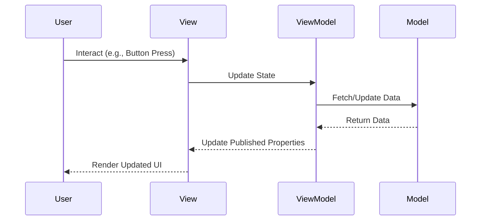

## 11.6 Reactive UI Development with SwiftUI

In the realm of modern iOS development, creating dynamic and responsive user interfaces is paramount. SwiftUI, Apple's declarative UI framework, combined with the power of Combine, a reactive programming framework, provides developers with the tools to build reactive user interfaces that respond to data changes seamlessly. In this section, we will delve into the integration of SwiftUI and Combine, exploring state management, data flow, and real-time updates to create robust and interactive applications.

### SwiftUI and Combine Integration

SwiftUI and Combine work hand-in-hand to facilitate reactive programming. SwiftUI provides the UI components, while Combine handles the data flow and event processing. This integration allows developers to build applications that react to changes in data, enabling real-time updates and a smooth user experience.

#### State Management

State management is a crucial aspect of reactive UI development. SwiftUI offers several property wrappers to manage state effectively:

- **`@State`**: Use `@State` for simple, local state management within a view. It allows you to create mutable state variables that SwiftUI automatically observes for changes.

```swift
struct CounterView: View {
    @State private var count = 0

    var body: some View {
        VStack {
            Text("Count: \\(count)")
            Button("Increment") {
                count += 1
            }
        }
    }
}
```

- **`@Binding`**: Use `@Binding` to create a two-way binding between a parent and child view. This allows changes in the child view to be reflected in the parent view.

```swift
struct ParentView: View {
    @State private var count = 0

    var body: some View {
        ChildView(count: $count)
    }
}

struct ChildView: View {
    @Binding var count: Int

    var body: some View {
        Button("Increment") {
            count += 1
        }
    }
}
```

- **`@ObservedObject`**: Use `@ObservedObject` for observing changes in an external object that conforms to the `ObservableObject` protocol. This is useful for managing state across multiple views.

```swift
class CounterModel: ObservableObject {
    @Published var count = 0
}

struct ContentView: View {
    @ObservedObject var counter = CounterModel()

    var body: some View {
        VStack {
            Text("Count: \\(counter.count)")
            Button("Increment") {
                counter.count += 1
            }
        }
    }
}
```

- **`@EnvironmentObject`**: Use `@EnvironmentObject` to share data across the view hierarchy. It allows you to inject an observable object into the environment and access it in any descendant view.

```swift
class AppModel: ObservableObject {
    @Published var isLoggedIn = false
}

struct RootView: View {
    @EnvironmentObject var model: AppModel

    var body: some View {
        if model.isLoggedIn {
            Text("Welcome Back!")
        } else {
            Text("Please Log In")
        }
    }
}
```

#### Data Flow: Binding Publishers to UI Components

Combine's publishers can be bound directly to SwiftUI components, enabling a seamless flow of data. This is particularly useful for handling asynchronous data streams, such as network responses or user input.

```swift
import Combine

class WeatherViewModel: ObservableObject {
    @Published var temperature: String = "Loading..."
    private var cancellable: AnyCancellable?

    init() {
        fetchWeather()
    }

    func fetchWeather() {
        cancellable = URLSession.shared.dataTaskPublisher(for: URL(string: "https://api.weather.com")!)
            .map { data, _ in String(data: data, encoding: .utf8) ?? "Error" }
            .replaceError(with: "Error")
            .assign(to: &$temperature)
    }
}

struct WeatherView: View {
    @ObservedObject var viewModel = WeatherViewModel()

    var body: some View {
        Text("Temperature: \\(viewModel.temperature)")
    }
}
```

In this example, the `WeatherViewModel` fetches weather data asynchronously and updates the `temperature` property. The `WeatherView` observes this property and updates the UI accordingly.

#### Real-Time Updates: Automatically Updating Views

SwiftUI's declarative syntax ensures that views automatically update when the underlying data changes. This is a key aspect of reactive UI development, as it allows for real-time updates without manual intervention.

```swift
struct TimerView: View {
    @State private var time = Date()

    var body: some View {
        Text("Current Time: \\(time)")
            .onAppear {
                Timer.scheduledTimer(withTimeInterval: 1.0, repeats: true) { _ in
                    time = Date()
                }
            }
    }
}
```

In this example, the `TimerView` updates the displayed time every second using a scheduled timer. SwiftUI automatically re-renders the view whenever the `time` state changes.

### Practical Applications

Reactive UI development with SwiftUI and Combine opens up a world of possibilities for practical applications. Let's explore some common use cases:

#### Form Validation: Reactively Validating User Input

Form validation is a common requirement in many applications. With SwiftUI and Combine, you can create reactive validation logic that provides immediate feedback to users.

```swift
class FormViewModel: ObservableObject {
    @Published var username = ""
    @Published var isValid = false

    private var cancellable: AnyCancellable?

    init() {
        cancellable = $username
            .map { $0.count >= 3 }
            .assign(to: &$isValid)
    }
}

struct FormView: View {
    @ObservedObject var viewModel = FormViewModel()

    var body: some View {
        VStack {
            TextField("Username", text: $viewModel.username)
                .padding()
                .border(viewModel.isValid ? Color.green : Color.red)
            Text(viewModel.isValid ? "Valid" : "Invalid")
        }
        .padding()
    }
}
```

In this example, the `FormViewModel` uses Combine to validate the username input. The `FormView` updates the border color and validation message based on the validation result.

#### Dynamic Lists: Updating Lists and Collections in Response to Data Changes

SwiftUI makes it easy to create dynamic lists that update in response to data changes. This is particularly useful for applications that display data from a backend service or database.

```swift
class ItemListViewModel: ObservableObject {
    @Published var items = ["Item 1", "Item 2", "Item 3"]

    func addItem() {
        items.append("Item \\(items.count + 1)")
    }
}

struct ItemListView: View {
    @ObservedObject var viewModel = ItemListViewModel()

    var body: some View {
        VStack {
            List(viewModel.items, id: \.self) { item in
                Text(item)
            }
            Button("Add Item") {
                viewModel.addItem()
            }
        }
    }
}
```

In this example, the `ItemListViewModel` manages a list of items. The `ItemListView` displays the items in a `List` and provides a button to add new items. The list updates automatically when new items are added.

#### Animations and Transitions: Reacting to State Changes with Visual Effects

Animations and transitions are essential for creating engaging user interfaces. SwiftUI provides a powerful animation system that can be used to react to state changes.

```swift
struct AnimationView: View {
    @State private var isExpanded = false

    var body: some View {
        VStack {
            Rectangle()
                .fill(isExpanded ? Color.blue : Color.gray)
                .frame(width: isExpanded ? 200 : 100, height: 100)
                .animation(.easeInOut, value: isExpanded)

            Button("Toggle") {
                isExpanded.toggle()
            }
        }
    }
}
```

In this example, the `AnimationView` uses a simple animation to expand and contract a rectangle. The animation is triggered by changes to the `isExpanded` state.

### Visualizing Reactive UI Development

To better understand the flow of data and state changes in a reactive SwiftUI application, let's visualize the process using a sequence diagram.



This diagram illustrates the typical flow of interactions in a reactive SwiftUI application. The user interacts with the view, which updates the view model. The view model fetches or updates data in the model, and the model returns the data to the view model. The view model updates its published properties, causing the view to re-render and display the updated UI to the user.

### Try It Yourself

To deepen your understanding of reactive UI development with SwiftUI, try modifying the code examples provided. Here are a few suggestions:

- **Experiment with State Management**: Try using `@State`, `@Binding`, `@ObservedObject`, and `@EnvironmentObject` in different scenarios to see how they affect data flow and UI updates.
- **Enhance Form Validation**: Add more validation rules to the form validation example, such as checking for email format or password strength.
- **Create Complex Animations**: Combine multiple animations and transitions to create more complex visual effects in the animations example.

### References and Links

- [SwiftUI Documentation](https://developer.apple.com/documentation/swiftui)
- [Combine Framework Documentation](https://developer.apple.com/documentation/combine)
- [Apple Developer - SwiftUI Tutorials](https://developer.apple.com/tutorials/swiftui)

### Knowledge Check

Before we conclude, let's reinforce what we've learned with a few questions:

- What are the differences between `@State`, `@Binding`, `@ObservedObject`, and `@EnvironmentObject`?
- How does Combine facilitate data flow in a SwiftUI application?
- What are some practical applications of reactive UI development with SwiftUI?

### Embrace the Journey

Remember, mastering reactive UI development with SwiftUI is a journey. As you continue to explore and experiment, you'll gain a deeper understanding of how to create dynamic and responsive user interfaces. Keep pushing the boundaries of what's possible, and enjoy the process of building beautiful and interactive applications.

## Quiz Time!



### Which property wrapper is used for local state management within a view in SwiftUI?

- [x] @State
- [ ] @Binding
- [ ] @ObservedObject
- [ ] @EnvironmentObject

> **Explanation:** `@State` is used for local state management within a view, allowing SwiftUI to observe changes and update the UI accordingly.

### How can you create a two-way binding between a parent and child view in SwiftUI?

- [ ] @State
- [x] @Binding
- [ ] @ObservedObject
- [ ] @EnvironmentObject

> **Explanation:** `@Binding` is used to create a two-way binding between a parent and child view, allowing changes in the child view to be reflected in the parent view.

### What protocol must an object conform to in order to be observed using @ObservedObject?

- [ ] Identifiable
- [x] ObservableObject
- [ ] Codable
- [ ] Equatable

> **Explanation:** An object must conform to the `ObservableObject` protocol to be observed using `@ObservedObject`.

### Which property wrapper allows sharing data across the view hierarchy in SwiftUI?

- [ ] @State
- [ ] @Binding
- [ ] @ObservedObject
- [x] @EnvironmentObject

> **Explanation:** `@EnvironmentObject` allows sharing data across the view hierarchy, making it accessible in any descendant view.

### In Combine, what is used to handle asynchronous data streams?

- [ ] View
- [ ] Model
- [x] Publisher
- [ ] Subscriber

> **Explanation:** Combine uses `Publisher` to handle asynchronous data streams, allowing data to be processed and emitted over time.

### What is the primary benefit of using SwiftUI's declarative syntax?

- [ ] Manual UI updates
- [x] Automatic UI updates
- [ ] Complex code
- [ ] Increased boilerplate

> **Explanation:** SwiftUI's declarative syntax ensures that views automatically update when the underlying data changes, reducing the need for manual UI updates.

### Which of the following is a practical application of reactive UI development with SwiftUI?

- [x] Form validation
- [x] Dynamic lists
- [ ] Static UI
- [x] Animations and transitions

> **Explanation:** Reactive UI development with SwiftUI is useful for form validation, dynamic lists, and animations, among other applications.

### What is the role of Combine in a SwiftUI application?

- [ ] Rendering UI
- [x] Managing data flow
- [ ] Styling components
- [ ] Handling gestures

> **Explanation:** Combine manages data flow and event processing in a SwiftUI application, facilitating reactive programming.

### True or False: SwiftUI requires manual intervention to update views when data changes.

- [ ] True
- [x] False

> **Explanation:** SwiftUI automatically updates views when data changes, thanks to its declarative syntax and integration with Combine.

### Which of the following is NOT a state management technique in SwiftUI?

- [ ] @State
- [ ] @Binding
- [ ] @ObservedObject
- [x] @Published

> **Explanation:** `@Published` is used within an `ObservableObject` to mark properties for observation, but it is not a state management technique in SwiftUI itself.




