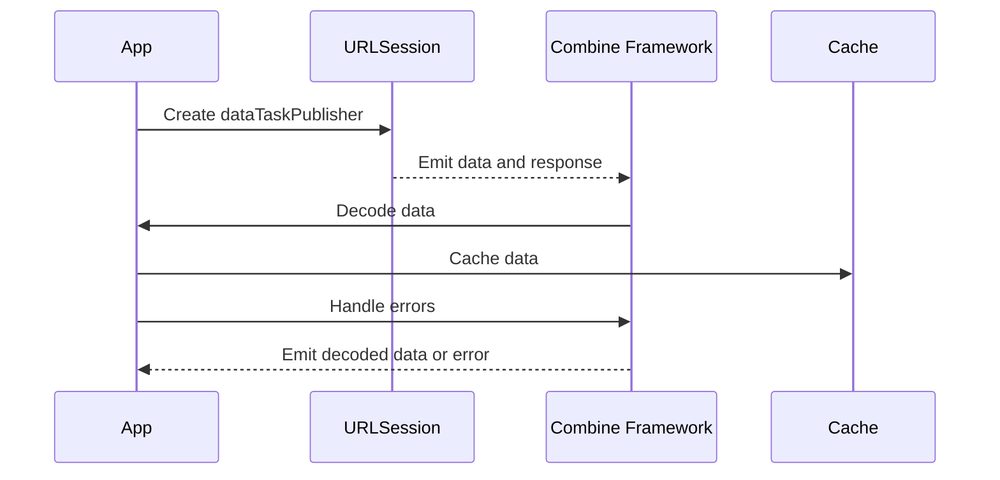

## 11.7 Integrating Reactive Patterns in Networking

In today's fast-paced digital world, networking is the backbone of most applications. Whether you're fetching data from a server, uploading user-generated content, or synchronizing data across devices, efficient networking is crucial. In this section, we'll explore how to integrate reactive patterns in networking using Swift's powerful Combine framework. By the end of this guide, you'll be equipped with the knowledge to create robust, efficient, and scalable networking solutions in your Swift applications.

### Network Requests with Combine

#### Creating Publishers with `URLSession`

The Combine framework provides a declarative Swift API for processing values over time. One of its most powerful features is the ability to create publishers that can handle asynchronous network requests seamlessly.

To begin, let's explore how to create a publisher using `URLSession`. This allows us to simplify asynchronous network calls and handle responses in a reactive manner.

```swift
import Combine
import Foundation

// Define a URL for the network request
let url = URL(string: "https://api.example.com/data")!

// Create a URLSession data task publisher
let dataTaskPublisher = URLSession.shared.dataTaskPublisher(for: url)
    .map(\.data) // Extract the data from the response
    .eraseToAnyPublisher() // Erase the type to AnyPublisher for flexibility

// Subscribe to the publisher
let cancellable = dataTaskPublisher
    .sink(receiveCompletion: { completion in
        switch completion {
        case .finished:
            print("Network request completed successfully.")
        case .failure(let error):
            print("Network request failed with error: \\(error.localizedDescription)")
        }
    }, receiveValue: { data in
        print("Received data: \\(data)")
    })
```

**Explanation:**

- **`URLSession.shared.dataTaskPublisher(for:)`**: This method creates a publisher that wraps a URL session data task. It emits a tuple containing the data and response.
- **`.map(\.data)`**: This operator extracts the data part from the emitted tuple.
- **`.eraseToAnyPublisher()`**: This method erases the specific type of the publisher, allowing for more flexible composition.

#### Decoding Responses

Once we have the raw data from a network request, the next step is to decode it into a usable format. Combine provides a convenient `decode(type:decoder:)` operator for JSON parsing.

```swift
import Combine
import Foundation

// Define a Codable struct to represent the JSON response
struct ApiResponse: Codable {
    let id: Int
    let name: String
}

// Create a publisher that decodes the JSON response
let decodedPublisher = dataTaskPublisher
    .decode(type: ApiResponse.self, decoder: JSONDecoder())
    .eraseToAnyPublisher()

// Subscribe to the decoded publisher
let cancellable = decodedPublisher
    .sink(receiveCompletion: { completion in
        switch completion {
        case .finished:
            print("Decoding completed successfully.")
        case .failure(let error):
            print("Decoding failed with error: \\(error.localizedDescription)")
        }
    }, receiveValue: { response in
        print("Received response: \\(response)")
    })
```

**Explanation:**

- **`decode(type:decoder:)`**: This operator decodes the data into a specified type using the provided decoder. In this case, we're using `JSONDecoder` to parse JSON data into an `ApiResponse` object.

#### Error Handling

Handling errors gracefully is a crucial aspect of networking. Combine allows us to manage network errors within the reactive stream, ensuring that our applications remain robust and responsive.

```swift
import Combine
import Foundation

// Create a publisher with error handling
let errorHandledPublisher = dataTaskPublisher
    .tryCatch { error -> URLSession.DataTaskPublisher in
        print("Caught error: \\(error.localizedDescription)")
        // Retry the request or return a different publisher
        return URLSession.shared.dataTaskPublisher(for: url)
    }
    .eraseToAnyPublisher()

// Subscribe to the publisher with error handling
let cancellable = errorHandledPublisher
    .sink(receiveCompletion: { completion in
        switch completion {
        case .finished:
            print("Request completed successfully.")
        case .failure(let error):
            print("Request failed with error: \\(error.localizedDescription)")
        }
    }, receiveValue: { data in
        print("Received data: \\(data)")
    })
```

**Explanation:**

- **`tryCatch`**: This operator allows us to catch errors and provide an alternative publisher. In this example, we're retrying the request upon encountering an error.

### Advanced Networking

#### Chaining Requests

In many scenarios, network requests are dependent on one another. Combine makes it easy to sequence these requests using operators like `flatMap`.

```swift
import Combine
import Foundation

// Define a second URL for a dependent network request
let secondUrl = URL(string: "https://api.example.com/relatedData")!

// Create a publisher that chains requests
let chainedPublisher = dataTaskPublisher
    .flatMap { data -> URLSession.DataTaskPublisher in
        // Process the first response and create a new request
        return URLSession.shared.dataTaskPublisher(for: secondUrl)
    }
    .map(\.data)
    .eraseToAnyPublisher()

// Subscribe to the chained publisher
let cancellable = chainedPublisher
    .sink(receiveCompletion: { completion in
        switch completion {
        case .finished:
            print("Chained requests completed successfully.")
        case .failure(let error):
            print("Chained requests failed with error: \\(error.localizedDescription)")
        }
    }, receiveValue: { data in
        print("Received data from second request: \\(data)")
    })
```

**Explanation:**

- **`flatMap`**: This operator transforms each received value into a new publisher, allowing us to chain network requests.

#### Parallel Requests

Running multiple requests concurrently can significantly improve the performance of your application. Combine allows us to run parallel requests and combine their results using operators like `merge`.

```swift
import Combine
import Foundation

// Define URLs for parallel requests
let url1 = URL(string: "https://api.example.com/data1")!
let url2 = URL(string: "https://api.example.com/data2")!

// Create publishers for parallel requests
let publisher1 = URLSession.shared.dataTaskPublisher(for: url1).map(\.data).eraseToAnyPublisher()
let publisher2 = URLSession.shared.dataTaskPublisher(for: url2).map(\.data).eraseToAnyPublisher()

// Merge the publishers to run requests in parallel
let parallelPublisher = Publishers.Merge(publisher1, publisher2)
    .collect()
    .eraseToAnyPublisher()

// Subscribe to the parallel publisher
let cancellable = parallelPublisher
    .sink(receiveCompletion: { completion in
        switch completion {
        case .finished:
            print("Parallel requests completed successfully.")
        case .failure(let error):
            print("Parallel requests failed with error: \\(error.localizedDescription)")
        }
    }, receiveValue: { data in
        print("Received data from parallel requests: \\(data)")
    })
```

**Explanation:**

- **`Publishers.Merge`**: This operator merges multiple publishers into a single publisher, allowing them to emit values concurrently.
- **`.collect()`**: This operator collects all emitted values into an array, which is useful for handling results from parallel requests.

#### Caching Strategies

Implementing caching strategies can enhance the performance and responsiveness of your application by reducing redundant network requests. Combine can be used to create reactive caching mechanisms.

```swift
import Combine
import Foundation

// Define a simple cache
var cache: [URL: Data] = [:]

// Create a publisher with caching
let cachingPublisher = dataTaskPublisher
    .handleEvents(receiveOutput: { data in
        // Cache the data
        cache[url] = data
    })
    .eraseToAnyPublisher()

// Check cache before making a network request
let cachedData = cache[url]
if let cachedData = cachedData {
    print("Using cached data: \\(cachedData)")
} else {
    let cancellable = cachingPublisher
        .sink(receiveCompletion: { completion in
            switch completion {
            case .finished:
                print("Request completed successfully with caching.")
            case .failure(let error):
                print("Request failed with error: \\(error.localizedDescription)")
            }
        }, receiveValue: { data in
            print("Received data: \\(data)")
        })
}
```

**Explanation:**

- **`handleEvents`**: This operator allows us to perform side effects, such as caching data, without affecting the stream of values.

### Visualizing Reactive Networking with Combine

To better understand how reactive networking with Combine works, let's visualize a typical flow of network requests using a sequence diagram.



**Description:**

- The app creates a `dataTaskPublisher` using `URLSession`.
- `URLSession` emits data and response to the Combine framework.
- Combine decodes the data and emits it back to the app.
- The app caches the data and handles any errors emitted by Combine.

### Try It Yourself

To truly master reactive networking with Combine, it's important to experiment and explore different scenarios. Here are a few suggestions for modifications you can try:

- **Modify the URL**: Change the URL to point to a different API endpoint and observe how the app handles different responses.
- **Add More Requests**: Try adding more parallel or chained requests to see how Combine manages multiple streams.
- **Implement Advanced Caching**: Enhance the caching mechanism to include expiration times or versioning.

### Knowledge Check

Before we wrap up, let's summarize the key takeaways:

- Combine provides a declarative API for handling asynchronous network requests in Swift.
- Publishers can be created using `URLSession` to simplify network calls.
- The `decode(type:decoder:)` operator is used for JSON parsing.
- Errors can be managed within the reactive stream using operators like `tryCatch`.
- Combine supports chaining and parallel execution of network requests.
- Caching strategies can be implemented using Combine's operators.

Remember, this is just the beginning. As you progress, you'll build more complex and interactive networking solutions. Keep experimenting, stay curious, and enjoy the journey!

## Quiz Time!



### What is the primary benefit of using Combine for networking in Swift?

- [x] Simplifies asynchronous network calls
- [ ] Increases app size
- [ ] Decreases code readability
- [ ] Requires more boilerplate code

> **Explanation:** Combine simplifies asynchronous network calls by providing a declarative API that handles values over time.

### Which operator is used to decode JSON data in Combine?

- [ ] map
- [ ] filter
- [x] decode
- [ ] merge

> **Explanation:** The `decode(type:decoder:)` operator is used to parse JSON data into a specified type.

### How can you handle errors in a Combine stream?

- [ ] Use a try-catch block
- [x] Use the tryCatch operator
- [ ] Use a switch statement
- [ ] Ignore them

> **Explanation:** The `tryCatch` operator allows you to catch errors within a Combine stream and provide an alternative publisher.

### What does the flatMap operator do in Combine?

- [ ] Transforms values into strings
- [ ] Filters out nil values
- [x] Transforms each value into a new publisher
- [ ] Combines multiple publishers into one

> **Explanation:** The `flatMap` operator transforms each received value into a new publisher, enabling chaining of network requests.

### Which operator allows for parallel execution of network requests in Combine?

- [ ] flatMap
- [x] merge
- [ ] decode
- [ ] tryCatch

> **Explanation:** The `merge` operator combines multiple publishers into a single publisher, allowing them to emit values concurrently.

### What is the purpose of the handleEvents operator in Combine?

- [ ] To decode JSON data
- [ ] To merge multiple streams
- [x] To perform side effects without affecting the stream
- [ ] To catch errors

> **Explanation:** The `handleEvents` operator is used to perform side effects, such as caching data, without affecting the stream of values.

### How can you cache data in a Combine stream?

- [ ] Use a map operator
- [ ] Use a merge operator
- [x] Use the handleEvents operator
- [ ] Use the decode operator

> **Explanation:** The `handleEvents` operator can be used to cache data by performing side effects during the stream.

### What is the role of URLSession in Combine networking?

- [ ] To decode JSON data
- [x] To create dataTaskPublisher for network requests
- [ ] To handle errors
- [ ] To merge multiple streams

> **Explanation:** `URLSession` is used to create a `dataTaskPublisher` that wraps a URL session data task, emitting data and response.

### True or False: Combine can only handle sequential network requests.

- [ ] True
- [x] False

> **Explanation:** False. Combine can handle both sequential and parallel network requests using operators like `flatMap` and `merge`.

### Which of the following is a key takeaway from using Combine for networking?

- [x] Combine provides a declarative API for handling asynchronous network requests.
- [ ] Combine increases code complexity.
- [ ] Combine is only suitable for small projects.
- [ ] Combine eliminates the need for error handling.

> **Explanation:** Combine provides a declarative API that simplifies the handling of asynchronous network requests, making it suitable for projects of all sizes.



By integrating reactive patterns in networking using Combine, you can create efficient, scalable, and maintainable Swift applications. Embrace the power of reactive programming and continue exploring the vast possibilities Combine offers for modern Swift development.


