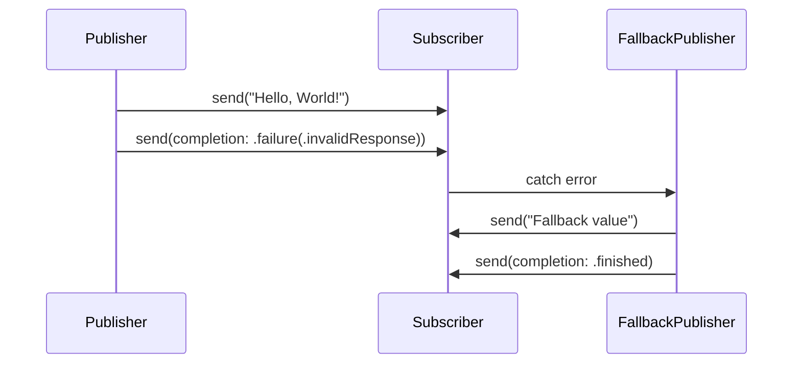

## 11.8 Error Handling in Reactive Streams

In the world of reactive programming, handling errors effectively is crucial for building robust and resilient applications. Swift's Combine framework provides powerful tools to manage errors in reactive streams, ensuring that your applications can gracefully handle unexpected situations. In this section, we will explore error propagation, recovery strategies, and techniques for designing resilient streams in Swift.

### Error Propagation

Reactive streams in Combine are designed to propagate errors through the stream's lifecycle. Understanding how errors are propagated and how they can terminate streams is essential for effective error handling.

#### Failure Completion

In Combine, a stream can complete in two ways: successfully or with a failure. When an error occurs, the stream terminates with a failure completion. This means that no further values will be emitted, and any downstream subscribers will receive the error.

```swift
import Combine

enum NetworkError: Error {
    case invalidResponse
    case serverError
}

let publisher = PassthroughSubject<String, NetworkError>()

let subscription = publisher
    .sink(receiveCompletion: { completion in
        switch completion {
        case .finished:
            print("Stream completed successfully.")
        case .failure(let error):
            print("Stream failed with error: \\(error)")
        }
    }, receiveValue: { value in
        print("Received value: \\(value)")
    })

publisher.send("Hello, World!")
publisher.send(completion: .failure(.serverError))
```

In this example, the stream emits a value and then terminates with a `serverError`. The `sink` subscriber handles the error in the `receiveCompletion` closure, allowing us to respond to the failure appropriately.

### Recovering from Errors

While error propagation is a natural part of reactive streams, Combine provides operators to recover from errors and continue processing values.

#### Using `catch` Operator

The `catch` operator allows you to handle errors and provide an alternative publisher to continue the stream. This operator is useful for providing fallback values or retrying failed operations.

```swift
let fallbackPublisher = Just("Fallback value")
    .setFailureType(to: NetworkError.self)

let recoverySubscription = publisher
    .catch { error -> Just<String> in
        print("Handling error: \\(error)")
        return fallbackPublisher
    }
    .sink(receiveCompletion: { completion in
        print("Recovery stream completed: \\(completion)")
    }, receiveValue: { value in
        print("Recovery received value: \\(value)")
    })

publisher.send("Hello, World!")
publisher.send(completion: .failure(.invalidResponse))
```

In this example, when the original stream fails with an `invalidResponse` error, the `catch` operator provides a fallback publisher that emits a default value, allowing the stream to continue.

#### Using `retry` Operator

The `retry` operator attempts to resubscribe to the original publisher a specified number of times when an error occurs. This operator is useful for transient errors that may succeed on subsequent attempts.

```swift
let retrySubscription = publisher
    .retry(3)
    .sink(receiveCompletion: { completion in
        print("Retry stream completed: \\(completion)")
    }, receiveValue: { value in
        print("Retry received value: \\(value)")
    })

publisher.send("Hello, World!")
publisher.send(completion: .failure(.serverError))
```

Here, the `retry` operator attempts to resubscribe to the publisher up to three times if a `serverError` occurs, providing multiple chances for the operation to succeed.

### Designing Resilient Streams

To build resilient applications, it's important to design streams that can gracefully handle errors and continue processing when possible. Let's explore some strategies for achieving this.

#### Fallback Values

Providing fallback values is a common strategy for handling errors in reactive streams. By supplying default values, you can ensure that your application continues to function even when errors occur.

```swift
let defaultPublisher = Just("Default value")
    .setFailureType(to: NetworkError.self)

let fallbackSubscription = publisher
    .replaceError(with: "Default value")
    .sink(receiveCompletion: { completion in
        print("Fallback stream completed: \\(completion)")
    }, receiveValue: { value in
        print("Fallback received value: \\(value)")
    })

publisher.send(completion: .failure(.invalidResponse))
```

In this example, the `replaceError` operator provides a default value when an error occurs, allowing the stream to complete successfully.

#### Selective Error Handling

In some cases, you may want to handle specific errors while allowing others to propagate. The `catch` operator can be used to selectively handle errors based on their type or context.

```swift
let selectiveSubscription = publisher
    .catch { error -> AnyPublisher<String, NetworkError> in
        switch error {
        case .invalidResponse:
            return Just("Handled invalid response error")
                .setFailureType(to: NetworkError.self)
                .eraseToAnyPublisher()
        default:
            return Fail(error: error).eraseToAnyPublisher()
        }
    }
    .sink(receiveCompletion: { completion in
        print("Selective stream completed: \\(completion)")
    }, receiveValue: { value in
        print("Selective received value: \\(value)")
    })

publisher.send(completion: .failure(.invalidResponse))
```

Here, the `catch` operator handles the `invalidResponse` error by providing an alternative publisher, while allowing other errors to propagate.

#### Custom Error Types

Defining meaningful custom error types can improve the clarity and debuggability of your reactive streams. By creating specific error types, you can provide more context and detail about the errors that occur.

```swift
enum DataError: Error {
    case notFound
    case corruptedData(reason: String)
}

let dataPublisher = PassthroughSubject<Data, DataError>()

let customErrorSubscription = dataPublisher
    .sink(receiveCompletion: { completion in
        switch completion {
        case .finished:
            print("Data stream completed successfully.")
        case .failure(let error):
            switch error {
            case .notFound:
                print("Data not found.")
            case .corruptedData(let reason):
                print("Data corrupted: \\(reason)")
            }
        }
    }, receiveValue: { data in
        print("Received data: \\(data)")
    })

dataPublisher.send(completion: .failure(.corruptedData(reason: "Checksum mismatch")))
```

In this example, the `DataError` enum provides specific error cases, allowing the subscriber to handle each error with appropriate logic.

### Visualizing Error Handling in Reactive Streams

To better understand the flow of error handling in reactive streams, let's visualize the process using a sequence diagram.



This diagram illustrates how a publisher sends values and an error, triggering the `catch` operator to provide a fallback value and complete the stream.

### References and Further Reading

For more information on error handling in reactive streams, consider exploring the following resources:

- [Combine Framework Documentation](https://developer.apple.com/documentation/combine)
- [Reactive Programming with Swift](https://www.raywenderlich.com/books/combine-asynchronous-programming-with-swift/v1.0)
- [Error Handling in Swift](https://docs.swift.org/swift-book/LanguageGuide/ErrorHandling.html)

### Knowledge Check

Before we conclude, let's reinforce what we've learned with a few questions:

1. How does the `catch` operator help in error handling within reactive streams?
2. What is the purpose of the `retry` operator in Combine?
3. Why is it beneficial to define custom error types in reactive streams?

### Try It Yourself

Experiment with the code examples provided in this section. Try modifying the error types, adding additional recovery strategies, or implementing selective error handling for different error cases. Remember, practice is key to mastering error handling in reactive streams.

### Embrace the Journey

Remember, mastering error handling in reactive streams is a journey. As you continue to explore and experiment with Combine, you'll develop a deeper understanding of how to build resilient and robust applications. Keep experimenting, stay curious, and enjoy the journey!

## Quiz Time!



### What does the `catch` operator do in a reactive stream?

- [x] It handles errors and provides an alternative publisher to continue the stream.
- [ ] It terminates the stream when an error occurs.
- [ ] It retries the operation when an error occurs.
- [ ] It logs errors without affecting the stream.

> **Explanation:** The `catch` operator handles errors by providing an alternative publisher, allowing the stream to continue.

### How does the `retry` operator function in Combine?

- [x] It attempts to resubscribe to the original publisher a specified number of times when an error occurs.
- [ ] It replaces the error with a default value.
- [ ] It logs the error and terminates the stream.
- [ ] It ignores the error and continues the stream.

> **Explanation:** The `retry` operator retries the original operation a specified number of times if an error occurs, providing multiple chances for success.

### What is the benefit of using fallback values in error handling?

- [x] It ensures the application continues to function even when errors occur.
- [ ] It logs errors for debugging purposes.
- [ ] It terminates the stream gracefully.
- [ ] It increases the performance of the stream.

> **Explanation:** Providing fallback values allows the application to continue functioning by supplying default values when errors occur.

### Why is selective error handling important in reactive streams?

- [x] It allows specific errors to be handled while letting others propagate.
- [ ] It terminates the stream for all errors.
- [ ] It retries the operation for all errors.
- [ ] It logs all errors without affecting the stream.

> **Explanation:** Selective error handling enables handling specific errors while allowing others to propagate, providing flexibility in error management.

### What is a custom error type in reactive streams?

- [x] A user-defined error type that provides more context and detail about errors.
- [ ] A built-in error type provided by the framework.
- [ ] An error type that automatically retries operations.
- [ ] An error type that logs errors for debugging.

> **Explanation:** Custom error types are user-defined and provide specific context and details about errors, improving clarity and debuggability.

### How does the `replaceError` operator work?

- [x] It provides a default value when an error occurs, allowing the stream to complete successfully.
- [ ] It retries the operation when an error occurs.
- [ ] It logs the error and terminates the stream.
- [ ] It ignores the error and continues the stream.

> **Explanation:** The `replaceError` operator provides a default value to replace the error, allowing the stream to complete successfully.

### What is the role of the `sink` subscriber in error handling?

- [x] It receives completion events and values, allowing error handling logic to be implemented.
- [ ] It logs errors without affecting the stream.
- [ ] It retries operations when errors occur.
- [ ] It terminates the stream when an error occurs.

> **Explanation:** The `sink` subscriber receives completion events and values, enabling the implementation of error handling logic.

### How can custom error types improve error handling?

- [x] By providing more context and detail, making errors easier to debug and handle.
- [ ] By automatically retrying operations.
- [ ] By logging errors for debugging purposes.
- [ ] By terminating the stream gracefully.

> **Explanation:** Custom error types provide more context and detail, improving the clarity and debuggability of errors.

### What is the purpose of the `PassthroughSubject` in Combine?

- [x] It acts as a publisher that can emit values and completion events, including errors.
- [ ] It logs errors without affecting the stream.
- [ ] It retries operations when errors occur.
- [ ] It terminates the stream when an error occurs.

> **Explanation:** `PassthroughSubject` is a publisher that can emit values and completion events, including errors, in Combine.

### True or False: The `catch` operator can be used to selectively handle specific errors.

- [x] True
- [ ] False

> **Explanation:** The `catch` operator can indeed be used to selectively handle specific errors, providing alternative publishers for certain error cases.




