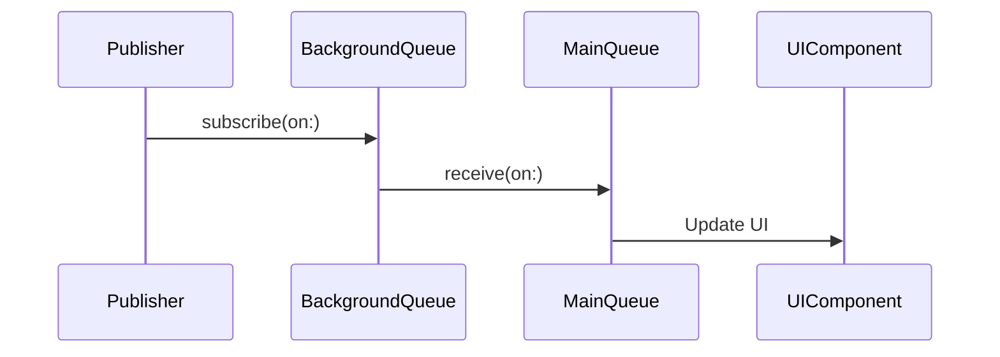

## 11.9 Scheduler Management and Threading

In the realm of Swift's reactive programming, understanding scheduler management and threading is crucial for building responsive and efficient applications. This section delves into the intricacies of schedulers, execution contexts, and best practices for threading in Swift, ensuring you can harness the full potential of Swift's concurrency model.

### Schedulers Overview

Schedulers in Swift's reactive programming are responsible for controlling the execution context of your code. They determine on which thread or queue your code runs, allowing you to manage how and when work is performed. This is particularly important in iOS and macOS development, where maintaining a responsive UI is paramount.

#### Main Scheduler

The Main Scheduler is used for updating UI components. Since UI updates must occur on the main thread, the Main Scheduler ensures that any UI-related tasks are executed in the correct context. This is crucial for maintaining a smooth user experience.

```swift
import Combine
import UIKit

let mainScheduler = DispatchQueue.main

mainScheduler.async {
    // Update UI components here
    someUILabel.text = "Updated Text"
}
```

#### Background Schedulers

Background Schedulers are used for performing heavy computations or tasks that don't require immediate user interaction. By offloading these tasks to background threads, you can keep the main thread free for handling UI updates and user interactions.

```swift
let backgroundScheduler = DispatchQueue.global(qos: .background)

backgroundScheduler.async {
    // Perform heavy computation here
    let result = performComplexCalculation()
    DispatchQueue.main.async {
        // Update UI with the result
        someUILabel.text = "\\(result)"
    }
}
```

### Controlling Execution Context

Managing where and when your code runs is a critical aspect of reactive programming. Swift provides powerful tools to control execution contexts, primarily through the use of `subscribe(on:)` and `receive(on:)` methods.

#### `subscribe(on:)` vs `receive(on:)`

- **`subscribe(on:)`**: Determines the thread or queue where the subscription side-effects occur. This is useful for performing work in the background before delivering results.

- **`receive(on:)`**: Specifies the thread or queue where the downstream receives events. This is typically used to ensure that UI updates happen on the main thread.

```swift
import Combine

let publisher = Just("Hello, World!")
    .subscribe(on: DispatchQueue.global(qos: .background))
    .receive(on: DispatchQueue.main)
    .sink { value in
        // This will be executed on the main thread
        someUILabel.text = value
    }
```

#### Avoiding Deadlocks

Deadlocks occur when two or more threads are waiting for each other to complete, resulting in a standstill. Properly managing thread jumps and ensuring that resources are not locked indefinitely is essential to avoid deadlocks.

- **Use Serial Queues**: For tasks that must be executed in order, use serial queues to prevent simultaneous access to shared resources.

- **Locking Mechanisms**: Use locks sparingly and prefer higher-level abstractions like semaphores or operations.

```swift
let serialQueue = DispatchQueue(label: "com.example.serialQueue")

serialQueue.async {
    // Task 1
}

serialQueue.async {
    // Task 2
}
```

### Best Practices

Adhering to best practices in scheduler management and threading can greatly enhance the performance and reliability of your Swift applications.

#### Minimal Thread Hops

Reducing context switches, or "thread hops," can improve performance by minimizing the overhead associated with switching execution contexts. Aim to perform as much work as possible on a single thread before switching.

#### UI Updates

Ensure that all UI updates occur on the main thread. This can be enforced by always using the Main Scheduler for UI-related tasks.

```swift
DispatchQueue.main.async {
    // Always update UI components on the main thread
    someUILabel.text = "New Text"
}
```

### Visualizing Scheduler Management

To better understand the flow of data and execution contexts, let's visualize the process using a sequence diagram.



This diagram illustrates how a publisher can perform work on a background queue and then deliver results to the main queue for UI updates.

### Try It Yourself

Experiment with the following code to see how schedulers affect execution contexts. Try changing the `subscribe(on:)` and `receive(on:)` to different queues and observe the behavior.

```swift
import Combine

let publisher = Just("Experimenting with Schedulers")
    .subscribe(on: DispatchQueue.global(qos: .userInitiated))
    .receive(on: DispatchQueue.main)
    .sink { value in
        print("Received on main thread: \\(value)")
    }
```

### References and Links

- [Apple's Concurrency Programming Guide](https://developer.apple.com/library/archive/documentation/General/Conceptual/ConcurrencyProgrammingGuide/Introduction/Introduction.html)
- [Combine Framework Documentation](https://developer.apple.com/documentation/combine)

### Knowledge Check

- What is the purpose of the Main Scheduler in Swift?
- How does `subscribe(on:)` differ from `receive(on:)`?
- What are some strategies to avoid deadlocks in Swift?

### Embrace the Journey

Remember, mastering scheduler management and threading is a journey. As you explore these concepts, keep experimenting and learning. The more you practice, the more proficient you'll become in building responsive and efficient Swift applications.

## Quiz Time!



### What is the primary role of the Main Scheduler in Swift?

- [x] To update UI components on the main thread
- [ ] To perform heavy computations
- [ ] To manage background tasks
- [ ] To handle network requests

> **Explanation:** The Main Scheduler is responsible for ensuring that UI updates occur on the main thread, maintaining a responsive user interface.

### Which method determines where subscription side-effects occur?

- [x] `subscribe(on:)`
- [ ] `receive(on:)`
- [ ] `sink(on:)`
- [ ] `dispatch(on:)`

> **Explanation:** The `subscribe(on:)` method specifies the thread or queue where the subscription side-effects take place.

### How can you avoid deadlocks in Swift?

- [x] Use serial queues
- [ ] Use multiple locks
- [ ] Perform all tasks on the main thread
- [ ] Avoid using queues

> **Explanation:** Using serial queues helps prevent simultaneous access to shared resources, reducing the risk of deadlocks.

### What is the benefit of reducing thread hops?

- [x] Improved performance
- [ ] Increased complexity
- [ ] More context switches
- [ ] Slower execution

> **Explanation:** Reducing thread hops minimizes the overhead associated with context switching, leading to better performance.

### Which method ensures that downstream receives events on a specified thread?

- [x] `receive(on:)`
- [ ] `subscribe(on:)`
- [ ] `dispatch(on:)`
- [ ] `sink(on:)`

> **Explanation:** The `receive(on:)` method specifies the thread or queue where the downstream receives events.

### What is a common use case for background schedulers?

- [x] Performing heavy computations
- [ ] Updating UI components
- [ ] Handling user input
- [ ] Managing animations

> **Explanation:** Background schedulers are ideal for offloading heavy computations that do not require immediate user interaction.

### Why should UI updates always occur on the main thread?

- [x] To maintain a responsive user interface
- [ ] To improve computation speed
- [ ] To reduce memory usage
- [ ] To handle network requests

> **Explanation:** UI updates on the main thread ensure that the user interface remains responsive and smooth.

### What is the purpose of using `DispatchQueue.main.async`?

- [x] To execute code on the main thread
- [ ] To perform background tasks
- [ ] To handle network requests
- [ ] To manage database operations

> **Explanation:** `DispatchQueue.main.async` is used to execute code on the main thread, typically for UI updates.

### What is the effect of using `subscribe(on:)` with a background queue?

- [x] Subscription side-effects occur on a background thread
- [ ] Events are received on the main thread
- [ ] UI updates are performed
- [ ] Network requests are handled

> **Explanation:** Using `subscribe(on:)` with a background queue ensures that subscription side-effects are executed on a background thread.

### True or False: Schedulers in Swift are only used for UI updates.

- [ ] True
- [x] False

> **Explanation:** Schedulers in Swift are used for managing execution contexts across various tasks, not just UI updates.



By mastering scheduler management and threading, you enhance your ability to build robust and efficient Swift applications. Keep exploring and applying these concepts to become proficient in reactive programming with Swift.


