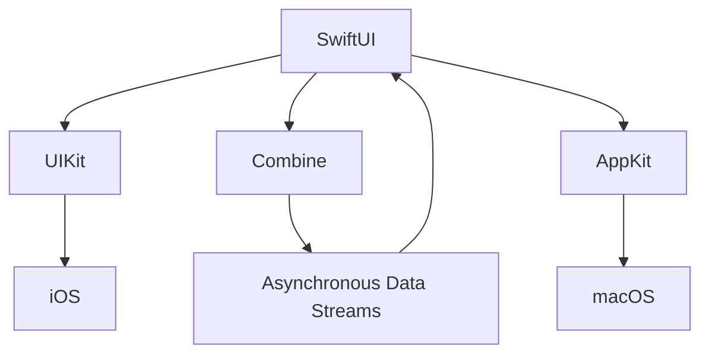

## 12.1 Introduction to SwiftUI

SwiftUI is Apple's revolutionary framework for building user interfaces across all its platforms, including iOS, macOS, watchOS, and tvOS. Introduced at WWDC 2019, SwiftUI represents a paradigm shift from the imperative UIKit and AppKit frameworks, embracing a declarative syntax that simplifies UI development and enhances code readability and maintainability.

### **Overview of SwiftUI**

SwiftUI allows developers to describe the interface and behavior of their apps in a clear, concise, and declarative manner. Instead of focusing on the sequence of operations to achieve a UI state, SwiftUI lets developers declare what the UI should look like and how it should behave, and the framework takes care of the rest. This approach not only reduces boilerplate code but also aligns with modern programming paradigms, making SwiftUI a powerful tool for developers.

#### **Key Features of SwiftUI**

1. **Declarative Syntax**: SwiftUI's declarative syntax allows developers to describe what the UI should do, rather than how to do it. This results in more readable and maintainable code.

   ```swift
   import SwiftUI

   struct ContentView: View {
       var body: some View {
           VStack {
               Text("Hello, SwiftUI!")
                   .font(.largeTitle)
                   .padding()
               Button(action: {
                   print("Button tapped!")
               }) {
                   Text("Tap Me")
               }
           }
       }
   }
   ```

   In this example, the `VStack` arranges its children vertically. The `Text` and `Button` are declaratively described, and SwiftUI handles the rendering and state management.

2. **Live Previews**: Xcode's live preview feature allows developers to see changes in real-time as they code. This instant feedback loop accelerates development and reduces the need for constant recompilation.

3. **Cross-Platform Compatibility**: SwiftUI is designed to work seamlessly across all Apple platforms. This means developers can write their UI code once and deploy it on iOS, macOS, watchOS, and tvOS, leveraging the same codebase and design principles.

4. **State Management**: SwiftUI introduces a new way to manage state using property wrappers like `@State`, `@Binding`, and `@ObservedObject`. These tools help developers create reactive interfaces that automatically update when the underlying data changes.

5. **Integration with Combine**: SwiftUI works hand-in-hand with the Combine framework, Apple's reactive programming library, to handle asynchronous events and data streams efficiently.

### **The Declarative Approach**

The declarative approach in SwiftUI is a significant departure from the imperative style used in UIKit and AppKit. In imperative programming, developers must explicitly manage the state and lifecycle of UI components, often leading to complex and error-prone code. In contrast, SwiftUI's declarative syntax allows developers to focus on the desired outcome, with the framework handling the underlying details.

#### **Benefits of Declarative Syntax**

- **Simplicity**: By abstracting the complexity of UI state management, SwiftUI enables developers to write simpler and more intuitive code.
- **Consistency**: Declarative code is often more consistent and predictable, as it focuses on the end result rather than the process.
- **Reusability**: Components in SwiftUI are highly reusable, promoting modular design and reducing code duplication.

### **Live Previews in Xcode**

One of the standout features of SwiftUI is its live preview capability in Xcode. This feature provides developers with a real-time view of their UI as they write code, significantly speeding up the development process.

#### **How Live Previews Work**

Live previews in Xcode are powered by SwiftUI's declarative nature. As you make changes to your code, Xcode recompiles only the affected parts, updating the preview almost instantaneously. This allows developers to experiment with different layouts, styles, and interactions without the need to run the app on a simulator or device.

```swift
struct ContentView_Previews: PreviewProvider {
    static var previews: some View {
        ContentView()
            .previewDevice("iPhone 12")
            .previewDisplayName("iPhone 12 Preview")
    }
}
```

In this example, the `ContentView_Previews` struct provides a preview of the `ContentView` on an iPhone 12. Developers can customize the preview to test different devices and configurations.

### **Cross-Platform Development**

SwiftUI's cross-platform capabilities are a game-changer for developers working within the Apple ecosystem. By using a single codebase, developers can create apps that run on multiple platforms, reducing development time and effort.

#### **Unified Design Language**

SwiftUI promotes a unified design language across all Apple platforms. This means that UI components behave consistently, whether they're running on an iPhone, iPad, Mac, Apple Watch, or Apple TV. This consistency not only enhances the user experience but also simplifies the development process.

#### **Platform-Specific Customization**

While SwiftUI provides a common set of tools and components, it also allows for platform-specific customization. Developers can tailor their apps to take advantage of unique platform features, such as the Digital Crown on Apple Watch or the Touch Bar on MacBook Pro.

### **State Management in SwiftUI**

State management is a crucial aspect of any UI framework, and SwiftUI introduces a new paradigm for managing state with property wrappers. These wrappers provide a declarative way to bind UI components to data, ensuring that the UI automatically updates when the data changes.

#### **Property Wrappers**

- **`@State`**: Used for simple state variables that are owned by a view. Changes to a `@State` variable trigger a UI update.

  ```swift
  struct CounterView: View {
      @State private var count = 0

      var body: some View {
          VStack {
              Text("Count: \\(count)")
              Button("Increment") {
                  count += 1
              }
          }
      }
  }
  ```

- **`@Binding`**: Used to create a two-way binding between a parent and child view. It allows a child view to update a value owned by its parent.

  ```swift
  struct ParentView: View {
      @State private var isOn = false

      var body: some View {
          ToggleView(isOn: $isOn)
      }
  }

  struct ToggleView: View {
      @Binding var isOn: Bool

      var body: some View {
          Toggle("Toggle", isOn: $isOn)
      }
  }
  ```

- **`@ObservedObject` and `@EnvironmentObject`**: Used for more complex state management scenarios, often involving shared data across multiple views.

  ```swift
  class UserData: ObservableObject {
      @Published var name: String = "John Doe"
  }

  struct UserView: View {
      @ObservedObject var userData = UserData()

      var body: some View {
          Text("User: \\(userData.name)")
      }
  }
  ```

### **Integration with Combine**

SwiftUI is designed to work seamlessly with Combine, Apple's framework for handling asynchronous events and data streams. Combine provides powerful tools for managing data flow and reacting to changes, making it an ideal companion for SwiftUI's declarative syntax.

#### **Using Combine with SwiftUI**

Combine's publishers and subscribers can be used to handle asynchronous data in SwiftUI. For example, you can use Combine to fetch data from a network request and update the UI when the data arrives.

```swift
import Combine

class NetworkManager: ObservableObject {
    @Published var data: String = ""

    private var cancellable: AnyCancellable?

    func fetchData() {
        let url = URL(string: "https://api.example.com/data")!
        cancellable = URLSession.shared.dataTaskPublisher(for: url)
            .map { $0.data }
            .decode(type: String.self, decoder: JSONDecoder())
            .replaceError(with: "Error")
            .assign(to: &$data)
    }
}

struct DataView: View {
    @ObservedObject var networkManager = NetworkManager()

    var body: some View {
        Text("Data: \\(networkManager.data)")
            .onAppear {
                networkManager.fetchData()
            }
    }
}
```

In this example, the `NetworkManager` class uses Combine to fetch data from a network request and publish it to the `data` property. The `DataView` subscribes to this data and updates the UI accordingly.

### **Try It Yourself**

To truly grasp the power of SwiftUI, we encourage you to experiment with the code examples provided. Try modifying the `ContentView` to include additional UI elements, such as sliders, pickers, or images. Explore the use of different property wrappers to manage state in more complex scenarios. By engaging with the code and making it your own, you'll develop a deeper understanding of SwiftUI's capabilities.

### **Visualizing SwiftUI Architecture**

To better understand how SwiftUI fits into the broader Apple ecosystem, let's visualize its architecture and relationship with other frameworks like UIKit and Combine.



**Diagram Description**: This diagram illustrates SwiftUI's connections to UIKit, Combine, and AppKit. SwiftUI can interface with UIKit for iOS development and AppKit for macOS development. Combine provides the reactive data flow that integrates seamlessly with SwiftUI's declarative syntax.

### **Conclusion**

SwiftUI is a transformative framework that empowers developers to build beautiful, responsive, and cross-platform user interfaces with ease. Its declarative syntax, live previews, and seamless integration with Combine make it a powerful tool for modern app development. As you continue to explore SwiftUI, remember that this is just the beginning of your journey. Embrace the opportunities to experiment, learn, and innovate with this cutting-edge technology.

## Quiz Time!



### What is the primary programming paradigm of SwiftUI?

- [x] Declarative
- [ ] Imperative
- [ ] Procedural
- [ ] Object-Oriented

> **Explanation:** SwiftUI uses a declarative programming paradigm, allowing developers to describe what the UI should do, rather than how to do it.

### Which property wrapper is used to create a two-way binding between a parent and child view in SwiftUI?

- [ ] @State
- [x] @Binding
- [ ] @ObservedObject
- [ ] @EnvironmentObject

> **Explanation:** `@Binding` is used to create a two-way binding between a parent and child view in SwiftUI.

### What feature of Xcode provides real-time feedback for SwiftUI code changes?

- [ ] Code Completion
- [ ] Debug Console
- [x] Live Previews
- [ ] Interface Builder

> **Explanation:** Live Previews in Xcode provide real-time feedback for SwiftUI code changes, allowing developers to see updates instantly.

### Which framework is often used alongside SwiftUI to handle asynchronous events and data streams?

- [ ] Core Data
- [ ] UIKit
- [ ] AppKit
- [x] Combine

> **Explanation:** Combine is often used alongside SwiftUI to handle asynchronous events and data streams.

### What is the primary benefit of SwiftUI's cross-platform capabilities?

- [x] Write once, run on all Apple platforms
- [ ] Faster compilation times
- [ ] Improved debugging tools
- [ ] Enhanced security features

> **Explanation:** SwiftUI's cross-platform capabilities allow developers to write code once and run it on all Apple platforms, streamlining development.

### Which property wrapper is used for simple state variables owned by a view?

- [x] @State
- [ ] @Binding
- [ ] @ObservedObject
- [ ] @EnvironmentObject

> **Explanation:** `@State` is used for simple state variables that are owned by a view in SwiftUI.

### How does SwiftUI's declarative syntax benefit code readability?

- [x] By focusing on the end result rather than the process
- [ ] By reducing the need for comments
- [ ] By using fewer lines of code
- [ ] By enforcing strict coding standards

> **Explanation:** SwiftUI's declarative syntax benefits code readability by focusing on the end result rather than the process, making the code more intuitive.

### What does the `@ObservedObject` property wrapper do in SwiftUI?

- [ ] Manages simple state variables
- [x] Observes changes in an external object
- [ ] Creates a two-way binding
- [ ] Provides environment-specific data

> **Explanation:** `@ObservedObject` in SwiftUI observes changes in an external object and updates the view when the data changes.

### True or False: SwiftUI can only be used for iOS development.

- [ ] True
- [x] False

> **Explanation:** False. SwiftUI is designed to work across all Apple platforms, including iOS, macOS, watchOS, and tvOS.

### What is the role of the `@EnvironmentObject` property wrapper in SwiftUI?

- [ ] Manages simple state variables
- [ ] Creates a two-way binding
- [ ] Observes changes in an external object
- [x] Provides shared data across multiple views

> **Explanation:** `@EnvironmentObject` in SwiftUI provides shared data across multiple views, allowing for a more centralized state management approach.



Remember, mastering SwiftUI is an ongoing journey. Keep experimenting, stay curious, and enjoy the process of building beautiful, responsive user interfaces with SwiftUI!


