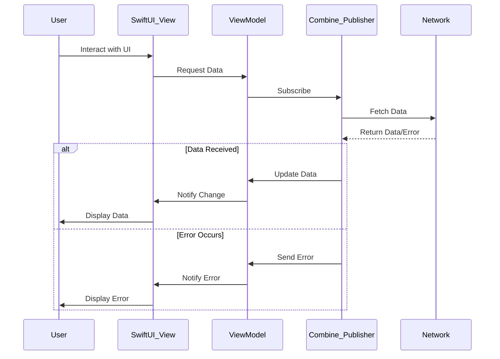

## 12.10 Integrating Combine with SwiftUI

SwiftUI and Combine are two powerful frameworks introduced by Apple to revolutionize the way we build apps. SwiftUI provides a declarative syntax for building user interfaces, while Combine is a reactive programming framework that allows you to work with asynchronous data streams. Integrating these two frameworks enables developers to create dynamic, responsive, and efficient applications. In this section, we will explore how to integrate Combine with SwiftUI, focusing on data flow integration, practical applications, and error handling.

### Data Flow Integration

#### Using Publishers

In Combine, a `Publisher` is a protocol that represents a stream of values that can change over time. SwiftUI views can bind to these publishers, allowing for real-time updates. This integration is seamless, making it easy to update the UI based on changes in data.

**Example: Binding a Publisher to a SwiftUI View**

```swift
import SwiftUI
import Combine

class TimerViewModel: ObservableObject {
    @Published var currentTime: String = ""
    private var timerSubscription: AnyCancellable?

    init() {
        timerSubscription = Timer.publish(every: 1.0, on: .main, in: .common)
            .autoconnect()
            .map { _ in
                let formatter = DateFormatter()
                formatter.timeStyle = .medium
                return formatter.string(from: Date())
            }
            .assign(to: \.currentTime, on: self)
    }
}

struct TimerView: View {
    @ObservedObject var viewModel = TimerViewModel()

    var body: some View {
        Text(viewModel.currentTime)
            .font(.largeTitle)
            .padding()
    }
}
```

**Explanation:**

- **Publisher**: We use `Timer.publish` to create a publisher that emits current time every second.
- **ObservableObject**: The `TimerViewModel` conforms to `ObservableObject` and uses `@Published` to notify SwiftUI of changes.
- **Binding**: The `TimerView` binds to `viewModel.currentTime`, updating the text whenever the time changes.

#### Observable Objects

Observable objects are a cornerstone of data flow in SwiftUI. They allow you to publish changes from your view models, which SwiftUI can then observe and react to.

**Example: Using ObservableObject with Combine**

```swift
import SwiftUI
import Combine

class CounterViewModel: ObservableObject {
    @Published var count: Int = 0

    func increment() {
        count += 1
    }
}

struct CounterView: View {
    @ObservedObject var viewModel = CounterViewModel()

    var body: some View {
        VStack {
            Text("Count: \\(viewModel.count)")
                .font(.largeTitle)
            Button(action: {
                viewModel.increment()
            }) {
                Text("Increment")
                    .padding()
                    .background(Color.blue)
                    .foregroundColor(.white)
                    .cornerRadius(8)
            }
        }
    }
}
```

**Explanation:**

- **ObservableObject**: `CounterViewModel` is marked as `ObservableObject`, allowing SwiftUI to observe its properties.
- **@Published**: The `count` property is marked with `@Published`, indicating that changes should trigger UI updates.
- **@ObservedObject**: `CounterView` uses `@ObservedObject` to bind to the `CounterViewModel`.

### Practical Applications

#### Asynchronous Data

Combine excels at handling asynchronous data, such as network requests. By integrating Combine with SwiftUI, you can fetch data asynchronously and update your UI seamlessly.

**Example: Fetching Data with Combine**

```swift
import SwiftUI
import Combine

struct Post: Codable, Identifiable {
    let id: Int
    let title: String
}

class PostsViewModel: ObservableObject {
    @Published var posts: [Post] = []
    private var cancellable: AnyCancellable?

    func fetchPosts() {
        let url = URL(string: "https://jsonplaceholder.typicode.com/posts")!
        cancellable = URLSession.shared.dataTaskPublisher(for: url)
            .map { $0.data }
            .decode(type: [Post].self, decoder: JSONDecoder())
            .replaceError(with: [])
            .receive(on: DispatchQueue.main)
            .assign(to: \.posts, on: self)
    }
}

struct PostsView: View {
    @ObservedObject var viewModel = PostsViewModel()

    var body: some View {
        List(viewModel.posts) { post in
            Text(post.title)
        }
        .onAppear {
            viewModel.fetchPosts()
        }
    }
}
```

**Explanation:**

- **DataTaskPublisher**: We use `URLSession.shared.dataTaskPublisher` to create a publisher for network data.
- **Decoding**: The data is decoded into an array of `Post` objects.
- **Error Handling**: Errors are replaced with an empty array using `replaceError(with:)`.
- **UI Update**: The `posts` property is updated on the main thread, triggering a UI update.

#### Real-Time Updates

Combine's reactive nature makes it ideal for handling real-time data, such as live events or notifications.

**Example: Real-Time Data with Combine**

```swift
import SwiftUI
import Combine

class StockPriceViewModel: ObservableObject {
    @Published var stockPrice: Double = 0.0
    private var cancellable: AnyCancellable?

    func startUpdating() {
        cancellable = Timer.publish(every: 1.0, on: .main, in: .common)
            .autoconnect()
            .map { _ in Double.random(in: 100...200) }
            .assign(to: \.stockPrice, on: self)
    }
}

struct StockPriceView: View {
    @ObservedObject var viewModel = StockPriceViewModel()

    var body: some View {
        Text("Stock Price: \\(viewModel.stockPrice, specifier: "%.2f")")
            .font(.largeTitle)
            .onAppear {
                viewModel.startUpdating()
            }
    }
}
```

**Explanation:**

- **Timer Publisher**: A timer is used to simulate real-time updates.
- **Random Data**: The stock price is randomly updated every second.
- **UI Binding**: The `stockPrice` is bound to the view, updating the UI in real-time.

### Error Handling

Error handling is crucial when dealing with asynchronous data. Combine provides powerful tools for managing errors and ensuring your app remains stable.

#### Displaying Errors

When an error occurs, it's important to inform the user. You can use SwiftUI to display error messages in a user-friendly manner.

**Example: Displaying Errors in SwiftUI**

```swift
import SwiftUI
import Combine

class ErrorHandlingViewModel: ObservableObject {
    @Published var data: String = ""
    @Published var errorMessage: String?
    private var cancellable: AnyCancellable?

    func fetchData() {
        let url = URL(string: "https://invalid-url")!
        cancellable = URLSession.shared.dataTaskPublisher(for: url)
            .map { $0.data }
            .decode(type: String.self, decoder: JSONDecoder())
            .catch { error -> Just<String> in
                self.errorMessage = "Failed to load data: \\(error.localizedDescription)"
                return Just("")
            }
            .assign(to: \.data, on: self)
    }
}

struct ErrorHandlingView: View {
    @ObservedObject var viewModel = ErrorHandlingViewModel()

    var body: some View {
        VStack {
            if let errorMessage = viewModel.errorMessage {
                Text(errorMessage)
                    .foregroundColor(.red)
            } else {
                Text(viewModel.data)
            }
        }
        .onAppear {
            viewModel.fetchData()
        }
    }
}
```

**Explanation:**

- **Error Catching**: The `catch` operator is used to handle errors, updating the `errorMessage` property.
- **UI Display**: The error message is displayed in the UI if an error occurs.

#### Retry Mechanisms

Combine allows you to implement retry mechanisms for failed operations, ensuring robustness in your app.

**Example: Implementing Retry with Combine**

```swift
import SwiftUI
import Combine

class RetryViewModel: ObservableObject {
    @Published var data: String = ""
    private var cancellable: AnyCancellable?

    func fetchData() {
        let url = URL(string: "https://invalid-url")!
        cancellable = URLSession.shared.dataTaskPublisher(for: url)
            .map { $0.data }
            .decode(type: String.self, decoder: JSONDecoder())
            .retry(3)
            .catch { _ in Just("Failed to load data after retries") }
            .assign(to: \.data, on: self)
    }
}

struct RetryView: View {
    @ObservedObject var viewModel = RetryViewModel()

    var body: some View {
        Text(viewModel.data)
            .onAppear {
                viewModel.fetchData()
            }
    }
}
```

**Explanation:**

- **Retry Operator**: The `retry` operator attempts the operation up to three times before failing.
- **Fallback Data**: If all retries fail, a fallback message is displayed.

### Visualizing Combine and SwiftUI Integration

To better understand how Combine and SwiftUI work together, let's visualize the data flow and error handling process.



**Diagram Explanation:**

- **User Interaction**: The user interacts with the SwiftUI view, triggering a data request.
- **Data Flow**: The view model subscribes to a Combine publisher, which fetches data from the network.
- **Error Handling**: If an error occurs, it's propagated back to the view model and displayed to the user.

### Try It Yourself

Experiment with the code examples provided in this section. Try modifying the timer interval in the `TimerViewModel`, change the URL in the `PostsViewModel`, or add more retry attempts in the `RetryViewModel`. Observe how these changes affect the behavior of your SwiftUI views.

### Knowledge Check

- Explain how Combine publishers can be used to update SwiftUI views in real-time.
- Describe the role of `@Published` and `@ObservedObject` in data flow integration.
- Demonstrate how to handle errors in a Combine pipeline and display them in SwiftUI.
- Provide an example of using Combine to fetch asynchronous data and update a SwiftUI list.

### Embrace the Journey

Integrating Combine with SwiftUI opens up a world of possibilities for building responsive and dynamic applications. As you continue to explore these frameworks, remember that practice is key. Keep experimenting with different publishers, error handling strategies, and real-time updates. Stay curious and enjoy the journey of mastering SwiftUI and Combine!

## Quiz Time!



### What is a primary benefit of integrating Combine with SwiftUI?

- [x] Real-time data updates in the UI
- [ ] Improved app launch speed
- [ ] Enhanced graphics rendering
- [ ] Reduced memory usage

> **Explanation:** Integrating Combine with SwiftUI allows for real-time data updates in the UI, making applications more dynamic and responsive.

### Which Combine operator is used to handle errors and provide a fallback value?

- [ ] map
- [ ] assign
- [x] catch
- [ ] filter

> **Explanation:** The `catch` operator is used to handle errors in a Combine pipeline and provide a fallback value.

### What is the role of `@Published` in a SwiftUI view model?

- [ ] It defines a constant value.
- [x] It notifies SwiftUI of changes to a property.
- [ ] It handles user input.
- [ ] It formats data for display.

> **Explanation:** `@Published` is used in a SwiftUI view model to notify SwiftUI of changes to a property, triggering UI updates.

### How can you bind a Combine publisher to a SwiftUI view?

- [x] By using `@ObservedObject` and `@Published`
- [ ] By using `@State` and `@Binding`
- [ ] By using `@Environment` and `@EnvironmentObject`
- [ ] By using `@StateObject` and `@Binding`

> **Explanation:** You can bind a Combine publisher to a SwiftUI view by using `@ObservedObject` in the view and `@Published` in the view model.

### What does the `retry` operator do in a Combine pipeline?

- [ ] It filters out unwanted data.
- [ ] It maps values to a new type.
- [x] It attempts an operation multiple times.
- [ ] It assigns values to a property.

> **Explanation:** The `retry` operator attempts an operation multiple times if it fails, increasing the robustness of the app.

### In the context of Combine, what is a `Publisher`?

- [ ] A type that formats data for display
- [ ] A type that handles user input
- [x] A type that emits a sequence of values over time
- [ ] A type that manages memory

> **Explanation:** A `Publisher` in Combine is a type that emits a sequence of values over time, which can be observed and processed.

### How does SwiftUI respond to changes in an `ObservableObject`?

- [ ] By ignoring the changes
- [x] By automatically updating the UI
- [ ] By logging the changes
- [ ] By sending notifications

> **Explanation:** SwiftUI automatically updates the UI in response to changes in an `ObservableObject`, ensuring the view reflects the current state.

### What is the purpose of `@ObservedObject` in SwiftUI?

- [ ] To store temporary state
- [ ] To manage environment variables
- [x] To observe changes in a view model
- [ ] To handle user interactions

> **Explanation:** `@ObservedObject` is used in SwiftUI to observe changes in a view model, allowing the view to react to data updates.

### True or False: Combine and SwiftUI can only be used for network requests.

- [ ] True
- [x] False

> **Explanation:** False. Combine and SwiftUI can be used for a wide range of tasks beyond network requests, including timers, real-time updates, and more.

### What is a common use case for using Combine with SwiftUI?

- [x] Fetching and displaying asynchronous data
- [ ] Rendering complex graphics
- [ ] Managing app permissions
- [ ] Compiling code

> **Explanation:** A common use case for using Combine with SwiftUI is fetching and displaying asynchronous data, such as from a network request.




