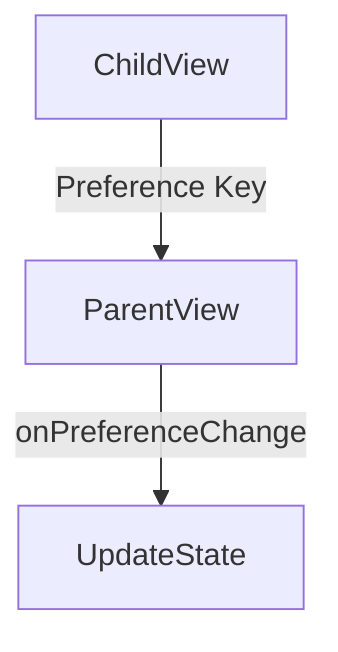
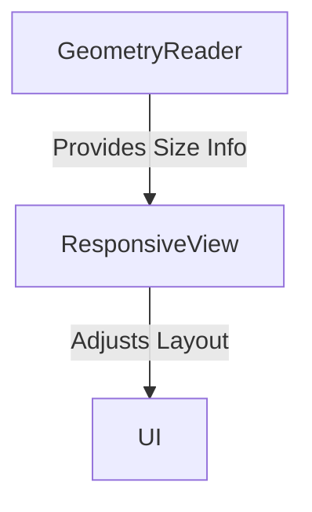

## 12.11 Advanced SwiftUI Techniques

SwiftUI offers a powerful and intuitive way to build user interfaces across all Apple platforms. As you become more familiar with SwiftUI, you will find that there are advanced techniques that can significantly enhance your app's UI and UX. In this section, we will dive into three advanced SwiftUI techniques: Preference Keys, GeometryReader, and View Builders. These techniques enable you to create more dynamic, responsive, and flexible interfaces.

### Preference Keys

Preference Keys in SwiftUI provide a mechanism for passing data from child views back up to parent views. This is particularly useful in scenarios where you need to propagate information that is only available in a child view, such as dynamic sizing or coordinate space information.

#### Data Propagation with Preference Keys

Preference Keys are a way to propagate data up the view hierarchy. This is the opposite of the typical data flow in SwiftUI, which is top-down. Preference Keys allow you to define a key-value pair where the key is a type conforming to the `PreferenceKey` protocol.

**Example: Dynamic View Sizing**

Imagine a situation where you want to determine the size of a child view and use that information in a parent view. You can achieve this using a Preference Key.

```swift
import SwiftUI

struct SizePreferenceKey: PreferenceKey {
    static var defaultValue: CGSize = .zero
    
    static func reduce(value: inout CGSize, nextValue: () -> CGSize) {
        value = nextValue()
    }
}

struct ChildView: View {
    var body: some View {
        Text("Hello, SwiftUI!")
            .background(GeometryReader { geometry in
                Color.clear
                    .preference(key: SizePreferenceKey.self, value: geometry.size)
            })
    }
}

struct ParentView: View {
    @State private var childSize: CGSize = .zero
    
    var body: some View {
        VStack {
            ChildView()
                .onPreferenceChange(SizePreferenceKey.self) { size in
                    self.childSize = size
                }
            Text("Child View Size: \\(childSize.width) x \\(childSize.height)")
        }
    }
}
```

In this example, `SizePreferenceKey` is used to pass the size of the `ChildView` back to the `ParentView`. The `onPreferenceChange` modifier listens for changes in the preference value and updates the state accordingly.

#### Use Cases for Preference Keys

1. **Dynamic View Sizing**: As demonstrated, Preference Keys can be used to dynamically adjust layouts based on child view sizes.
2. **Coordinate Space**: Preference Keys can also be used to pass coordinate space information from child to parent views, which is useful for custom positioning and animations.

### GeometryReader

The `GeometryReader` is a powerful tool in SwiftUI that allows you to create responsive layouts by providing access to the size and position of a view within its parent. This enables you to adjust your UI based on the available space.

#### Responsive Layouts with GeometryReader

`GeometryReader` provides a `GeometryProxy` object that contains information about the size and position of the view. You can use this information to create layouts that adapt to different screen sizes and orientations.

**Example: Responsive Layout**

```swift
import SwiftUI

struct ResponsiveView: View {
    var body: some View {
        GeometryReader { geometry in
            VStack {
                Text("Width: \\(geometry.size.width)")
                Text("Height: \\(geometry.size.height)")
            }
            .frame(width: geometry.size.width / 2, height: geometry.size.height / 2)
            .background(Color.blue)
        }
    }
}
```

In this example, the `ResponsiveView` uses the `GeometryReader` to create a layout that adjusts its size based on the available space. The text views display the width and height of the `GeometryReader`.

#### Custom Alignments with GeometryReader

You can also use `GeometryReader` to create custom alignments by precisely positioning elements within a view.

**Example: Custom Alignment**

```swift
import SwiftUI

struct CustomAlignmentView: View {
    var body: some View {
        GeometryReader { geometry in
            VStack {
                Text("Aligned Text")
                    .position(x: geometry.size.width / 4, y: geometry.size.height / 4)
                    .background(Color.green)
            }
        }
    }
}
```

In this example, the `Text` view is positioned at a custom alignment within its parent using the `position` modifier and the size information from the `GeometryReader`.

### View Builders and @ViewBuilder

SwiftUI's `@ViewBuilder` attribute allows you to create complex view hierarchies using a declarative syntax. This enables you to build custom domain-specific languages (DSLs) for views and create conditional views.

#### Creating Custom DSLs with @ViewBuilder

The `@ViewBuilder` attribute is used to construct views from a series of expressions. It allows you to create reusable view components that can accept multiple child views.

**Example: Custom DSL**

```swift
import SwiftUI

struct CustomContainer<Content: View>: View {
    let content: Content
    
    init(@ViewBuilder content: () -> Content) {
        self.content = content()
    }
    
    var body: some View {
        VStack {
            content
        }
        .padding()
        .background(Color.gray)
    }
}

struct ContentView: View {
    var body: some View {
        CustomContainer {
            Text("Hello, World!")
            Text("This is a custom DSL.")
        }
    }
}
```

In this example, `CustomContainer` uses `@ViewBuilder` to accept multiple child views. This allows you to create a custom DSL for building view hierarchies.

#### Building Conditional Views with @ViewBuilder

`@ViewBuilder` also enables you to create views with conditional content, making your UI more flexible.

**Example: Conditional Views**

```swift
import SwiftUI

struct ConditionalView: View {
    var showText: Bool
    
    var body: some View {
        VStack {
            if showText {
                Text("Condition is true!")
            } else {
                Text("Condition is false!")
            }
        }
    }
}
```

In this example, the `ConditionalView` uses `@ViewBuilder` to conditionally display different text views based on the value of `showText`.

### Try It Yourself

Experiment with the examples provided by modifying the code:

- Change the `ChildView` text and observe how it affects the size in the `ParentView`.
- Adjust the frame size in `ResponsiveView` to see how it impacts the layout.
- Add more child views to `CustomContainer` and see how it handles multiple views.
- Modify the condition in `ConditionalView` to test different scenarios.

### Visualizing SwiftUI Techniques

To better understand how these techniques work together, let's visualize the data flow and layout adjustments using Mermaid.js diagrams.

#### Preference Key Data Flow



*Description*: This diagram illustrates how data flows from `ChildView` to `ParentView` using a Preference Key.

#### GeometryReader Layout Adjustment



*Description*: This diagram shows how `GeometryReader` provides size information to `ResponsiveView`, which then adjusts the UI layout.

### Key Takeaways

- **Preference Keys**: Use them to propagate data from child to parent views, enabling dynamic sizing and coordinate space adjustments.
- **GeometryReader**: Employ it for responsive layouts and custom alignments by accessing size and position information.
- **View Builders and @ViewBuilder**: Leverage them to create custom DSLs and build conditional views, enhancing the flexibility of your UI.

### References and Further Reading

- [SwiftUI Documentation](https://developer.apple.com/documentation/swiftui)
- [Understanding SwiftUI's ViewBuilder](https://swiftwithmajid.com/2020/01/15/understanding-swiftui-viewbuilder/)

### Embrace the Journey

Remember, mastering these advanced SwiftUI techniques will empower you to create more dynamic and responsive applications. Keep experimenting, stay curious, and enjoy the journey of building beautiful UIs with SwiftUI!

## Quiz Time!



### What is the primary purpose of Preference Keys in SwiftUI?

- [x] To propagate data from child views to parent views
- [ ] To manage state within a view
- [ ] To handle user inputs
- [ ] To render complex animations

> **Explanation:** Preference Keys are used to pass data from child views back to parent views, enabling dynamic data flow.

### How does GeometryReader help in creating responsive layouts?

- [x] By providing access to the size and position of a view
- [ ] By managing view states
- [ ] By handling user interactions
- [ ] By rendering animations

> **Explanation:** GeometryReader provides a GeometryProxy object that contains size and position information, which can be used to adjust layouts.

### Which attribute is used to create custom DSLs in SwiftUI?

- [x] @ViewBuilder
- [ ] @State
- [ ] @Binding
- [ ] @Environment

> **Explanation:** The @ViewBuilder attribute allows you to construct views using a declarative syntax, enabling custom DSLs.

### What type of views can be created using @ViewBuilder?

- [x] Conditional views
- [ ] Stateful views
- [ ] Animatable views
- [ ] Interactive views

> **Explanation:** @ViewBuilder allows for the creation of conditional views, enhancing UI flexibility.

### Which of the following is a use case for Preference Keys?

- [x] Dynamic view sizing
- [ ] State management
- [ ] User input handling
- [ ] Animation control

> **Explanation:** Preference Keys can be used to dynamically adjust layouts based on child view sizes.

### What does the GeometryReader provide to its child views?

- [x] Size and position information
- [ ] Animation control
- [ ] User input handling
- [ ] State management

> **Explanation:** GeometryReader provides size and position information through a GeometryProxy object.

### How can you create a custom alignment using GeometryReader?

- [x] By using the position modifier with size information
- [ ] By using the alignment guide
- [ ] By adjusting the frame modifier
- [ ] By setting the zIndex

> **Explanation:** Custom alignments can be achieved by using the position modifier in conjunction with GeometryReader's size information.

### What is a benefit of using @ViewBuilder in SwiftUI?

- [x] It allows for building complex view hierarchies
- [ ] It simplifies state management
- [ ] It enhances animation capabilities
- [ ] It improves user interaction handling

> **Explanation:** @ViewBuilder enables the construction of complex view hierarchies with a declarative syntax.

### True or False: Preference Keys can be used to pass data from parent to child views.

- [ ] True
- [x] False

> **Explanation:** Preference Keys are designed to pass data from child views to parent views, not the other way around.

### True or False: GeometryReader can be used to manage state within a view.

- [ ] True
- [x] False

> **Explanation:** GeometryReader provides size and position information, not state management capabilities.






