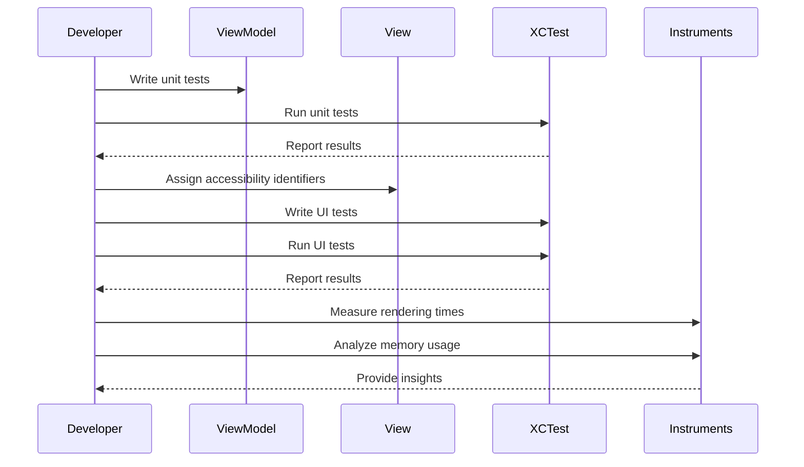

## 12.12 Testing SwiftUI Views

SwiftUI has revolutionized the way we build user interfaces in iOS and macOS applications. However, with great power comes great responsibility, and ensuring that your SwiftUI views are robust and performant is crucial. In this section, we'll delve into the various aspects of testing SwiftUI views, including unit testing, UI testing, and performance testing. We'll provide detailed explanations, code examples, and best practices to help you master SwiftUI view testing.

### Unit Testing SwiftUI Views

Unit testing is a fundamental practice in software development that involves testing individual components or units of code in isolation. In the context of SwiftUI, unit testing primarily focuses on testing the logic within view models and verifying state changes.

#### Testing Logic in View Models

View models in SwiftUI play a crucial role in managing the state and business logic of your views. By testing view models, we can ensure that our views behave correctly under different conditions.

**Example: Testing a View Model**

Let's consider a simple view model for a counter app:

```swift
import XCTest
@testable import MySwiftUIApp

class CounterViewModel: ObservableObject {
    @Published var count: Int = 0
    
    func increment() {
        count += 1
    }
    
    func decrement() {
        count -= 1
    }
}

class CounterViewModelTests: XCTestCase {
    
    func testIncrement() {
        let viewModel = CounterViewModel()
        viewModel.increment()
        XCTAssertEqual(viewModel.count, 1, "Count should be 1 after incrementing")
    }
    
    func testDecrement() {
        let viewModel = CounterViewModel()
        viewModel.decrement()
        XCTAssertEqual(viewModel.count, -1, "Count should be -1 after decrementing")
    }
}
```

In this example, we define a `CounterViewModel` with `increment` and `decrement` methods. The `CounterViewModelTests` class contains unit tests to verify that the `count` property is updated correctly.

#### View Snapshots: Capturing and Comparing View States

Snapshot testing involves capturing the visual representation of a view and comparing it against a reference image. This technique is particularly useful for ensuring that UI changes do not introduce unintended visual regressions.

**Example: Snapshot Testing with SwiftSnapshotTesting**

To perform snapshot testing in SwiftUI, we can use the [SwiftSnapshotTesting](https://github.com/pointfreeco/swift-snapshot-testing) library. Here's how you can set it up:

1. **Add SwiftSnapshotTesting to your project** using Swift Package Manager.

2. **Write a snapshot test** for your SwiftUI view:

```swift
import SnapshotTesting
import SwiftUI
import XCTest

class MyViewSnapshotTests: XCTestCase {
    
    func testMyView() {
        let view = MyView() // Replace with your SwiftUI view
        let host = UIHostingController(rootView: view)
        assertSnapshot(matching: host, as: .image)
    }
}
```

In this example, we use `UIHostingController` to wrap the SwiftUI view and `assertSnapshot` to capture and compare the view's appearance.

### UI Testing SwiftUI Views

UI testing involves interacting with the app's user interface to verify that it functions as expected. Xcode provides powerful tools for automated UI testing, allowing us to simulate user interactions and validate UI behavior.

#### Automated Testing with Xcode

Xcode's UI testing framework enables us to write tests that simulate user interactions such as taps, swipes, and text input. These tests run on a real or simulated device, providing a high level of confidence in the app's behavior.

**Example: UI Testing with XCTest**

Here's an example of a simple UI test for a SwiftUI app:

```swift
import XCTest

class MySwiftUIAppUITests: XCTestCase {
    
    func testButtonTapIncrementsCounter() {
        let app = XCUIApplication()
        app.launch()
        
        let incrementButton = app.buttons["Increment"]
        incrementButton.tap()
        
        let counterLabel = app.staticTexts["CounterLabel"]
        XCTAssertEqual(counterLabel.label, "1", "Counter should be 1 after tapping the increment button")
    }
}
```

In this example, we launch the app, tap the "Increment" button, and verify that the counter label updates correctly. Using accessibility identifiers (e.g., `app.buttons["Increment"]`) simplifies element selection.

#### Accessibility Identifiers: Simplifying Element Selection

Accessibility identifiers are key to writing reliable UI tests. By assigning unique identifiers to UI elements, we can easily locate and interact with them in our tests.

**Example: Setting Accessibility Identifiers in SwiftUI**

```swift
import SwiftUI

struct MyView: View {
    @State private var count = 0
    
    var body: some View {
        VStack {
            Text("\\(count)")
                .accessibilityIdentifier("CounterLabel")
            Button("Increment") {
                count += 1
            }
            .accessibilityIdentifier("IncrementButton")
        }
    }
}
```

In this example, we assign accessibility identifiers to the `Text` and `Button` elements, making them easily accessible in UI tests.

### Performance Testing SwiftUI Views

Performance testing is crucial to ensure that your SwiftUI views render smoothly and efficiently. This involves measuring rendering times, detecting memory leaks, and optimizing resource usage.

#### Measuring Rendering Times

Rendering time is a critical performance metric, especially for complex SwiftUI views. Xcode's Instruments tool provides powerful capabilities for measuring rendering performance.

**Example: Using Instruments to Measure Rendering Times**

1. **Open Instruments** from Xcode's `Xcode > Open Developer Tool > Instruments` menu.

2. **Select the "Time Profiler" template** to measure CPU usage and rendering times.

3. **Run your app** and interact with the SwiftUI views to collect data.

4. **Analyze the results** to identify performance bottlenecks and optimize rendering times.

#### Memory Usage: Detecting Leaks and Optimizing Resource Usage

Memory management is another critical aspect of performance testing. SwiftUI's declarative nature can sometimes lead to unexpected memory usage patterns.

**Example: Analyzing Memory Usage with Instruments**

1. **Open Instruments** and select the "Leaks" template.

2. **Run your app** and interact with the SwiftUI views to detect memory leaks.

3. **Use the "Allocations" template** to analyze memory usage patterns and optimize resource management.

### Try It Yourself

Now that we've covered the basics of testing SwiftUI views, it's time to put your knowledge into practice. Try modifying the code examples above to test different scenarios or add new features to the view models and UI tests. Experiment with snapshot testing and performance analysis to gain deeper insights into your app's behavior.

### Visualizing the Testing Process

Let's visualize the workflow of testing SwiftUI views using a sequence diagram. This diagram illustrates the interaction between different components during the testing process.



### Key Takeaways

- **Unit Testing**: Focus on testing view models and state changes to ensure correct behavior.
- **Snapshot Testing**: Capture and compare view states to detect visual regressions.
- **UI Testing**: Use Xcode's UI testing framework for automated interaction testing.
- **Accessibility Identifiers**: Simplify element selection in UI tests.
- **Performance Testing**: Measure rendering times and analyze memory usage to optimize performance.

### References and Further Reading

- [SwiftSnapshotTesting](https://github.com/pointfreeco/swift-snapshot-testing)
- [Xcode UI Testing Guide](https://developer.apple.com/documentation/xctest/ui_testing)
- [Instruments User Guide](https://developer.apple.com/library/archive/documentation/DeveloperTools/Conceptual/InstrumentsUserGuide/)

### Embrace the Journey

Testing SwiftUI views is an essential skill for any iOS developer. As you continue to experiment and refine your testing strategies, you'll gain a deeper understanding of your app's behavior and performance. Remember, this is just the beginning. Keep exploring, stay curious, and enjoy the journey of mastering SwiftUI view testing!

## Quiz Time!



### What is the primary focus of unit testing in SwiftUI?

- [x] Testing the logic within view models and verifying state changes
- [ ] Testing the visual appearance of views
- [ ] Interacting with the app's user interface
- [ ] Measuring rendering times

> **Explanation:** Unit testing in SwiftUI focuses on testing the logic within view models and verifying state changes to ensure correct behavior.

### What is snapshot testing used for in SwiftUI?

- [x] Capturing and comparing the visual representation of a view
- [ ] Measuring rendering times
- [ ] Testing view models
- [ ] Detecting memory leaks

> **Explanation:** Snapshot testing involves capturing the visual representation of a view and comparing it against a reference image to detect visual regressions.

### Which tool can be used to measure rendering times in SwiftUI?

- [x] Instruments
- [ ] XCTest
- [ ] SwiftLint
- [ ] Xcode's Debugger

> **Explanation:** Instruments is a powerful tool provided by Xcode for measuring rendering times and analyzing performance.

### What is the purpose of accessibility identifiers in UI testing?

- [x] Simplifying element selection in UI tests
- [ ] Measuring rendering times
- [ ] Detecting memory leaks
- [ ] Capturing view snapshots

> **Explanation:** Accessibility identifiers simplify element selection in UI tests by providing unique identifiers for UI elements.

### In the provided UI test example, what does the `XCTAssertEqual` function verify?

- [x] That the counter label updates correctly after tapping the increment button
- [ ] That the app launches successfully
- [ ] That the view model logic is correct
- [ ] That memory usage is optimized

> **Explanation:** The `XCTAssertEqual` function in the UI test example verifies that the counter label updates correctly after tapping the increment button.

### Which library is recommended for snapshot testing in SwiftUI?

- [x] SwiftSnapshotTesting
- [ ] XCTest
- [ ] Instruments
- [ ] SwiftLint

> **Explanation:** SwiftSnapshotTesting is a recommended library for performing snapshot testing in SwiftUI.

### What is the role of `UIHostingController` in snapshot testing?

- [x] Wrapping a SwiftUI view for snapshot testing
- [ ] Measuring rendering times
- [ ] Detecting memory leaks
- [ ] Simplifying element selection

> **Explanation:** `UIHostingController` is used to wrap a SwiftUI view for snapshot testing, allowing it to be captured and compared.

### What does the "Leaks" template in Instruments detect?

- [x] Memory leaks
- [ ] Rendering times
- [ ] UI interactions
- [ ] View model logic

> **Explanation:** The "Leaks" template in Instruments is used to detect memory leaks in an application.

### True or False: Performance testing in SwiftUI only involves measuring rendering times.

- [ ] True
- [x] False

> **Explanation:** Performance testing in SwiftUI involves not only measuring rendering times but also analyzing memory usage and optimizing resource management.

### Which of the following is a key takeaway from testing SwiftUI views?

- [x] Use accessibility identifiers to simplify element selection in UI tests
- [ ] Focus solely on visual appearance
- [ ] Ignore performance testing
- [ ] Avoid using unit tests

> **Explanation:** A key takeaway from testing SwiftUI views is to use accessibility identifiers to simplify element selection in UI tests.




