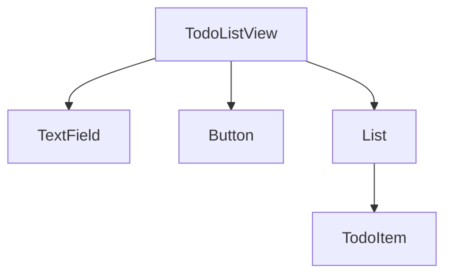
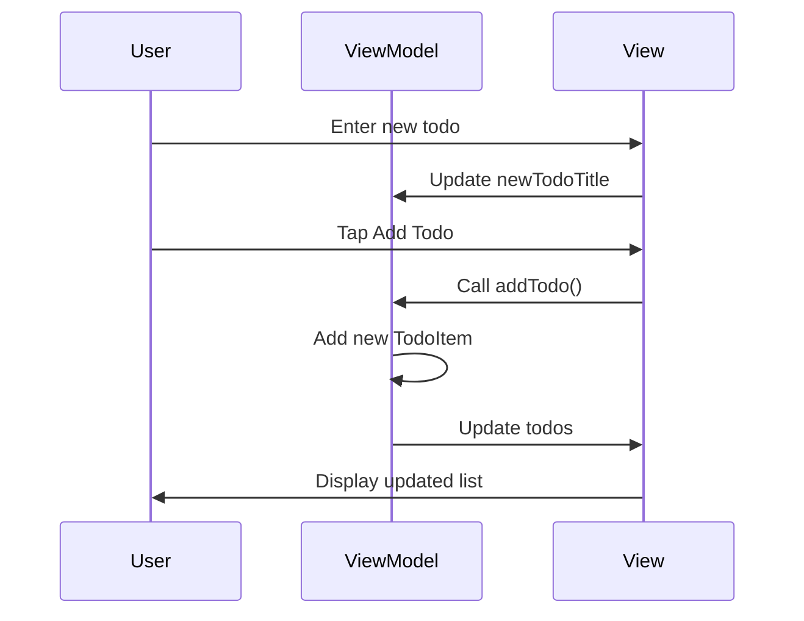

## 12.2 Declarative UI Programming

Declarative UI programming is a paradigm shift in the way we build user interfaces, especially in the context of SwiftUI. It focuses on describing what the UI should look like at any given time, rather than detailing the steps to achieve that look. This approach aligns with Swift's modern programming principles, offering a more intuitive and efficient way to develop user interfaces. Let's explore the key principles, advantages, and practical examples of declarative UI programming in Swift.

### Principles of Declarative UI Programming

#### Describing the UI

In declarative UI programming, we focus on the "what" rather than the "how". This means we define the desired state of the UI, and the framework takes care of rendering it. For example, instead of writing imperative code to create and configure UI components, we declare the UI structure and its behavior directly in the code.

```swift
import SwiftUI

struct ContentView: View {
    var body: some View {
        VStack {
            Text("Hello, SwiftUI!")
                .font(.largeTitle)
                .padding()
            Button(action: {
                print("Button tapped!")
            }) {
                Text("Tap me")
            }
        }
    }
}
```

In this example, we declare a `VStack` containing a `Text` and a `Button`. The code describes the UI hierarchy and properties, leaving the rendering details to SwiftUI.

#### State-Driven Rendering

One of the core concepts of declarative UI programming is state-driven rendering. The UI automatically updates in response to state changes, eliminating the need for manual updates and reducing the likelihood of bugs.

```swift
import SwiftUI

struct CounterView: View {
    @State private var count = 0

    var body: some View {
        VStack {
            Text("Count: \\(count)")
            Button("Increment") {
                count += 1
            }
        }
    }
}
```

Here, the `@State` property wrapper is used to manage the `count` state. Whenever the `count` changes, SwiftUI automatically re-renders the `Text` view to reflect the new state.

#### Composable Views

Declarative UI programming encourages building complex interfaces from simple, reusable components. This composability leads to more maintainable and scalable code.

```swift
import SwiftUI

struct ProfileView: View {
    var body: some View {
        VStack {
            AvatarView(imageName: "profile_picture")
            UserInfoView(name: "John Doe", email: "john.doe@example.com")
        }
    }
}

struct AvatarView: View {
    let imageName: String

    var body: some View {
        Image(imageName)
            .resizable()
            .frame(width: 100, height: 100)
            .clipShape(Circle())
    }
}

struct UserInfoView: View {
    let name: String
    let email: String

    var body: some View {
        VStack(alignment: .leading) {
            Text(name)
                .font(.headline)
            Text(email)
                .font(.subheadline)
                .foregroundColor(.gray)
        }
    }
}
```

In this example, `ProfileView` is composed of `AvatarView` and `UserInfoView`, demonstrating how complex UIs can be constructed from smaller, reusable components.

### Advantages of Declarative UI Programming

#### Simplified Code

Declarative UI programming significantly reduces boilerplate code compared to traditional UIKit programming. By focusing on the desired state rather than the process, developers can write more concise and readable code.

#### Prediction and Consistency

Declarative UI programming offers a clear mapping between the application's state and its UI. This predictability ensures that the UI is always consistent with the underlying data, reducing bugs and improving user experience.

### Code Examples and Practical Implementation

Let's delve deeper into practical implementations of declarative UI programming in Swift, exploring more complex scenarios and advanced techniques.

#### Building a Todo List Application

We'll build a simple Todo List application to demonstrate the power of declarative UI programming in SwiftUI.

```swift
import SwiftUI

struct TodoItem: Identifiable {
    let id = UUID()
    let title: String
}

struct TodoListView: View {
    @State private var todos = [TodoItem]()
    @State private var newTodoTitle = ""

    var body: some View {
        NavigationView {
            VStack {
                TextField("Enter new todo", text: $newTodoTitle)
                    .padding()
                    .textFieldStyle(RoundedBorderTextFieldStyle())

                Button("Add Todo") {
                    if !newTodoTitle.isEmpty {
                        todos.append(TodoItem(title: newTodoTitle))
                        newTodoTitle = ""
                    }
                }
                .padding()

                List(todos) { todo in
                    Text(todo.title)
                }
            }
            .navigationTitle("Todo List")
        }
    }
}
```

In this example, we use SwiftUI's `List` view to display a list of todos. The `@State` property wrapper manages the list of todos and the new todo title. The UI updates automatically when new todos are added.

#### Handling Complex State with State Objects

For more complex state management, we can use `@StateObject` and `ObservableObject` to manage state across multiple views.

```swift
import SwiftUI
import Combine

class TodoViewModel: ObservableObject {
    @Published var todos = [TodoItem]()
    @Published var newTodoTitle = ""

    func addTodo() {
        guard !newTodoTitle.isEmpty else { return }
        todos.append(TodoItem(title: newTodoTitle))
        newTodoTitle = ""
    }
}

struct TodoListView: View {
    @StateObject private var viewModel = TodoViewModel()

    var body: some View {
        NavigationView {
            VStack {
                TextField("Enter new todo", text: $viewModel.newTodoTitle)
                    .padding()
                    .textFieldStyle(RoundedBorderTextFieldStyle())

                Button("Add Todo") {
                    viewModel.addTodo()
                }
                .padding()

                List(viewModel.todos) { todo in
                    Text(todo.title)
                }
            }
            .navigationTitle("Todo List")
        }
    }
}
```

Here, `TodoViewModel` is an `ObservableObject` that manages the state of the todo list. The `@StateObject` property wrapper initializes the view model, and SwiftUI automatically observes changes to the published properties.

### Visualizing Declarative UI Programming

To better understand the flow and structure of declarative UI programming, let's visualize the component hierarchy and state management using Mermaid.js diagrams.

#### Component Hierarchy



*Diagram: Visualizing the component hierarchy of the Todo List application.*

#### State Management Flow



*Diagram: State management flow in the Todo List application.*

### References and Further Reading

- [SwiftUI Documentation](https://developer.apple.com/documentation/swiftui)
- [Hacking with Swift - SwiftUI](https://www.hackingwithswift.com/quick-start/swiftui)
- [Swift by Sundell - Articles on SwiftUI](https://www.swiftbysundell.com/articles/)

### Knowledge Check

To reinforce your understanding of declarative UI programming in Swift, consider these questions:

- What are the benefits of using `@State` and `@StateObject` in SwiftUI?
- How does declarative UI programming differ from imperative UI programming?
- Why is state-driven rendering beneficial in UI development?

### Embrace the Journey

Remember, mastering declarative UI programming in Swift is a journey. As you continue to explore and experiment, you'll discover new techniques and patterns that enhance your development process. Keep building, stay curious, and enjoy the creative freedom that declarative UI programming offers!

## Quiz Time!



### What is the primary focus of declarative UI programming?

- [x] Describing the UI's desired state
- [ ] Detailing the steps to render the UI
- [ ] Managing memory allocation
- [ ] Optimizing performance

> **Explanation:** Declarative UI programming focuses on describing what the UI should look like, rather than detailing the steps to achieve that look.

### Which SwiftUI property wrapper is used for state management?

- [x] @State
- [ ] @Binding
- [ ] @Environment
- [ ] @Published

> **Explanation:** The `@State` property wrapper is used to manage state within a SwiftUI view.

### What is a key advantage of state-driven rendering?

- [x] Automatic UI updates
- [ ] Manual UI updates
- [ ] Complex code
- [ ] Increased boilerplate

> **Explanation:** State-driven rendering allows the UI to update automatically in response to state changes, reducing the need for manual updates.

### How does SwiftUI encourage composability?

- [x] By allowing complex interfaces to be built from simple components
- [ ] By enforcing strict view hierarchies
- [ ] By using only one type of view
- [ ] By discouraging reuse

> **Explanation:** SwiftUI encourages building complex interfaces from simple, reusable components, promoting composability.

### What is the role of `@StateObject` in SwiftUI?

- [x] To initialize and manage an observable object
- [ ] To bind a value to a view
- [ ] To store environment values
- [ ] To publish changes to a property

> **Explanation:** `@StateObject` is used to initialize and manage an observable object within a SwiftUI view.

### Which diagram best represents component hierarchy in SwiftUI?

- [x] Graph
- [ ] Sequence
- [ ] Class
- [ ] Flowchart

> **Explanation:** A graph diagram effectively represents the component hierarchy in SwiftUI.

### What does the `@Published` property wrapper do?

- [x] Publishes changes to a property for observers
- [ ] Binds a value to a view
- [ ] Stores environment values
- [ ] Initializes an observable object

> **Explanation:** The `@Published` property wrapper publishes changes to a property, allowing observers to react to updates.

### What is a key benefit of using declarative UI programming?

- [x] Simplified code
- [ ] Increased complexity
- [ ] More boilerplate
- [ ] Manual state management

> **Explanation:** Declarative UI programming simplifies code by focusing on the desired state rather than the process.

### True or False: Declarative UI programming requires manual updates for state changes.

- [ ] True
- [x] False

> **Explanation:** False. Declarative UI programming automatically updates the UI in response to state changes.

### Which of the following is not a principle of declarative UI programming?

- [ ] Describing the UI
- [ ] State-Driven Rendering
- [ ] Composable Views
- [x] Imperative Event Handling

> **Explanation:** Imperative event handling is not a principle of declarative UI programming, which focuses on describing the UI, state-driven rendering, and composable views.




