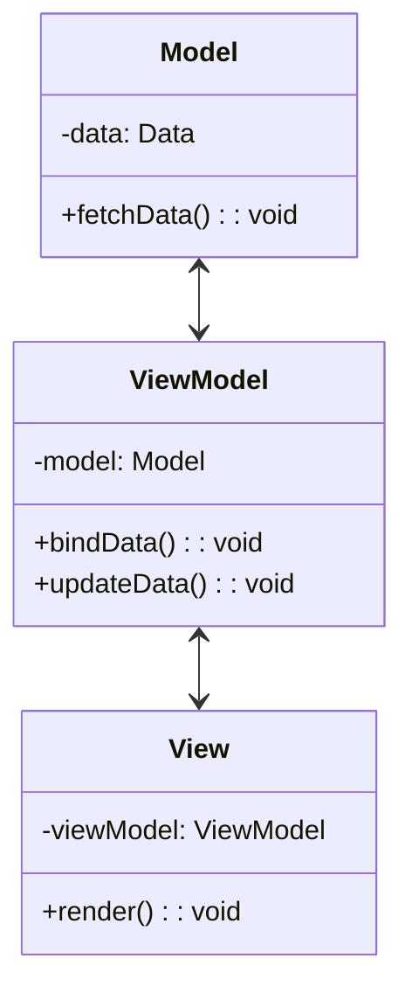

## 12.4 MVVM in SwiftUI

### Introduction to MVVM

The Model-View-ViewModel (MVVM) design pattern is a powerful architectural pattern that helps developers build applications in a modular and maintainable way. In SwiftUI, MVVM is particularly effective because it leverages SwiftUI's declarative syntax and data binding capabilities. This section will guide you through understanding and implementing MVVM in SwiftUI, ensuring your applications are robust, scalable, and testable.

### Understanding MVVM Components

#### Model

The **Model** represents the data and business logic of your application. It is responsible for managing the data, whether it's from a local database, a remote server, or any other source. The Model should be independent of the UI and should not contain any presentation logic.

#### View

The **View** is the UI layer of your application. In SwiftUI, the View is declarative, meaning you describe what the UI should look like for a given state. The View is responsible for displaying data and reacting to user input.

#### ViewModel

The **ViewModel** acts as an intermediary between the Model and the View. It holds the presentation logic and prepares data from the Model for the View. The ViewModel exposes data through properties that the View can bind to, allowing for a clean separation of concerns.

### Implementing MVVM in SwiftUI

#### Data Binding

Data binding is a core concept in MVVM, allowing the View to automatically update when the data in the ViewModel changes. SwiftUI's `@State`, `@Binding`, `@ObservedObject`, and `@EnvironmentObject` property wrappers facilitate this binding.

Here's a simple example to illustrate data binding in SwiftUI:

```swift
import SwiftUI
import Combine

// Model
struct UserModel {
    var name: String
}

// ViewModel
class UserViewModel: ObservableObject {
    @Published var user: UserModel
    
    init(user: UserModel) {
        self.user = user
    }
    
    func updateName(to newName: String) {
        user.name = newName
    }
}

// View
struct UserView: View {
    @ObservedObject var viewModel: UserViewModel
    
    var body: some View {
        VStack {
            Text("User Name: \\(viewModel.user.name)")
            Button(action: {
                viewModel.updateName(to: "New Name")
            }) {
                Text("Change Name")
            }
        }
    }
}

// Usage
struct ContentView: View {
    var body: some View {
        UserView(viewModel: UserViewModel(user: UserModel(name: "John Doe")))
    }
}
```

In this example, the `UserView` is bound to the `UserViewModel`, and any changes to the `user` property in the ViewModel will automatically update the View.

#### Simplifying Views

One of the key benefits of MVVM is keeping Views free of complex logic. By offloading business logic and state management to the ViewModel, Views remain simple and focused on UI rendering.

Consider the following approach to simplify Views:

- **Delegate Data Manipulation**: Let the ViewModel handle data manipulation and formatting.
- **Use Computed Properties**: In the ViewModel, use computed properties to prepare data for the View.
- **Keep Views Stateless**: As much as possible, keep Views stateless and rely on the ViewModel for state management.

#### Testability

MVVM enhances testability by decoupling the View from the business logic. You can test ViewModels independently of the UI, ensuring that the logic is correct without the need for UI tests.

Here's how you can test a ViewModel:

```swift
import XCTest
@testable import YourApp

class UserViewModelTests: XCTestCase {

    func testUpdateName() {
        let user = UserModel(name: "John Doe")
        let viewModel = UserViewModel(user: user)
        
        viewModel.updateName(to: "Jane Doe")
        
        XCTAssertEqual(viewModel.user.name, "Jane Doe")
    }
}
```

This test verifies that the `updateName` method in the `UserViewModel` correctly updates the user's name.

### Visualizing MVVM in SwiftUI

Below is a diagram illustrating the interaction between the Model, ViewModel, and View in the MVVM pattern:



**Diagram Description**: This diagram shows the flow of data and responsibilities in the MVVM pattern. The Model manages the data, the ViewModel acts as a bridge, and the View renders the UI based on the ViewModel's data.

### SwiftUI's Unique Features in MVVM

SwiftUI offers several unique features that enhance the implementation of MVVM:

- **Declarative Syntax**: SwiftUI's declarative syntax simplifies the creation of Views, making it easier to express the UI state.
- **Automatic Updates**: With data binding, SwiftUI automatically updates the UI when the data changes, reducing boilerplate code.
- **State Management**: SwiftUI's property wrappers (`@State`, `@Binding`, `@ObservedObject`, `@EnvironmentObject`) provide powerful tools for managing state.

### Differences and Similarities with Other Patterns

While MVVM shares similarities with other patterns like MVC (Model-View-Controller), it offers a clearer separation of concerns by introducing the ViewModel. Unlike MVC, where the Controller often handles both business logic and UI updates, MVVM separates these responsibilities, leading to more maintainable code.

### Try It Yourself

To deepen your understanding of MVVM in SwiftUI, try modifying the example code:

- **Add More Properties**: Extend the `UserModel` with additional properties and update the ViewModel and View accordingly.
- **Implement Additional Methods**: Add more methods to the ViewModel to handle different user interactions.
- **Experiment with Property Wrappers**: Use different property wrappers to see how they affect data binding and state management.

### Key Considerations

When implementing MVVM in SwiftUI, consider the following:

- **Complexity**: While MVVM can simplify Views, it may introduce complexity in the ViewModel. Balance is key.
- **Data Flow**: Ensure a clear data flow between the Model, ViewModel, and View to prevent data inconsistencies.
- **Performance**: Be mindful of performance, especially when dealing with large data sets or complex UI updates.

### Conclusion

Mastering MVVM in SwiftUI empowers you to build scalable, maintainable, and testable applications. By leveraging SwiftUI's declarative syntax and data binding capabilities, you can create clean and efficient codebases. Remember, this is just the beginning. As you progress, you'll build more complex and interactive applications. Keep experimenting, stay curious, and enjoy the journey!

## Quiz Time!



### What does the ViewModel do in MVVM?

- [x] Connects the Model and View
- [ ] Manages the UI layout
- [ ] Handles network requests
- [ ] Stores user preferences

> **Explanation:** The ViewModel connects the Model and View, handling presentation logic and data preparation for the View.

### Which SwiftUI feature is crucial for data binding in MVVM?

- [x] Property wrappers
- [ ] Storyboards
- [ ] ViewControllers
- [ ] Animations

> **Explanation:** Property wrappers like `@State`, `@Binding`, `@ObservedObject`, and `@EnvironmentObject` are crucial for data binding in MVVM.

### What is the primary role of the Model in MVVM?

- [x] Manage data and business logic
- [ ] Render the UI
- [ ] Handle user input
- [ ] Connect to the ViewModel

> **Explanation:** The Model is responsible for managing data and business logic, independent of the UI.

### How does MVVM enhance testability?

- [x] By decoupling the View from business logic
- [ ] By using fewer lines of code
- [ ] By integrating with XCTest
- [ ] By reducing the number of classes

> **Explanation:** MVVM enhances testability by decoupling the View from business logic, allowing ViewModels to be tested independently.

### What is a key benefit of keeping Views simple in MVVM?

- [x] Easier maintenance and readability
- [ ] Faster network requests
- [ ] Improved graphics rendering
- [ ] More complex animations

> **Explanation:** Keeping Views simple improves maintenance and readability, as they focus solely on UI rendering.

### How does SwiftUI's declarative syntax benefit MVVM?

- [x] Simplifies UI creation and state expression
- [ ] Increases code complexity
- [ ] Requires more manual updates
- [ ] Limits flexibility

> **Explanation:** SwiftUI's declarative syntax simplifies UI creation and state expression, making it easier to implement MVVM.

### What should you be mindful of when implementing MVVM?

- [x] Complexity and data flow
- [ ] Reducing file size
- [ ] Increasing animation speed
- [ ] Using fewer classes

> **Explanation:** Be mindful of complexity and data flow to prevent data inconsistencies and maintain clarity.

### Which pattern does MVVM often get compared to?

- [x] MVC (Model-View-Controller)
- [ ] Singleton
- [ ] Factory
- [ ] Observer

> **Explanation:** MVVM is often compared to MVC due to their similarities in separating concerns within an application.

### True or False: In MVVM, the ViewModel should contain UI code.

- [ ] True
- [x] False

> **Explanation:** False. The ViewModel should not contain UI code; it should handle presentation logic and data preparation.

### True or False: SwiftUI automatically updates Views when data changes in MVVM.

- [x] True
- [ ] False

> **Explanation:** True. SwiftUI automatically updates Views when data changes, thanks to its data binding capabilities.




