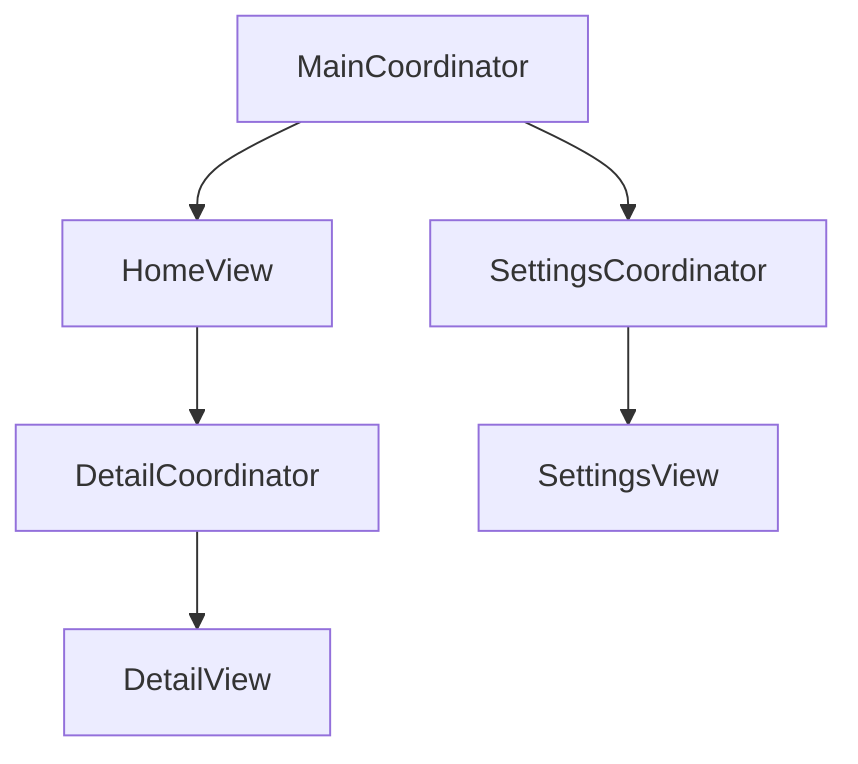

## 12.5 Coordinators in SwiftUI

In the world of iOS development, managing navigation and flow is a critical aspect of building robust applications. SwiftUI, with its declarative syntax, introduces new challenges and opportunities in handling navigation. This is where the Coordinator pattern comes into play, providing a structured way to manage navigation logic and flow. In this section, we'll delve into the Coordinator pattern, its implementation in SwiftUI, and the benefits it brings to your development process.

### Understanding Coordinators

**Purpose**: The Coordinator pattern is designed to manage navigation and flow in SwiftUI applications. By encapsulating navigation logic in separate entities, Coordinators help in maintaining a clean separation of concerns, making your codebase more manageable and scalable.

#### Key Concepts

- **Navigation Logic**: Coordinators encapsulate navigation logic, allowing views to remain focused on their presentation responsibilities.
- **Separation of Concerns**: By separating navigation from view logic, Coordinators enhance code organization and readability.

### Implementing Coordinators in SwiftUI

To implement Coordinators in SwiftUI, we typically create a class or struct that handles the navigation logic. This entity is responsible for creating views and managing transitions between them.

#### Step-by-Step Implementation

1. **Define the Coordinator Protocol**

   Start by defining a protocol that outlines the responsibilities of a Coordinator. This protocol can include methods for starting the navigation flow and presenting specific views.

   ```swift
   protocol Coordinator {
       func start()
   }
   ```

2. **Create a Base Coordinator**

   Implement a base class or struct that conforms to the `Coordinator` protocol. This base Coordinator will manage a collection of child Coordinators, allowing for complex navigation flows.

   ```swift
   class BaseCoordinator: Coordinator {
       var childCoordinators: [Coordinator] = []

       func start() {
           // Implement the starting logic for the navigation flow
       }

       func addChild(_ coordinator: Coordinator) {
           childCoordinators.append(coordinator)
       }

       func removeChild(_ coordinator: Coordinator) {
           childCoordinators.removeAll { $0 === coordinator }
       }
   }
   ```

3. **Implement Specific Coordinators**

   Create specific Coordinators for different parts of your application. Each Coordinator is responsible for managing the navigation logic for a particular feature or section.

   ```swift
   class MainCoordinator: BaseCoordinator {
       private var navigationController: UINavigationController

       init(navigationController: UINavigationController) {
           self.navigationController = navigationController
       }

       override func start() {
           let viewController = HomeViewController()
           viewController.coordinator = self
           navigationController.pushViewController(viewController, animated: true)
       }

       func showDetail() {
           let detailCoordinator = DetailCoordinator(navigationController: navigationController)
           addChild(detailCoordinator)
           detailCoordinator.start()
       }
   }
   ```

4. **Integrate with SwiftUI Views**

   Use the `UIViewControllerRepresentable` protocol to integrate your Coordinators with SwiftUI views. This allows you to use UIKit-based navigation within a SwiftUI application.

   ```swift
   struct MainCoordinatorView: UIViewControllerRepresentable {
       func makeUIViewController(context: Context) -> UINavigationController {
           let navigationController = UINavigationController()
           let coordinator = MainCoordinator(navigationController: navigationController)
           coordinator.start()
           return navigationController
       }

       func updateUIViewController(_ uiViewController: UINavigationController, context: Context) {}
   }
   ```

### Benefits of Using Coordinators

#### Reusability

Coordinators promote reusability by encapsulating navigation logic in a single entity. This allows you to reuse Coordinators across different parts of your application, reducing code duplication and enhancing consistency.

#### Maintainability

By separating navigation logic from views, Coordinators make your codebase easier to manage and update. Changes to navigation flows can be made in a single place, reducing the risk of introducing bugs and improving overall maintainability.

### Design Considerations

When implementing Coordinators, consider the following:

- **Complexity**: While Coordinators can simplify navigation logic, they can also introduce complexity if not managed properly. Ensure that your Coordinator hierarchy is well-structured and avoid deeply nested Coordinators.
- **State Management**: Coordinators often need to manage state across different views. Consider using SwiftUI's state management tools, such as `@State`, `@Binding`, and `@ObservedObject`, to keep your state in sync.

### Swift Unique Features

SwiftUI offers unique features that can enhance the Coordinator pattern:

- **Declarative Syntax**: Leverage SwiftUI's declarative syntax to define navigation flows more intuitively.
- **Combine Framework**: Use Combine to handle asynchronous events and data flow within your Coordinators.

### Differences and Similarities

Coordinators are often compared to other navigation patterns, such as the Router pattern. While both patterns manage navigation, Coordinators focus on encapsulating navigation logic, whereas Routers are more concerned with routing logic and URL handling.

### Visualizing Coordinators in SwiftUI

To better understand the flow of Coordinators in SwiftUI, let's visualize the process using a Mermaid.js diagram.



**Diagram Description**: This diagram illustrates a simple Coordinator structure where the `MainCoordinator` manages navigation to `HomeView` and `SettingsView`. It also shows how the `DetailCoordinator` is responsible for presenting the `DetailView`.

### Try It Yourself

To get hands-on experience with Coordinators in SwiftUI, try modifying the code examples above:

- **Experiment with Navigation**: Add additional views and Coordinators to explore more complex navigation flows.
- **Integrate Combine**: Use Combine to handle asynchronous data updates within your Coordinators.
- **Explore State Management**: Implement state management using SwiftUI's state tools to see how they interact with Coordinators.

### Knowledge Check

- **Question**: What is the primary purpose of the Coordinator pattern in SwiftUI?
- **Exercise**: Implement a simple Coordinator for a multi-step form in a SwiftUI application.

### Embrace the Journey

Remember, mastering Coordinators in SwiftUI is just the beginning. As you continue to build more complex applications, you'll find that the Coordinator pattern is an invaluable tool in your development toolkit. Keep experimenting, stay curious, and enjoy the journey!

## Quiz Time!



### What is the primary purpose of the Coordinator pattern in SwiftUI?

- [x] To manage navigation and flow in SwiftUI applications.
- [ ] To handle state management in SwiftUI applications.
- [ ] To manage data persistence in SwiftUI applications.
- [ ] To optimize performance in SwiftUI applications.

> **Explanation:** The Coordinator pattern is primarily used to manage navigation and flow in SwiftUI applications, encapsulating navigation logic and maintaining a separation of concerns.


### Which protocol is commonly used to define a Coordinator in SwiftUI?

- [x] Coordinator
- [ ] NavigationManager
- [ ] FlowController
- [ ] ViewCoordinator

> **Explanation:** The `Coordinator` protocol is commonly used to define the responsibilities of a Coordinator in SwiftUI, including methods for starting the navigation flow.


### What is a key benefit of using Coordinators in SwiftUI?

- [x] Reusability and maintainability of navigation logic.
- [ ] Improved data persistence.
- [ ] Enhanced performance optimization.
- [ ] Better state management.

> **Explanation:** Coordinators enhance reusability and maintainability by encapsulating navigation logic, allowing it to be reused across different parts of the application.


### How do Coordinators promote separation of concerns?

- [x] By encapsulating navigation logic separate from views.
- [ ] By managing data persistence.
- [ ] By optimizing application performance.
- [ ] By handling state management.

> **Explanation:** Coordinators promote separation of concerns by encapsulating navigation logic, keeping it separate from view presentation logic.


### What is a potential drawback of using Coordinators?

- [x] They can introduce complexity if not managed properly.
- [ ] They reduce code readability.
- [ ] They make state management more difficult.
- [ ] They decrease application performance.

> **Explanation:** While Coordinators can simplify navigation logic, they can also introduce complexity if the Coordinator hierarchy is not well-structured.


### How can SwiftUI's declarative syntax benefit Coordinators?

- [x] It allows defining navigation flows more intuitively.
- [ ] It improves data persistence.
- [ ] It enhances performance optimization.
- [ ] It simplifies state management.

> **Explanation:** SwiftUI's declarative syntax allows developers to define navigation flows more intuitively, aligning well with the Coordinator pattern.


### What tool can be used alongside Coordinators to handle asynchronous events?

- [x] Combine Framework
- [ ] Core Data
- [ ] UIKit
- [ ] Swift Compiler

> **Explanation:** The Combine Framework can be used alongside Coordinators to handle asynchronous events and data flow within SwiftUI applications.


### Which SwiftUI state management tools can be used with Coordinators?

- [x] @State, @Binding, @ObservedObject
- [ ] Core Data, Combine, URLSession
- [ ] UIKit, AppKit, SceneKit
- [ ] Swift Compiler, Xcode, Instruments

> **Explanation:** SwiftUI's state management tools like `@State`, `@Binding`, and `@ObservedObject` can be used to manage state within Coordinators.


### What is a common comparison made with the Coordinator pattern?

- [x] Router pattern
- [ ] Singleton pattern
- [ ] Observer pattern
- [ ] Factory pattern

> **Explanation:** The Coordinator pattern is often compared to the Router pattern, as both manage navigation but focus on different aspects.


### True or False: Coordinators can be reused across different parts of an application.

- [x] True
- [ ] False

> **Explanation:** True. Coordinators encapsulate navigation logic, allowing them to be reused across different parts of an application, enhancing reusability and consistency.


