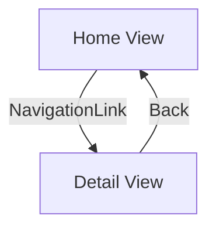

## 12.6 Navigation Patterns

Navigating between different views is a fundamental aspect of any application, and SwiftUI provides a rich set of tools to manage navigation efficiently. In this section, we will explore various navigation patterns in SwiftUI, including stack-based navigation with `NavigationView` and `NavigationLink`, programmatic navigation using state variables, and modal presentations with sheets and full-screen covers. By mastering these patterns, you can build intuitive and seamless navigation experiences in your Swift applications.

### NavigationView and NavigationLink

SwiftUI's `NavigationView` and `NavigationLink` are the primary tools for implementing stack-based navigation. They allow developers to push and pop views in a manner similar to the navigation controllers in UIKit.

#### Stack-Based Navigation: Pushing and Popping Views

The `NavigationView` acts as a container that manages a stack of views. Within this container, `NavigationLink` is used to define the transition from one view to another. Let's explore how these components work together.

```swift
import SwiftUI

struct ContentView: View {
    var body: some View {
        NavigationView {
            VStack {
                Text("Home View")
                    .font(.largeTitle)
                    .padding()

                NavigationLink(destination: DetailView()) {
                    Text("Go to Detail View")
                        .foregroundColor(.blue)
                        .padding()
                        .background(Color.gray.opacity(0.2))
                        .cornerRadius(8)
                }
            }
            .navigationTitle("Home")
        }
    }
}

struct DetailView: View {
    var body: some View {
        Text("Detail View")
            .font(.largeTitle)
            .navigationTitle("Detail")
    }
}
```

In this example, `NavigationView` wraps the `VStack` containing a `Text` and a `NavigationLink`. The `NavigationLink` specifies a destination view (`DetailView`), and tapping the link pushes the `DetailView` onto the navigation stack.

#### Customization: Modifying Navigation Bar Appearance

SwiftUI allows customization of the navigation bar to enhance the user interface. You can modify the title, add buttons, or change the appearance using the `navigationBarItems` and `navigationBarTitleDisplayMode` modifiers.

```swift
import SwiftUI

struct CustomNavigationView: View {
    var body: some View {
        NavigationView {
            VStack {
                Text("Custom Navigation")
                    .font(.largeTitle)
                    .padding()

                NavigationLink(destination: AnotherView()) {
                    Text("Navigate")
                        .foregroundColor(.white)
                        .padding()
                        .background(Color.blue)
                        .cornerRadius(8)
                }
            }
            .navigationTitle("Custom View")
            .navigationBarTitleDisplayMode(.inline)
            .navigationBarItems(leading: Button(action: {
                print("Leading button tapped")
            }) {
                Image(systemName: "bell")
            }, trailing: Button(action: {
                print("Trailing button tapped")
            }) {
                Image(systemName: "gear")
            })
        }
    }
}

struct AnotherView: View {
    var body: some View {
        Text("Another View")
            .font(.largeTitle)
            .navigationTitle("Another")
    }
}
```

In this code, we customize the navigation bar by adding leading and trailing buttons. The `navigationBarTitleDisplayMode(.inline)` modifier sets the title to be displayed inline.

### Programmatic Navigation

While `NavigationLink` provides a declarative way to navigate, there are scenarios where programmatic navigation is more suitable, such as navigating based on user interactions or state changes.

#### Using State Variables: Controlling Navigation with Boolean Flags

You can use state variables to control navigation programmatically. By binding a `NavigationLink` to a boolean state, you can trigger navigation based on conditions.

```swift
import SwiftUI

struct ProgrammaticNavigationView: View {
    @State private var isActive = false

    var body: some View {
        NavigationView {
            VStack {
                Text("Programmatic Navigation")
                    .font(.largeTitle)
                    .padding()

                Button(action: {
                    isActive = true
                }) {
                    Text("Navigate Programmatically")
                        .foregroundColor(.white)
                        .padding()
                        .background(Color.green)
                        .cornerRadius(8)
                }

                NavigationLink(destination: TargetView(), isActive: $isActive) {
                    EmptyView()
                }
            }
            .navigationTitle("Programmatic")
        }
    }
}

struct TargetView: View {
    var body: some View {
        Text("Target View")
            .font(.largeTitle)
            .navigationTitle("Target")
    }
}
```

Here, a `Button` changes the `isActive` state to `true`, which programmatically triggers the navigation to `TargetView`.

#### Routes and Paths: Defining Navigation Paths

In complex applications, managing navigation paths can become challenging. SwiftUI allows you to define routes and paths, making it easier to manage navigation state.

```swift
import SwiftUI

enum Route {
    case home
    case detail
    case settings
}

struct Router: View {
    @State private var currentRoute: Route? = .home

    var body: some View {
        NavigationView {
            VStack {
                if currentRoute == .home {
                    HomeView(currentRoute: $currentRoute)
                } else if currentRoute == .detail {
                    DetailView(currentRoute: $currentRoute)
                } else if currentRoute == .settings {
                    SettingsView(currentRoute: $currentRoute)
                }
            }
        }
    }
}

struct HomeView: View {
    @Binding var currentRoute: Route?

    var body: some View {
        VStack {
            Text("Home View")
                .font(.largeTitle)

            Button("Go to Detail") {
                currentRoute = .detail
            }

            Button("Go to Settings") {
                currentRoute = .settings
            }
        }
    }
}

struct DetailView: View {
    @Binding var currentRoute: Route?

    var body: some View {
        VStack {
            Text("Detail View")
                .font(.largeTitle)

            Button("Back to Home") {
                currentRoute = .home
            }
        }
    }
}

struct SettingsView: View {
    @Binding var currentRoute: Route?

    var body: some View {
        VStack {
            Text("Settings View")
                .font(.largeTitle)

            Button("Back to Home") {
                currentRoute = .home
            }
        }
    }
}
```

This approach uses an enum to define possible routes and a `Router` view to manage navigation based on the current route.

### Modal Presentation

Modal presentations are a common way to present content in a separate context. SwiftUI provides `sheet` and `fullScreenCover` modifiers for presenting views modally.

#### Sheets: Presenting Views Modally

The `sheet` modifier presents a view modally over the current view. It's useful for presenting temporary content that requires user interaction.

```swift
import SwiftUI

struct SheetExampleView: View {
    @State private var showModal = false

    var body: some View {
        VStack {
            Text("Main View")
                .font(.largeTitle)

            Button("Show Modal") {
                showModal.toggle()
            }
        }
        .sheet(isPresented: $showModal) {
            ModalView()
        }
    }
}

struct ModalView: View {
    var body: some View {
        VStack {
            Text("Modal View")
                .font(.largeTitle)

            Button("Dismiss") {
                // Dismiss logic here
            }
        }
    }
}
```

In this example, tapping the "Show Modal" button presents the `ModalView` as a sheet. The `sheet` modifier binds to the `showModal` state to control the presentation.

#### FullScreenCover: Presenting Full-Screen Modals

The `fullScreenCover` modifier is similar to `sheet`, but it presents the view in a full-screen mode, which is useful for immersive experiences.

```swift
import SwiftUI

struct FullScreenExampleView: View {
    @State private var showFullScreen = false

    var body: some View {
        VStack {
            Text("Full Screen Example")
                .font(.largeTitle)

            Button("Show Full Screen") {
                showFullScreen.toggle()
            }
        }
        .fullScreenCover(isPresented: $showFullScreen) {
            FullScreenModalView()
        }
    }
}

struct FullScreenModalView: View {
    var body: some View {
        VStack {
            Text("Full Screen Modal")
                .font(.largeTitle)

            Button("Dismiss") {
                // Dismiss logic here
            }
        }
    }
}
```

Here, the "Show Full Screen" button triggers the `fullScreenCover`, presenting `FullScreenModalView` in full-screen mode.

### Try It Yourself

Experiment with the code examples provided by modifying them to suit different scenarios. Try adding additional views, customizing navigation bar items, or implementing complex navigation paths. This hands-on approach will deepen your understanding of SwiftUI navigation patterns.

### Visualizing Navigation Patterns

Below is a diagram illustrating the flow of stack-based navigation using `NavigationView` and `NavigationLink`.



This diagram represents a simple stack-based navigation flow where the user navigates from the Home View to the Detail View and can return to the Home View.

### References and Links

For more in-depth information on SwiftUI navigation patterns, consider the following resources:

- [Apple's SwiftUI Documentation](https://developer.apple.com/documentation/swiftui)
- [Swift by Sundell: Navigation in SwiftUI](https://www.swiftbysundell.com/articles/navigation-in-swiftui/)
- [Hacking with Swift: SwiftUI Navigation](https://www.hackingwithswift.com/quick-start/swiftui/swiftui-navigation)

### Knowledge Check

Reflect on the following questions to reinforce your understanding:

- What are the key differences between `sheet` and `fullScreenCover`?
- How can you customize the appearance of a navigation bar in SwiftUI?
- In what scenarios would programmatic navigation be more suitable than using `NavigationLink`?

### Embrace the Journey

Remember, mastering navigation patterns in SwiftUI is a journey. As you explore these patterns, you'll gain the skills to create seamless and intuitive navigation experiences in your applications. Keep experimenting, stay curious, and enjoy the process of learning and building with SwiftUI.

## Quiz Time!



### What is the primary purpose of `NavigationView` in SwiftUI?

- [x] To manage a stack of views for navigation.
- [ ] To customize the appearance of buttons.
- [ ] To handle user input events.
- [ ] To manage data persistence.

> **Explanation:** `NavigationView` is used to manage a stack of views, enabling navigation between them in a stack-based manner.

### How can you present a view modally in SwiftUI?

- [ ] Using `NavigationLink`.
- [x] Using `sheet`.
- [x] Using `fullScreenCover`.
- [ ] Using `NavigationView`.

> **Explanation:** `sheet` and `fullScreenCover` are used to present views modally in SwiftUI.

### Which modifier is used to customize the title display mode in a navigation bar?

- [ ] `sheet`
- [ ] `fullScreenCover`
- [x] `navigationBarTitleDisplayMode`
- [ ] `navigationBarItems`

> **Explanation:** `navigationBarTitleDisplayMode` is used to set how the title is displayed in the navigation bar.

### What is a common use case for programmatic navigation in SwiftUI?

- [ ] To always navigate to the same view.
- [ ] To display static content.
- [x] To navigate based on user interactions or state changes.
- [ ] To manage data storage.

> **Explanation:** Programmatic navigation is often used to navigate based on user interactions or changes in application state.

### What is the difference between `sheet` and `fullScreenCover`?

- [x] `sheet` presents a view modally, while `fullScreenCover` presents it in full-screen mode.
- [ ] `sheet` is used for navigation, while `fullScreenCover` is not.
- [ ] `fullScreenCover` is used for navigation, while `sheet` is not.
- [ ] There is no difference.

> **Explanation:** `sheet` presents a view modally over the current view, whereas `fullScreenCover` presents it in full-screen mode.

### How can you add buttons to a navigation bar in SwiftUI?

- [ ] Using `NavigationLink`.
- [ ] Using `sheet`.
- [x] Using `navigationBarItems`.
- [ ] Using `fullScreenCover`.

> **Explanation:** `navigationBarItems` is used to add buttons to the navigation bar.

### What is the role of `NavigationLink` in SwiftUI?

- [x] To define transitions between views within a `NavigationView`.
- [ ] To manage data persistence.
- [ ] To handle user input events.
- [ ] To customize view appearance.

> **Explanation:** `NavigationLink` is used to define transitions between views within a `NavigationView`.

### In which scenarios would you choose `fullScreenCover` over `sheet`?

- [ ] When you want to display a small amount of content.
- [x] When you want a more immersive, full-screen experience.
- [ ] When you need to manage data storage.
- [ ] When you want to customize the navigation bar.

> **Explanation:** `fullScreenCover` is chosen for immersive experiences where the entire screen is needed.

### What is the benefit of using state variables for navigation?

- [ ] To manage data storage.
- [x] To control navigation programmatically based on conditions.
- [ ] To customize view appearance.
- [ ] To handle user input events.

> **Explanation:** State variables allow for programmatic control of navigation based on conditions or user interactions.

### True or False: `NavigationView` is necessary for using `sheet` or `fullScreenCover`.

- [ ] True
- [x] False

> **Explanation:** `NavigationView` is not necessary for using `sheet` or `fullScreenCover`; they can be used independently to present views modally.


