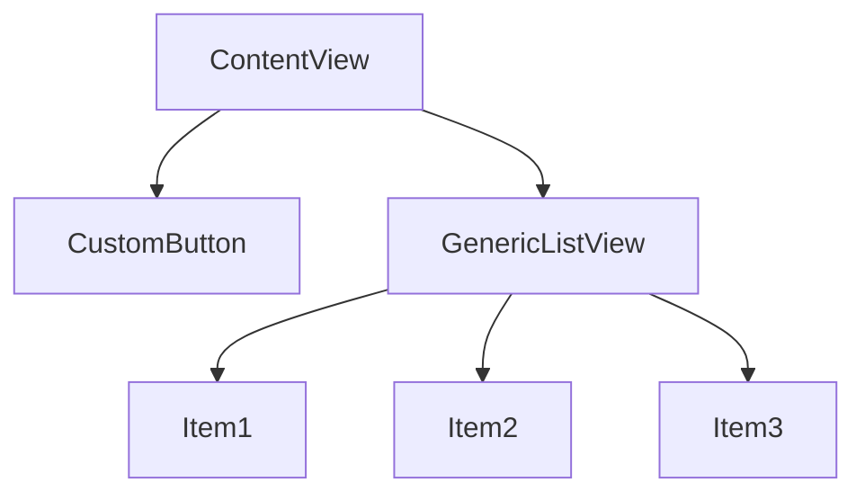

## 12.7 View Composition and Reusable Components

In the world of SwiftUI, view composition and reusable components are fundamental concepts that empower developers to build efficient, scalable, and maintainable applications. By mastering these techniques, you can create custom views that not only enhance the user interface but also streamline the development process. In this section, we'll explore how to build custom views using view structs, leverage generics and protocols for flexibility, utilize modifiers and extensions to encapsulate view modifications, and adhere to best practices such as single responsibility and parameterization.

### Building Custom Views

#### View Structs: Defining Reusable Views

In SwiftUI, views are typically defined using structs that conform to the `View` protocol. This approach allows for lightweight, efficient, and easily composable views. By defining views as structs, we can harness the power of Swift's value types, ensuring that our views are immutable and thread-safe.

**Example: Creating a Simple Custom View**

```swift
import SwiftUI

struct CustomButton: View {
    var title: String
    var action: () -> Void

    var body: some View {
        Button(action: action) {
            Text(title)
                .font(.headline)
                .padding()
                .background(Color.blue)
                .foregroundColor(.white)
                .cornerRadius(8)
        }
    }
}
```

In this example, `CustomButton` is a reusable view that takes a title and an action as parameters. This encapsulation allows us to create buttons with consistent styling throughout our app.

#### Generics and Protocols: Creating Flexible Components

Generics and protocols are powerful features in Swift that enable us to create flexible and reusable components. By using generics, we can define components that work with any data type, while protocols allow us to define a set of requirements that types must conform to.

**Example: A Generic List View**

```swift
import SwiftUI

struct GenericListView<Item: Identifiable, Content: View>: View {
    var items: [Item]
    var content: (Item) -> Content

    var body: some View {
        List(items) { item in
            self.content(item)
        }
    }
}
```

In this example, `GenericListView` is a reusable component that can display a list of any identifiable items. The `content` closure allows us to define how each item should be displayed, making this component highly flexible.

### Modifiers and Extensions

#### Custom Modifiers: Encapsulating View Modifications

Modifiers in SwiftUI are used to change the appearance or behavior of a view. By creating custom modifiers, we can encapsulate complex view modifications and apply them consistently across different views.

**Example: A Custom Shadow Modifier**

```swift
import SwiftUI

struct ShadowModifier: ViewModifier {
    func body(content: Content) -> some View {
        content
            .shadow(color: .gray, radius: 5, x: 0, y: 2)
    }
}

extension View {
    func customShadow() -> some View {
        self.modifier(ShadowModifier())
    }
}
```

In this example, `ShadowModifier` is a custom view modifier that adds a shadow to any view. By extending the `View` protocol with the `customShadow` function, we can easily apply this modifier to any view.

#### View Extensions: Adding Functions to the `View` Protocol

Extensions allow us to add new functionality to existing types. By extending the `View` protocol, we can create reusable functions that can be applied to any view.

**Example: Adding a Border Function**

```swift
import SwiftUI

extension View {
    func bordered(color: Color, width: CGFloat) -> some View {
        self.overlay(
            RoundedRectangle(cornerRadius: 8)
                .stroke(color, lineWidth: width)
        )
    }
}
```

In this example, we extend the `View` protocol with a `bordered` function that adds a border to any view. This function can be used to apply consistent styling across different views.

### Best Practices

#### Single Responsibility: Each View Handles One Piece of Functionality

Adhering to the single responsibility principle ensures that each view is responsible for one piece of functionality. This approach leads to cleaner, more maintainable code and makes it easier to reuse views in different contexts.

**Example: Separating Logic from Presentation**

Instead of embedding business logic within a view, separate it into a view model or a separate component. This separation allows the view to focus solely on presentation.

```swift
import SwiftUI

struct ContentView: View {
    @ObservedObject var viewModel: ContentViewModel

    var body: some View {
        VStack {
            Text(viewModel.title)
            Button("Fetch Data") {
                viewModel.fetchData()
            }
        }
    }
}

class ContentViewModel: ObservableObject {
    @Published var title: String = "Initial Title"

    func fetchData() {
        // Fetch data and update title
        self.title = "Updated Title"
    }
}
```

#### Parameterization: Making Views Configurable Through Parameters

Parameterization involves making views configurable through parameters, allowing them to be reused in different contexts with different configurations.

**Example: Configurable Button**

```swift
import SwiftUI

struct ConfigurableButton: View {
    var title: String
    var backgroundColor: Color
    var action: () -> Void

    var body: some View {
        Button(action: action) {
            Text(title)
                .padding()
                .background(backgroundColor)
                .foregroundColor(.white)
                .cornerRadius(8)
        }
    }
}
```

In this example, `ConfigurableButton` is a reusable button that can be configured with a title and background color, making it adaptable to different use cases.

### Visualizing View Composition

To better understand how view composition works in SwiftUI, let's visualize the hierarchy of a composed view using a diagram.



**Diagram Description:** This diagram illustrates a `ContentView` that contains a `CustomButton` and a `GenericListView`. The `GenericListView` displays multiple items, demonstrating how views can be composed to create complex interfaces.

### Try It Yourself

Now that we've covered the basics of view composition and reusable components, try experimenting with the code examples provided. Modify the `CustomButton` to include an icon, or extend the `GenericListView` to support section headers. By experimenting with these components, you'll gain a deeper understanding of how to build efficient and scalable views in SwiftUI.

### Knowledge Check

- Explain the benefits of using view structs for defining reusable views.
- Demonstrate how generics and protocols can be used to create flexible components.
- Provide an example of a custom view modifier and explain its purpose.
- Describe the single responsibility principle and its importance in view composition.
- Explain how parameterization can make views more reusable.

### Embrace the Journey

Remember, mastering view composition and reusable components is just the beginning. As you progress, you'll build more complex and interactive user interfaces. Keep experimenting, stay curious, and enjoy the journey!

## Quiz Time!



### What is the primary advantage of using view structs in SwiftUI?

- [x] They are lightweight and efficient.
- [ ] They allow for dynamic memory allocation.
- [ ] They enable runtime type checking.
- [ ] They are mutable and thread-safe.

> **Explanation:** View structs in SwiftUI are lightweight and efficient, leveraging Swift's value type system to ensure immutability and thread safety.

### How can generics enhance the flexibility of a SwiftUI component?

- [x] By allowing the component to work with any data type.
- [ ] By enabling dynamic dispatch.
- [ ] By providing automatic memory management.
- [ ] By enforcing strict type constraints.

> **Explanation:** Generics allow SwiftUI components to work with any data type, enhancing flexibility and reusability.

### What is the purpose of a custom view modifier in SwiftUI?

- [x] To encapsulate complex view modifications.
- [ ] To create new view types.
- [ ] To manage view lifecycle events.
- [ ] To perform network requests.

> **Explanation:** Custom view modifiers encapsulate complex view modifications, allowing for consistent styling and behavior across views.

### Which principle ensures that each view handles one piece of functionality?

- [x] Single Responsibility Principle.
- [ ] Open/Closed Principle.
- [ ] Dependency Inversion Principle.
- [ ] Interface Segregation Principle.

> **Explanation:** The Single Responsibility Principle ensures that each view handles one piece of functionality, leading to cleaner and more maintainable code.

### What is a key benefit of parameterizing views in SwiftUI?

- [x] It makes views more reusable and configurable.
- [ ] It reduces compile-time errors.
- [ ] It improves runtime performance.
- [ ] It simplifies memory management.

> **Explanation:** Parameterizing views makes them more reusable and configurable, allowing them to adapt to different contexts and requirements.

### How can extensions enhance the functionality of SwiftUI views?

- [x] By adding new methods and properties to existing view types.
- [ ] By creating new view hierarchies.
- [ ] By managing view state.
- [ ] By performing asynchronous tasks.

> **Explanation:** Extensions add new methods and properties to existing view types, enhancing their functionality without modifying the original type.

### What is the role of protocols in creating reusable SwiftUI components?

- [x] They define a set of requirements that types must conform to.
- [ ] They allow for dynamic memory allocation.
- [ ] They enable runtime type checking.
- [ ] They enforce strict type constraints.

> **Explanation:** Protocols define a set of requirements that types must conform to, facilitating the creation of reusable and flexible components.

### What does the `@ObservedObject` property wrapper do in SwiftUI?

- [x] It observes changes to an object and updates the view accordingly.
- [ ] It manages memory allocation for the object.
- [ ] It performs network requests on behalf of the object.
- [ ] It provides automatic type inference for the object.

> **Explanation:** The `@ObservedObject` property wrapper observes changes to an object and updates the view accordingly, ensuring that the UI reflects the current state of the data.

### How can custom view modifiers improve code readability in SwiftUI?

- [x] By encapsulating styling and behavior into reusable components.
- [ ] By reducing the number of lines of code.
- [ ] By improving runtime performance.
- [ ] By enforcing strict type constraints.

> **Explanation:** Custom view modifiers encapsulate styling and behavior into reusable components, improving code readability and maintainability.

### True or False: In SwiftUI, views are typically defined using classes.

- [ ] True
- [x] False

> **Explanation:** In SwiftUI, views are typically defined using structs, not classes. This approach leverages Swift's value type system for efficiency and immutability.


