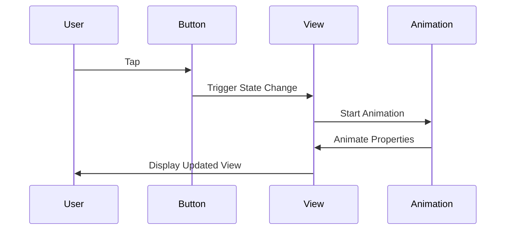

## 12.8 Animations and Transitions

Animations and transitions in SwiftUI are powerful tools that can bring your applications to life. They not only enhance the user experience by providing visual feedback but also make your app more engaging and intuitive. In this section, we will delve into the various aspects of animations and transitions in SwiftUI, including animatable properties, implicit and explicit animations, built-in and custom transitions, and techniques for synchronizing animations.

### Animatable Properties

In SwiftUI, animations are driven by changes in state. When a state change occurs, SwiftUI automatically animates any changes to animatable properties. These properties include positions, sizes, colors, and more. By leveraging these properties, you can create smooth and dynamic animations with minimal effort.

#### Implicit Animations

Implicit animations in SwiftUI are the simplest way to add animations to your views. By using the `.animation()` modifier, you can specify how changes to animatable properties should be animated.

```swift
import SwiftUI

struct ImplicitAnimationView: View {
    @State private var isScaled = false

    var body: some View {
        VStack {
            Circle()
                .fill(Color.blue)
                .frame(width: 100, height: 100)
                .scaleEffect(isScaled ? 1.5 : 1.0)
                .animation(.easeInOut(duration: 1.0), value: isScaled)
            
            Button("Toggle Scale") {
                isScaled.toggle()
            }
        }
    }
}
```

In this example, the circle's scale is animated whenever the `isScaled` state changes. The `.animation()` modifier specifies an ease-in-out animation with a duration of 1 second.

#### Explicit Animations

For more control over your animations, SwiftUI provides explicit animations using `withAnimation` blocks. This approach allows you to animate multiple properties simultaneously or perform complex animations.

```swift
import SwiftUI

struct ExplicitAnimationView: View {
    @State private var isRotated = false

    var body: some View {
        VStack {
            Rectangle()
                .fill(Color.green)
                .frame(width: 100, height: 100)
                .rotationEffect(.degrees(isRotated ? 180 : 0))
            
            Button("Toggle Rotation") {
                withAnimation(.spring(response: 0.5, dampingFraction: 0.5, blendDuration: 0)) {
                    isRotated.toggle()
                }
            }
        }
    }
}
```

Here, the rectangle's rotation is explicitly animated using a spring animation, providing a bouncy effect when the button is tapped.

### Transitions

Transitions in SwiftUI define how a view appears and disappears. They can be applied to views using the `.transition()` modifier, which specifies the visual effect to use when a view is inserted or removed from the hierarchy.

#### Built-in Transitions

SwiftUI offers several built-in transitions, such as slide, opacity, and scale. These transitions can be easily applied to views to create smooth entry and exit animations.

```swift
import SwiftUI

struct BuiltInTransitionView: View {
    @State private var isVisible = false

    var body: some View {
        VStack {
            if isVisible {
                Text("Hello, SwiftUI!")
                    .padding()
                    .background(Color.yellow)
                    .transition(.slide)
            }
            
            Button("Toggle Visibility") {
                withAnimation {
                    isVisible.toggle()
                }
            }
        }
    }
}
```

In this example, the text view slides in and out of view when the button is pressed, thanks to the `.slide` transition.

#### Custom Transitions

For more complex animations, you can create custom transitions by combining existing transitions or defining new ones using `AnyTransition`.

```swift
import SwiftUI

extension AnyTransition {
    static var customTransition: AnyTransition {
        AnyTransition.scale.combined(with: .opacity)
    }
}

struct CustomTransitionView: View {
    @State private var isVisible = false

    var body: some View {
        VStack {
            if isVisible {
                Text("Custom Transition!")
                    .padding()
                    .background(Color.purple)
                    .transition(.customTransition)
            }
            
            Button("Toggle Visibility") {
                withAnimation {
                    isVisible.toggle()
                }
            }
        }
    }
}
```

This example demonstrates a custom transition that combines scaling and opacity changes for a unique visual effect.

### Synchronizing Animations

Synchronizing animations involves coordinating multiple animations to occur simultaneously or in a specific sequence. This can enhance the overall user experience by creating cohesive and polished animations.

#### Animation Stacks

Animation stacks allow you to combine multiple animations into a single cohesive effect. By nesting animations, you can create complex sequences that appear smooth and natural.

```swift
import SwiftUI

struct AnimationStackView: View {
    @State private var isExpanded = false

    var body: some View {
        VStack {
            RoundedRectangle(cornerRadius: 25)
                .fill(Color.orange)
                .frame(width: isExpanded ? 200 : 100, height: isExpanded ? 200 : 100)
                .animation(.easeInOut(duration: 0.5), value: isExpanded)
                .rotationEffect(.degrees(isExpanded ? 45 : 0))
                .animation(.easeInOut(duration: 0.5), value: isExpanded)
            
            Button("Toggle Expansion") {
                isExpanded.toggle()
            }
        }
    }
}
```

In this example, the rectangle's size and rotation are animated simultaneously, creating a smooth expansion effect.

#### Timing and Curves

Customizing animation timing and curves allows you to fine-tune the pacing and feel of your animations. SwiftUI provides several predefined timing curves, such as `.easeIn`, `.easeOut`, and `.linear`, as well as the ability to define custom curves.

```swift
import SwiftUI

struct TimingAndCurvesView: View {
    @State private var isMoved = false

    var body: some View {
        VStack {
            Circle()
                .fill(Color.red)
                .frame(width: 50, height: 50)
                .offset(x: isMoved ? 150 : -150)
                .animation(Animation.timingCurve(0.5, 0.1, 0.1, 1, duration: 1), value: isMoved)
            
            Button("Toggle Move") {
                isMoved.toggle()
            }
        }
    }
}
```

This code snippet demonstrates the use of a custom timing curve to control the movement of a circle.

### Visualizing Animation Flow

To better understand how animations and transitions flow in your application, let's visualize the process using a sequence diagram.



This diagram illustrates the interaction between the user, button, view, and animation during an animation sequence.

### Try It Yourself

Experiment with the code examples provided above. Try changing the animation types, durations, and curves to see how they affect the animations. You can also create your own custom transitions or synchronize multiple animations to achieve unique effects.

### Knowledge Check

- What are implicit animations, and how are they applied in SwiftUI?
- How do explicit animations differ from implicit animations?
- Name some built-in transitions available in SwiftUI.
- How can you create a custom transition in SwiftUI?
- What is the purpose of animation stacks?
- How can timing and curves be customized in SwiftUI animations?

### Summary

In this section, we explored the powerful animation and transition capabilities of SwiftUI. We covered animatable properties, implicit and explicit animations, built-in and custom transitions, and techniques for synchronizing animations. By mastering these concepts, you can create engaging and dynamic user interfaces that enhance the overall user experience.

Remember, this is just the beginning. As you progress, you'll build more complex and interactive animations. Keep experimenting, stay curious, and enjoy the journey!

## Quiz Time!



### What are implicit animations in SwiftUI?

- [x] Animations applied automatically to animatable properties when state changes
- [ ] Animations defined using `withAnimation` blocks
- [ ] Animations that require manual triggering
- [ ] Animations that do not involve state changes

> **Explanation:** Implicit animations are automatically applied to animatable properties when their state changes, using the `.animation()` modifier.

### How do explicit animations differ from implicit animations?

- [x] Explicit animations use `withAnimation` blocks for more control
- [ ] Explicit animations are automatically applied
- [ ] Explicit animations cannot animate multiple properties
- [ ] Explicit animations are only for built-in transitions

> **Explanation:** Explicit animations provide more control over the animation process using `withAnimation` blocks, allowing for complex animations.

### Which of the following is a built-in transition in SwiftUI?

- [x] Slide
- [ ] Fade
- [ ] Flip
- [ ] Zoom

> **Explanation:** Slide is one of the built-in transitions provided by SwiftUI.

### How can you create a custom transition in SwiftUI?

- [x] By combining existing transitions using `AnyTransition`
- [ ] By using only built-in transitions
- [ ] By modifying the view's layout
- [ ] By changing the view's background color

> **Explanation:** Custom transitions can be created by combining existing transitions with `AnyTransition`.

### What is the purpose of animation stacks?

- [x] To combine multiple animations into a cohesive effect
- [ ] To animate only one property at a time
- [ ] To prevent animations from occurring
- [ ] To apply animations without state changes

> **Explanation:** Animation stacks allow multiple animations to be combined into a single cohesive effect.

### How can timing and curves be customized in SwiftUI animations?

- [x] By using predefined timing curves or defining custom ones
- [ ] By only using linear timing
- [ ] By changing the view's color
- [ ] By modifying the view's frame

> **Explanation:** Timing and curves can be customized using predefined timing curves or by defining custom ones.

### What is the `.animation()` modifier used for?

- [x] Applying implicit animations to animatable properties
- [ ] Defining explicit animations
- [ ] Creating custom transitions
- [ ] Modifying the view's layout

> **Explanation:** The `.animation()` modifier is used to apply implicit animations to animatable properties.

### Which method allows for more control over animations?

- [x] `withAnimation` blocks
- [ ] `.animation()` modifier
- [ ] `.transition()` modifier
- [ ] `.opacity()` modifier

> **Explanation:** `withAnimation` blocks provide more control over animations compared to the `.animation()` modifier.

### What is the role of `AnyTransition` in SwiftUI?

- [x] To define custom transitions by combining existing ones
- [ ] To apply only built-in transitions
- [ ] To modify view properties
- [ ] To animate view colors

> **Explanation:** `AnyTransition` is used to define custom transitions by combining existing ones.

### True or False: Implicit animations in SwiftUI require manual triggering.

- [ ] True
- [x] False

> **Explanation:** False. Implicit animations in SwiftUI are automatically applied when animatable properties change state.


