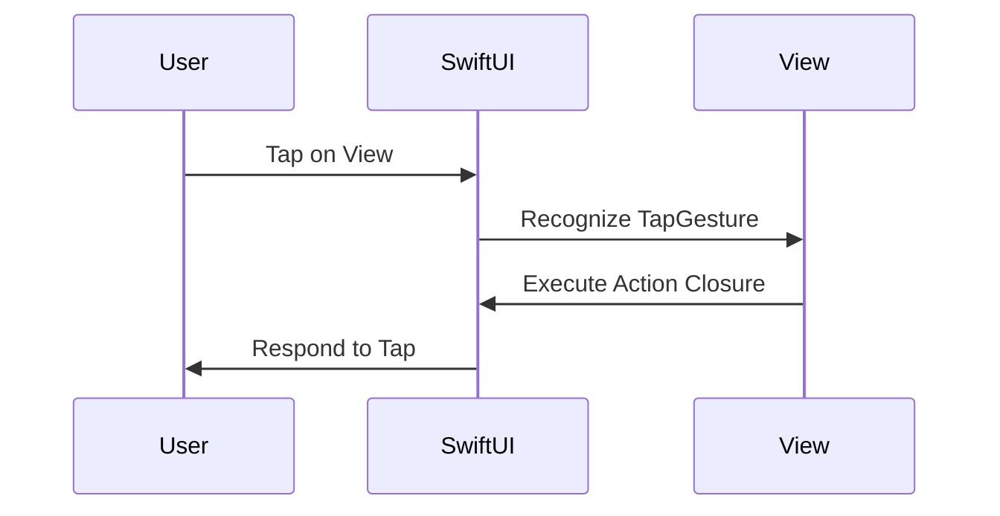

## 12.9 Handling User Input and Gestures

Handling user input and gestures effectively is crucial for creating interactive and user-friendly applications in SwiftUI. This section explores various interactive controls, gesture recognizers, and event handling mechanisms that SwiftUI offers, empowering developers to build responsive and engaging user interfaces.

### Interactive Controls

Interactive controls are the building blocks of any user interface. In SwiftUI, these controls are designed to be both powerful and easy to use, providing a seamless way to capture user input.

#### Buttons, Sliders, and Toggles

SwiftUI offers a variety of standard controls to capture user input:

- **Buttons**: Used to trigger actions when tapped.
- **Sliders**: Allow users to select a value from a continuous range.
- **Toggles**: Enable users to switch between two states.

Let's explore each of these controls with examples.

##### Buttons

Buttons are fundamental interactive elements in any app. In SwiftUI, a button is created using the `Button` view, which takes a label and an action closure.

```swift
Button(action: {
    print("Button tapped!")
}) {
    Text("Tap Me")
}
```

In this example, the button displays the text "Tap Me" and prints a message to the console when tapped.

##### Sliders

Sliders are used to select a value from a range. They are particularly useful for settings like volume or brightness.

```swift
@State private var sliderValue: Double = 0.5

Slider(value: $sliderValue, in: 0...1)
    .padding()
```

Here, the slider's value is bound to a state variable `sliderValue`, allowing the UI to update as the user interacts with it.

##### Toggles

Toggles provide a simple way to switch between two states, such as on/off or true/false.

```swift
@State private var isOn: Bool = true

Toggle(isOn: $isOn) {
    Text("Enable Feature")
}
.padding()
```

The toggle's state is managed by the `isOn` variable, which updates automatically as the toggle is switched.

### TextFields: Capturing Textual Input

TextFields are essential for capturing user input in the form of text. They are commonly used for forms, search bars, and input fields.

```swift
@State private var textInput: String = ""

TextField("Enter your name", text: $textInput)
    .textFieldStyle(RoundedBorderTextFieldStyle())
    .padding()
```

In this example, the `TextField` is bound to the `textInput` variable, which updates as the user types.

### Gestures

Gestures allow users to interact with the app using touch-based input. SwiftUI provides a rich set of gesture recognizers that can be combined to create complex interactions.

#### TapGesture, DragGesture, etc.

SwiftUI supports various gestures, such as tap, drag, long press, and more.

##### TapGesture

A `TapGesture` is recognized when the user taps the screen. It can be used to trigger actions or change the view's state.

```swift
Text("Tap me")
    .onTapGesture {
        print("Text tapped!")
    }
```

##### DragGesture

A `DragGesture` allows users to move elements around the screen.

```swift
@State private var offset = CGSize.zero

Text("Drag me")
    .offset(offset)
    .gesture(
        DragGesture()
            .onChanged { gesture in
                offset = gesture.translation
            }
            .onEnded { _ in
                offset = .zero
            }
    )
```

In this example, the text can be dragged around the screen, and it returns to its original position when the drag ends.

#### Gesture Composition

Gesture composition involves combining multiple gestures to create more sophisticated interactions.

```swift
@State private var isLongPressed = false

Text("Long Press and Tap")
    .padding()
    .background(isLongPressed ? Color.green : Color.gray)
    .gesture(
        LongPressGesture(minimumDuration: 1)
            .onEnded { _ in
                isLongPressed.toggle()
            }
            .simultaneously(with:
                TapGesture()
                    .onEnded {
                        print("Tapped while long pressing")
                    }
            )
    )
```

In this example, a `LongPressGesture` is combined with a `TapGesture`. The background color changes on a long press, and a message is printed if tapped during the long press.

### Event Handling

Event handling in SwiftUI involves responding to user actions and updating the view state accordingly.

#### Action Closures

Action closures are used to define what happens when a user interacts with a control.

```swift
Button(action: {
    print("Button tapped!")
}) {
    Text("Tap Me")
}
```

The action closure here defines the logic that executes when the button is tapped.

#### Updating State

SwiftUI's state management system allows views to update dynamically based on user input. By binding controls to state variables, you ensure that the UI reflects the current state.

```swift
@State private var isOn: Bool = false

Toggle(isOn: $isOn) {
    Text(isOn ? "Enabled" : "Disabled")
}
```

In this example, the text next to the toggle updates based on the toggle's state.

### Visualizing Gesture Recognition

To better understand how gestures work in SwiftUI, let's visualize the process of recognizing a tap gesture.



This diagram illustrates the sequence of events when a user taps a view. SwiftUI recognizes the gesture, executes the associated action, and updates the UI accordingly.

### Try It Yourself

Experiment with the following code snippets to deepen your understanding:

1. Modify the `Slider` example to change the background color of a view based on the slider's value.
2. Combine a `DragGesture` with a `TapGesture` to create a draggable view that changes color when tapped.
3. Implement a `TextField` that validates input and displays an error message if the input is invalid.

### References and Links

- [Apple Developer Documentation: SwiftUI](https://developer.apple.com/documentation/swiftui)
- [SwiftUI Tutorials](https://developer.apple.com/tutorials/swiftui)
- [Hacking with Swift: SwiftUI by Example](https://www.hackingwithswift.com/quick-start/swiftui)

### Knowledge Check

- What are the main interactive controls available in SwiftUI?
- How do you use a `DragGesture` to move a view?
- What is the purpose of gesture composition in SwiftUI?
- How does SwiftUI handle state updates based on user input?

### Embrace the Journey

Remember, mastering user input and gestures in SwiftUI is a journey. As you experiment and build more complex interactions, you'll gain a deeper understanding of how to create intuitive and engaging user experiences. Keep exploring, stay curious, and enjoy the process!

## Quiz Time!



### What is the primary use of a `Button` in SwiftUI?

- [x] To trigger an action when tapped
- [ ] To display static text
- [ ] To capture textual input
- [ ] To provide a slider control

> **Explanation:** A `Button` in SwiftUI is used to trigger an action when tapped by the user.

### How can you capture textual input in SwiftUI?

- [ ] Using a `Button`
- [x] Using a `TextField`
- [ ] Using a `Slider`
- [ ] Using a `Toggle`

> **Explanation:** A `TextField` is used in SwiftUI to capture textual input from the user.

### Which gesture allows users to move elements around the screen?

- [ ] TapGesture
- [x] DragGesture
- [ ] LongPressGesture
- [ ] PinchGesture

> **Explanation:** A `DragGesture` is used to allow users to move elements around the screen.

### What is gesture composition?

- [ ] Combining multiple views into one
- [x] Combining multiple gestures for complex interactions
- [ ] Using gestures to animate views
- [ ] Creating a new gesture from scratch

> **Explanation:** Gesture composition involves combining multiple gestures to create complex interactions.

### How do you update a view's state based on user input?

- [x] By binding controls to state variables
- [ ] By using static properties
- [ ] By hardcoding values
- [ ] By using immutable variables

> **Explanation:** In SwiftUI, you update a view's state based on user input by binding controls to state variables.

### What is the purpose of action closures in SwiftUI?

- [x] To define what happens when a user interacts with a control
- [ ] To initialize views
- [ ] To style views
- [ ] To manage memory

> **Explanation:** Action closures in SwiftUI are used to define what happens when a user interacts with a control.

### Which of the following is a standard control for user input in SwiftUI?

- [x] Slider
- [ ] Image
- [ ] Rectangle
- [ ] Spacer

> **Explanation:** A `Slider` is a standard control for user input in SwiftUI, allowing users to select a value from a range.

### What does a `Toggle` control do?

- [x] Switches between two states
- [ ] Captures textual input
- [ ] Displays images
- [ ] Triggers animations

> **Explanation:** A `Toggle` control in SwiftUI is used to switch between two states, such as on/off.

### True or False: A `TapGesture` can be used to trigger an action when a view is tapped.

- [x] True
- [ ] False

> **Explanation:** A `TapGesture` in SwiftUI is used to trigger an action when a view is tapped by the user.

### True or False: SwiftUI does not support gesture composition.

- [ ] True
- [x] False

> **Explanation:** SwiftUI supports gesture composition, allowing developers to combine multiple gestures for complex interactions.


