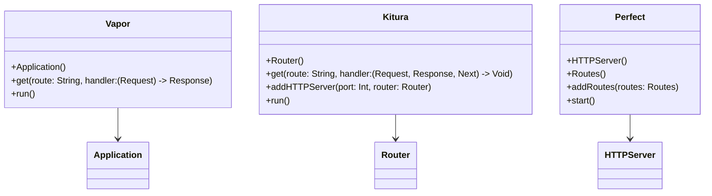

## 13.1 Introduction to Server-Side Swift

Welcome to the exciting world of Server-Side Swift! As Swift continues to evolve beyond its roots as a language for iOS and macOS applications, it has become a powerful tool for backend development. In this section, we will explore the advantages of using Swift for server-side applications, introduce popular frameworks, and provide you with a solid foundation for leveraging Swift in your backend projects.

### Overview of Server-Side Swift

Server-Side Swift refers to the use of the Swift programming language to develop backend applications and services. This includes building APIs, web applications, and other server-side components that can power both mobile and web applications.

#### Advantages of Server-Side Swift

1. **High Performance**: 
   - Swift is a compiled language that offers performance comparable to C-based languages. This makes it an excellent choice for high-performance server applications that require efficient resource utilization.

2. **Type Safety and Reliability**: 
   - Swift's strong type system helps catch errors at compile time, reducing runtime crashes and improving the overall reliability of your applications.

3. **Unified Codebase**: 
   - By using Swift for both client and server-side development, you can share code between your iOS/macOS apps and your backend, reducing duplication and simplifying maintenance.

4. **Modern Language Features**: 
   - Swift's modern syntax and features, such as optionals, generics, and closures, make it a pleasure to work with and enable developers to write clean, concise, and expressive code.

5. **Growing Ecosystem**: 
   - The Swift ecosystem is rapidly growing, with an increasing number of libraries and tools available for server-side development.

### Popular Frameworks for Server-Side Swift

Several frameworks have emerged to facilitate server-side development in Swift. Let's take a closer look at some of the most popular ones:

#### Vapor

**Vapor** is one of the most popular server-side Swift frameworks. It is a robust, full-featured framework that provides everything you need to build web applications, APIs, and more.

- **Features**: 
  - Routing, middleware, templating, and more.
  - Support for WebSockets, databases, and authentication.
  - Extensive documentation and a vibrant community.

- **Code Example**:

```swift
import Vapor

// Create a new Vapor application
let app = Application()

// Define a simple route
app.get("hello") { req in
    return "Hello, world!"
}

// Start the server
try app.run()
```

> **Try It Yourself**: Modify the route to return a JSON response instead of a plain text string.

#### Kitura

**Kitura**, developed by IBM, is an enterprise-grade framework for building server-side applications in Swift. It is known for its scalability and integration with IBM's cloud services.

- **Features**: 
  - Built-in support for RESTful APIs, WebSockets, and more.
  - Integration with IBM's cloud services for scalability.
  - Middleware support for request handling.

- **Code Example**:

```swift
import Kitura

// Create a new Kitura router
let router = Router()

// Define a simple route
router.get("/hello") { request, response, next in
    response.send("Hello, Kitura!")
    next()
}

// Start the server
Kitura.addHTTPServer(onPort: 8080, with: router)
Kitura.run()
```

> **Try It Yourself**: Add a new route that accepts query parameters and returns a personalized greeting.

#### Perfect

**Perfect** is another popular server-side Swift framework focused on high performance and security. It provides a comprehensive set of tools for building web applications and APIs.

- **Features**: 
  - High-performance HTTP server and client.
  - Support for WebSockets, SSL, and more.
  - Database integration and ORM support.

- **Code Example**:

```swift
import PerfectHTTP
import PerfectHTTPServer

// Create a new HTTP server
let server = HTTPServer()

// Define a simple route
var routes = Routes()
routes.add(method: .get, uri: "/hello", handler: { request, response in
    response.setBody(string: "Hello, Perfect!")
    response.completed()
})

// Add routes to the server
server.addRoutes(routes)

// Start the server
try server.start()
```

> **Try It Yourself**: Implement a new route that returns the current server time as a JSON response.

### Visualizing Server-Side Swift Frameworks

To better understand how these frameworks fit into the server-side development landscape, let's visualize their interactions and components using a class diagram.



> **Diagram Description**: This class diagram illustrates the core components of Vapor, Kitura, and Perfect frameworks, highlighting their primary classes and methods for setting up routes and running the server.

### Getting Started with Server-Side Swift

Now that we've explored the advantages and popular frameworks, let's discuss how to get started with server-side Swift development.

#### Setting Up Your Environment

1. **Install Swift**: 
   - Ensure you have the latest version of Swift installed on your machine. You can download it from [swift.org](https://swift.org/download/).

2. **Choose a Framework**: 
   - Decide which server-side Swift framework best suits your needs. Consider factors such as community support, documentation, and specific features.

3. **Set Up Your Project**: 
   - Use Swift Package Manager (SPM) to create a new project. SPM is the preferred tool for managing dependencies and building Swift projects.

```bash
// Create a new Swift package
swift package init --type executable

// Build the project
swift build
```

4. **Add Dependencies**: 
   - Add the chosen framework as a dependency in your `Package.swift` file.

```swift
// Example: Adding Vapor as a dependency
dependencies: [
    .package(url: "https://github.com/vapor/vapor.git", from: "4.0.0")
]
```

5. **Start Coding**: 
   - Begin implementing your server-side logic using the framework's APIs and features.

#### Deploying Your Server-Side Swift Application

Once your application is ready, it's time to deploy it to a server. Here are some steps to guide you through the deployment process:

1. **Choose a Hosting Provider**: 
   - Select a hosting provider that supports Swift applications. Popular options include AWS, Heroku, and IBM Cloud.

2. **Configure Your Server**: 
   - Set up your server environment, including installing Swift and any necessary dependencies.

3. **Build and Deploy**: 
   - Build your application using Swift Package Manager and deploy it to your server.

```bash
// Build the release version of your application
swift build -c release

// Run the application on your server
.build/release/YourAppName
```

4. **Monitor and Scale**: 
   - Monitor your application's performance and scale your infrastructure as needed to handle increased traffic.

### References and Further Reading

To deepen your understanding of server-side Swift, consider exploring the following resources:

- [Swift.org](https://swift.org): Official Swift website with documentation and downloads.
- [Vapor Documentation](https://docs.vapor.codes): Comprehensive documentation for the Vapor framework.
- [Kitura Documentation](https://www.kitura.io/docs/): Official documentation for the Kitura framework.
- [Perfect Documentation](https://perfect.org/docs/): Documentation for the Perfect framework.

### Knowledge Check

Before we conclude, let's reinforce your learning with a few questions:

- What are the key advantages of using Swift for server-side development?
- How does Vapor differ from Kitura and Perfect in terms of features and use cases?
- What steps are involved in setting up a server-side Swift project?
- How can you deploy a server-side Swift application to a production environment?

### Embrace the Journey

Remember, mastering server-side Swift is a journey. As you continue to explore and experiment with different frameworks and tools, you'll gain a deeper understanding of how to build efficient and scalable backend applications. Stay curious, keep learning, and enjoy the process!

## Quiz Time!



### What is one of the main advantages of using Swift for server-side development?

- [x] High performance comparable to C-based languages
- [ ] Lack of community support
- [ ] Limited language features
- [ ] High runtime error rate

> **Explanation:** Swift offers high performance comparable to C-based languages, making it suitable for server-side development.

### Which framework is known for its enterprise-grade capabilities and integration with IBM's cloud services?

- [ ] Vapor
- [x] Kitura
- [ ] Perfect
- [ ] SwiftUI

> **Explanation:** Kitura, developed by IBM, is known for its enterprise-grade capabilities and integration with IBM's cloud services.

### What is the primary purpose of using Swift Package Manager (SPM) in server-side Swift projects?

- [x] Managing dependencies and building Swift projects
- [ ] Designing user interfaces
- [ ] Handling database operations
- [ ] Writing unit tests

> **Explanation:** Swift Package Manager (SPM) is used for managing dependencies and building Swift projects.

### Which of the following frameworks is focused on high performance and security?

- [ ] Vapor
- [ ] Kitura
- [x] Perfect
- [ ] SwiftUI

> **Explanation:** Perfect is a server-side Swift framework focused on high performance and security.

### What is a common step involved in deploying a server-side Swift application?

- [x] Building the release version of the application
- [ ] Designing the user interface
- [ ] Writing unit tests
- [ ] Creating a new Swift package

> **Explanation:** Building the release version of the application is a common step in deploying a server-side Swift application.

### Which framework provides support for WebSockets, databases, and authentication?

- [x] Vapor
- [ ] Kitura
- [ ] Perfect
- [ ] SwiftUI

> **Explanation:** Vapor provides support for WebSockets, databases, and authentication.

### What is the main benefit of using a unified codebase in server-side Swift development?

- [x] Sharing code between client and server
- [ ] Increased runtime errors
- [ ] Limited language features
- [ ] Lack of community support

> **Explanation:** A unified codebase allows developers to share code between client and server, reducing duplication.

### What is the first step in setting up a server-side Swift project?

- [x] Installing Swift
- [ ] Writing unit tests
- [ ] Designing the user interface
- [ ] Creating a new Swift package

> **Explanation:** Installing Swift is the first step in setting up a server-side Swift project.

### Which framework is known for its robust, full-featured capabilities for building web applications and APIs?

- [x] Vapor
- [ ] Kitura
- [ ] Perfect
- [ ] SwiftUI

> **Explanation:** Vapor is known for its robust, full-featured capabilities for building web applications and APIs.

### True or False: Swift's strong type system helps catch errors at runtime.

- [ ] True
- [x] False

> **Explanation:** Swift's strong type system helps catch errors at compile time, not runtime.




