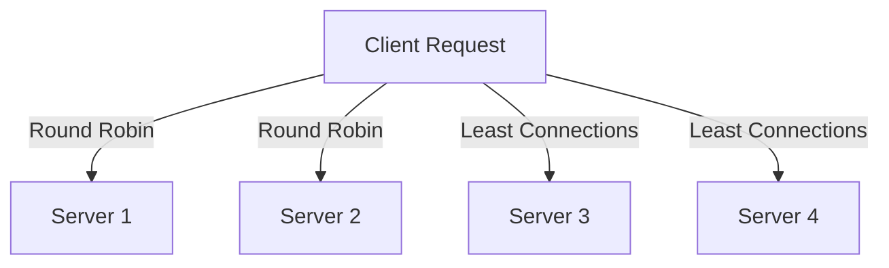

## 13.10 Scaling and Load Balancing

As we delve into the realm of server-side Swift development, understanding the concepts of scaling and load balancing becomes crucial. These strategies ensure that applications remain responsive, efficient, and capable of handling increased loads. In this section, we will explore the fundamentals of scaling, various load balancing techniques, and state management strategies to enhance the performance and reliability of your Swift applications.

### Understanding Scaling: Horizontal vs. Vertical

Scaling is the process of adjusting the capacity of your application to meet demand. There are two primary types of scaling: horizontal and vertical.

#### Horizontal Scaling

Horizontal scaling, also known as scaling out, involves adding more servers to your pool of resources. This approach is often preferred for its flexibility and cost-effectiveness. By distributing the load across multiple servers, you can enhance fault tolerance and ensure high availability.

**Benefits of Horizontal Scaling:**

- **Improved Redundancy:** If one server fails, others can take over, minimizing downtime.
- **Cost-Effective:** You can add inexpensive commodity hardware rather than investing in a single, high-capacity server.
- **Flexibility:** Easily add or remove servers based on current demand.

**Challenges of Horizontal Scaling:**

- **Complexity:** Requires sophisticated load balancing and data synchronization mechanisms.
- **Consistency:** Ensuring data consistency across multiple servers can be challenging.

#### Vertical Scaling

Vertical scaling, or scaling up, involves adding more resources (CPU, RAM, storage) to an existing server. This approach can be simpler to implement since it doesn't require changes to the application architecture.

**Benefits of Vertical Scaling:**

- **Simplicity:** Easier to implement as it doesn't require a distributed architecture.
- **Consistency:** Data consistency is easier to maintain since all data resides on a single server.

**Challenges of Vertical Scaling:**

- **Limits:** There's a physical limit to how much you can scale a single server.
- **Cost:** High-capacity servers can be expensive.

### Load Balancing Techniques

Load balancing is the process of distributing incoming network traffic across multiple servers to ensure no single server becomes overwhelmed. Let's explore some common load balancing techniques.

#### Round Robin

Round Robin is a straightforward load balancing technique where requests are distributed evenly across all available servers in a cyclic order. This method is simple to implement and works well when servers have similar capabilities.

**Advantages:**

- **Simplicity:** Easy to implement and understand.
- **Fair Distribution:** Ensures all servers handle an equal number of requests.

**Disadvantages:**

- **Unequal Load:** If servers have different capacities, some may become overloaded while others are underutilized.

#### Least Connections

The Least Connections method directs traffic to the server with the fewest active connections. This approach is beneficial when servers have varying capabilities or when requests have different processing times.

**Advantages:**

- **Dynamic Balancing:** Adapts to varying server loads and capacities.
- **Efficient Resource Use:** Ensures servers are utilized according to their capacity.

**Disadvantages:**

- **Complexity:** Requires real-time monitoring of server connections.

### State Management in Load Balanced Environments

State management is a critical aspect of designing scalable applications. It involves handling user sessions and data across distributed servers.

#### Stateless Services

Stateless services do not retain any information about the client's state between requests. Each request is treated independently, making it easier to scale horizontally.

**Benefits:**

- **Scalability:** Easily distribute requests across multiple servers without concern for session data.
- **Resilience:** If a server fails, another can handle the request without session loss.

**Implementation in Swift:**

```swift
struct RequestHandler {
    func handleRequest(_ request: URLRequest) -> HTTPResponse {
        // Process request independently
        return HTTPResponse(status: .ok, body: "Request handled statelessly")
    }
}
```

#### Session Persistence

Session persistence, or sticky sessions, involves maintaining user sessions across multiple requests. This can be achieved through various methods, such as:

- **Session Affinity:** Directs all requests from a particular client to the same server.
- **Session Replication:** Shares session data across servers.

**Benefits:**

- **User Experience:** Provides a seamless experience by maintaining session data across requests.
- **Consistency:** Ensures data consistency for user-specific information.

**Challenges:**

- **Complexity:** Requires additional infrastructure to manage sessions.
- **Scalability:** Can limit scalability if not implemented correctly.

### Implementing Load Balancing with Swift

To implement load balancing in Swift, you can use frameworks like Vapor or Kitura, which provide tools for building scalable server-side applications.

**Example: Load Balancing with Vapor**

```swift
import Vapor

func routes(_ app: Application) throws {
    app.get("balance") { req -> String in
        // Load balancing logic
        return "Request handled by server instance"
    }
}

// Configure load balancer
let app = try Application(.detect())
defer { app.shutdown() }
try configure(app)
try app.run()
```

### Visualizing Load Balancing

Let's visualize how load balancing distributes requests across multiple servers using a simple flowchart.



**Diagram Explanation:**

- **Client Request:** The initial request from the client.
- **Server 1, 2, 3, 4:** The pool of servers handling requests.
- **Round Robin and Least Connections:** Load balancing techniques distributing requests.

### Best Practices for Scaling and Load Balancing

- **Monitor Performance:** Regularly monitor server performance and adjust scaling strategies as needed.
- **Automate Scaling:** Use tools like Kubernetes for automated scaling based on demand.
- **Optimize Code:** Ensure your Swift code is optimized for performance to handle increased loads efficiently.
- **Use Caching:** Implement caching strategies to reduce server load and improve response times.
- **Plan for Failures:** Design your system to handle server failures gracefully, ensuring continuity of service.

### Try It Yourself

Experiment with different load balancing techniques using Swift frameworks like Vapor. Modify the code examples to implement round robin or least connections strategies and observe how they affect performance.

### Knowledge Check

- **What is the difference between horizontal and vertical scaling?**
- **How does round robin load balancing work?**
- **What are the benefits of stateless services in a load-balanced environment?**

### Conclusion

Scaling and load balancing are essential components of robust server-side Swift applications. By understanding and implementing these strategies, you can ensure your applications remain responsive and efficient, even under heavy loads. Remember, this is just the beginning. As you progress, continue experimenting with different techniques and tools to enhance your server-side Swift development skills.

## Quiz Time!



### What is horizontal scaling?

- [x] Adding more servers to handle increased load
- [ ] Adding more resources to a single server
- [ ] Reducing the number of servers
- [ ] Decreasing server resources

> **Explanation:** Horizontal scaling involves adding more servers to distribute the load effectively.

### Which load balancing technique distributes requests evenly across servers?

- [x] Round Robin
- [ ] Least Connections
- [ ] Random Selection
- [ ] Weighted Round Robin

> **Explanation:** Round Robin distributes requests evenly across all servers in a cyclic order.

### What is a key advantage of stateless services?

- [x] Easier to scale horizontally
- [ ] Requires session persistence
- [ ] Maintains user sessions
- [ ] Needs complex infrastructure

> **Explanation:** Stateless services treat each request independently, making them easier to scale horizontally.

### What is session persistence also known as?

- [x] Sticky Sessions
- [ ] Stateless Sessions
- [ ] Load Balancing
- [ ] Session Affinity

> **Explanation:** Session persistence, also known as sticky sessions, maintains user sessions across multiple requests.

### Which scaling method involves adding more resources to an existing server?

- [x] Vertical Scaling
- [ ] Horizontal Scaling
- [ ] Distributed Scaling
- [ ] Cloud Scaling

> **Explanation:** Vertical scaling involves adding more resources like CPU and RAM to an existing server.

### What is a disadvantage of vertical scaling?

- [x] There's a physical limit to scaling
- [ ] It's complex to implement
- [ ] It requires multiple servers
- [ ] It needs session replication

> **Explanation:** Vertical scaling has a physical limit to how much a single server can be scaled.

### Which load balancing technique adapts to varying server loads?

- [x] Least Connections
- [ ] Round Robin
- [ ] Random Selection
- [ ] Weighted Round Robin

> **Explanation:** Least Connections directs traffic to the server with the fewest active connections, adapting to varying loads.

### What is a benefit of using caching in load-balanced environments?

- [x] Reduces server load and improves response times
- [ ] Increases server load
- [ ] Decreases response times
- [ ] Requires more servers

> **Explanation:** Caching reduces the load on servers and improves response times by storing frequently accessed data.

### Which framework can be used for building scalable server-side Swift applications?

- [x] Vapor
- [ ] UIKit
- [ ] SwiftUI
- [ ] Core Data

> **Explanation:** Vapor is a popular framework for building scalable server-side Swift applications.

### True or False: Stateless services are more complex to scale than stateful services.

- [ ] True
- [x] False

> **Explanation:** Stateless services are easier to scale because they do not retain any information about the client's state between requests.




