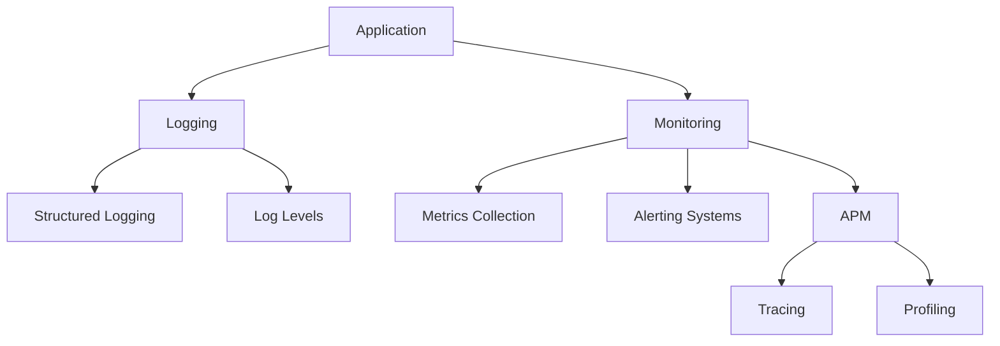

## 13.11 Logging and Monitoring

In the realm of server-side Swift development, logging and monitoring are crucial practices that ensure the health and performance of applications. These practices provide insights into application behavior, help diagnose issues, and maintain optimal performance levels. In this section, we will explore the essential components of logging and monitoring, including structured logging, log levels, monitoring tools, and application performance management (APM).

### Logging Practices

Logging is the process of recording information about an application's operation. It serves as a critical tool for developers and system administrators to understand what is happening within an application. Let's delve into some best practices for effective logging.

#### Structured Logging

Structured logging involves recording logs in a structured format, such as JSON, which allows for better analysis and querying. Unlike traditional logging, which often involves plain text, structured logs can be easily parsed and filtered by log management systems.

- **Advantages of Structured Logging**:
  - **Searchability**: Structured logs can be easily searched and filtered based on specific fields.
  - **Consistency**: Ensures a consistent format across all logs, making them easier to read and analyze.
  - **Integration**: Structured logs can be seamlessly integrated with log management tools and dashboards.

**Example: Implementing Structured Logging in Swift**

```swift
import Foundation

struct LogEntry: Codable {
    let timestamp: Date
    let level: String
    let message: String
    let context: [String: String]
}

func log(_ message: String, level: String, context: [String: String] = [:]) {
    let logEntry = LogEntry(timestamp: Date(), level: level, message: message, context: context)
    if let jsonData = try? JSONEncoder().encode(logEntry),
       let jsonString = String(data: jsonData, encoding: .utf8) {
        print(jsonString)
    }
}

// Usage
log("User logged in", level: "INFO", context: ["userId": "12345"])
```

In this example, we define a `LogEntry` struct that represents a log entry in JSON format. The `log` function encodes this struct into a JSON string and prints it, providing a structured log output.

#### Log Levels

Log levels categorize logs based on their severity, helping developers and administrators prioritize and filter logs efficiently. Common log levels include:

- **Debug**: Detailed information, typically of interest only when diagnosing problems.
- **Info**: Confirmation that things are working as expected.
- **Warning**: An indication that something unexpected happened, or indicative of some problem in the near future (e.g., ‘disk space low’). The software is still working as expected.
- **Error**: Due to a more serious problem, the software has not been able to perform some function.
- **Critical**: A serious error, indicating that the program itself may be unable to continue running.

**Example: Implementing Log Levels in Swift**

```swift
enum LogLevel: String {
    case debug = "DEBUG"
    case info = "INFO"
    case warning = "WARNING"
    case error = "ERROR"
    case critical = "CRITICAL"
}

func logWithLevel(_ message: String, level: LogLevel, context: [String: String] = [:]) {
    log(message, level: level.rawValue, context: context)
}

// Usage
logWithLevel("Disk space low", level: .warning)
logWithLevel("Unable to connect to database", level: .error)
```

By defining an enumeration for log levels, we can ensure consistency and clarity in our logging practices.

### Monitoring Tools

Monitoring tools are essential for maintaining the health and performance of server-side applications. They provide real-time insights into application behavior and resource usage, enabling proactive issue resolution.

#### Metrics Collection

Metrics collection involves gathering data on various aspects of application performance, such as CPU usage, memory consumption, and request latency. This data is crucial for identifying performance bottlenecks and ensuring efficient resource utilization.

- **Key Metrics to Monitor**:
  - **CPU Usage**: Helps identify processes consuming excessive CPU resources.
  - **Memory Usage**: Monitors memory consumption to prevent leaks and optimize performance.
  - **Request Latency**: Measures the time taken to process requests, aiding in performance tuning.

**Example: Collecting Metrics in Swift**

```swift
import Foundation

struct Metrics {
    var cpuUsage: Double
    var memoryUsage: Double
    var requestLatency: Double
}

func collectMetrics() -> Metrics {
    // Placeholder values for demonstration
    return Metrics(cpuUsage: 75.0, memoryUsage: 1024.0, requestLatency: 200.0)
}

// Usage
let metrics = collectMetrics()
print("CPU Usage: \\(metrics.cpuUsage)%, Memory Usage: \\(metrics.memoryUsage)MB, Request Latency: \\(metrics.requestLatency)ms")
```

In this example, we define a `Metrics` struct to represent key performance metrics and a `collectMetrics` function to simulate their collection.

#### Alerting Systems

Alerting systems notify administrators of issues that require immediate attention. They are configured to trigger alerts based on predefined thresholds for various metrics, ensuring timely intervention.

- **Common Alert Types**:
  - **Threshold Alerts**: Triggered when a metric exceeds a specified threshold.
  - **Anomaly Alerts**: Triggered when unusual patterns are detected in the data.
  - **Downtime Alerts**: Triggered when the application becomes unavailable.

**Example: Implementing a Simple Alerting System in Swift**

```swift
struct Alert {
    let message: String
    let isCritical: Bool
}

func checkMetricsAndAlert(metrics: Metrics) -> [Alert] {
    var alerts = [Alert]()
    
    if metrics.cpuUsage > 80 {
        alerts.append(Alert(message: "High CPU Usage", isCritical: false))
    }
    if metrics.memoryUsage > 2048 {
        alerts.append(Alert(message: "High Memory Usage", isCritical: true))
    }
    if metrics.requestLatency > 300 {
        alerts.append(Alert(message: "High Request Latency", isCritical: false))
    }
    
    return alerts
}

// Usage
let alerts = checkMetricsAndAlert(metrics: metrics)
for alert in alerts {
    print("Alert: \\(alert.message) - Critical: \\(alert.isCritical)")
}
```

This example demonstrates a simple alerting system that checks metrics and generates alerts based on predefined thresholds.

### Application Performance Management (APM)

APM encompasses a set of practices and tools designed to monitor and manage the performance of applications. It provides insights into application behavior, identifies performance bottlenecks, and ensures optimal performance.

#### Tracing

Tracing involves tracking the flow of requests through an application, providing visibility into the execution path and identifying performance bottlenecks.

- **Benefits of Tracing**:
  - **End-to-End Visibility**: Provides a comprehensive view of request flows across different components.
  - **Bottleneck Identification**: Helps pinpoint areas of the application that are causing delays.
  - **Dependency Mapping**: Visualizes the dependencies between different services and components.

**Example: Implementing Simple Tracing in Swift**

```swift
struct Trace {
    let requestId: String
    let startTime: Date
    let endTime: Date
    let operations: [String]
}

func startTrace(requestId: String) -> Trace {
    return Trace(requestId: requestId, startTime: Date(), endTime: Date(), operations: [])
}

func endTrace(trace: inout Trace) {
    trace.endTime = Date()
    print("Trace for Request ID \\(trace.requestId): Duration \\(trace.endTime.timeIntervalSince(trace.startTime))s, Operations: \\(trace.operations)")
}

// Usage
var trace = startTrace(requestId: "req-123")
trace.operations.append("Database Query")
trace.operations.append("Data Processing")
endTrace(trace: &trace)
```

In this example, we define a `Trace` struct to represent a trace and functions to start and end a trace, simulating the tracking of request flows.

#### Profiling

Profiling involves analyzing the performance characteristics of an application to identify areas for optimization. It provides insights into resource usage, execution times, and potential bottlenecks.

- **Key Profiling Metrics**:
  - **Execution Time**: Measures the time taken for specific operations or functions.
  - **Resource Usage**: Analyzes CPU and memory consumption for different components.
  - **Concurrency**: Evaluates the efficiency of concurrent operations.

**Example: Implementing Simple Profiling in Swift**

```swift
import Foundation

func profileOperation(_ operation: () -> Void) {
    let startTime = Date()
    operation()
    let endTime = Date()
    print("Operation Duration: \\(endTime.timeIntervalSince(startTime))s")
}

// Usage
profileOperation {
    // Simulate a time-consuming operation
    Thread.sleep(forTimeInterval: 2.0)
}
```

This example demonstrates a simple profiling function that measures the execution time of a given operation.

### Visualizing Logging and Monitoring in Swift

To better understand the relationship between logging, monitoring, and application performance management, let's visualize these concepts using a Mermaid.js diagram.



**Diagram Description**: This diagram illustrates the flow of logging and monitoring in a server-side Swift application. The application generates logs and metrics, which are used for structured logging, log levels, metrics collection, alerting, and APM. APM further includes tracing and profiling to ensure optimal performance.

### References and Links

For further reading on logging and monitoring in Swift, consider exploring the following resources:

- [Apple's Logging API Documentation](https://developer.apple.com/documentation/os/logging)
- [Swift.org: Swift Performance](https://swift.org/performance/)
- [Ray Wenderlich's Guide to Logging in Swift](https://www.raywenderlich.com/)

### Knowledge Check

As we conclude this section, let's reinforce our understanding with a few questions:

1. What are the benefits of structured logging in Swift?
2. How do log levels help in managing application logs?
3. What are some common metrics to monitor in a server-side application?
4. How does tracing contribute to application performance management?
5. What is the purpose of profiling in application performance management?

### Embrace the Journey

Remember, logging and monitoring are continuous processes that evolve with your application. As you implement these practices, you'll gain deeper insights into your application's behavior and performance. Keep exploring, stay curious, and enjoy the journey of mastering server-side Swift development!

## Quiz Time!



### What is structured logging?

- [x] Logging in a structured format like JSON
- [ ] Logging with random text
- [ ] Logging without any format
- [ ] Logging only errors

> **Explanation:** Structured logging involves recording logs in a structured format, such as JSON, which allows for better analysis and querying.

### Which log level indicates a serious error?

- [ ] Debug
- [ ] Info
- [ ] Warning
- [x] Critical

> **Explanation:** The "Critical" log level indicates a serious error, suggesting that the program may be unable to continue running.

### What is the purpose of metrics collection?

- [ ] To decorate logs
- [x] To gather data on performance and resource usage
- [ ] To delete logs
- [ ] To obfuscate data

> **Explanation:** Metrics collection involves gathering data on various aspects of application performance, such as CPU usage, memory consumption, and request latency.

### What does APM stand for?

- [ ] Application Programming Model
- [x] Application Performance Management
- [ ] Application Process Monitoring
- [ ] Application Protocol Management

> **Explanation:** APM stands for Application Performance Management, which encompasses practices and tools to monitor and manage application performance.

### What is tracing used for?

- [x] Tracking the flow of requests through an application
- [ ] Encrypting data
- [ ] Debugging UI issues
- [ ] Managing databases

> **Explanation:** Tracing involves tracking the flow of requests through an application, providing visibility into the execution path and identifying performance bottlenecks.

### What is the benefit of profiling?

- [ ] It slows down the application
- [x] It identifies areas for optimization
- [ ] It increases memory usage
- [ ] It hides errors

> **Explanation:** Profiling involves analyzing the performance characteristics of an application to identify areas for optimization.

### Which of the following is NOT a common alert type?

- [ ] Threshold Alerts
- [ ] Anomaly Alerts
- [ ] Downtime Alerts
- [x] Debug Alerts

> **Explanation:** Debug Alerts are not a common alert type. Common alert types include threshold alerts, anomaly alerts, and downtime alerts.

### What is the role of alerting systems?

- [x] Notifying administrators of issues
- [ ] Logging errors
- [ ] Deleting old logs
- [ ] Encrypting data

> **Explanation:** Alerting systems notify administrators of issues that require immediate attention, based on predefined thresholds for various metrics.

### How do log levels help in logging?

- [x] By categorizing logs based on severity
- [ ] By deleting old logs
- [ ] By encrypting logs
- [ ] By obfuscating data

> **Explanation:** Log levels categorize logs based on their severity, helping developers and administrators prioritize and filter logs efficiently.

### True or False: Structured logging makes logs harder to read.

- [ ] True
- [x] False

> **Explanation:** Structured logging makes logs easier to read and analyze by ensuring a consistent format.






