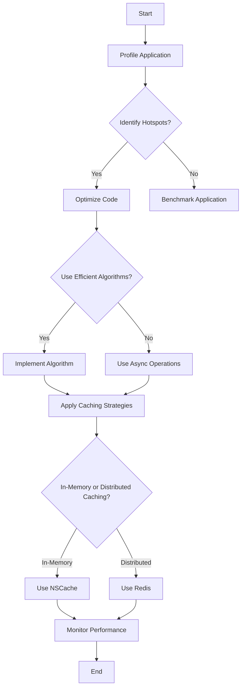

## 13.12 Server-Side Performance Optimization

In the realm of server-side Swift development, optimizing performance is crucial to ensure that applications can handle high loads efficiently and provide a seamless user experience. This section will guide you through the essential techniques and strategies for server-side performance optimization, focusing on profiling and benchmarking, code optimization, and caching strategies.

### Profiling and Benchmarking

Before diving into optimization, it's essential to understand where your server-side Swift application might be encountering performance bottlenecks. Profiling and benchmarking are critical steps in identifying these hotspots.

#### Identifying Hotspots

**Profiling** involves monitoring various aspects of your application to identify parts of the code that consume the most resources, such as CPU or memory. Tools like **Instruments** in Xcode can help you visualize performance metrics and pinpoint inefficient code paths.

- **CPU Profiling**: Determine which functions are consuming the most CPU time. This can help you focus your optimization efforts on the most computationally expensive parts of your application.
- **Memory Profiling**: Identify memory leaks or excessive memory usage that could lead to performance degradation.

**Benchmarking** involves running a series of tests to measure the performance of your application under different conditions. This helps you understand how changes in your code affect performance.

- **Load Testing**: Simulate high-traffic conditions to evaluate how your application performs under stress. Tools like Apache JMeter or Artillery can be used to generate load and analyze the results.

### Code Optimization

Once hotspots are identified, the next step is to optimize the code to improve performance. This involves selecting efficient algorithms, utilizing asynchronous operations, and optimizing data structures.

#### Efficient Algorithms

Choosing the right algorithm and data structure can significantly impact the performance of your application. Consider the following:

- **Algorithm Complexity**: Opt for algorithms with lower time complexity. For instance, prefer O(n log n) algorithms over O(n^2) for sorting large datasets.
- **Data Structures**: Use appropriate data structures for your use case. For example, use dictionaries for fast lookups or arrays for ordered data.

#### Async Operations

Swift's concurrency model allows you to perform non-blocking I/O operations, which can enhance the scalability of your server-side application.

- **Async/Await**: Utilize async/await to handle asynchronous tasks more naturally and efficiently. This can help in writing cleaner and more maintainable code.
- **Dispatch Queues**: Use Grand Central Dispatch (GCD) to manage concurrent operations effectively.

Here's a simple example of using async/await in Swift:

```swift
import Foundation

func fetchData(from url: URL) async throws -> Data {
    let (data, _) = try await URLSession.shared.data(from: url)
    return data
}

Task {
    do {
        let url = URL(string: "https://example.com/data")!
        let data = try await fetchData(from: url)
        print("Data fetched: \\(data)")
    } catch {
        print("Failed to fetch data: \\(error)")
    }
}
```

### Caching Strategies

Caching is a powerful technique to reduce server load and improve response times by storing frequently accessed data.

#### In-Memory Caching

In-memory caching involves storing data in RAM for quick access. This is suitable for data that is frequently requested and doesn't change often.

- **NSCache**: Use NSCache in Swift for in-memory caching. It automatically purges its contents when system memory is low.

```swift
import Foundation

let cache = NSCache<NSString, NSData>()

func cacheData(_ data: NSData, forKey key: NSString) {
    cache.setObject(data, forKey: key)
}

func fetchData(forKey key: NSString) -> NSData? {
    return cache.object(forKey: key)
}
```

#### Distributed Caching

For applications running on multiple servers, distributed caching can be used to share cache across servers, reducing the load on the database.

- **Redis**: Use Redis, a popular in-memory data structure store, for distributed caching. It allows you to store key-value pairs and provides mechanisms for data persistence and replication.

```swift
import Redis

let redis = try Redis(url: "redis://localhost:6379")

func cacheData(_ data: String, forKey key: String) async throws {
    try await redis.set(key, value: data)
}

func fetchData(forKey key: String) async throws -> String? {
    return try await redis.get(key)
}
```

### Visualizing Server-Side Performance Optimization

To better understand the flow of server-side performance optimization, let's visualize the process using a flowchart.



### References and Links

- [Swift.org - Concurrency](https://swift.org/documentation/concurrency/)
- [Apple Developer Documentation - Instruments](https://developer.apple.com/documentation/instruments)
- [Redis Documentation](https://redis.io/documentation)

### Knowledge Check

- Why is profiling important before optimizing code?
- How does async/await improve code readability and performance?
- What are the benefits of using distributed caching in server-side applications?

### Embrace the Journey

Remember, server-side performance optimization is an ongoing process. As your application grows and evolves, continue to profile, benchmark, and optimize. Keep experimenting with different strategies, stay curious, and enjoy the journey!

## Quiz Time!



### What is the primary purpose of profiling in server-side performance optimization?

- [x] To identify performance bottlenecks
- [ ] To increase code complexity
- [ ] To add more features
- [ ] To reduce code readability

> **Explanation:** Profiling helps identify parts of the code that consume the most resources, allowing developers to focus optimization efforts effectively.

### Which tool can be used for load testing in server-side Swift applications?

- [ ] Xcode
- [x] Apache JMeter
- [ ] SwiftLint
- [ ] Instruments

> **Explanation:** Apache JMeter is a tool used for load testing, simulating high-traffic conditions to evaluate application performance under stress.

### What is the benefit of using async/await in Swift?

- [x] It allows non-blocking I/O operations
- [ ] It increases code complexity
- [ ] It reduces memory usage
- [ ] It simplifies error handling

> **Explanation:** Async/await allows for non-blocking I/O operations, enhancing scalability and improving code readability.

### What is the purpose of in-memory caching?

- [x] To store frequently accessed data for quick access
- [ ] To permanently store data
- [ ] To reduce code complexity
- [ ] To increase server load

> **Explanation:** In-memory caching stores frequently accessed data in RAM, reducing server load and improving response times.

### Which of the following is a distributed caching solution?

- [ ] NSCache
- [x] Redis
- [ ] Core Data
- [ ] UserDefaults

> **Explanation:** Redis is a popular distributed caching solution that allows sharing of cache across multiple servers.

### How does NSCache handle low-memory situations?

- [x] It automatically purges its contents
- [ ] It increases memory usage
- [ ] It crashes the application
- [ ] It saves data to disk

> **Explanation:** NSCache automatically purges its contents when system memory is low, preventing application crashes.

### What is a key advantage of using efficient algorithms in server-side applications?

- [x] Lower time complexity
- [ ] Increased code complexity
- [ ] Higher memory usage
- [ ] Slower execution

> **Explanation:** Efficient algorithms have lower time complexity, leading to faster execution and improved performance.

### Why is it important to choose appropriate data structures?

- [x] They impact performance significantly
- [ ] They increase code complexity
- [ ] They reduce code readability
- [ ] They limit application features

> **Explanation:** Choosing appropriate data structures can greatly impact performance, making operations faster and more efficient.

### What is the role of benchmarking in performance optimization?

- [x] To measure application performance under different conditions
- [ ] To add more features to the application
- [ ] To reduce code readability
- [ ] To increase code complexity

> **Explanation:** Benchmarking measures application performance under various conditions, helping developers understand how changes affect performance.

### True or False: Profiling should be done after code optimization.

- [ ] True
- [x] False

> **Explanation:** Profiling should be done before code optimization to identify hotspots and focus efforts on the most resource-intensive parts of the application.




