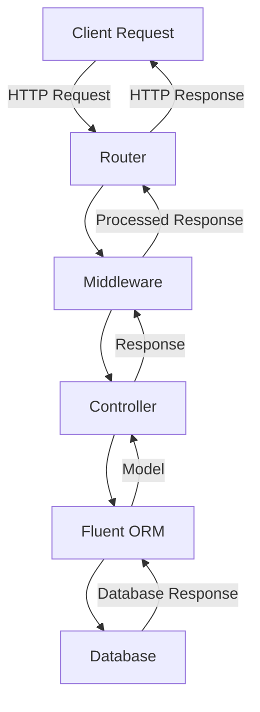

## 13.2 Using Vapor Framework

Vapor is a powerful web framework for Swift that enables developers to create robust server-side applications. In this section, we will guide you through the essentials of using Vapor, from installation and project setup to core concepts like routing, controllers, middleware, and database integration with Fluent ORM. By the end of this guide, you will be well-equipped to build and deploy server-side applications using Swift.

### Getting Started

#### Installation

To begin using Vapor, you need to have Swift installed on your system. Vapor leverages the Swift Package Manager (SPM) for dependency management, making it easy to install and manage your Vapor projects.

1. **Install Swift**: Ensure you have Swift installed. You can download it from the [Swift.org](https://swift.org/download/) website.

2. **Install Vapor Toolbox**: The Vapor Toolbox is a command-line tool that simplifies the creation and management of Vapor projects. Install it using Homebrew:

   ```bash
   brew install vapor
   ```

3. **Verify Installation**: Confirm that Vapor is installed correctly by running:

   ```bash
   vapor --version
   ```

#### Creating a Project

Once Vapor is installed, you can create a new project. The Vapor Toolbox provides a convenient command to initialize a new Vapor project.

1. **Create a New Project**: Use the `vapor new` command to create a new project:

   ```bash
   vapor new HelloWorld
   ```

   This command generates a new Vapor project in a directory named `HelloWorld`.

2. **Navigate to the Project Directory**:

   ```bash
   cd HelloWorld
   ```

3. **Build and Run the Project**: Use the following commands to build and run your Vapor application:

   ```bash
   vapor build
   vapor run
   ```

   Your Vapor server should now be running, and you can access it at `http://localhost:8080`.

### Core Concepts

Vapor provides a range of features to build server-side applications. Let's explore some of the core concepts that are crucial for developing with Vapor.

#### Routing

Routing is the process of defining URL endpoints and associating them with specific logic. Vapor uses a routing system to map HTTP requests to request handlers.

- **Define Routes**: You can define routes in the `routes.swift` file. Here's an example of a simple route:

  ```swift
  import Vapor

  func routes(_ app: Application) throws {
      app.get("hello") { req in
          return "Hello, world!"
      }
  }
  ```

  This route responds with "Hello, world!" when a GET request is made to `/hello`.

- **Handle HTTP Methods**: Vapor supports various HTTP methods, including GET, POST, PUT, DELETE, etc. You can define routes for each method:

  ```swift
  app.post("submit") { req -> String in
      return "Data submitted!"
  }
  ```

#### Controllers and Request Handlers

Controllers in Vapor are used to organize your application's logic. They help separate concerns and make your code more maintainable.

- **Create a Controller**: Define a controller by creating a class that conforms to `RouteCollection`:

  ```swift
  import Vapor

  final class HelloWorldController: RouteCollection {
      func boot(routes: RoutesBuilder) throws {
          routes.get("hello", use: sayHello)
      }

      func sayHello(req: Request) -> String {
          return "Hello from the controller!"
      }
  }
  ```

- **Register the Controller**: Register your controller in the `routes.swift` file:

  ```swift
  try app.register(collection: HelloWorldController())
  ```

#### Middleware

Middleware in Vapor allows you to intercept and process requests and responses. It's useful for tasks like authentication, logging, and error handling.

- **Create Middleware**: Define middleware by conforming to the `Middleware` protocol:

  ```swift
  import Vapor

  final class LoggingMiddleware: Middleware {
      func respond(to request: Request, chainingTo next: Responder) -> EventLoopFuture<Response> {
          print("Incoming request: \\(request)")
          return next.respond(to: request)
      }
  }
  ```

- **Register Middleware**: Add your middleware to the application's middleware configuration:

  ```swift
  app.middleware.use(LoggingMiddleware())
  ```

### Database Integration

Vapor integrates seamlessly with databases using Fluent ORM, which provides an abstraction layer for database operations.

#### Fluent ORM

Fluent is an Object-Relational Mapping (ORM) framework that maps Swift objects to database tables. It supports multiple databases, including PostgreSQL, MySQL, and SQLite.

- **Define Models**: Create a model by conforming to the `Model` protocol:

  ```swift
  import Fluent
  import Vapor

  final class User: Model, Content {
      static let schema = "users"

      @ID(key: .id)
      var id: UUID?

      @Field(key: "name")
      var name: String

      init() { }

      init(id: UUID? = nil, name: String) {
          self.id = id
          self.name = name
      }
  }
  ```

- **Perform CRUD Operations**: Use Fluent's API to perform CRUD operations:

  ```swift
  // Create
  let user = User(name: "Alice")
  try await user.save(on: req.db)

  // Read
  let users = try await User.query(on: req.db).all()

  // Update
  user.name = "Alice Updated"
  try await user.update(on: req.db)

  // Delete
  try await user.delete(on: req.db)
  ```

#### Migrations

Migrations in Fluent are used to manage database schema changes. They ensure that your database structure evolves alongside your application.

- **Create a Migration**: Define a migration by conforming to the `Migration` protocol:

  ```swift
  import Fluent

  struct CreateUser: Migration {
      func prepare(on database: Database) -> EventLoopFuture<Void> {
          database.schema("users")
              .id()
              .field("name", .string, .required)
              .create()
      }

      func revert(on database: Database) -> EventLoopFuture<Void> {
          database.schema("users").delete()
      }
  }
  ```

- **Run Migrations**: Register and run migrations in your application:

  ```swift
  app.migrations.add(CreateUser())

  try app.autoMigrate().wait()
  ```

### Visualizing Vapor Framework Architecture

To better understand how Vapor's components interact, let's visualize the architecture using a Mermaid.js diagram.



**Diagram Description**: This diagram illustrates the flow of a client request through the Vapor framework. The request passes through the router, middleware, and controller, interacting with the Fluent ORM and database before returning a response to the client.

### Try It Yourself

Now that you have a grasp of the basics, try experimenting with Vapor:

- **Add a New Route**: Create a new route that returns a JSON response.
- **Implement Middleware**: Develop middleware that logs request headers.
- **Extend Models**: Add a new field to the `User` model and update the migration.

### References and Links

- [Vapor Documentation](https://docs.vapor.codes/)
- [Swift.org](https://swift.org/)
- [Fluent ORM Documentation](https://docs.vapor.codes/fluent/overview/)

### Knowledge Check

- **What is the purpose of middleware in Vapor?**
- **How do you define a route in Vapor?**
- **What is Fluent ORM used for?**

### Embrace the Journey

Remember, mastering Vapor and server-side Swift is a journey. As you continue to explore and build more complex applications, you'll gain deeper insights and refine your skills. Keep experimenting, stay curious, and enjoy the process!

## Quiz Time!



### What command is used to create a new Vapor project?

- [x] `vapor new`
- [ ] `swift new`
- [ ] `vapor create`
- [ ] `swift package init`

> **Explanation:** The `vapor new` command initializes a new Vapor project.

### Which protocol must a controller conform to in Vapor?

- [x] `RouteCollection`
- [ ] `Middleware`
- [ ] `Responder`
- [ ] `Model`

> **Explanation:** Controllers in Vapor conform to the `RouteCollection` protocol to manage routes.

### What is the primary purpose of middleware in Vapor?

- [x] To intercept and process requests and responses
- [ ] To define database models
- [ ] To handle routing
- [ ] To manage migrations

> **Explanation:** Middleware is used to intercept and process requests and responses in Vapor.

### How do you define a model in Fluent ORM?

- [x] By conforming to the `Model` protocol
- [ ] By creating a class that inherits from `Database`
- [ ] By using a `RouteCollection`
- [ ] By implementing the `Middleware` protocol

> **Explanation:** Models in Fluent ORM are defined by conforming to the `Model` protocol.

### What command is used to run migrations in Vapor?

- [x] `try app.autoMigrate().wait()`
- [ ] `vapor migrate`
- [ ] `swift migrate`
- [ ] `vapor run`

> **Explanation:** The `try app.autoMigrate().wait()` command is used to run migrations in Vapor.

### Which database operation is not directly supported by Fluent ORM?

- [ ] Create
- [ ] Read
- [ ] Update
- [x] Compile

> **Explanation:** Fluent ORM supports CRUD operations, but "Compile" is not a database operation.

### What is the function of the `routes.swift` file in a Vapor project?

- [x] To define the application's routes
- [ ] To manage database migrations
- [ ] To configure middleware
- [ ] To initialize the application

> **Explanation:** The `routes.swift` file is used to define the application's routes in Vapor.

### What does the `@Field` property wrapper in Fluent ORM signify?

- [x] It defines a field in a database model
- [ ] It registers a route
- [ ] It creates a middleware
- [ ] It initializes a controller

> **Explanation:** The `@Field` property wrapper is used to define a field in a database model in Fluent ORM.

### How can you log incoming requests in Vapor?

- [x] By creating and using a custom middleware
- [ ] By defining a route
- [ ] By creating a controller
- [ ] By configuring Fluent ORM

> **Explanation:** Custom middleware can be created to log incoming requests in Vapor.

### True or False: Vapor can only be used with PostgreSQL databases.

- [ ] True
- [x] False

> **Explanation:** Vapor supports multiple databases, including PostgreSQL, MySQL, and SQLite.




