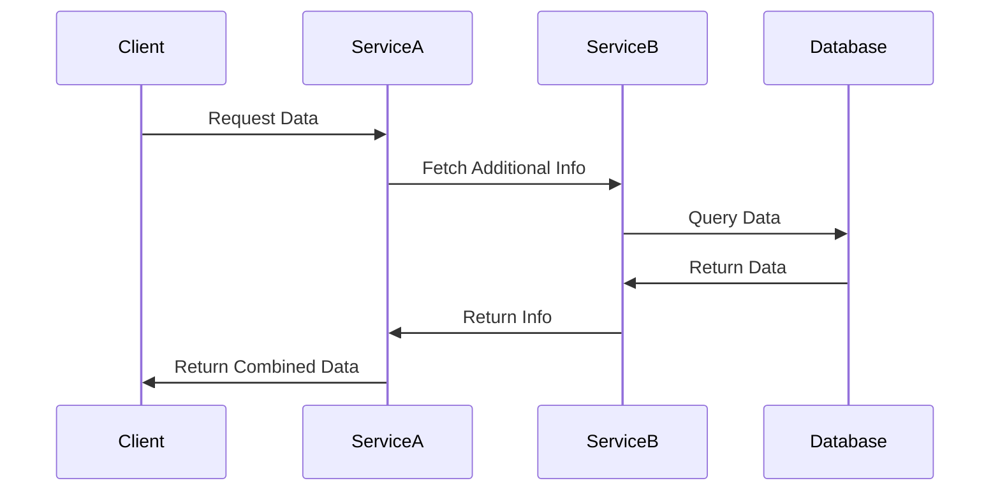

## 13.3 Microservices Architecture with Swift

In recent years, the microservices architecture has gained significant traction in the software development world. This architectural style allows developers to build applications as a collection of loosely coupled services, each focusing on a specific business function. In this section, we'll explore how to implement microservices architecture using Swift, a language traditionally associated with iOS and macOS development, but increasingly powerful for server-side applications.

### Principles of Microservices

Microservices architecture is built on several core principles. Understanding these principles is essential for effectively implementing and managing microservices.

#### Independent Services

The cornerstone of microservices architecture is the concept of independent services. Each service is a small, focused unit that performs a specific function. These services communicate over a network, typically using lightweight protocols such as HTTP/REST or gRPC.

- **Decoupling**: Services are designed to be independent, allowing teams to develop, deploy, and scale them without affecting others.
- **Focus**: Each service is responsible for a single business capability, promoting simplicity and clarity.

#### Scalability

Scalability is another crucial principle of microservices architecture. By allowing services to scale independently, applications can efficiently handle increased loads without unnecessary resource consumption.

- **Horizontal Scaling**: Services can be scaled out across multiple machines or containers to handle more requests.
- **Resource Optimization**: Only the services that require more resources are scaled, optimizing the use of infrastructure.

### Implementing Microservices with Swift

Swift, with its strong type system, performance, and safety features, is well-suited for building microservices. Let's delve into the key aspects of implementing microservices using Swift.

#### Service Isolation

Service isolation is critical in microservices architecture. Each service should have its own codebase, database, and runtime environment. This separation ensures that changes in one service do not inadvertently affect others.

- **Swift Package Manager**: Use Swift Package Manager to manage dependencies and organize code for each service.
- **Database Per Service**: Each service should manage its own data, using databases like PostgreSQL or MongoDB.

```swift
// Example of a simple Swift service using Vapor framework
import Vapor

func routes(_ app: Application) throws {
    app.get("hello") { req in
        return "Hello, world!"
    }
}

let app = try Application(.detect())
defer { app.shutdown() }
try configure(app)
try app.run()
```

#### Communication

Communication between services is a fundamental aspect of microservices architecture. Swift services can communicate using REST APIs, message queues, or gRPC.

- **REST APIs**: Use frameworks like Vapor to create RESTful endpoints.
- **Message Queues**: Implement message queues with RabbitMQ or Kafka for asynchronous communication.
- **gRPC**: Use gRPC for efficient, binary communication between services.

```swift
// Example of a REST API endpoint in Swift using Vapor
app.get("user", ":id") { req -> String in
    guard let id = req.parameters.get("id") else {
        throw Abort(.badRequest)
    }
    return "User ID: \\(id)"
}
```

#### Deployment Strategies

Deploying microservices requires careful planning to ensure scalability and reliability. Containerization and orchestration are key strategies in modern deployments.

- **Containerization with Docker**: Package each service as a Docker container for consistent deployment across environments.
- **Orchestration with Kubernetes**: Use Kubernetes to manage and scale your containerized services.

```dockerfile
# Dockerfile for a Swift microservice
FROM swift:5.6
WORKDIR /app
COPY . .
RUN swift build -c release
CMD ["./.build/release/YourService"]
```

```yaml
# Kubernetes deployment for a Swift microservice
apiVersion: apps/v1
kind: Deployment
metadata:
  name: swift-service
spec:
  replicas: 3
  selector:
    matchLabels:
      app: swift-service
  template:
    metadata:
      labels:
        app: swift-service
    spec:
      containers:
      - name: swift-service
        image: your-docker-image
        ports:
        - containerPort: 8080
```

### Visualizing Microservices Architecture

To better understand the microservices architecture, let's visualize the interaction between services using a sequence diagram.



This diagram illustrates a typical interaction in a microservices architecture, where a client request is processed by multiple services, each performing a specific task.

### Swift's Unique Features in Microservices

Swift offers several unique features that make it an excellent choice for microservices architecture.

- **Type Safety**: Swift's strong type system helps catch errors at compile-time, reducing runtime errors.
- **Performance**: Swift is designed for high performance, making it suitable for server-side applications.
- **Concurrency**: Swift's concurrency model, including async/await, simplifies writing asynchronous code, crucial for microservices.

```swift
// Example of async/await in Swift
func fetchData() async throws -> String {
    let url = URL(string: "https://api.example.com/data")!
    let (data, _) = try await URLSession.shared.data(from: url)
    return String(data: data, encoding: .utf8) ?? ""
}
```

### Design Considerations

When designing microservices with Swift, consider the following:

- **Service Boundaries**: Clearly define the boundaries of each service to avoid overlap and ensure independence.
- **Data Consistency**: Use eventual consistency models and distributed transactions carefully to maintain data integrity.
- **Security**: Implement security measures such as authentication, authorization, and encryption to protect data and services.

### Differences and Similarities with Other Patterns

Microservices architecture can be confused with other architectural patterns like monoliths or service-oriented architecture (SOA). Here are some key differences and similarities:

- **Monolith vs. Microservices**: Monoliths are single, large applications, whereas microservices are composed of multiple independent services.
- **SOA vs. Microservices**: Both focus on service orientation, but microservices emphasize smaller, more focused services with independent deployment.

### Try It Yourself

To get hands-on experience with microservices in Swift, try the following exercises:

1. **Create a Simple Microservice**: Use Vapor to create a basic REST API service.
2. **Implement Communication**: Set up communication between two services using REST or gRPC.
3. **Deploy with Docker**: Containerize your service and deploy it using Docker.
4. **Scale with Kubernetes**: Use Kubernetes to manage and scale your containerized service.

### Knowledge Check

Let's reinforce what we've learned with a few questions:

1. What are the core principles of microservices architecture?
2. How does Swift's type safety benefit microservices development?
3. What are the key differences between monoliths and microservices?
4. How can Docker and Kubernetes be used in deploying Swift microservices?

### Embrace the Journey

Remember, mastering microservices architecture with Swift is a journey. As you progress, you'll build more scalable and resilient systems. Keep experimenting, stay curious, and enjoy the process of creating robust server-side applications with Swift!

## Quiz Time!



### What is the primary benefit of using independent services in microservices architecture?

- [x] They allow for independent development and deployment.
- [ ] They require less code to implement.
- [ ] They eliminate the need for databases.
- [ ] They reduce the need for testing.

> **Explanation:** Independent services allow for independent development and deployment, making the system more flexible and scalable.

### Which Swift feature is particularly beneficial for catching errors at compile-time in microservices?

- [x] Type Safety
- [ ] Dynamic Typing
- [ ] Reflection
- [ ] Garbage Collection

> **Explanation:** Swift's strong type safety helps catch errors at compile-time, reducing runtime errors.

### What is a common communication method between microservices?

- [x] REST APIs
- [ ] Direct Database Access
- [ ] File Sharing
- [ ] Email

> **Explanation:** REST APIs are commonly used for communication between microservices due to their lightweight nature.

### How does Kubernetes help in deploying microservices?

- [x] It orchestrates and scales containerized services.
- [ ] It compiles Swift code.
- [ ] It manages source code repositories.
- [ ] It provides a user interface for services.

> **Explanation:** Kubernetes orchestrates and scales containerized services, making it ideal for managing microservices.

### What is the role of Docker in microservices deployment?

- [x] It containerizes services for consistent deployment.
- [ ] It provides a database for services.
- [ ] It handles network traffic.
- [ ] It writes code for services.

> **Explanation:** Docker containerizes services, ensuring consistent deployment across different environments.

### Which protocol is commonly used for efficient, binary communication in microservices?

- [x] gRPC
- [ ] HTTP
- [ ] FTP
- [ ] SMTP

> **Explanation:** gRPC is used for efficient, binary communication between microservices.

### What should each service in a microservices architecture ideally manage?

- [x] Its own database
- [ ] A shared database
- [ ] No database
- [ ] A central API

> **Explanation:** Each service should ideally manage its own database to maintain independence and avoid coupling.

### Which deployment strategy is crucial for modern microservices architecture?

- [x] Containerization
- [ ] Manual Deployment
- [ ] FTP Upload
- [ ] Direct Compilation

> **Explanation:** Containerization is crucial for modern microservices architecture as it ensures consistency and scalability.

### What is a key difference between monoliths and microservices?

- [x] Monoliths are single applications, while microservices are composed of multiple services.
- [ ] Monoliths are easier to scale than microservices.
- [ ] Microservices require no communication between components.
- [ ] Monoliths use more databases than microservices.

> **Explanation:** Monoliths are single applications, whereas microservices consist of multiple independent services.

### True or False: Microservices architecture eliminates the need for security measures.

- [ ] True
- [x] False

> **Explanation:** Microservices architecture does not eliminate the need for security measures; security is crucial to protect data and services.




