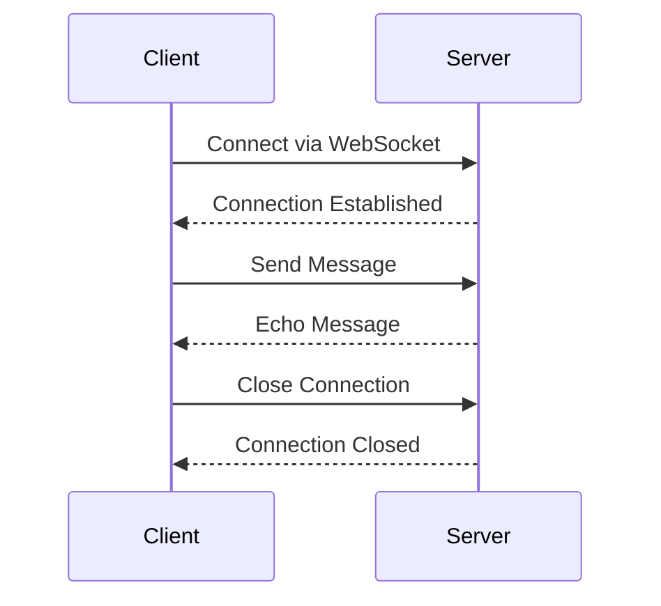

## 13.4 Networking and Web Services

The world of modern applications relies heavily on networking and web services to communicate between clients and servers. In this section, we will delve into the intricacies of building RESTful APIs and implementing WebSockets for real-time communication using Swift. By the end of this guide, you will have a solid understanding of how to create robust networking solutions that can power your iOS, macOS, and server-side applications.

### Building RESTful APIs

RESTful APIs (Representational State Transfer) are a popular architectural style for designing networked applications. They use HTTP requests to perform CRUD (Create, Read, Update, Delete) operations on resources. Let's explore how to build RESTful APIs in Swift.

#### Defining Routes

Routes are the backbone of any RESTful API. They map incoming HTTP requests to specific handlers that process the requests. In Swift, frameworks like Vapor make it easy to define routes.

```swift
import Vapor

func routes(_ app: Application) throws {
    // Define a route for GET requests to "/hello"
    app.get("hello") { req -> String in
        return "Hello, world!"
    }
    
    // Define a route for POST requests to "/api/users"
    app.post("api", "users") { req -> HTTPStatus in
        // Handle user creation
        return .created
    }
}
```

In the above example, we define two routes: one for a simple GET request and another for a POST request to create a user. Each route is associated with a handler that processes the request and returns a response.

#### Handling Requests

Handling requests involves parsing the incoming data, such as parameters, headers, and body content. Let's see how we can achieve this in Swift.

```swift
import Vapor

// Define a model for a User
struct User: Content {
    var id: UUID?
    var name: String
    var email: String
}

func createUserHandler(_ req: Request) throws -> EventLoopFuture<User> {
    // Decode the incoming JSON request body into a User model
    let user = try req.content.decode(User.self)
    
    // Save the user to the database (omitted for brevity)
    
    return req.eventLoop.future(user)
}
```

In this example, we define a `User` model conforming to `Content`, which allows it to be encoded and decoded from JSON. The `createUserHandler` function decodes the incoming request body into a `User` instance.

#### Responding to Clients

Once a request is processed, the server needs to respond to the client. Responses can be in various formats such as JSON, HTML, or plain text.

```swift
import Vapor

func getUserHandler(_ req: Request) throws -> EventLoopFuture<User> {
    // Fetch the user from the database (omitted for brevity)
    let user = User(id: UUID(), name: "John Doe", email: "john.doe@example.com")
    
    // Return the user as a JSON response
    return req.eventLoop.future(user)
}
```

Here, the `getUserHandler` function returns a `User` instance as a JSON response. Vapor automatically handles the conversion of the `User` model to JSON.

### WebSockets for Real-Time Communication

WebSockets provide a way to establish a persistent, two-way communication channel between a client and a server. This is ideal for real-time applications such as chat apps or live updates.

#### Establishing Connections

To use WebSockets in Swift, you can leverage frameworks like Vapor, which provide built-in support for WebSocket connections.

```swift
import Vapor

func configureWebSockets(_ app: Application) {
    app.webSocket("chat") { req, ws in
        // Handle WebSocket connection
        ws.onText { ws, text in
            print("Received text: \\(text)")
            
            // Echo the text back to the client
            ws.send("Echo: \\(text)")
        }
        
        ws.onClose.whenComplete { _ in
            print("WebSocket connection closed")
        }
    }
}
```

In this example, we define a WebSocket route for a chat application. When a client connects, we handle incoming text messages and echo them back to the client.

#### Event Handling

WebSockets are event-driven, meaning you can define handlers for various events such as receiving messages or closing the connection.

```swift
import Vapor

func configureWebSocketHandlers(_ app: Application) {
    app.webSocket("notifications") { req, ws in
        ws.onBinary { ws, binary in
            print("Received binary data")
            
            // Process binary data (omitted for brevity)
        }
        
        ws.onError { ws, error in
            print("WebSocket error: \\(error)")
        }
    }
}
```

In this example, we handle binary data and errors on a WebSocket connection. This flexibility allows you to build complex real-time applications.

### Visualizing WebSocket Communication

To better understand how WebSockets facilitate real-time communication, let's visualize the process using a sequence diagram.



This diagram illustrates the sequence of events in a WebSocket communication: establishing a connection, sending and receiving messages, and closing the connection.

### Swift Unique Features

Swift offers several unique features that enhance networking and web services development:

- **Type Safety**: Swift's strong type system helps prevent errors when handling network data.
- **Protocol-Oriented Programming**: Leverage protocols to define flexible and reusable networking components.
- **Swift Concurrency**: Use async/await to handle asynchronous network operations cleanly and efficiently.

### Differences and Similarities

It's important to distinguish between RESTful APIs and WebSockets:

- **RESTful APIs** are stateless and use HTTP requests to perform operations on resources. They are ideal for CRUD operations.
- **WebSockets** provide a persistent connection for real-time communication, suitable for applications requiring low-latency updates.

### Try It Yourself

Experiment with the code examples provided in this section. Try modifying the routes, handling different types of requests, and implementing WebSocket communication for various use cases. Remember, the best way to learn is by doing!

### Knowledge Check

- Explain the difference between RESTful APIs and WebSockets.
- How do you define a route in Vapor?
- What is the purpose of the `Content` protocol in Vapor?

### Embrace the Journey

Networking and web services are crucial components of modern applications. As you continue to explore these concepts, remember to stay curious and keep experimenting. The journey of mastering Swift networking is filled with opportunities to build innovative and efficient solutions.

## Quiz Time!



### What is a RESTful API?

- [x] An architectural style for designing networked applications using HTTP requests.
- [ ] A protocol for real-time communication between clients and servers.
- [ ] A library for handling network connections in Swift.
- [ ] A design pattern for structuring code in Swift applications.

> **Explanation:** RESTful APIs use HTTP requests to perform operations on resources, following an architectural style for networked applications.

### How do you define a route in Vapor?

- [x] By using the `app.get` or `app.post` methods with a URL path and a handler.
- [ ] By creating a new instance of `Route` and adding it to the application.
- [ ] By using the `RouteBuilder` class to construct routes.
- [ ] By defining a new protocol that conforms to `Routable`.

> **Explanation:** In Vapor, routes are defined using methods like `app.get` or `app.post`, specifying a URL path and a handler function.

### What is the purpose of the `Content` protocol in Vapor?

- [x] To enable models to be encoded and decoded from JSON.
- [ ] To provide a way to handle errors in Vapor applications.
- [ ] To define the structure of HTTP requests and responses.
- [ ] To manage database connections in Vapor.

> **Explanation:** The `Content` protocol in Vapor allows models to be easily encoded and decoded from JSON, facilitating request and response handling.

### What is a key difference between RESTful APIs and WebSockets?

- [x] RESTful APIs are stateless, while WebSockets provide a persistent connection.
- [ ] RESTful APIs use TCP, while WebSockets use HTTP.
- [ ] RESTful APIs are used for real-time communication, while WebSockets are not.
- [ ] RESTful APIs require a persistent connection, while WebSockets do not.

> **Explanation:** RESTful APIs are stateless and use HTTP requests, whereas WebSockets provide a persistent connection for real-time communication.

### How can you handle binary data in a WebSocket connection using Vapor?

- [x] By using the `ws.onBinary` method to define a handler for binary data.
- [ ] By converting binary data to text and using `ws.onText`.
- [ ] By implementing a custom protocol for binary communication.
- [ ] By using the `BinaryHandler` class provided by Vapor.

> **Explanation:** The `ws.onBinary` method in Vapor allows you to define a handler for binary data received over a WebSocket connection.

### What is a common use case for WebSockets?

- [x] Real-time chat applications.
- [ ] Batch processing of large datasets.
- [ ] Static website hosting.
- [ ] Generating reports from a database.

> **Explanation:** WebSockets are commonly used for real-time applications like chat, where low-latency communication is essential.

### Which Swift feature enhances networking by preventing errors when handling network data?

- [x] Type Safety.
- [ ] Automatic Reference Counting (ARC).
- [ ] Protocol Extensions.
- [ ] Optionals.

> **Explanation:** Swift's strong type system, or type safety, helps prevent errors when handling network data by ensuring type correctness.

### How does Swift's concurrency model improve network operations?

- [x] By using async/await for clean and efficient asynchronous operations.
- [ ] By providing a built-in HTTP client for network requests.
- [ ] By allowing multiple threads to access shared data simultaneously.
- [ ] By using synchronous operations for all network requests.

> **Explanation:** Swift's concurrency model, with async/await, allows for clean and efficient handling of asynchronous network operations.

### What is the role of the `EventLoopFuture` in Vapor?

- [x] To represent the result of an asynchronous operation.
- [ ] To manage HTTP request headers.
- [ ] To define routes in a Vapor application.
- [ ] To handle errors in network requests.

> **Explanation:** `EventLoopFuture` in Vapor represents the result of an asynchronous operation, allowing for non-blocking code execution.

### True or False: WebSockets are ideal for CRUD operations.

- [ ] True
- [x] False

> **Explanation:** WebSockets are not ideal for CRUD operations; they are better suited for real-time communication. RESTful APIs are more appropriate for CRUD operations.




