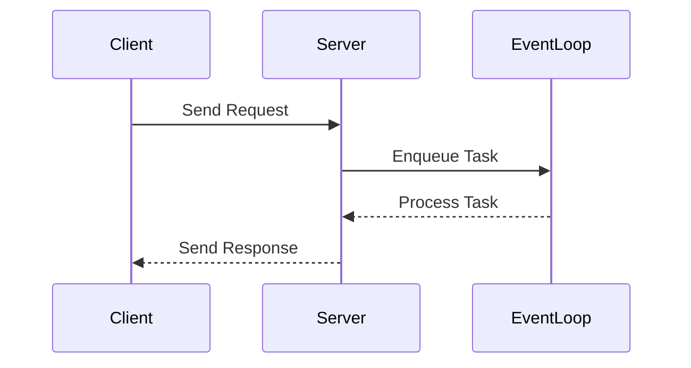

## 13.5 Concurrency and Async I/O

Concurrency and asynchronous I/O are fundamental concepts for building efficient, scalable, and high-performance applications in Swift. In this section, we will delve into the intricacies of asynchronous programming, explore various concurrency models, and understand how Swift's unique features facilitate robust server-side development.

### Asynchronous Programming

Asynchronous programming allows a program to perform tasks concurrently without blocking the execution of other operations. This is particularly important in server-side applications where handling multiple client requests simultaneously is crucial for performance.

#### Event Loops

Event loops are a core component of asynchronous programming, especially in non-blocking I/O operations. They provide a mechanism to handle events and callbacks in an efficient, event-driven architecture.

- **Concept**: An event loop continuously checks for new events or tasks and processes them as they become available. This allows the application to remain responsive even when performing I/O operations.
- **Implementation**: In Swift, event loops can be implemented using libraries like SwiftNIO, which provides a robust framework for building event-driven network applications.

```swift
import NIO

let group = MultiThreadedEventLoopGroup(numberOfThreads: System.coreCount)
defer {
    try? group.syncShutdownGracefully()
}

let promise = group.next().makePromise(of: String.self)
promise.futureResult.whenSuccess { value in
    print("Received value: \\(value)")
}

promise.succeed("Hello, Event Loop!")
```

In this example, we create a multi-threaded event loop group and use a promise to handle asynchronous results. The event loop ensures that the promise is fulfilled without blocking the main thread.

#### Async/Await

Swift's async/await syntax simplifies the process of writing asynchronous code by allowing developers to write code that looks synchronous while still being non-blocking.

- **Async Functions**: Functions marked with `async` can perform asynchronous operations and must be awaited by the caller.
- **Await Keyword**: The `await` keyword is used to pause the execution of an async function until the awaited operation completes.

```swift
func fetchData() async throws -> String {
    // Simulating an asynchronous network call
    try await Task.sleep(nanoseconds: 1_000_000_000)
    return "Data fetched successfully"
}

Task {
    do {
        let result = try await fetchData()
        print(result)
    } catch {
        print("Error fetching data: \\(error)")
    }
}
```

This example demonstrates how to define an asynchronous function using `async` and handle its result using `await`. The function `fetchData` simulates a network call and returns a result after a delay.

### Concurrency Models

Concurrency models define how tasks are executed concurrently within an application. Swift provides several models to handle concurrency effectively.

#### Promise/Future Patterns

The Promise/Future pattern is a popular concurrency model for handling asynchronous results. It allows developers to work with values that may not be immediately available.

- **Promise**: Represents a value that will be available in the future.
- **Future**: Represents the result of an asynchronous operation.

```swift
import NIO

let promise = group.next().makePromise(of: Int.self)

promise.futureResult.whenComplete { result in
    switch result {
    case .success(let value):
        print("Received value: \\(value)")
    case .failure(let error):
        print("Error: \\(error)")
    }
}

promise.succeed(42)
```

In this code snippet, we create a promise and use it to handle an asynchronous result. The future is used to register callbacks that are executed when the promise is fulfilled.

#### SwiftNIO

SwiftNIO is a powerful, low-level networking framework designed for building high-performance servers. It provides essential tools for handling concurrency and asynchronous I/O in Swift applications.

- **Core Components**: SwiftNIO includes event loops, channels, and handlers that work together to process network events efficiently.
- **Use Cases**: Ideal for building web servers, proxies, and other networked applications that require high throughput and low latency.

```swift
import NIO
import NIOHTTP1

final class HTTPHandler: ChannelInboundHandler {
    typealias InboundIn = HTTPServerRequestPart
    typealias OutboundOut = HTTPServerResponsePart

    func channelRead(context: ChannelHandlerContext, data: NIOAny) {
        let reqPart = self.unwrapInboundIn(data)
        switch reqPart {
        case .head(let request):
            print("Received request: \\(request.uri)")
        case .body:
            break
        case .end:
            let responseHead = HTTPResponseHead(version: request.version, status: .ok)
            context.write(self.wrapOutboundOut(.head(responseHead)), promise: nil)
            context.write(self.wrapOutboundOut(.end(nil)), promise: nil)
            context.flush()
        }
    }
}

let group = MultiThreadedEventLoopGroup(numberOfThreads: System.coreCount)
let bootstrap = ServerBootstrap(group: group)
    .serverChannelOption(ChannelOptions.backlog, value: 256)
    .childChannelInitializer { channel in
        channel.pipeline.addHandler(HTTPHandler())
    }

let channel = try bootstrap.bind(host: "localhost", port: 8080).wait()
print("Server running on:", channel.localAddress!)
try channel.closeFuture.wait()
```

This example sets up a simple HTTP server using SwiftNIO. The `HTTPHandler` processes incoming HTTP requests and sends back a response.

### Visualizing Concurrency and Async I/O

To better understand how concurrency and async I/O work together, let's visualize the flow of an asynchronous operation using a Mermaid.js sequence diagram.



This diagram illustrates the interaction between a client, server, and event loop during an asynchronous operation. The event loop manages the task queue, ensuring that tasks are processed efficiently without blocking the server.

### Swift Unique Features

Swift provides several unique features that enhance concurrency and async I/O:

- **Actors**: Swift's actor model helps manage state in a concurrent environment by ensuring that only one task can access an actor's mutable state at a time.
- **Structured Concurrency**: Swift's structured concurrency model allows developers to manage concurrent tasks in a more organized and predictable manner.

```swift
actor Counter {
    private var value = 0

    func increment() {
        value += 1
    }

    func getValue() -> Int {
        return value
    }
}

Task {
    let counter = Counter()
    await counter.increment()
    print(await counter.getValue())
}
```

In this example, we define an actor `Counter` to manage a shared state. The actor ensures that the state is accessed safely across concurrent tasks.

### Differences and Similarities

Concurrency and async I/O are often confused with each other, but they serve different purposes:

- **Concurrency**: Refers to the ability to execute multiple tasks simultaneously, improving the efficiency and responsiveness of an application.
- **Async I/O**: Focuses on performing I/O operations without blocking the execution of other tasks, ensuring that the application remains responsive.

Both concepts are essential for building high-performance applications, and Swift provides robust tools and patterns to leverage these capabilities effectively.

### Design Considerations

When implementing concurrency and async I/O in Swift, consider the following:

- **Thread Safety**: Ensure that shared resources are accessed safely across concurrent tasks.
- **Error Handling**: Implement robust error handling mechanisms to manage failures in asynchronous operations.
- **Performance**: Optimize the use of resources to maximize performance and minimize latency.

### Try It Yourself

Experiment with the code examples provided in this section. Try modifying the event loop example to handle multiple promises or extend the SwiftNIO server to process different types of HTTP requests. By experimenting with these examples, you'll gain a deeper understanding of how concurrency and async I/O work in Swift.

### References and Links

- [SwiftNIO Documentation](https://github.com/apple/swift-nio)
- [Swift Concurrency Guide](https://swift.org/documentation/concurrency/)
- [Async/Await in Swift](https://developer.apple.com/documentation/swift/asynchronous_programming_with_async_and_await)

### Knowledge Check

- Explain the role of event loops in asynchronous programming.
- Describe the difference between concurrency and async I/O.
- How does Swift's async/await syntax simplify asynchronous code?
- What are the key components of SwiftNIO?

### Embrace the Journey

Remember, mastering concurrency and async I/O in Swift is a journey. As you progress, you'll build more complex and efficient applications. Keep experimenting, stay curious, and enjoy the process!

## Quiz Time!



### What is the primary role of an event loop in asynchronous programming?

- [x] To manage and process events and callbacks efficiently
- [ ] To block the execution of tasks
- [ ] To handle synchronous operations
- [ ] To manage memory allocation

> **Explanation:** An event loop manages and processes events and callbacks efficiently in an asynchronous, non-blocking manner.

### How does Swift's async/await syntax benefit asynchronous programming?

- [x] It simplifies asynchronous code flow
- [ ] It blocks the main thread
- [ ] It eliminates the need for concurrency
- [ ] It only works with synchronous functions

> **Explanation:** Swift's async/await syntax simplifies the flow of asynchronous code by allowing developers to write code that looks synchronous while remaining non-blocking.

### What is the difference between a Promise and a Future in concurrency models?

- [x] A Promise represents a value that will be available in the future, while a Future represents the result of an asynchronous operation
- [ ] A Future represents a value that will be available in the future, while a Promise represents the result of an asynchronous operation
- [ ] Both Promise and Future are the same
- [ ] Promise and Future are unrelated to concurrency

> **Explanation:** A Promise represents a value that will be available in the future, while a Future represents the result of an asynchronous operation.

### What is SwiftNIO primarily used for?

- [x] Building high-performance networked applications
- [ ] Managing memory allocation
- [ ] Simplifying UI development
- [ ] Handling synchronous operations

> **Explanation:** SwiftNIO is a low-level networking framework designed for building high-performance networked applications.

### Which of the following is a unique feature of Swift that aids concurrency?

- [x] Actors
- [ ] Threads
- [ ] Semaphores
- [ ] Locks

> **Explanation:** Swift's actor model helps manage state in a concurrent environment by ensuring that only one task can access an actor's mutable state at a time.

### In Swift, what keyword is used to pause the execution of an async function until an operation completes?

- [x] await
- [ ] async
- [ ] defer
- [ ] wait

> **Explanation:** The `await` keyword is used to pause the execution of an async function until the awaited operation completes.

### What is the purpose of structured concurrency in Swift?

- [x] To manage concurrent tasks in a more organized and predictable manner
- [ ] To eliminate the need for async/await
- [ ] To block concurrent tasks
- [ ] To handle synchronous operations

> **Explanation:** Swift's structured concurrency model allows developers to manage concurrent tasks in a more organized and predictable manner.

### What is a key consideration when implementing concurrency in Swift?

- [x] Thread Safety
- [ ] Blocking the main thread
- [ ] Avoiding async/await
- [ ] Ignoring error handling

> **Explanation:** Ensuring thread safety is crucial when implementing concurrency in Swift to prevent data races and ensure safe access to shared resources.

### Which concurrency model is ideal for handling asynchronous results?

- [x] Promise/Future Patterns
- [ ] Blocking I/O
- [ ] Synchronous Operations
- [ ] Thread Pools

> **Explanation:** The Promise/Future pattern is ideal for handling asynchronous results by allowing developers to work with values that may not be immediately available.

### True or False: Concurrency and async I/O are the same thing.

- [ ] True
- [x] False

> **Explanation:** Concurrency refers to the ability to execute multiple tasks simultaneously, while async I/O focuses on performing I/O operations without blocking the execution of other tasks.




