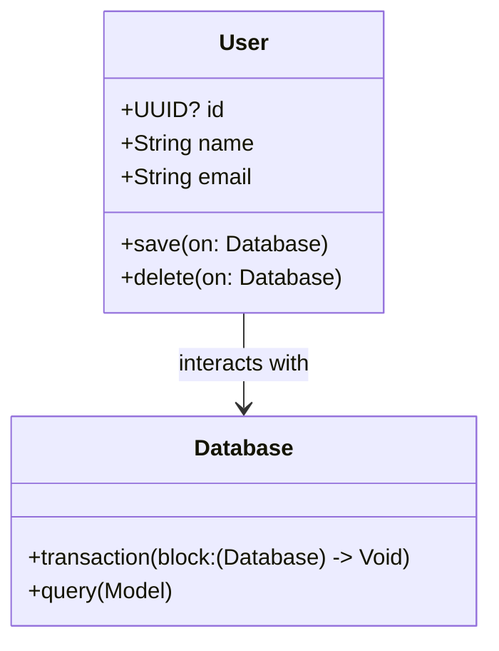

## 13.6 Database Integration and ORM Patterns

In the realm of server-side Swift development, database integration is a crucial aspect that ensures efficient data management and retrieval. Object-Relational Mapping (ORM) is a technique that allows developers to interact with databases using Swift objects, abstracting the complexity of raw SQL queries. In this section, we will delve into ORM patterns in Swift, focusing on Fluent, Vapor's ORM framework, and explore various database operations, including CRUD, query building, transactions, and batch operations.

### Object-Relational Mapping (ORM)

Object-Relational Mapping (ORM) is a programming technique used to convert data between incompatible type systems in object-oriented programming languages. In Swift, ORM allows developers to work with database records as if they were Swift objects, providing a more intuitive and type-safe way to interact with databases.

#### Fluent: Vapor's ORM for Database Interactions

Fluent is an ORM framework provided by Vapor, a popular server-side Swift framework. Fluent simplifies database interactions by allowing developers to define models using Swift structs or classes and perform database operations using Swift syntax.

**Key Features of Fluent:**

- **Type Safety**: Fluent leverages Swift's strong type system to ensure compile-time safety.
- **Database Agnostic**: Fluent supports multiple database backends, including PostgreSQL, MySQL, and SQLite.
- **Migration Support**: Fluent provides tools for managing database schema migrations.
- **Query Builder**: Fluent offers a powerful query builder for constructing complex queries using Swift syntax.

#### Defining Models: Mapping Swift Structs or Classes to Database Tables

In Fluent, models are defined as Swift structs or classes that conform to the `Model` protocol. Each model represents a table in the database, and each property corresponds to a column in the table.

Here's an example of defining a `User` model in Fluent:

```swift
import Fluent
import Vapor

final class User: Model, Content {
    static let schema = "users"

    @ID(key: .id)
    var id: UUID?

    @Field(key: "name")
    var name: String

    @Field(key: "email")
    var email: String

    init() {}

    init(id: UUID? = nil, name: String, email: String) {
        self.id = id
        self.name = name
        self.email = email
    }
}
```

**Explanation:**

- **Schema**: The `schema` property defines the table name.
- **ID**: The `@ID` property is used to define the primary key.
- **Fields**: The `@Field` properties represent the columns in the table.

### Database Operations

Once models are defined, Fluent provides a set of operations to interact with the database. These operations include creating, reading, updating, and deleting records, commonly referred to as CRUD operations.

#### CRUD Operations: Creating, Reading, Updating, Deleting Records

**Create Operation:**

To create a new record in the database, instantiate the model and save it:

```swift
let user = User(name: "John Doe", email: "johndoe@example.com")
try await user.save(on: database)
```

**Read Operation:**

To retrieve records from the database, use Fluent's query builder:

```swift
let users = try await User.query(on: database).all()
```

**Update Operation:**

To update an existing record, modify the properties and save the changes:

```swift
if let user = try await User.find(userID, on: database) {
    user.name = "Jane Doe"
    try await user.save(on: database)
}
```

**Delete Operation:**

To delete a record from the database, use the `delete` method:

```swift
if let user = try await User.find(userID, on: database) {
    try await user.delete(on: database)
}
```

### Query Building: Constructing Queries Using Swift Syntax

Fluent's query builder allows developers to construct complex queries using a Swift syntax, providing a more readable and maintainable way to interact with databases.

**Example of Query Building:**

```swift
let users = try await User.query(on: database)
    .filter(\.$name == "John Doe")
    .sort(\.$email, .ascending)
    .limit(10)
    .all()
```

**Explanation:**

- **Filter**: The `filter` method is used to apply conditions to the query.
- **Sort**: The `sort` method specifies the order of the results.
- **Limit**: The `limit` method restricts the number of results returned.

### Transactions and Batch Operations

Transactions and batch operations are essential for ensuring data integrity and efficiently handling large datasets.

#### Atomic Operations: Ensuring Data Integrity

Transactions allow multiple database operations to be executed as a single unit, ensuring that either all operations succeed or none at all. This is crucial for maintaining data integrity.

**Example of a Transaction:**

```swift
try await database.transaction { db in
    let user = User(name: "Alice", email: "alice@example.com")
    try await user.save(on: db)

    let profile = Profile(userID: user.id!, bio: "Swift Developer")
    try await profile.save(on: db)
}
```

**Explanation:**

- **Transaction Block**: The `transaction` method executes the enclosed operations as a single transaction.
- **Rollback**: If any operation fails, the transaction is rolled back, undoing all changes.

#### Performing Bulk Actions: Efficiently Handling Large Data Sets

Batch operations allow multiple records to be inserted, updated, or deleted in a single database call, improving performance when handling large datasets.

**Example of a Bulk Insert:**

```swift
let users = [
    User(name: "Bob", email: "bob@example.com"),
    User(name: "Charlie", email: "charlie@example.com")
]

try await users.create(on: database)
```

**Explanation:**

- **Bulk Insert**: The `create` method is used to insert multiple records in a single operation.

### Visualizing ORM Patterns

To better understand the flow of ORM patterns in Swift, let's visualize the interaction between models, queries, and the database using a class diagram.



**Diagram Description:**

- **User Class**: Represents the model with properties and methods for database operations.
- **Database Class**: Represents the database connection and provides methods for transactions and queries.
- **Interaction**: The `User` class interacts with the `Database` to perform CRUD operations.

### Try It Yourself

To solidify your understanding of ORM patterns in Swift, try modifying the code examples provided:

1. **Add a New Model**: Define a new model for a different entity (e.g., `Product`) and implement CRUD operations.
2. **Complex Query**: Construct a complex query using multiple filters and sorting criteria.
3. **Transaction Handling**: Implement a transaction that involves multiple models.

### References and Links

- [Vapor Documentation](https://docs.vapor.codes/)
- [Fluent ORM](https://docs.vapor.codes/fluent/overview/)
- [Swift.org](https://swift.org/)

### Knowledge Check

Before moving on, ensure you understand the following:

- How to define models in Fluent and map them to database tables.
- The process of performing CRUD operations using Fluent.
- Constructing queries using Fluent's query builder.
- The importance of transactions and how to implement them.

### Embrace the Journey

Remember, mastering database integration and ORM patterns in Swift is a journey. As you progress, you'll build more complex and efficient server-side applications. Keep experimenting, stay curious, and enjoy the process!

## Quiz Time!



### What is the primary purpose of an ORM in Swift?

- [x] To map Swift objects to database tables
- [ ] To perform network operations
- [ ] To handle user interface rendering
- [ ] To manage memory allocation

> **Explanation:** ORM stands for Object-Relational Mapping, which is used to map Swift objects to database tables.

### Which framework provides ORM capabilities in Vapor?

- [x] Fluent
- [ ] CoreData
- [ ] Alamofire
- [ ] Combine

> **Explanation:** Fluent is the ORM framework provided by Vapor for database interactions.

### What method is used to save a new record in Fluent?

- [x] save(on: Database)
- [ ] insert(on: Database)
- [ ] add(on: Database)
- [ ] persist(on: Database)

> **Explanation:** The `save(on: Database)` method is used to save a new record in Fluent.

### How do you ensure data integrity during multiple database operations in Swift?

- [x] Use transactions
- [ ] Use async/await
- [ ] Use closures
- [ ] Use error handling

> **Explanation:** Transactions ensure that multiple database operations are executed as a single unit, maintaining data integrity.

### What is the advantage of using batch operations?

- [x] Improved performance with large datasets
- [ ] Simplified code structure
- [ ] Enhanced security
- [ ] Better error handling

> **Explanation:** Batch operations allow multiple records to be processed in a single database call, improving performance with large datasets.

### What is the role of the `@Field` property in a Fluent model?

- [x] It represents a column in the database table
- [ ] It defines the primary key
- [ ] It specifies the table name
- [ ] It handles transactions

> **Explanation:** The `@Field` property in a Fluent model represents a column in the database table.

### Which method is used to delete a record in Fluent?

- [x] delete(on: Database)
- [ ] remove(on: Database)
- [ ] erase(on: Database)
- [ ] drop(on: Database)

> **Explanation:** The `delete(on: Database)` method is used to delete a record in Fluent.

### What does the `filter` method do in Fluent's query builder?

- [x] Applies conditions to the query
- [ ] Sorts the query results
- [ ] Limits the number of results
- [ ] Joins multiple tables

> **Explanation:** The `filter` method is used to apply conditions to the query in Fluent's query builder.

### True or False: Fluent can only be used with PostgreSQL databases.

- [ ] True
- [x] False

> **Explanation:** False. Fluent is database agnostic and supports multiple databases, including PostgreSQL, MySQL, and SQLite.

### What is the purpose of the `transaction` method in Fluent?

- [x] To execute multiple operations as a single unit
- [ ] To handle network requests
- [ ] To perform UI updates
- [ ] To manage concurrency

> **Explanation:** The `transaction` method in Fluent is used to execute multiple operations as a single unit, ensuring data integrity.




