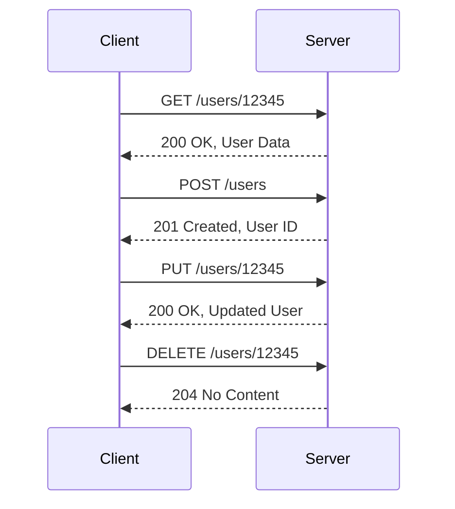

## 13.7 RESTful API Design

In the realm of modern software development, RESTful APIs play a pivotal role in enabling communication between different systems. Whether you're building a mobile app, a web service, or a server-side application in Swift, understanding the principles and best practices of RESTful API design is crucial for creating efficient, scalable, and maintainable systems. This section delves into the core principles of RESTful API design, explores best practices, and provides guidance on documenting APIs effectively.

### Principles of RESTful API Design

REST, or Representational State Transfer, is an architectural style that leverages HTTP protocols to create scalable web services. Here are the core principles of RESTful API design:

#### Statelessness

One of the fundamental principles of REST is statelessness. This means that each API request from a client must contain all the information necessary to understand and process the request. The server does not store any session information about the client, making each request independent and self-contained.

**Benefits of Statelessness:**

- **Scalability**: Statelessness allows servers to handle requests independently, making it easier to scale horizontally.
- **Reliability**: With no session state stored on the server, there's less risk of data inconsistency.
- **Simplified Server Logic**: Stateless APIs reduce the complexity of server-side logic.

**Example:**

```swift
// A simple GET request to fetch a user's profile
GET /users/12345
```

In this example, the server processes the request based solely on the information provided in the URL and headers, without relying on any stored session data.

#### Resource-Based URLs

RESTful APIs are designed around resources, which are identified by URLs. Instead of using verbs to describe actions, RESTful APIs use nouns to represent resources.

**Guidelines for Resource-Based URLs:**

- Use plural nouns (e.g., `/users`, `/products`).
- Avoid verbs in URLs (e.g., `/getUser` is not recommended).
- Nest resources to represent relationships (e.g., `/users/12345/orders`).

**Example:**

```swift
// Fetch all orders for a specific user
GET /users/12345/orders
```

This URL represents a collection of `orders` associated with a specific `user`.

### Best Practices for RESTful API Design

To ensure your RESTful APIs are robust and maintainable, consider the following best practices:

#### Versioning

APIs evolve over time, and changes may break existing clients. Implementing versioning allows you to introduce new features or changes without disrupting existing clients.

**Versioning Strategies:**

- **URL Versioning**: Include the version number in the URL (e.g., `/v1/users`).
- **Header Versioning**: Use custom headers to specify the API version (e.g., `Accept: application/vnd.example.v1+json`).

**Example:**

```swift
// Versioned URL
GET /v1/users/12345
```

#### Pagination

When dealing with large data sets, it's essential to implement pagination to improve performance and user experience. Pagination allows clients to request data in chunks, reducing the load on the server and the client.

**Pagination Techniques:**

- **Offset-Based Pagination**: Use query parameters to specify the starting point and limit (e.g., `?offset=0&limit=10`).
- **Cursor-Based Pagination**: Use cursors to navigate through data (e.g., `?cursor=abc123`).

**Example:**

```swift
// Offset-based pagination
GET /users?offset=0&limit=10
```

This request fetches the first 10 users from the list.

### API Documentation

Comprehensive API documentation is crucial for developers who consume your API. It provides clarity on how to use the API effectively and reduces the learning curve.

#### OpenAPI/Swagger

OpenAPI (formerly known as Swagger) is a widely used specification for documenting RESTful APIs. It provides a standard way to describe your API's endpoints, request/response models, and authentication mechanisms.

**Benefits of OpenAPI:**

- **Standardization**: Provides a consistent format for API documentation.
- **Automation**: Tools like Swagger UI can generate interactive documentation from OpenAPI specifications.

**Example:**

```yaml
openapi: 3.0.0
info:
  title: User API
  version: 1.0.0
paths:
  /users/{userId}:
    get:
      summary: Get a user by ID
      parameters:
        - name: userId
          in: path
          required: true
          schema:
            type: string
      responses:
        '200':
          description: Successful response
```

#### Interactive Documentation

Interactive documentation allows developers to try out API endpoints directly from the documentation, making it easier to understand how the API works.

**Tools for Interactive Documentation:**

- **Swagger UI**: Provides a web-based interface for interacting with APIs.
- **Postman**: Offers a powerful platform for exploring and testing APIs.

### Implementing RESTful APIs in Swift

Swift, with its strong type system and modern features, is an excellent choice for building RESTful APIs. Let's explore how to implement some of the concepts discussed above using Swift.

#### Building a Simple RESTful API with Vapor

Vapor is a popular server-side Swift framework that makes it easy to build RESTful APIs. Here's a simple example of creating a RESTful API using Vapor.

**Setup Vapor Project:**

First, install Vapor using the Swift Package Manager:

```bash
brew install vapor/tap/vapor
vapor new MyAPI --api
cd MyAPI
```

**Define a Model:**

Create a Swift model to represent a resource, such as a `User`.

```swift
import Vapor

final class User: Content {
    var id: UUID?
    var name: String
    var email: String

    init(name: String, email: String) {
        self.name = name
        self.email = email
    }
}
```

**Create a Controller:**

Define a controller to handle HTTP requests related to the `User` resource.

```swift
import Vapor

struct UserController: RouteCollection {
    func boot(routes: RoutesBuilder) throws {
        let users = routes.grouped("users")
        users.get(use: index)
        users.post(use: create)
        users.group(":userID") { user in
            user.get(use: show)
            user.put(use: update)
            user.delete(use: delete)
        }
    }

    func index(req: Request) throws -> EventLoopFuture<[User]> {
        // Retrieve all users from the database
    }

    func create(req: Request) throws -> EventLoopFuture<User> {
        // Create a new user
    }

    func show(req: Request) throws -> EventLoopFuture<User> {
        // Retrieve a specific user by ID
    }

    func update(req: Request) throws -> EventLoopFuture<User> {
        // Update a user
    }

    func delete(req: Request) throws -> EventLoopFuture<HTTPStatus> {
        // Delete a user
    }
}
```

**Register Routes:**

Finally, register the routes in your application.

```swift
import Vapor

func routes(_ app: Application) throws {
    let userController = UserController()
    try app.register(collection: userController)
}
```

With this setup, you have a basic RESTful API for managing users. You can extend this example by adding authentication, validation, and error handling.

### Visualizing RESTful API Design

To better understand the flow of a RESTful API, let's visualize the interaction between a client and a server.



In this sequence diagram, we see a client making various HTTP requests to a server to interact with the `User` resource. Each interaction follows the principles of RESTful design, ensuring a clean and consistent API.

### Try It Yourself

Experiment with the code examples provided in this section. You can try modifying the `User` model to include additional fields, such as `age` or `address`. Implement additional endpoints, such as searching for users by name or email. By experimenting with the code, you'll gain a deeper understanding of how RESTful APIs work in Swift.

### Knowledge Check

To reinforce your understanding of RESTful API design, consider the following questions:

- What are the benefits of statelessness in RESTful APIs?
- How does resource-based URL design improve API readability?
- What are the advantages of using OpenAPI for API documentation?
- How can versioning help manage changes in an API?
- Why is pagination important when dealing with large data sets?

### Embrace the Journey

Remember, mastering RESTful API design is a journey. As you continue to build and refine your APIs, keep experimenting and learning. The principles and best practices discussed in this section will serve as a foundation for creating efficient and scalable APIs. Stay curious, embrace challenges, and enjoy the process of building robust systems with Swift.

## Quiz Time!



### What is a key benefit of statelessness in RESTful APIs?

- [x] Scalability
- [ ] Complexity
- [ ] Session management
- [ ] Security

> **Explanation:** Statelessness allows servers to handle requests independently, making it easier to scale horizontally.

### What is the recommended way to represent resources in RESTful APIs?

- [x] Using nouns in URLs
- [ ] Using verbs in URLs
- [ ] Using adjectives in URLs
- [ ] Using adverbs in URLs

> **Explanation:** RESTful APIs use nouns to represent resources, making URLs more intuitive and consistent.

### How can you manage changes in an API over time?

- [x] Versioning
- [ ] Caching
- [ ] Logging
- [ ] Monitoring

> **Explanation:** Versioning allows you to introduce new features or changes without disrupting existing clients.

### What is a common technique for handling large data sets in APIs?

- [x] Pagination
- [ ] Encryption
- [ ] Compression
- [ ] Caching

> **Explanation:** Pagination allows clients to request data in chunks, improving performance and user experience.

### Which tool is commonly used for documenting RESTful APIs?

- [x] OpenAPI/Swagger
- [ ] Postman
- [ ] GitHub
- [ ] Docker

> **Explanation:** OpenAPI (formerly Swagger) is a widely used specification for documenting RESTful APIs.

### What is an advantage of using interactive documentation for APIs?

- [x] Allows developers to try out API endpoints
- [ ] Increases server load
- [ ] Reduces security
- [ ] Complicates API usage

> **Explanation:** Interactive documentation allows developers to try out API endpoints directly, making it easier to understand how the API works.

### Which of the following is a versioning strategy for APIs?

- [x] URL Versioning
- [ ] JSON Versioning
- [ ] XML Versioning
- [ ] HTML Versioning

> **Explanation:** URL Versioning involves including the version number in the URL (e.g., `/v1/users`).

### What is a benefit of using Vapor for building RESTful APIs in Swift?

- [x] Strong type system and modern features
- [ ] Limited scalability
- [ ] Complex setup
- [ ] Lack of community support

> **Explanation:** Vapor leverages Swift's strong type system and modern features, making it an excellent choice for building RESTful APIs.

### How does resource-based URL design improve API design?

- [x] Improves readability and consistency
- [ ] Increases complexity
- [ ] Reduces performance
- [ ] Limits scalability

> **Explanation:** Resource-based URL design uses nouns to represent resources, improving readability and consistency.

### True or False: Statelessness in RESTful APIs requires the server to store session information.

- [ ] True
- [x] False

> **Explanation:** Statelessness means that each API request must contain all the information necessary to understand and process the request, without relying on stored session data.




