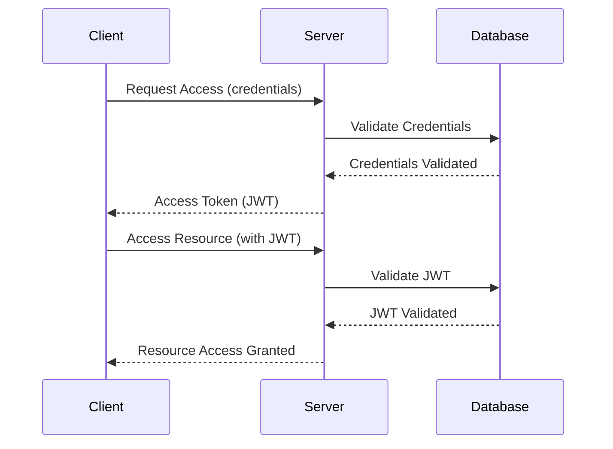

## 13.8 Authentication and Security on the Server

In today's digital landscape, securing server-side applications is paramount. As Swift continues to grow in popularity for server-side development, understanding and implementing robust authentication and security practices is crucial. This section delves into key authentication methods, essential security measures, and encryption techniques to fortify your server-side Swift applications.

### Authentication Methods

Authentication is the process of verifying the identity of a user or system. In server-side Swift development, implementing secure and efficient authentication methods is essential to protect sensitive data and ensure that only authorized users can access resources.

#### JWT (JSON Web Tokens)

**JSON Web Tokens (JWT)** are a compact, URL-safe means of representing claims to be transferred between two parties. JWTs are used for stateless authentication, meaning the server does not need to store session information.

**How JWT Works:**

1. **Header**: Specifies the type of token and the signing algorithm.
2. **Payload**: Contains the claims, which are statements about an entity (typically, the user) and additional metadata.
3. **Signature**: Ensures the token's integrity and authenticity.

**Implementing JWT in Swift:**

```swift
import Foundation
import JWTKit

struct MyJWT: JWTPayload {
    var exp: ExpirationClaim
    var userId: String

    func verify(using signer: JWTSigner) throws {
        try exp.verifyNotExpired()
    }
}

let signer = JWTSigner.hs256(key: "secret")
let payload = MyJWT(exp: .init(value: Date().addingTimeInterval(3600)), userId: "12345")

do {
    // Encoding the JWT
    let jwt = try signer.sign(payload)
    print("JWT: \\(jwt)")

    // Decoding the JWT
    let verifiedPayload = try signer.verify(jwt, as: MyJWT.self)
    print("Verified User ID: \\(verifiedPayload.userId)")
} catch {
    print("JWT Error: \\(error)")
}
```

**Key Points:**
- **Stateless**: JWTs do not require server-side storage.
- **Scalable**: Ideal for distributed systems.
- **Secure**: Ensure to use strong secret keys and algorithms.

#### OAuth2

**OAuth2** is an authorization framework that enables applications to obtain limited access to user accounts on an HTTP service. It works by delegating user authentication to the service that hosts the user account.

**OAuth2 Flow:**

1. **Authorization Request**: Client requests authorization from the resource owner.
2. **Authorization Grant**: Resource owner provides authorization.
3. **Access Token Request**: Client requests an access token from the authorization server.
4. **Access Token Response**: Authorization server issues an access token.
5. **Resource Request**: Client accesses resources using the access token.

**Implementing OAuth2 in Swift:**

```swift
import Foundation

struct OAuth2Client {
    let clientId: String
    let clientSecret: String
    let tokenURL: URL

    func requestAccessToken(code: String, redirectURI: String, completion: @escaping (Result<String, Error>) -> Void) {
        var request = URLRequest(url: tokenURL)
        request.httpMethod = "POST"
        let body = "grant_type=authorization_code&code=\\(code)&redirect_uri=\\(redirectURI)&client_id=\\(clientId)&client_secret=\\(clientSecret)"
        request.httpBody = body.data(using: .utf8)
        request.setValue("application/x-www-form-urlencoded", forHTTPHeaderField: "Content-Type")

        URLSession.shared.dataTask(with: request) { data, response, error in
            if let error = error {
                completion(.failure(error))
                return
            }
            guard let data = data else {
                completion(.failure(NSError(domain: "OAuth2Client", code: -1, userInfo: [NSLocalizedDescriptionKey: "No data received"])))
                return
            }
            do {
                let json = try JSONSerialization.jsonObject(with: data, options: [])
                if let dict = json as? [String: Any], let accessToken = dict["access_token"] as? String {
                    completion(.success(accessToken))
                } else {
                    completion(.failure(NSError(domain: "OAuth2Client", code: -1, userInfo: [NSLocalizedDescriptionKey: "Invalid response"])))
                }
            } catch {
                completion(.failure(error))
            }
        }.resume()
    }
}
```

**Key Points:**
- **Delegated Authorization**: Allows third-party applications to access user data without exposing credentials.
- **Secure**: Reduces the risk of exposing sensitive information.

### Security Measures

Securing your server-side application involves implementing measures to protect against common vulnerabilities and attacks.

#### Input Validation

Input validation is the process of ensuring that user input is clean, correct, and useful. It is a crucial first step in preventing injection attacks, such as SQL injection and cross-site scripting (XSS).

**Best Practices for Input Validation:**

- **Sanitize Input**: Remove or escape potentially harmful characters.
- **Use Whitelists**: Define acceptable input patterns and reject anything that doesn't match.
- **Validate on the Server**: Never rely solely on client-side validation.

**Example of Input Validation in Swift:**

```swift
import Foundation

func isValidEmail(_ email: String) -> Bool {
    let emailRegex = "^[A-Z0-9a-z._%+-]+@[A-Za-z0-9.-]+\\.[A-Za-z]{2,}$"
    let emailTest = NSPredicate(format: "SELF MATCHES %@", emailRegex)
    return emailTest.evaluate(with: email)
}

let email = "test@example.com"
if isValidEmail(email) {
    print("Valid email address")
} else {
    print("Invalid email address")
}
```

#### Rate Limiting

Rate limiting is a technique used to control the amount of incoming and outgoing traffic to or from a network. It helps protect against denial-of-service (DoS) attacks and ensures fair usage among users.

**Implementing Rate Limiting:**

1. **Identify Critical Endpoints**: Determine which parts of your application need rate limiting.
2. **Define Limits**: Set thresholds for requests per user or IP address.
3. **Monitor and Log**: Keep track of request patterns and adjust limits as necessary.

**Example of Rate Limiting in Swift:**

```swift
import Vapor

func routes(_ app: Application) throws {
    app.get("rate-limited") { req -> String in
        let ip = req.remoteAddress?.description ?? "unknown"
        let limit = 100
        let currentCount = req.application.caches.memory.get(ip) ?? 0

        if currentCount >= limit {
            throw Abort(.tooManyRequests, reason: "Rate limit exceeded")
        }

        req.application.caches.memory.set(ip, currentCount + 1, expiresIn: .minutes(1))
        return "Request successful"
    }
}
```

### Encryption

Encryption is a fundamental aspect of securing data in transit and at rest. It ensures that data remains confidential and protected from unauthorized access.

#### SSL/TLS

**SSL/TLS** (Secure Sockets Layer/Transport Layer Security) are protocols that provide secure communication over a computer network. They are used to encrypt data in transit, ensuring privacy and data integrity.

**Implementing SSL/TLS in Swift:**

1. **Obtain a Certificate**: Purchase or generate a certificate from a trusted Certificate Authority (CA).
2. **Configure Your Server**: Set up your server to use the certificate for SSL/TLS.
3. **Use HTTPS**: Ensure all communication is done over HTTPS.

**Example of SSL/TLS Setup in Swift:**

```swift
import Vapor

let app = Application(.production)
defer { app.shutdown() }

app.http.server.configuration.hostname = "0.0.0.0"
app.http.server.configuration.port = 443
app.http.server.configuration.tlsConfiguration = .forServer(
    certificateChain: [.file("/path/to/cert.pem")],
    privateKey: .file("/path/to/key.pem")
)

app.get("secure-endpoint") { req in
    return "Secure communication"
}

try app.run()
```

#### Password Hashing

Storing passwords securely is critical to protecting user accounts. Password hashing is the process of converting a password into a fixed-length string of characters, which is typically a hash code.

**Best Practices for Password Hashing:**

- **Use Strong Hashing Algorithms**: Employ algorithms like bcrypt, scrypt, or Argon2.
- **Add Salt**: Add a unique salt to each password before hashing to prevent rainbow table attacks.
- **Iterate Hashing**: Apply the hashing function multiple times to increase security.

**Example of Password Hashing in Swift:**

```swift
import CryptoKit

func hashPassword(_ password: String, salt: String) -> String {
    let saltedPassword = password + salt
    let hashed = SHA256.hash(data: Data(saltedPassword.utf8))
    return hashed.compactMap { String(format: "%02x", $0) }.joined()
}

let password = "mySecurePassword"
let salt = "randomSalt"
let hashedPassword = hashPassword(password, salt: salt)
print("Hashed Password: \\(hashedPassword)")
```

### Visualizing Security Architecture

Let's visualize the security architecture of a server-side Swift application using a sequence diagram. This diagram illustrates the interaction between the client, server, and database during the authentication process.



### Knowledge Check

- **What is the primary purpose of JWTs in server-side applications?**
- **How does OAuth2 enhance security in third-party applications?**
- **What are some best practices for input validation?**
- **Why is rate limiting important in preventing DoS attacks?**
- **How does SSL/TLS protect data in transit?**
- **What are the key considerations when hashing passwords?**

### Try It Yourself

- **Modify the JWT example** to include additional claims, such as roles or permissions.
- **Experiment with the OAuth2 client** by integrating it with a real-world API that supports OAuth2.
- **Implement additional input validation** for different data types, such as phone numbers or URLs.
- **Adjust the rate limiting example** to use a different time window or request limit.
- **Set up a local server** with SSL/TLS using self-signed certificates.

### Embrace the Journey

Remember, mastering server-side security in Swift is an ongoing journey. As you continue to explore and implement these concepts, you'll build more secure and resilient applications. Stay curious, keep experimenting, and enjoy the process of learning and growing as a developer.

## Quiz Time!



### What is the primary purpose of JWTs in server-side applications?

- [x] Stateless authentication
- [ ] Encrypting data
- [ ] Rate limiting
- [ ] Input validation

> **Explanation:** JWTs are used for stateless authentication, allowing the server to verify user identity without storing session data.

### How does OAuth2 enhance security in third-party applications?

- [x] Delegated authorization
- [ ] Encrypting data
- [ ] Input validation
- [ ] Rate limiting

> **Explanation:** OAuth2 provides delegated authorization, allowing third-party applications to access user data without exposing credentials.

### What is a key practice for input validation?

- [x] Sanitize input
- [ ] Use weak passwords
- [ ] Ignore user input
- [ ] Disable SSL

> **Explanation:** Sanitizing input is crucial to prevent injection attacks and ensure data integrity.

### Why is rate limiting important?

- [x] Prevents DoS attacks
- [ ] Encrypts data
- [ ] Validates input
- [ ] Stores passwords

> **Explanation:** Rate limiting controls traffic to protect against denial-of-service attacks and ensure fair usage.

### How does SSL/TLS protect data in transit?

- [x] Encrypts data
- [ ] Validates input
- [ ] Limits requests
- [ ] Hashes passwords

> **Explanation:** SSL/TLS encrypts data in transit, ensuring privacy and data integrity.

### What is a consideration when hashing passwords?

- [x] Use strong algorithms
- [ ] Store passwords in plain text
- [ ] Ignore password security
- [ ] Use weak algorithms

> **Explanation:** Using strong hashing algorithms like bcrypt is essential for secure password storage.

### What is the role of salt in password hashing?

- [x] Prevents rainbow table attacks
- [ ] Encrypts data
- [ ] Validates input
- [ ] Limits requests

> **Explanation:** Salt is used to add uniqueness to each password hash, preventing rainbow table attacks.

### What does the acronym SSL stand for?

- [x] Secure Sockets Layer
- [ ] Simple Secure Layer
- [ ] Secure System Layer
- [ ] Secure Socket Link

> **Explanation:** SSL stands for Secure Sockets Layer, a protocol for securing data in transit.

### What is a benefit of using HTTPS?

- [x] Secure communication
- [ ] Faster data transfer
- [ ] Easier debugging
- [ ] Reduced server load

> **Explanation:** HTTPS ensures secure communication by encrypting data between the client and server.

### True or False: OAuth2 can be used for both authentication and authorization.

- [x] True
- [ ] False

> **Explanation:** OAuth2 is primarily used for authorization, but it can also facilitate authentication in some implementations.




