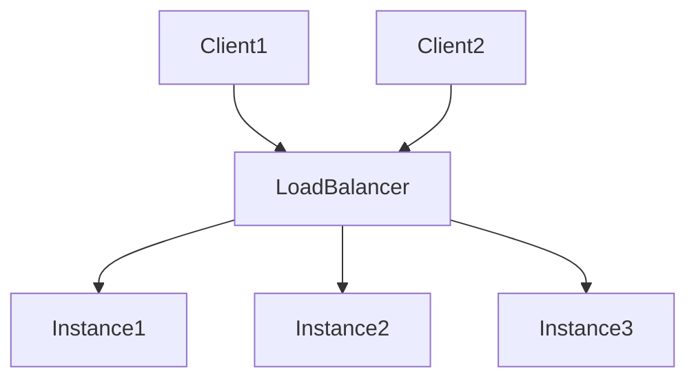
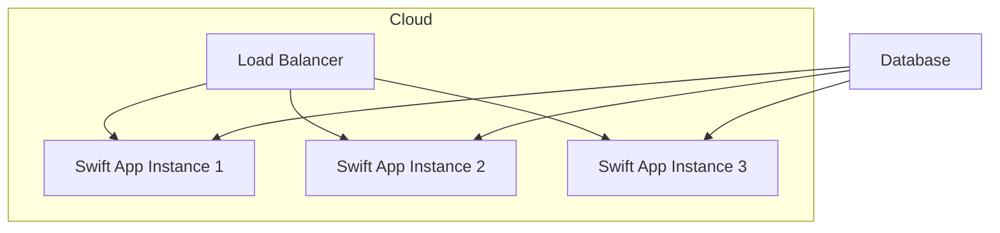

## 13.9 Deploying Server-Side Swift Applications

Deploying server-side Swift applications involves a series of strategic decisions and technical implementations that ensure your application runs smoothly, efficiently, and securely in a production environment. In this section, we will explore various deployment environments, strategies, and scalability considerations to help you master the deployment process.

### Deployment Environments

Choosing the right deployment environment is crucial for the success of your server-side Swift applications. Let's examine the most common options:

#### Cloud Services

Cloud services offer flexible, scalable, and cost-effective solutions for deploying server-side applications. Here are some popular cloud service providers:

- **AWS (Amazon Web Services)**: AWS offers a comprehensive suite of services, including EC2 for virtual servers, RDS for managed databases, and Lambda for serverless computing. AWS provides robust infrastructure and scalability options, making it a popular choice for many developers.

- **Heroku**: Heroku is a platform-as-a-service (PaaS) that simplifies deployment by abstracting the underlying infrastructure. It supports multiple programming languages, including Swift, and offers easy integration with Git for continuous deployment.

- **IBM Cloud**: IBM Cloud provides a range of services, including Kubernetes, serverless functions, and AI capabilities. It supports Swift applications and offers tools for monitoring and managing your deployments.

#### On-Premises

For organizations with specific security or compliance requirements, hosting applications on private servers may be necessary. On-premises deployment provides complete control over the infrastructure but requires more resources for maintenance and scaling.

### Deployment Strategies

Effective deployment strategies ensure that your application is delivered reliably and efficiently. Here are some key strategies to consider:

#### Continuous Integration/Continuous Deployment (CI/CD)

CI/CD is a practice that automates the process of integrating, testing, and deploying code changes. It helps reduce errors, improve collaboration, and accelerate delivery. Here's how you can implement CI/CD for your Swift applications:

1. **Set Up a CI/CD Pipeline**: Use tools like Jenkins, GitLab CI, or GitHub Actions to automate the build, test, and deployment processes. Define stages for building the application, running tests, and deploying to staging or production environments.

2. **Automate Testing**: Write comprehensive unit, integration, and end-to-end tests to ensure code quality. Automate these tests as part of the CI/CD pipeline to catch issues early.

3. **Deploy Automatically**: Configure your pipeline to deploy changes automatically to staging environments for testing and to production environments once tests pass.

4. **Monitor and Rollback**: Implement monitoring tools to track application performance and errors. Set up rollback mechanisms to revert to previous versions in case of failures.

#### Containerization

Containerization involves packaging your application and its dependencies into a container, ensuring consistency across different environments. Docker is a popular tool for containerization:

1. **Create a Dockerfile**: Define the environment for your Swift application in a Dockerfile. Specify the base image, dependencies, and commands to build and run your application.

   ```dockerfile
   # Use the official Swift image
   FROM swift:5.5

   # Set the working directory
   WORKDIR /app

   # Copy the source code into the container
   COPY . .

   # Build the application
   RUN swift build -c release

   # Run the application
   CMD ["./.build/release/MySwiftApp"]
   ```

2. **Build and Run the Container**: Use Docker commands to build and run your container locally. Test the containerized application to ensure it works as expected.

   ```bash
   # Build the Docker image
   docker build -t my-swift-app .

   # Run the Docker container
   docker run -p 8080:8080 my-swift-app
   ```

3. **Deploy Containers**: Deploy your containers to cloud platforms like AWS ECS, Google Kubernetes Engine, or Azure Kubernetes Service for scalable and managed deployments.

### Scalability

Scalability is essential for handling varying loads and ensuring your application performs well under stress. Here are some techniques to achieve scalability:

#### Load Balancing

Load balancing distributes incoming traffic across multiple instances of your application, ensuring no single instance is overwhelmed. This improves performance and reliability. Use tools like AWS Elastic Load Balancing or NGINX to implement load balancing.



#### Auto Scaling

Auto scaling automatically adjusts the number of instances based on demand. It helps optimize resource usage and reduce costs. Configure auto scaling policies on platforms like AWS Auto Scaling or Google Cloud Autoscaler.

### Visualizing Deployment Architecture

To better understand the deployment architecture, let's visualize a typical setup using a Mermaid.js diagram:



This diagram shows a load balancer distributing traffic to multiple Swift application instances, all connected to a shared database.

### Try It Yourself

Experiment with deploying a simple Swift application using Docker and a cloud service of your choice. Modify the Dockerfile to include additional dependencies or configurations. Test the deployment process and observe how load balancing and auto scaling affect performance.

### References and Links

For further reading on deploying server-side Swift applications, consider the following resources:

- [AWS Documentation](https://aws.amazon.com/documentation/)
- [Heroku Dev Center](https://devcenter.heroku.com/)
- [IBM Cloud Docs](https://cloud.ibm.com/docs)
- [Docker Documentation](https://docs.docker.com/)
- [Kubernetes Documentation](https://kubernetes.io/docs/)

### Knowledge Check

- What are the advantages of using cloud services for deployment?
- How does containerization improve deployment consistency?
- Describe the role of a load balancer in a deployment architecture.

### Embrace the Journey

Deploying server-side Swift applications is an ongoing journey of learning and improvement. As you gain experience, you'll discover new tools and techniques to optimize your deployments. Keep experimenting, stay curious, and enjoy the process!

---

## Quiz Time!



### Which cloud service is known for its comprehensive suite of services, including EC2 and Lambda?

- [x] AWS
- [ ] Heroku
- [ ] IBM Cloud
- [ ] Google Cloud

> **Explanation:** AWS offers a wide range of services such as EC2 for virtual servers and Lambda for serverless computing, making it a comprehensive cloud service provider.

### What is the primary benefit of using CI/CD in deployment?

- [x] Automating build and deployment processes
- [ ] Reducing server costs
- [ ] Increasing manual testing
- [ ] Enhancing security protocols

> **Explanation:** CI/CD automates the integration, testing, and deployment processes, which helps reduce errors and speeds up delivery.

### What tool is commonly used for containerization in deployment?

- [x] Docker
- [ ] Jenkins
- [ ] GitLab
- [ ] Ansible

> **Explanation:** Docker is a popular tool used for containerizing applications, ensuring consistent environments across different stages of deployment.

### What is the purpose of load balancing in server-side applications?

- [x] Distributing traffic across multiple instances
- [ ] Increasing the speed of database queries
- [ ] Enhancing data encryption
- [ ] Reducing code complexity

> **Explanation:** Load balancing helps distribute incoming traffic evenly across multiple instances, improving performance and reliability.

### Which deployment strategy involves packaging applications and dependencies into containers?

- [x] Containerization
- [ ] Virtualization
- [ ] Manual Deployment
- [ ] Continuous Integration

> **Explanation:** Containerization involves packaging applications and their dependencies into containers, ensuring consistency across environments.

### What is a key feature of auto scaling?

- [x] Adjusting resources based on demand
- [ ] Manually configuring server instances
- [ ] Increasing application complexity
- [ ] Reducing network bandwidth

> **Explanation:** Auto scaling automatically adjusts the number of instances based on demand, optimizing resource usage and reducing costs.

### Which of the following is a PaaS that simplifies deployment by abstracting infrastructure?

- [x] Heroku
- [ ] AWS
- [ ] Azure
- [ ] IBM Cloud

> **Explanation:** Heroku is a platform-as-a-service (PaaS) that abstracts the underlying infrastructure, simplifying the deployment process.

### What does a Dockerfile define?

- [x] The environment for a containerized application
- [ ] The user interface of an application
- [ ] The database schema
- [ ] The network configuration

> **Explanation:** A Dockerfile defines the environment, including the base image and dependencies, for a containerized application.

### True or False: On-premises deployment provides more control but requires more maintenance.

- [x] True
- [ ] False

> **Explanation:** On-premises deployment gives complete control over the infrastructure but requires more resources for maintenance and scaling.

### What is a common tool for monitoring application performance and errors?

- [x] Prometheus
- [ ] Docker
- [ ] GitHub Actions
- [ ] Jenkins

> **Explanation:** Prometheus is a monitoring tool that tracks application performance and errors, helping identify issues early.


