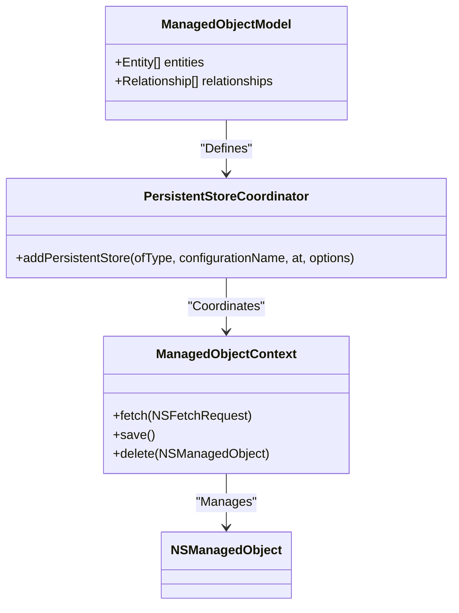

## 14.1 Working with Core Data

Core Data is a powerful framework provided by Apple for managing the model layer of your application. It is a crucial component for data persistence in iOS and macOS applications, allowing developers to efficiently manage object graphs and persist data to disk. In this section, we will delve into the essentials of Core Data, explore its components, and learn how to perform basic and advanced operations.

### Core Data Basics

Core Data is built around a few key concepts: the Managed Object Model, Managed Object Context, and Persistent Store Coordinator. Understanding these components is fundamental to effectively using Core Data.

#### Managed Object Model

The Managed Object Model is the blueprint of your data. It defines the entities, attributes, and relationships within your application. Think of it as a schema for your data, similar to tables in a database.

- **Entities**: These are the objects you want to store. Each entity corresponds to a class in your data model.
- **Attributes**: These are the properties of the entities, such as strings, numbers, and dates.
- **Relationships**: These define how entities are connected to one another.

To create a Managed Object Model, you typically use the Xcode Data Model Editor. This tool provides a graphical interface to define your entities, attributes, and relationships.

```swift
// Example of defining an entity in code
class Person: NSManagedObject {
    @NSManaged var name: String?
    @NSManaged var age: Int16
    @NSManaged var friends: NSSet?
}
```

#### Managed Object Context

The Managed Object Context is the workspace for Core Data operations. It acts as an in-memory "scratchpad" for managing and tracking changes to your objects. You perform all data operations, such as fetching, inserting, deleting, and updating, within a context.

- **Concurrency**: Core Data contexts are not thread-safe. You must use different contexts for different threads.
- **Lifecycle**: Changes made in a context are not saved until you explicitly save the context.

```swift
// Creating a managed object context
let context = NSManagedObjectContext(concurrencyType: .mainQueueConcurrencyType)
```

#### Persistent Store Coordinator

The Persistent Store Coordinator is responsible for coordinating access to the underlying data store. It acts as a bridge between the Managed Object Context and the physical storage, such as an SQLite database.

- **Multiple Stores**: You can configure a Persistent Store Coordinator to manage multiple stores.
- **Store Types**: Common store types include SQLite, XML, and binary.

```swift
// Setting up a persistent store coordinator
let coordinator = NSPersistentStoreCoordinator(managedObjectModel: model)
do {
    try coordinator.addPersistentStore(ofType: NSSQLiteStoreType, configurationName: nil, at: storeURL, options: nil)
} catch {
    fatalError("Persistent store error! \\(error)")
}
```

### Performing Operations

Once you have set up your Core Data stack, you can perform various operations, such as fetching, saving, and deleting data.

#### Fetching Data

Fetching data in Core Data is done using `NSFetchRequest`. This object specifies the entity you want to fetch and any filtering or sorting criteria.

```swift
// Fetching data with NSFetchRequest
let fetchRequest = NSFetchRequest<NSFetchRequestResult>(entityName: "Person")
fetchRequest.predicate = NSPredicate(format: "age > %d", 18)
do {
    let results = try context.fetch(fetchRequest)
    for result in results as! [Person] {
        print("Name: \\(result.name), Age: \\(result.age)")
    }
} catch {
    print("Fetch error: \\(error)")
}
```

#### Saving Changes

After making changes to your managed objects, you must save the context to persist these changes to the store.

```swift
// Saving changes to the context
do {
    try context.save()
} catch {
    print("Save error: \\(error)")
}
```

#### Deleting Objects

To delete an object, you remove it from the context and then save the context.

```swift
// Deleting an object
if let person = results.first {
    context.delete(person)
    do {
        try context.save()
    } catch {
        print("Delete error: \\(error)")
    }
}
```

### Advanced Core Data

Core Data also provides advanced features for optimizing performance and managing model changes over time.

#### Batch Updates and Deletes

Batch operations allow you to perform updates and deletes directly at the store level, bypassing the need to load objects into memory. This can significantly improve performance for large datasets.

```swift
// Performing a batch update
let batchUpdateRequest = NSBatchUpdateRequest(entityName: "Person")
batchUpdateRequest.propertiesToUpdate = ["age": 30]
batchUpdateRequest.resultType = .updatedObjectIDsResultType

do {
    let batchUpdateResult = try context.execute(batchUpdateRequest) as? NSBatchUpdateResult
    let objectIDArray = batchUpdateResult?.result as! [NSManagedObjectID]
    for objectID in objectIDArray {
        let managedObject = context.object(with: objectID)
        context.refresh(managedObject, mergeChanges: false)
    }
} catch {
    print("Batch update error: \\(error)")
}
```

#### Migration

As your application evolves, your data model may change. Core Data provides migration tools to handle these changes and ensure data integrity across app versions.

- **Lightweight Migration**: Automatically migrates data using inferred mapping models.
- **Custom Migration**: Requires defining explicit mapping models and migration policies.

```swift
// Enabling lightweight migration
let options = [NSMigratePersistentStoresAutomaticallyOption: true, NSInferMappingModelAutomaticallyOption: true]
do {
    try coordinator.addPersistentStore(ofType: NSSQLiteStoreType, configurationName: nil, at: storeURL, options: options)
} catch {
    print("Migration error: \\(error)")
}
```

### Visualizing Core Data Architecture

To better understand the architecture of Core Data, let's visualize the relationship between its components using a Mermaid.js diagram.



### Try It Yourself

To reinforce your understanding of Core Data, try modifying the code examples provided:

- **Add a new entity**: Define a new entity in your data model and create instances of it in your context.
- **Experiment with predicates**: Use different predicates in your fetch requests to filter data.
- **Perform a batch delete**: Use `NSBatchDeleteRequest` to remove a large number of objects efficiently.

### References and Links

- [Apple Developer Documentation: Core Data](https://developer.apple.com/documentation/coredata)
- [NSFetchRequest Class Reference](https://developer.apple.com/documentation/coredata/nsfetchrequest)
- [Core Data Programming Guide](https://developer.apple.com/library/archive/documentation/Cocoa/Conceptual/CoreData/index.html)

### Knowledge Check

Before moving on, let's review what we've learned:

- Understand the role of the Managed Object Model, Managed Object Context, and Persistent Store Coordinator.
- Perform basic operations like fetching, saving, and deleting data.
- Utilize advanced features like batch updates and migrations.

### Embrace the Journey

Remember, mastering Core Data is a journey. As you progress, you'll build more complex data models and optimize performance for your applications. Keep experimenting, stay curious, and enjoy the journey!

## Quiz Time!



### What is the primary role of the Managed Object Context in Core Data?

- [x] It acts as a workspace for managing and tracking changes to objects.
- [ ] It defines the schema for the data model.
- [ ] It coordinates access to the underlying data store.
- [ ] It performs batch updates and deletes.

> **Explanation:** The Managed Object Context is used to manage and track changes to objects in Core Data.

### Which component connects the Managed Object Context to the physical data store?

- [ ] Managed Object Model
- [ ] NSFetchRequest
- [x] Persistent Store Coordinator
- [ ] Entity Description

> **Explanation:** The Persistent Store Coordinator connects the Managed Object Context to the physical data store.

### How do you perform a batch update in Core Data?

- [ ] Using NSFetchRequest
- [x] Using NSBatchUpdateRequest
- [ ] Using NSManagedObject
- [ ] Using NSPersistentStoreCoordinator

> **Explanation:** NSBatchUpdateRequest is used to perform batch updates in Core Data.

### What is the purpose of a predicate in an NSFetchRequest?

- [ ] To define the entity to fetch
- [x] To filter the data retrieved
- [ ] To save changes to the context
- [ ] To delete objects from the store

> **Explanation:** Predicates are used in NSFetchRequest to filter the data retrieved.

### What is lightweight migration in Core Data?

- [x] Automatically migrates data using inferred mapping models.
- [ ] Requires explicit mapping models and migration policies.
- [ ] Deletes old data models.
- [ ] Manually updates the data store.

> **Explanation:** Lightweight migration automatically migrates data using inferred mapping models.

### Which Core Data component is responsible for defining entities and relationships?

- [x] Managed Object Model
- [ ] Managed Object Context
- [ ] Persistent Store Coordinator
- [ ] NSFetchRequest

> **Explanation:** The Managed Object Model defines entities and relationships in Core Data.

### What is required to save changes in a Managed Object Context?

- [ ] Define a new entity
- [x] Call the save() method
- [ ] Use NSBatchUpdateRequest
- [ ] Perform a fetch request

> **Explanation:** To save changes in a Managed Object Context, you must call the save() method.

### How can you efficiently delete a large number of objects in Core Data?

- [ ] Use NSFetchRequest
- [ ] Use NSManagedObject
- [x] Use NSBatchDeleteRequest
- [ ] Use NSPersistentStoreCoordinator

> **Explanation:** NSBatchDeleteRequest is used to efficiently delete a large number of objects in Core Data.

### What is a key benefit of using Core Data in iOS applications?

- [x] Efficient data persistence and management
- [ ] Simplified UI design
- [ ] Enhanced network communication
- [ ] Improved graphics rendering

> **Explanation:** Core Data provides efficient data persistence and management in iOS applications.

### True or False: Core Data contexts are thread-safe.

- [ ] True
- [x] False

> **Explanation:** Core Data contexts are not thread-safe; separate contexts should be used for different threads.






