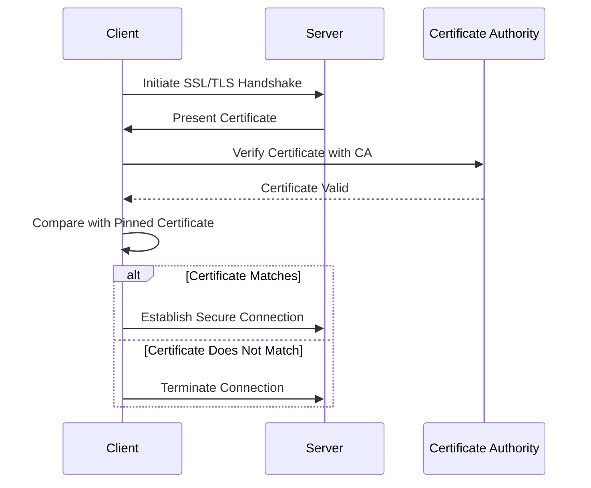

## 14.10 Security in Networking: SSL Pinning and Certificate Validation

In today's interconnected world, securing data in transit is paramount. As Swift developers, ensuring the security of our applications' networking layer is crucial to protect sensitive user data. This section delves into the concepts of SSL/TLS, SSL pinning, and certificate validation, providing you with the knowledge and tools to enhance the security of your Swift applications.

### SSL/TLS Basics

Before diving into SSL pinning and certificate validation, it's essential to understand the basics of SSL/TLS, which stands for Secure Sockets Layer and Transport Layer Security. These protocols are designed to secure data transmitted over the internet by providing encryption and authentication.

#### Encryption

Encryption is the process of converting plain text into a coded form, known as ciphertext, to prevent unauthorized access. SSL/TLS uses encryption to secure data in transit between a client and a server, ensuring that even if the data is intercepted, it cannot be read by malicious actors.

#### Certificates

Certificates play a vital role in SSL/TLS by verifying the identity of the server. A certificate is a digital document issued by a trusted Certificate Authority (CA) that confirms the server's identity. When a client connects to a server, the server presents its certificate, and the client verifies it against a list of trusted CAs.

### SSL Pinning

SSL pinning is a technique used to enhance the security of SSL/TLS by hardcoding specific certificates or public keys within an application. This ensures that the application only trusts connections to servers that present the pinned certificates or keys, protecting against man-in-the-middle (MITM) attacks.

#### Types of SSL Pinning

There are two primary types of SSL pinning: certificate pinning and public key pinning.

- **Certificate Pinning**: This involves pinning the entire certificate within the application. The app will only trust connections to servers that present this exact certificate.

- **Public Key Pinning**: Instead of pinning the entire certificate, this approach pins the public key contained within the certificate. This provides more flexibility, as it allows for certificate renewal without changing the public key.

#### Implementation

Implementing SSL pinning in Swift involves hardcoding the certificate or public key data within the app. Here's a basic example of how to implement certificate pinning using URLSession in Swift:

```swift
import Foundation

class SecureSessionDelegate: NSObject, URLSessionDelegate {
    func urlSession(_ session: URLSession, didReceive challenge: URLAuthenticationChallenge, completionHandler: @escaping (URLSession.AuthChallengeDisposition, URLCredential?) -> Void) {
        guard let serverTrust = challenge.protectionSpace.serverTrust else {
            completionHandler(.cancelAuthenticationChallenge, nil)
            return
        }
        
        // Load the pinned certificate
        if let pinnedCertificateURL = Bundle.main.url(forResource: "pinnedCert", withExtension: "cer"),
           let pinnedCertificateData = try? Data(contentsOf: pinnedCertificateURL),
           let pinnedCertificate = SecCertificateCreateWithData(nil, pinnedCertificateData as CFData) {
            
            let serverCertificates = (0..<SecTrustGetCertificateCount(serverTrust)).compactMap {
                SecTrustGetCertificateAtIndex(serverTrust, $0)
            }
            
            // Compare the server's certificate with the pinned certificate
            if serverCertificates.contains(pinnedCertificate) {
                completionHandler(.useCredential, URLCredential(trust: serverTrust))
                return
            }
        }
        
        completionHandler(.cancelAuthenticationChallenge, nil)
    }
}

// Usage
let session = URLSession(configuration: .default, delegate: SecureSessionDelegate(), delegateQueue: nil)
```

In this code, we define a custom `URLSessionDelegate` that handles the server trust authentication challenge. We load the pinned certificate from the app bundle and compare it against the server's certificates. If a match is found, the connection is trusted.

### Benefits and Risks

#### Enhanced Security

The primary benefit of SSL pinning is enhanced security. By ensuring that your app only trusts specific certificates or keys, you protect against MITM attacks, where an attacker intercepts and potentially alters the data being transmitted.

#### Maintenance Challenges

While SSL pinning provides significant security benefits, it also introduces maintenance challenges. Certificates expire, and when they do, the app must be updated with the new certificate or public key. This requires careful planning and coordination to ensure that users always have the latest version of the app with the updated certificate.

### Try It Yourself

To experiment with SSL pinning, try modifying the example code to implement public key pinning instead of certificate pinning. This involves extracting the public key from the certificate and comparing it against a pinned key. 

Additionally, consider setting up a test server with a self-signed certificate to practice handling certificate validation failures.

### Visualizing SSL Pinning and Certificate Validation

To better understand the process of SSL pinning and certificate validation, let's visualize the steps involved in a typical SSL/TLS handshake with pinning.



In this diagram, we see the client initiating an SSL/TLS handshake with the server. The server presents its certificate, which the client verifies with a trusted CA. The client then compares the server's certificate with the pinned certificate. If there's a match, a secure connection is established; otherwise, the connection is terminated.

### References and Links

For further reading on SSL/TLS and SSL pinning, consider the following resources:

- [Apple Developer Documentation on URLSession](https://developer.apple.com/documentation/foundation/urlsession)
- [OWASP Guide on SSL Pinning](https://owasp.org/www-community/controls/Certificate_and_Public_Key_Pinning)
- [Let's Encrypt: Free, Automated, and Open Certificate Authority](https://letsencrypt.org/)

### Knowledge Check

To reinforce your understanding of SSL pinning and certificate validation, consider the following questions:

- What are the differences between certificate pinning and public key pinning?
- Why is SSL pinning important for protecting against MITM attacks?
- What are the potential risks and challenges associated with SSL pinning?

### Embrace the Journey

Remember, mastering SSL pinning and certificate validation is just one step in securing your Swift applications. As you continue to develop your skills, keep experimenting with different security techniques and stay updated with the latest best practices. Security is an ever-evolving field, and your dedication to learning will ensure that your applications remain robust and secure.

## Quiz Time!



### What is the primary purpose of SSL/TLS?

- [x] To secure data in transit between a client and a server
- [ ] To store data on a server securely
- [ ] To manage user authentication
- [ ] To compress data for faster transmission

> **Explanation:** SSL/TLS is used to encrypt and secure data transmitted over the internet, ensuring confidentiality and integrity.

### What does SSL pinning protect against?

- [x] Man-in-the-middle attacks
- [ ] SQL injection attacks
- [ ] Cross-site scripting attacks
- [ ] Buffer overflow attacks

> **Explanation:** SSL pinning ensures that the app only trusts specific certificates or keys, protecting against MITM attacks.

### Which type of SSL pinning involves hardcoding the entire certificate?

- [x] Certificate pinning
- [ ] Public key pinning
- [ ] Domain pinning
- [ ] CA pinning

> **Explanation:** Certificate pinning involves hardcoding the entire certificate in the app.

### What is a potential challenge of SSL pinning?

- [x] Updating pinned certificates when they expire
- [ ] Increasing app performance
- [ ] Reducing app size
- [ ] Enhancing user interface design

> **Explanation:** Certificates expire, requiring updates to the app to maintain secure connections.

### Which of the following is a benefit of public key pinning over certificate pinning?

- [x] Allows for certificate renewal without changing the public key
- [ ] Provides more security than certificate pinning
- [ ] Requires less maintenance than certificate pinning
- [ ] Is easier to implement than certificate pinning

> **Explanation:** Public key pinning allows for certificate renewal without changing the pinned public key, offering more flexibility.

### What role does a Certificate Authority (CA) play in SSL/TLS?

- [x] Verifies the identity of the server by issuing digital certificates
- [ ] Encrypts data transmitted between client and server
- [ ] Manages user authentication and authorization
- [ ] Provides secure storage for user data

> **Explanation:** A CA issues digital certificates that verify the server's identity, ensuring trust in the SSL/TLS connection.

### In the context of SSL/TLS, what is a certificate?

- [x] A digital document that verifies the server's identity
- [ ] A key used to encrypt data
- [ ] A protocol for data transmission
- [ ] A method for compressing data

> **Explanation:** A certificate is a digital document issued by a CA that verifies the server's identity in an SSL/TLS connection.

### What is the primary difference between SSL and TLS?

- [x] TLS is the successor to SSL, offering improved security features
- [ ] SSL is faster than TLS
- [ ] TLS is used for data storage, while SSL is used for data transmission
- [ ] SSL is more secure than TLS

> **Explanation:** TLS is the successor to SSL and provides enhanced security features, making it the preferred protocol for secure communications.

### Which Swift class is commonly used to handle SSL pinning?

- [x] URLSession
- [ ] NSURLConnection
- [ ] Alamofire
- [ ] HTTPClient

> **Explanation:** URLSession is commonly used in Swift for networking tasks, including handling SSL pinning.

### True or False: SSL pinning can be used to protect against all types of cyber attacks.

- [x] False
- [ ] True

> **Explanation:** SSL pinning specifically protects against MITM attacks by ensuring that the app only trusts specific certificates or keys.


