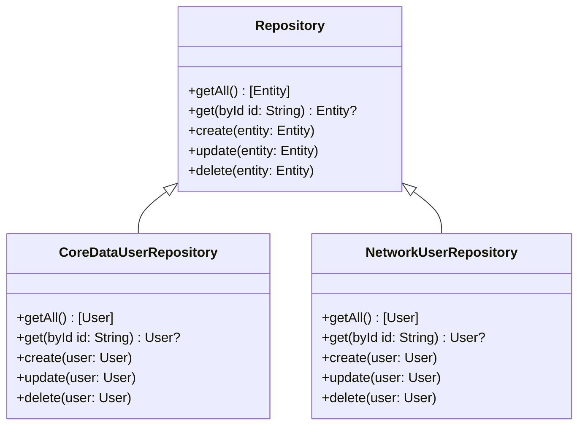

## 14.2 Repository Pattern for Data Access

In the world of software development, managing data access efficiently is crucial for building scalable and maintainable applications. The Repository Pattern is a design pattern that provides a consistent API for data operations, abstracting the data layer from the business logic. This pattern is particularly beneficial in Swift, where it enhances testability and flexibility, allowing developers to swap out data sources without affecting the core logic of the application.

### Intent

The primary intent of the Repository Pattern is to abstract the complexities of data access and provide a clean, consistent API for performing data operations. By separating the data layer from the business logic, it allows developers to focus on the core functionality of the application without worrying about the underlying data source.

### Implementing Repository

Implementing the Repository Pattern in Swift involves defining protocols to establish interfaces for repositories and creating concrete implementations for different data sources such as Core Data, Realm, or network-backed repositories.

#### Defining Protocols

Protocols in Swift are a powerful feature that allows developers to define a blueprint of methods, properties, and other requirements. When implementing the Repository Pattern, protocols are used to define the interface for data operations.

```swift
// Define a protocol for a generic repository
protocol Repository {
    associatedtype Entity
    func getAll() -> [Entity]
    func get(byId id: String) -> Entity?
    func create(_ entity: Entity)
    func update(_ entity: Entity)
    func delete(_ entity: Entity)
}
```

In this example, we define a generic `Repository` protocol with methods for basic CRUD (Create, Read, Update, Delete) operations. The `associatedtype` keyword is used to define a placeholder for the type of entity the repository will manage.

#### Concrete Implementations

Once the protocol is defined, the next step is to create concrete implementations for different data sources. Let's explore how to implement a repository for Core Data and a network-backed repository.

##### Core Data Repository

Core Data is a powerful framework for managing object graphs and persistent data in iOS applications. Here's an example of how to implement a Core Data repository:

```swift
import CoreData

// Define a Core Data entity
struct User {
    var id: String
    var name: String
    var email: String
}

// Implement the Core Data repository
class CoreDataUserRepository: Repository {
    typealias Entity = User
    
    private let context: NSManagedObjectContext
    
    init(context: NSManagedObjectContext) {
        self.context = context
    }
    
    func getAll() -> [User] {
        // Fetch all users from Core Data
        // Implementation details omitted for brevity
        return []
    }
    
    func get(byId id: String) -> User? {
        // Fetch a user by ID from Core Data
        // Implementation details omitted for brevity
        return nil
    }
    
    func create(_ entity: User) {
        // Create a new user in Core Data
        // Implementation details omitted for brevity
    }
    
    func update(_ entity: User) {
        // Update an existing user in Core Data
        // Implementation details omitted for brevity
    }
    
    func delete(_ entity: User) {
        // Delete a user from Core Data
        // Implementation details omitted for brevity
    }
}
```

In this implementation, we define a `CoreDataUserRepository` class that conforms to the `Repository` protocol. It uses an `NSManagedObjectContext` to perform data operations on Core Data entities.

##### Network-Backed Repository

In addition to local data sources, repositories can also be implemented for network-backed data sources. Here's an example of a network-backed repository:

```swift
import Foundation

// Define a network service
protocol NetworkService {
    func fetchData(completion: @escaping (Result<Data, Error>) -> Void)
}

// Implement the network-backed repository
class NetworkUserRepository: Repository {
    typealias Entity = User
    
    private let networkService: NetworkService
    
    init(networkService: NetworkService) {
        self.networkService = networkService
    }
    
    func getAll() -> [User] {
        // Fetch all users from the network
        // Implementation details omitted for brevity
        return []
    }
    
    func get(byId id: String) -> User? {
        // Fetch a user by ID from the network
        // Implementation details omitted for brevity
        return nil
    }
    
    func create(_ entity: User) {
        // Create a new user on the network
        // Implementation details omitted for brevity
    }
    
    func update(_ entity: User) {
        // Update an existing user on the network
        // Implementation details omitted for brevity
    }
    
    func delete(_ entity: User) {
        // Delete a user from the network
        // Implementation details omitted for brevity
    }
}
```

In this example, we define a `NetworkUserRepository` class that conforms to the `Repository` protocol. It uses a `NetworkService` to perform data operations over the network.

### Benefits

The Repository Pattern offers several benefits that make it an essential part of modern Swift development:

#### Testability

By abstracting the data layer, the Repository Pattern makes it easy to mock repositories for testing. This allows developers to write unit tests for business logic without depending on the actual data source.

#### Flexibility

The Repository Pattern provides the flexibility to swap out data sources without affecting the business logic. This is particularly useful in scenarios where the data source may change over time, such as migrating from a local database to a cloud-based service.

### Swift Unique Features

Swift offers several unique features that enhance the implementation of the Repository Pattern:

- **Protocol Extensions**: Swift's protocol extensions allow developers to provide default implementations for protocol methods, reducing boilerplate code.
- **Generics**: Swift's powerful generics system enables the creation of type-safe repositories that can manage different types of entities.
- **Value Semantics**: Swift's emphasis on value semantics ensures that data is managed efficiently and safely, reducing the risk of unintended side effects.

### Try It Yourself

To solidify your understanding of the Repository Pattern, try implementing a repository for a different data source, such as Realm or a custom file-based storage system. Experiment with adding new methods to the repository protocol and see how they can be used to enhance data operations.

### Visualizing the Repository Pattern

To better understand the structure and flow of the Repository Pattern, let's visualize it using a class diagram:



This diagram illustrates how the `CoreDataUserRepository` and `NetworkUserRepository` classes implement the `Repository` protocol, providing concrete implementations for different data sources.

### Design Considerations

When implementing the Repository Pattern, consider the following design considerations:

- **Consistency**: Ensure that the repository provides a consistent API for data operations, regardless of the underlying data source.
- **Performance**: Be mindful of the performance implications of different data sources, especially when dealing with large datasets or network operations.
- **Error Handling**: Implement robust error handling to manage potential failures in data operations, such as network errors or database constraints.

### Differences and Similarities

The Repository Pattern is often compared to the Data Access Object (DAO) pattern. While both patterns aim to abstract data access, the Repository Pattern is typically used at a higher level, providing a more comprehensive API that includes business logic, whereas the DAO pattern focuses solely on data operations.

### Knowledge Check

Before we conclude, let's summarize the key takeaways:

- The Repository Pattern abstracts the data layer, providing a consistent API for data operations.
- Implementing the pattern involves defining protocols and creating concrete implementations for different data sources.
- The pattern enhances testability and flexibility, allowing developers to swap out data sources without affecting business logic.
- Swift's unique features, such as protocol extensions and generics, enhance the implementation of the Repository Pattern.

Remember, mastering the Repository Pattern is just one step in building robust, scalable Swift applications. Keep experimenting, stay curious, and enjoy the journey!

## Quiz Time!



### What is the primary intent of the Repository Pattern?

- [x] To abstract the data layer and provide a consistent API for data operations.
- [ ] To directly access the database for data operations.
- [ ] To handle UI updates in response to data changes.
- [ ] To manage network requests and responses.

> **Explanation:** The Repository Pattern's primary intent is to abstract the data layer, providing a consistent API for data operations.

### What is a key benefit of using the Repository Pattern in Swift?

- [x] Enhanced testability and flexibility.
- [ ] Direct access to the database.
- [ ] Improved user interface design.
- [ ] Faster network requests.

> **Explanation:** The Repository Pattern enhances testability and flexibility by abstracting the data layer and allowing easy swapping of data sources.

### Which Swift feature is particularly useful for implementing the Repository Pattern?

- [x] Protocols and protocol extensions.
- [ ] SwiftUI views.
- [ ] UIKit components.
- [ ] Storyboards.

> **Explanation:** Protocols and protocol extensions in Swift allow developers to define interfaces and provide default implementations, which are useful for implementing the Repository Pattern.

### How does the Repository Pattern enhance testability?

- [x] By allowing repositories to be easily mocked for testing.
- [ ] By providing direct access to the database.
- [ ] By simplifying UI updates.
- [ ] By managing network requests.

> **Explanation:** The Repository Pattern enhances testability by abstracting the data layer, allowing repositories to be easily mocked for testing.

### What is a common use case for the Repository Pattern?

- [x] Abstracting data access for different data sources.
- [ ] Managing UI components.
- [ ] Handling user input.
- [ ] Designing animations.

> **Explanation:** A common use case for the Repository Pattern is abstracting data access for different data sources, providing a consistent API for data operations.

### What is the role of protocols in the Repository Pattern?

- [x] To define a blueprint for data operations.
- [ ] To manage UI components.
- [ ] To handle network requests.
- [ ] To design animations.

> **Explanation:** Protocols in the Repository Pattern define a blueprint for data operations, allowing for consistent implementation across different data sources.

### What is the difference between the Repository Pattern and the DAO pattern?

- [x] The Repository Pattern provides a more comprehensive API that includes business logic.
- [ ] The DAO pattern is used for UI updates.
- [ ] The Repository Pattern directly accesses the database.
- [ ] The DAO pattern manages network requests.

> **Explanation:** The Repository Pattern provides a more comprehensive API that includes business logic, whereas the DAO pattern focuses solely on data operations.

### What is a potential design consideration when implementing the Repository Pattern?

- [x] Ensuring consistent API for data operations.
- [ ] Directly accessing the database.
- [ ] Simplifying UI updates.
- [ ] Managing network requests.

> **Explanation:** A potential design consideration when implementing the Repository Pattern is ensuring a consistent API for data operations, regardless of the underlying data source.

### Which of the following is a concrete implementation of a repository?

- [x] CoreDataUserRepository
- [ ] UserInterfaceManager
- [ ] NetworkRequestHandler
- [ ] AnimationController

> **Explanation:** CoreDataUserRepository is a concrete implementation of a repository that manages data operations using Core Data.

### True or False: The Repository Pattern can only be used with local databases.

- [ ] True
- [x] False

> **Explanation:** False. The Repository Pattern can be used with various data sources, including local databases, network services, and more.


