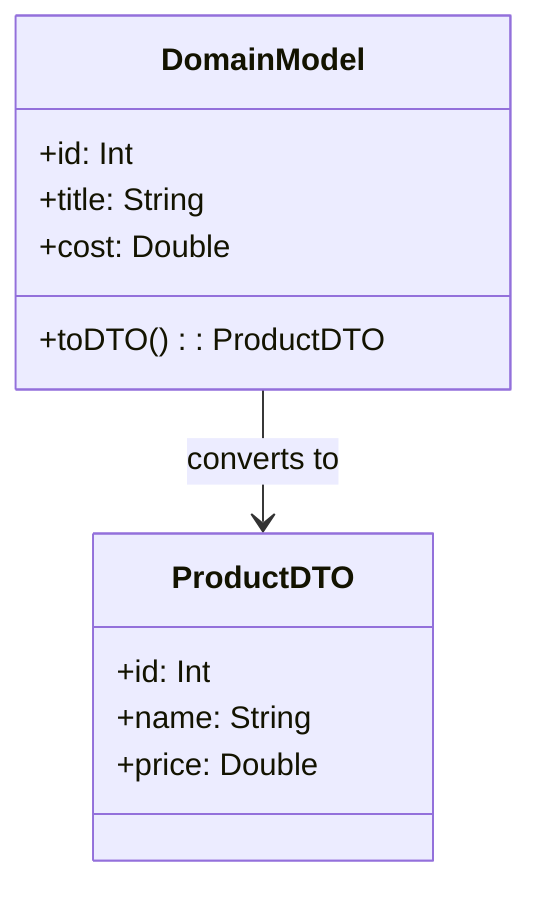

## 14.3 Data Transfer Objects (DTOs)

Data Transfer Objects (DTOs) are a fundamental design pattern used to transfer data between software application subsystems. In Swift, DTOs are often implemented as lightweight structures or classes that encapsulate data and provide a structured way to pass data across different layers of an application. This section will delve into the purpose, implementation, and use cases of DTOs, providing you with the knowledge to effectively utilize them in your Swift projects.

### Purpose of Data Transfer Objects

The primary purpose of DTOs is to simplify and streamline data transfer between different layers or systems within an application. By encapsulating data in a structured format, DTOs help to:

- **Reduce Complexity**: By providing a clear and concise data structure, DTOs reduce the complexity of data handling between layers, making the code easier to maintain and understand.
- **Enhance Security**: DTOs can be used to expose only the necessary data to the client, helping to protect sensitive information.
- **Improve Performance**: By transferring only the required data, DTOs can help to reduce the amount of data sent over the network, improving the performance of the application.
- **Facilitate Testing**: DTOs provide a clear contract for data transfer, making it easier to write tests and ensure data integrity.

### Implementing DTOs in Swift

Implementing DTOs in Swift involves creating simple structures or classes that define the data to be transferred. Let's explore how to create and use DTOs effectively.

#### Creating Simple Structures

In Swift, DTOs are typically implemented as structs or classes. Structs are often preferred due to their value semantics, which help to avoid unintended side effects. Here's an example of a simple DTO implemented as a struct:

```swift
struct UserDTO {
    let id: Int
    let name: String
    let email: String
}
```

In this example, `UserDTO` is a simple struct that encapsulates the data we want to transfer. It includes properties for `id`, `name`, and `email`. By using a struct, we ensure that the data is copied rather than referenced, which can help to prevent unintended modifications.

#### Mapping Data

Mapping data between domain models and DTOs is a crucial step in implementing DTOs. This involves converting data from the domain model to the DTO format and vice versa. Here's an example of how you might map a domain model to a DTO:

```swift
struct User {
    let id: Int
    let fullName: String
    let emailAddress: String
}

extension User {
    func toDTO() -> UserDTO {
        return UserDTO(id: self.id, name: self.fullName, email: self.emailAddress)
    }
}
```

In this example, we have a `User` domain model with properties that may differ slightly from the DTO. The `toDTO()` method converts the `User` instance into a `UserDTO`, ensuring that the data is in the correct format for transfer.

### Use Cases for DTOs

DTOs are particularly useful in scenarios where data needs to be transferred between different layers or systems. Let's explore some common use cases.

#### Network Communication

One of the most common use cases for DTOs is in network communication. When sending or receiving data over a network, it's important to have a well-defined data structure that can be easily serialized and deserialized. DTOs provide a perfect solution for this.

For example, when making a network request, you might receive JSON data that needs to be converted into a DTO for use within your application:

```swift
import Foundation

struct UserDTO: Codable {
    let id: Int
    let name: String
    let email: String
}

// Simulating a network response
let jsonData = """
{
    "id": 1,
    "name": "John Doe",
    "email": "john.doe@example.com"
}
""".data(using: .utf8)!

// Decoding the JSON data into a UserDTO
do {
    let userDTO = try JSONDecoder().decode(UserDTO.self, from: jsonData)
    print("User ID: \\(userDTO.id), Name: \\(userDTO.name), Email: \\(userDTO.email)")
} catch {
    print("Failed to decode JSON: \\(error)")
}
```

In this example, we define `UserDTO` as a `Codable` struct, allowing us to easily decode JSON data into a `UserDTO` instance. This approach ensures that the data is in a consistent format, making it easier to work with throughout the application.

#### Layer Isolation

DTOs are also useful for isolating different layers of an application. By using DTOs to transfer data between layers, you can separate concerns and ensure that each layer only has access to the data it needs. This can help to improve the maintainability and scalability of your application.

For instance, in a typical iOS application, you might have a data layer, a business logic layer, and a presentation layer. DTOs can be used to transfer data between these layers, ensuring that each layer remains independent and focused on its specific responsibilities.

### Design Considerations

When implementing DTOs, there are several important considerations to keep in mind:

- **Consistency**: Ensure that your DTOs are consistent in terms of naming conventions and structure. This will make it easier to work with them across different parts of your application.
- **Immutability**: Consider making your DTOs immutable by using `let` for properties. This can help to prevent unintended modifications and ensure data integrity.
- **Serialization**: If your DTOs will be used for network communication, ensure that they conform to the `Codable` protocol for easy serialization and deserialization.
- **Performance**: Be mindful of the performance implications of using DTOs, particularly in terms of memory usage and data transfer size.

### Swift Unique Features

Swift offers several unique features that can be leveraged when implementing DTOs:

- **Value Types**: Swift's structs are value types, meaning that they are copied when passed around. This can help to prevent unintended side effects when using DTOs.
- **Codable Protocol**: Swift's `Codable` protocol provides a powerful and easy-to-use mechanism for encoding and decoding data, making it ideal for use with DTOs.
- **Extensions**: Swift's extensions allow you to add functionality to existing types, making it easy to add conversion methods between domain models and DTOs.

### Differences and Similarities with Other Patterns

DTOs are often compared to other patterns such as Value Objects and Data Models. While they share some similarities, there are key differences:

- **Value Objects**: Unlike DTOs, value objects are typically used to represent a single concept or value within the domain model. They are often immutable and provide domain-specific behavior.
- **Data Models**: Data models are typically more complex than DTOs and may include business logic. DTOs, on the other hand, are purely data carriers with no behavior.

### Try It Yourself

Now that we've covered the basics of DTOs, let's try implementing a simple DTO in Swift. Start by defining a struct to represent a product:

```swift
struct ProductDTO {
    let id: Int
    let name: String
    let price: Double
}
```

Next, create a function to convert a domain model to a DTO:

```swift
struct Product {
    let id: Int
    let title: String
    let cost: Double
}

extension Product {
    func toDTO() -> ProductDTO {
        return ProductDTO(id: self.id, name: self.title, price: self.cost)
    }
}
```

Finally, test your implementation by creating a `Product` instance and converting it to a `ProductDTO`:

```swift
let product = Product(id: 101, title: "Laptop", cost: 999.99)
let productDTO = product.toDTO()
print("Product DTO - ID: \\(productDTO.id), Name: \\(productDTO.name), Price: \\(productDTO.price)")
```

Feel free to experiment by adding additional properties or methods to your DTOs. Remember, the goal is to create a clear and concise data structure that simplifies data transfer between layers.

### Visualizing DTOs in Action

To better understand how DTOs fit into the architecture of an application, let's visualize their role using a class diagram:



In this diagram, we see how a `DomainModel` (in this case, `Product`) converts to a `ProductDTO`. This conversion process ensures that data is transferred in a consistent and structured format.

### References and Further Reading

For more information on DTOs and related design patterns, consider exploring the following resources:

- [Swift.org Documentation](https://swift.org/documentation/)
- [Apple Developer Documentation on Codable](https://developer.apple.com/documentation/swift/codable)
- [Design Patterns: Elements of Reusable Object-Oriented Software](https://en.wikipedia.org/wiki/Design_Patterns) by Erich Gamma, Richard Helm, Ralph Johnson, and John Vlissides

### Knowledge Check

Before we wrap up, let's reinforce what we've learned with a few questions:

1. What is the primary purpose of a Data Transfer Object (DTO)?
2. How do DTOs help in network communication?
3. Why might you choose to use a struct for a DTO in Swift?
4. What protocol should a DTO conform to for easy serialization and deserialization?
5. How do DTOs differ from value objects?

### Embrace the Journey

Remember, mastering DTOs is just one step in your journey to becoming a proficient Swift developer. As you continue to explore design patterns and best practices, you'll find new ways to streamline your code and improve your applications. Keep experimenting, stay curious, and enjoy the process!

## Quiz Time!



### What is the primary purpose of a Data Transfer Object (DTO)?

- [x] Simplify data transfer between layers or systems
- [ ] Implement business logic
- [ ] Store data persistently
- [ ] Handle user input

> **Explanation:** The primary purpose of a DTO is to simplify data transfer between layers or systems by encapsulating data in a structured format.

### Which Swift feature is commonly used to implement DTOs?

- [x] Structs
- [ ] Enums
- [ ] Protocols
- [ ] Extensions

> **Explanation:** Structs are commonly used to implement DTOs in Swift due to their value semantics, which help avoid unintended side effects.

### What protocol should a DTO conform to for network communication?

- [x] Codable
- [ ] Equatable
- [ ] Comparable
- [ ] Hashable

> **Explanation:** DTOs should conform to the `Codable` protocol for easy serialization and deserialization during network communication.

### How do DTOs help in layer isolation?

- [x] By separating concerns between different layers
- [ ] By storing data persistently
- [ ] By handling user input
- [ ] By implementing business logic

> **Explanation:** DTOs help in layer isolation by separating concerns between different layers, ensuring each layer only has access to the data it needs.

### What is a key difference between DTOs and value objects?

- [x] DTOs are data carriers with no behavior
- [ ] DTOs are used to store data persistently
- [ ] DTOs implement business logic
- [ ] DTOs handle user input

> **Explanation:** DTOs are data carriers with no behavior, whereas value objects represent a single concept or value within the domain model and often provide domain-specific behavior.

### Why might you choose to use a struct for a DTO in Swift?

- [x] To ensure data is copied rather than referenced
- [ ] To handle user input
- [ ] To store data persistently
- [ ] To implement business logic

> **Explanation:** Using a struct for a DTO ensures that data is copied rather than referenced, preventing unintended modifications.

### What is a common use case for DTOs?

- [x] Network communication
- [ ] Implementing business logic
- [ ] Handling user input
- [ ] Storing data persistently

> **Explanation:** A common use case for DTOs is network communication, where they provide a well-defined data structure for serialization and deserialization.

### What is a benefit of using DTOs for data transfer?

- [x] Reducing the amount of data sent over the network
- [ ] Storing data persistently
- [ ] Handling user input
- [ ] Implementing business logic

> **Explanation:** DTOs help reduce the amount of data sent over the network by transferring only the required data, improving performance.

### What should you consider when implementing DTOs?

- [x] Consistency, immutability, serialization, and performance
- [ ] User input handling, business logic, and data persistence
- [ ] Storing data persistently and handling user input
- [ ] Implementing business logic and handling user input

> **Explanation:** When implementing DTOs, consider consistency, immutability, serialization, and performance to ensure efficient and secure data transfer.

### True or False: DTOs can include business logic.

- [ ] True
- [x] False

> **Explanation:** False. DTOs are purely data carriers and should not include business logic.






