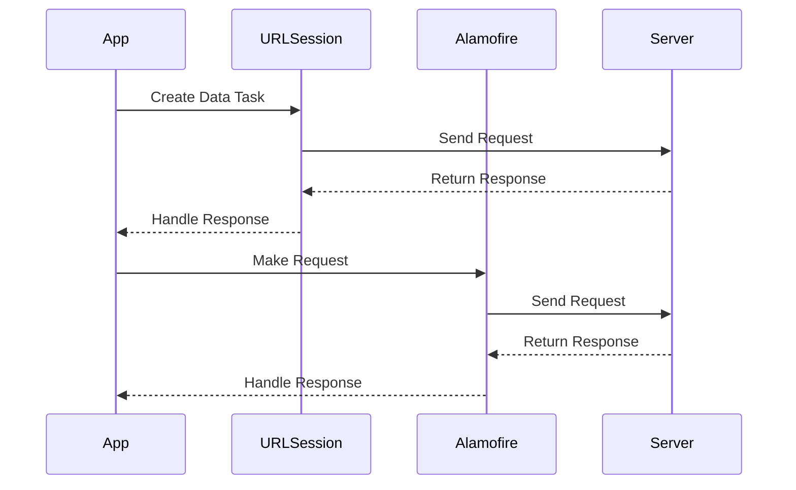

## 14.4 Networking with URLSession and Alamofire

Networking is a fundamental aspect of modern app development, enabling applications to communicate with servers, fetch data, and interact with web services. In Swift, two primary tools for networking are **URLSession** and **Alamofire**. In this section, we will explore both, understand their features, and learn how to choose the right tool for your needs.

### URLSession

**URLSession** is a powerful and flexible API provided by Apple for handling network requests. It offers fine-grained control over network operations, making it ideal for developers who need to manage networking tasks with precision.

#### Data Tasks

Data tasks are the most common type of tasks used with URLSession. They allow you to perform HTTP requests to retrieve data from a server or send data to a server.

```swift
import Foundation

// Create a URL object
guard let url = URL(string: "https://api.example.com/data") else {
    fatalError("Invalid URL")
}

// Create a URLSession data task
let task = URLSession.shared.dataTask(with: url) { data, response, error in
    // Handle the response
    if let error = error {
        print("Error: \\(error.localizedDescription)")
        return
    }
    
    guard let data = data else {
        print("No data received")
        return
    }
    
    // Parse the data
    do {
        let jsonObject = try JSONSerialization.jsonObject(with: data, options: [])
        print("Response JSON: \\(jsonObject)")
    } catch {
        print("Failed to parse JSON: \\(error.localizedDescription)")
    }
}

// Start the task
task.resume()
```

**Explanation**:  
- **URL**: We begin by creating a `URL` object. Ensure the URL is valid to avoid runtime errors.
- **dataTask(with:completionHandler:)**: This method creates a data task that retrieves the contents of the specified URL and calls a handler upon completion.
- **Completion Handler**: Handles the response, error, and data. It is crucial to check for errors and validate the received data before processing.

#### Configuration

URLSession provides several configuration options to customize network requests, such as timeouts, caching policies, and handling redirects.

```swift
let configuration = URLSessionConfiguration.default
configuration.timeoutIntervalForRequest = 30.0 // 30 seconds
configuration.requestCachePolicy = .reloadIgnoringLocalCacheData

let session = URLSession(configuration: configuration)
```

**Explanation**:  
- **URLSessionConfiguration**: Configures various aspects of the session, including timeouts and cache policies.
- **timeoutIntervalForRequest**: Sets the timeout interval for requests.
- **requestCachePolicy**: Determines how the session should interact with the cache.

#### Session Management

Efficient session management is crucial for performance, especially in applications that make frequent network requests. Reusing sessions can significantly reduce overhead.

```swift
let session = URLSession(configuration: .default)

// Reuse the session for multiple requests
let task1 = session.dataTask(with: url1) { data, response, error in
    // Handle response
}

let task2 = session.dataTask(with: url2) { data, response, error in
    // Handle response
}

task1.resume()
task2.resume()
```

**Explanation**:  
- **Session Reuse**: By reusing a single session, we can optimize resource usage and improve performance.

### Alamofire

**Alamofire** is a popular third-party library that simplifies networking tasks in Swift. It provides a more concise syntax and includes advanced features such as built-in JSON parsing and network reachability.

#### Simplified API

Alamofire's API is designed to be more straightforward and easier to use compared to URLSession, making it ideal for rapid development.

```swift
import Alamofire

AF.request("https://api.example.com/data").responseJSON { response in
    switch response.result {
    case .success(let value):
        print("Response JSON: \\(value)")
    case .failure(let error):
        print("Error: \\(error.localizedDescription)")
    }
}
```

**Explanation**:  
- **AF.request**: Initiates a network request. The syntax is concise and easy to read.
- **responseJSON**: Automatically parses the response as JSON, reducing boilerplate code.

#### Advanced Features

Alamofire offers several advanced features that enhance networking capabilities.

- **Built-in JSON Parsing**: Automatically parses JSON responses, saving time and reducing errors.
- **Network Reachability**: Monitors network reachability status, allowing your app to respond to changes in network connectivity.

```swift
let reachabilityManager = NetworkReachabilityManager()

reachabilityManager?.startListening { status in
    switch status {
    case .notReachable:
        print("Network not reachable")
    case .reachable(.ethernetOrWiFi):
        print("Network reachable via WiFi")
    case .reachable(.cellular):
        print("Network reachable via Cellular")
    case .unknown:
        print("Network status unknown")
    }
}
```

**Explanation**:  
- **NetworkReachabilityManager**: Monitors the network reachability status and provides callbacks for changes.

### Choosing Between URLSession and Alamofire

When deciding between URLSession and Alamofire, consider the following:

- **URLSession**: Offers fine-grained control over network requests and is part of the standard library, meaning no additional dependencies. It is ideal for developers who need to customize networking behavior extensively.
- **Alamofire**: Provides a simplified API and additional conveniences, making it suitable for rapid development and projects where ease of use is prioritized.

### Try It Yourself

To deepen your understanding, try modifying the code examples above. For instance, change the request URL, add headers, or experiment with different response handling techniques. This hands-on approach will reinforce the concepts and help you become more comfortable with both URLSession and Alamofire.

### Visualizing Networking with URLSession and Alamofire

Below is a sequence diagram illustrating the flow of a network request using URLSession and Alamofire.



**Description**:  
- **App**: Initiates network requests using either URLSession or Alamofire.
- **URLSession/Alamofire**: Sends the request to the server and handles the response.
- **Server**: Processes the request and returns a response.

### References and Links

- [Apple Developer Documentation for URLSession](https://developer.apple.com/documentation/foundation/urlsession)
- [Alamofire GitHub Repository](https://github.com/Alamofire/Alamofire)
- [JSON Parsing in Swift](https://developer.apple.com/documentation/foundation/jsonserialization)

### Knowledge Check

- What are the advantages of using URLSession over Alamofire?
- How does Alamofire simplify networking tasks compared to URLSession?
- What are some configuration options available in URLSession?
- How can you monitor network reachability using Alamofire?

### Embrace the Journey

Networking is a vast and essential part of app development. As you continue to explore URLSession and Alamofire, remember that mastering these tools will significantly enhance your ability to create robust and efficient applications. Keep experimenting, stay curious, and enjoy the journey!

## Quiz Time!



### What is the primary advantage of using URLSession over Alamofire?

- [x] Fine-grained control over network operations
- [ ] Built-in JSON parsing
- [ ] Network reachability monitoring
- [ ] Simplified API

> **Explanation:** URLSession provides fine-grained control over network operations, allowing for extensive customization.

### Which method in URLSession is used to create a data task?

- [x] dataTask(with:completionHandler:)
- [ ] request()
- [ ] startListening()
- [ ] responseJSON()

> **Explanation:** The dataTask(with:completionHandler:) method is used to create a data task in URLSession.

### What does the responseJSON method in Alamofire do?

- [x] Automatically parses the response as JSON
- [ ] Sends a network request
- [ ] Monitors network reachability
- [ ] Handles session management

> **Explanation:** The responseJSON method in Alamofire automatically parses the response as JSON, simplifying response handling.

### How can you configure a URLSession to ignore local cache data?

- [x] Set requestCachePolicy to .reloadIgnoringLocalCacheData
- [ ] Use responseJSON
- [ ] Call startListening()
- [ ] Set timeoutIntervalForRequest

> **Explanation:** Setting requestCachePolicy to .reloadIgnoringLocalCacheData configures URLSession to ignore local cache data.

### What is a feature of Alamofire that is not present in URLSession?

- [x] Network reachability monitoring
- [ ] Fine-grained control
- [ ] Session reuse
- [ ] Timeout configuration

> **Explanation:** Alamofire provides network reachability monitoring, a feature not present in URLSession.

### Which library is part of the standard Swift library?

- [x] URLSession
- [ ] Alamofire
- [ ] NetworkReachabilityManager
- [ ] AF.request

> **Explanation:** URLSession is part of the standard Swift library, requiring no additional dependencies.

### What does the NetworkReachabilityManager in Alamofire do?

- [x] Monitors network reachability status
- [ ] Sends HTTP requests
- [ ] Parses JSON responses
- [ ] Manages session configuration

> **Explanation:** The NetworkReachabilityManager in Alamofire monitors network reachability status and provides callbacks for changes.

### How can you reuse a session in URLSession?

- [x] Create a session and use it for multiple requests
- [ ] Use responseJSON
- [ ] Set requestCachePolicy
- [ ] Call startListening()

> **Explanation:** By creating a session and using it for multiple requests, you can reuse a session in URLSession.

### What is the main benefit of using Alamofire for networking?

- [x] Simplified API and additional conveniences
- [ ] Fine-grained control over requests
- [ ] No dependencies
- [ ] Extensive session management

> **Explanation:** Alamofire offers a simplified API and additional conveniences, making it ideal for rapid development.

### True or False: URLSession can automatically parse JSON responses.

- [ ] True
- [x] False

> **Explanation:** URLSession does not automatically parse JSON responses; this must be done manually.




