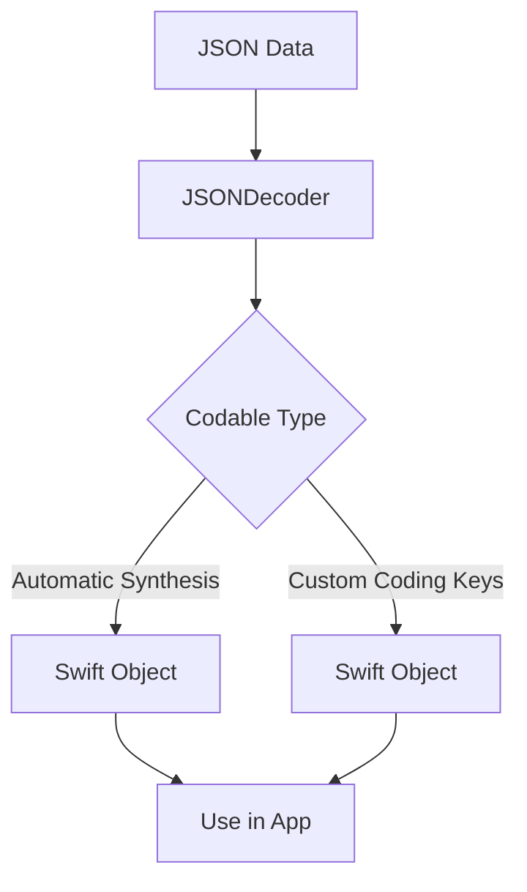

## 14.5 Parsing JSON and Codable Protocols

In the realm of modern app development, efficiently handling data is crucial, especially when dealing with JSON (JavaScript Object Notation), a widely-used data format. Swift's `Codable` protocol simplifies the process of encoding and decoding data, making it easier to work with JSON. In this section, we will delve into the intricacies of JSON parsing using `Codable` protocols, exploring automatic synthesis, custom coding keys, decoding strategies, and error handling.

### Introduction to Codable Protocols

Swift's `Codable` protocol is a type alias for the `Encodable` and `Decodable` protocols, allowing types to be encoded to and decoded from external representations such as JSON. By conforming to `Codable`, Swift types can automatically gain the ability to serialize and deserialize themselves with minimal boilerplate code.

```swift
struct User: Codable {
    var id: Int
    var name: String
    var email: String
}
```

In this example, the `User` struct automatically conforms to `Codable`, enabling JSON encoding and decoding without additional code.

### Automatic Synthesis of Codable

Swift provides automatic synthesis of the `Codable` protocol for types that have properties conforming to `Codable`. This feature significantly reduces the amount of code developers need to write and maintain.

#### How Automatic Synthesis Works

When a struct or class conforms to `Codable`, Swift synthesizes the necessary methods to encode and decode instances of that type, provided all its properties are also `Codable`. This synthesis covers both `Encodable` and `Decodable` functionalities.

```swift
let jsonData = """
{
    "id": 1,
    "name": "John Doe",
    "email": "john.doe@example.com"
}
""".data(using: .utf8)!

do {
    let user = try JSONDecoder().decode(User.self, from: jsonData)
    print("User: \\(user.name), Email: \\(user.email)")
} catch {
    print("Failed to decode JSON: \\(error)")
}
```

### Custom Coding Keys

Sometimes, the keys in JSON data do not match the property names in your Swift types. In such cases, you can use custom coding keys to map JSON keys to your properties.

#### Implementing Custom Coding Keys

To handle mismatched keys, define a nested `CodingKeys` enum within your type that conforms to `CodingKey`. This enum specifies the mapping between JSON keys and property names.

```swift
struct Product: Codable {
    var id: Int
    var productName: String
    var price: Double

    enum CodingKeys: String, CodingKey {
        case id
        case productName = "product_name"
        case price
    }
}
```

In this example, the `productName` property maps to the `product_name` key in the JSON data.

### Decoding Strategies

Swift's `JSONDecoder` provides several strategies to handle common decoding scenarios, such as date parsing and key naming conventions.

#### DateDecodingStrategy

Dates in JSON can be represented in various formats. Swift's `JSONDecoder` offers several `DateDecodingStrategy` options to parse dates.

```swift
let decoder = JSONDecoder()
decoder.dateDecodingStrategy = .iso8601

struct Event: Codable {
    var name: String
    var date: Date
}

let jsonData = """
{
    "name": "Conference",
    "date": "2023-11-23T10:00:00Z"
}
""".data(using: .utf8)!

do {
    let event = try decoder.decode(Event.self, from: jsonData)
    print("Event: \\(event.name), Date: \\(event.date)")
} catch {
    print("Failed to decode JSON: \\(error)")
}
```

#### KeyDecodingStrategy

The `KeyDecodingStrategy` allows you to convert between different key naming conventions, such as converting snake_case keys to camelCase properties.

```swift
decoder.keyDecodingStrategy = .convertFromSnakeCase

struct Article: Codable {
    var title: String
    var authorName: String
}

let jsonData = """
{
    "title": "Swift Codable",
    "author_name": "Jane Doe"
}
""".data(using: .utf8)!

do {
    let article = try decoder.decode(Article.self, from: jsonData)
    print("Article: \\(article.title), Author: \\(article.authorName)")
} catch {
    print("Failed to decode JSON: \\(error)")
}
```

### Error Handling in JSON Decoding

When working with JSON, errors are inevitable. Swift provides robust mechanisms to handle decoding errors gracefully.

#### Using Do-Catch Blocks

Swift's `do-catch` blocks allow you to manage errors during the decoding process. You can catch specific errors or handle them generically.

```swift
do {
    let user = try JSONDecoder().decode(User.self, from: jsonData)
    print("User: \\(user.name), Email: \\(user.email)")
} catch DecodingError.dataCorrupted(let context) {
    print("Data corrupted: \\(context.debugDescription)")
} catch DecodingError.keyNotFound(let key, let context) {
    print("Key '\\(key)' not found: \\(context.debugDescription)")
} catch {
    print("Decoding error: \\(error.localizedDescription)")
}
```

#### Partial Decoding

In scenarios where JSON data might have missing or extra fields, Swift allows partial decoding. This approach enables you to decode only the fields you need, ignoring others.

```swift
struct PartialUser: Codable {
    var id: Int
    var name: String
}

let jsonData = """
{
    "id": 1,
    "name": "John Doe",
    "email": "john.doe@example.com"
}
""".data(using: .utf8)!

do {
    let partialUser = try JSONDecoder().decode(PartialUser.self, from: jsonData)
    print("Partial User: \\(partialUser.name)")
} catch {
    print("Failed to decode JSON: \\(error)")
}
```

### Try It Yourself

To deepen your understanding, try modifying the code examples. For instance, experiment with different `DateDecodingStrategy` options, or create a new struct with custom coding keys and test it with JSON data that has mismatched keys.

### Visualizing JSON Parsing with Codable

Let's visualize the process of JSON parsing using Codable protocols in Swift. This diagram illustrates the flow from JSON data to Swift objects using automatic synthesis and custom coding keys.



This flowchart represents how JSON data is processed by `JSONDecoder`, utilizing either automatic synthesis or custom coding keys to produce Swift objects for use in your application.

### References and Links

- [Apple's Swift Documentation on Codable](https://developer.apple.com/documentation/swift/codable)
- [JSONDecoder Class Reference](https://developer.apple.com/documentation/foundation/jsondecoder)
- [Swift.org - Swift Language Guide](https://docs.swift.org/swift-book/LanguageGuide/TheBasics.html)

### Knowledge Check

- Explain how automatic synthesis of Codable works in Swift.
- Demonstrate how to use custom coding keys to handle mismatched JSON keys.
- Provide an example of using `DateDecodingStrategy` to parse ISO 8601 dates.
- Discuss how `do-catch` blocks can be used to handle decoding errors.

### Embrace the Journey

Remember, mastering JSON parsing and Codable protocols in Swift is a journey. As you progress, you'll encounter more complex data structures and scenarios. Keep experimenting, stay curious, and enjoy the process of building robust Swift applications.

## Quiz Time!



### What is the primary purpose of the Codable protocol in Swift?

- [x] To enable types to be encoded and decoded to/from external representations like JSON.
- [ ] To manage memory allocation for Swift objects.
- [ ] To handle concurrency in Swift applications.
- [ ] To provide a graphical user interface for Swift applications.

> **Explanation:** The Codable protocol allows Swift types to be easily encoded and decoded to/from external data formats such as JSON.

### How does Swift handle mismatched JSON keys when using Codable?

- [ ] By ignoring the mismatched keys.
- [ ] By automatically renaming the keys.
- [x] By using custom coding keys defined in a nested enum.
- [ ] By throwing an error.

> **Explanation:** Swift allows the use of custom coding keys through a nested enum to map JSON keys to Swift property names.

### Which strategy would you use to parse dates in JSON that are in ISO 8601 format?

- [x] DateDecodingStrategy.iso8601
- [ ] DateDecodingStrategy.formatted
- [ ] DateDecodingStrategy.custom
- [ ] DateDecodingStrategy.secondsSince1970

> **Explanation:** The DateDecodingStrategy.iso8601 is specifically used to parse dates in the ISO 8601 format.

### What is the purpose of the KeyDecodingStrategy in JSONDecoder?

- [ ] To handle errors during JSON decoding.
- [x] To convert between different key naming conventions.
- [ ] To manage memory allocation during decoding.
- [ ] To optimize performance of the decoding process.

> **Explanation:** KeyDecodingStrategy allows conversion between different key naming conventions, such as snake_case to camelCase.

### How can you handle decoding errors in Swift?

- [x] Using do-catch blocks to manage errors.
- [ ] By ignoring the errors.
- [ ] By automatically retrying the decoding process.
- [ ] By converting errors to warnings.

> **Explanation:** Swift's do-catch blocks are used to manage errors during the decoding process.

### What is a benefit of using automatic synthesis of Codable?

- [x] It reduces boilerplate code for encoding and decoding.
- [ ] It increases the performance of Swift applications.
- [ ] It simplifies memory management.
- [ ] It enhances user interface design.

> **Explanation:** Automatic synthesis of Codable reduces the amount of boilerplate code needed for encoding and decoding Swift types.

### How does partial decoding help when working with JSON data?

- [ ] By decoding all fields and ignoring errors.
- [x] By allowing you to decode only the fields you need.
- [ ] By automatically filling missing fields with default values.
- [ ] By converting all fields to optional types.

> **Explanation:** Partial decoding allows you to decode only the fields you need, ignoring extra fields in the JSON data.

### What is the role of the JSONDecoder class in Swift?

- [ ] To encode Swift objects into JSON.
- [x] To decode JSON data into Swift objects.
- [ ] To manage memory allocation for JSON data.
- [ ] To provide a graphical interface for JSON data.

> **Explanation:** JSONDecoder is used to decode JSON data into Swift objects.

### Can Codable be used with custom data formats other than JSON?

- [x] True
- [ ] False

> **Explanation:** Codable can be used with other data formats, such as Property List (plist), by using the appropriate encoder and decoder.




