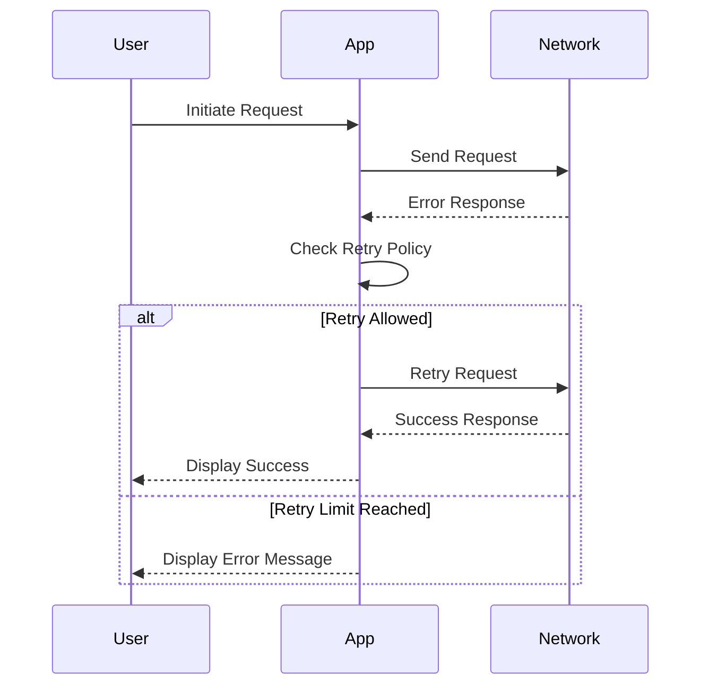

## 14.6 Handling Network Errors and Retries

In today's connected world, robust network error handling and retry strategies are essential for building resilient applications. Whether you're developing for iOS, macOS, or server-side Swift, understanding how to effectively manage network errors and implement retry mechanisms can significantly enhance the user experience and reliability of your applications. In this section, we will explore common network errors, strategies for implementing retries, and how to maintain a seamless user experience even in the face of network challenges.

### Understanding Common Network Errors

Network errors are inevitable in any application that relies on internet connectivity. These errors can arise from various sources, including server-side issues, client-side connectivity problems, or even transient network conditions. Let's delve into some of the most common types of network errors you might encounter:

#### HTTP Errors

HTTP errors are typically indicated by status codes returned from the server. These are categorized into different ranges:

- **4xx Client Errors**: These errors indicate issues on the client's side, such as a malformed request or unauthorized access. Common examples include:
  - **401 Unauthorized**: The request requires user authentication.
  - **404 Not Found**: The requested resource could not be found.
  - **403 Forbidden**: The server understands the request but refuses to authorize it.

- **5xx Server Errors**: These errors indicate issues on the server's side, suggesting that the server failed to fulfill a valid request. Examples include:
  - **500 Internal Server Error**: A generic error message when the server encounters an unexpected condition.
  - **503 Service Unavailable**: The server is currently unable to handle the request due to temporary overloading or maintenance.

#### Connection Issues

Connection issues can prevent your application from communicating with the server. These can be caused by:

- **Timeouts**: When a request takes too long to complete, it may time out, leading to an error.
- **No Internet Connection**: The device is not connected to the internet, preventing any network requests from succeeding.

### Implementing Retries

Implementing a retry mechanism is crucial for recovering from transient network errors. A well-designed retry strategy can improve the resilience of your application by automatically attempting to recover from errors without user intervention.

#### Retry Policies

When implementing retries, it's important to define a clear policy. Here are some common strategies:

- **Immediate Retries**: Attempt to retry the request immediately after a failure. This is suitable for transient errors that are likely to resolve quickly.
- **Delayed Retries**: Introduce a delay between retries to give the system time to recover. This can be implemented using exponential backoff, where the delay increases with each subsequent retry.

```swift
import Foundation

func performRequestWithRetry(url: URL, maxAttempts: Int, delay: TimeInterval, completion: @escaping (Data?, URLResponse?, Error?) -> Void) {
    var attempts = 0
    
    func attemptRequest() {
        attempts += 1
        let task = URLSession.shared.dataTask(with: url) { data, response, error in
            if let error = error, attempts < maxAttempts {
                print("Request failed with error: \\(error). Retrying in \\(delay) seconds...")
                DispatchQueue.global().asyncAfter(deadline: .now() + delay) {
                    attemptRequest()
                }
            } else {
                completion(data, response, error)
            }
        }
        task.resume()
    }
    
    attemptRequest()
}
```

In the code above, we define a function `performRequestWithRetry` that attempts to perform a network request up to a specified number of times (`maxAttempts`). If an error occurs, it waits for a specified delay before retrying.

#### Maximum Attempts

To prevent infinite retry loops, it's essential to set a maximum number of retry attempts. This ensures that your application doesn't exhaust resources or create a poor user experience by continuously retrying a failing request.

### Enhancing User Experience

Handling network errors gracefully is not just about retrying requests; it's also about maintaining a positive user experience. Here are some strategies to consider:

#### Providing Helpful Error Messages

When network errors occur, it's important to inform users of the issue in a clear and helpful manner. Avoid technical jargon and provide actionable suggestions when possible.

```swift
func handleNetworkError(_ error: Error) {
    // Provide a user-friendly error message
    let alert = UIAlertController(title: "Network Error", message: "Unable to connect to the server. Please check your internet connection and try again.", preferredStyle: .alert)
    alert.addAction(UIAlertAction(title: "Retry", style: .default, handler: { _ in
        // Retry the operation
    }))
    alert.addAction(UIAlertAction(title: "Cancel", style: .cancel, handler: nil))
    // Present the alert to the user
    // Assuming this is called within a UIViewController
    self.present(alert, animated: true, completion: nil)
}
```

#### Offline Mode

Consider implementing an offline mode that allows your app to function without an active network connection. This can involve caching data locally and syncing changes once connectivity is restored.

```swift
import CoreData

func fetchCachedData() -> [CachedItem] {
    // Fetch data from local cache
    let fetchRequest: NSFetchRequest<CachedItem> = CachedItem.fetchRequest()
    do {
        let cachedItems = try persistentContainer.viewContext.fetch(fetchRequest)
        return cachedItems
    } catch {
        print("Failed to fetch cached data: \\(error)")
        return []
    }
}

func syncDataWithServer() {
    // Sync local changes with the server once the connection is restored
    // This function should be called when the network becomes available
}
```

### Visualizing Network Error Handling and Retry Logic

To better understand how network error handling and retry logic work together, let's visualize the process using a sequence diagram.



This diagram illustrates the flow of a network request, handling errors, and retrying based on a defined policy. The app attempts to retry the request if allowed by the retry policy, otherwise, it displays an error message to the user.

### References and Further Reading

- [Apple Developer Documentation: URLSession](https://developer.apple.com/documentation/foundation/urlsession)
- [Swift.org: Error Handling](https://swift.org/documentation/#error-handling)
- [Ray Wenderlich: Networking in Swift](https://www.raywenderlich.com/3244963-urlsession-tutorial-getting-started)

### Knowledge Check

Let's reinforce what we've learned with a few questions:

1. What are the differences between 4xx and 5xx HTTP errors?
2. How can you implement exponential backoff in retry logic?
3. Why is it important to set a maximum number of retry attempts?
4. How can you enhance user experience when network errors occur?

### Embrace the Journey

Remember, mastering network error handling and retries is just one step in building robust applications. As you continue to develop your skills, you'll find new ways to improve your app's resilience and user experience. Keep experimenting, stay curious, and enjoy the journey!

## Quiz Time!



### What is a 404 HTTP error?

- [x] A client-side error indicating the requested resource could not be found.
- [ ] A server-side error indicating the server is overloaded.
- [ ] An error indicating the request requires user authentication.
- [ ] An error indicating a timeout occurred.

> **Explanation:** A 404 HTTP error is a client-side error indicating that the requested resource could not be found on the server.

### How can you prevent infinite retry loops?

- [x] By setting a maximum number of retry attempts.
- [ ] By using immediate retries without delay.
- [ ] By ignoring network errors.
- [ ] By using longer delays between retries.

> **Explanation:** Setting a maximum number of retry attempts prevents infinite retry loops, ensuring the application does not continuously retry a failing request.

### What is exponential backoff?

- [x] A retry strategy where the delay between retries increases exponentially.
- [ ] A retry strategy where retries are immediate.
- [ ] A method for handling server-side errors.
- [ ] A technique for caching data locally.

> **Explanation:** Exponential backoff is a retry strategy where the delay between retries increases exponentially, allowing the system time to recover.

### Why is it important to provide helpful error messages?

- [x] To inform users of the issue in a clear and actionable manner.
- [ ] To use technical jargon for better understanding.
- [ ] To avoid retrying requests.
- [ ] To prevent users from using the app.

> **Explanation:** Providing helpful error messages informs users of the issue in a clear and actionable manner, enhancing the user experience.

### What is offline mode?

- [x] A feature that allows app functionality without a network connection.
- [ ] A way to disable network requests.
- [ ] A method for handling 5xx errors.
- [ ] A technique for immediate retries.

> **Explanation:** Offline mode is a feature that allows app functionality without a network connection, often by caching data locally.

### How can you sync data with the server after a network error?

- [x] By implementing offline mode and syncing changes once connectivity is restored.
- [ ] By ignoring network errors.
- [ ] By using immediate retries.
- [ ] By displaying error messages only.

> **Explanation:** Implementing offline mode and syncing changes once connectivity is restored allows for seamless data synchronization after a network error.

### What is a 5xx HTTP error?

- [x] A server-side error indicating the server failed to fulfill a valid request.
- [ ] A client-side error indicating a malformed request.
- [ ] An error indicating the request requires user authentication.
- [ ] An error indicating a timeout occurred.

> **Explanation:** A 5xx HTTP error is a server-side error indicating that the server failed to fulfill a valid request.

### What should you do if retry limit is reached?

- [x] Display an error message to the user.
- [ ] Continue retrying indefinitely.
- [ ] Ignore the error and proceed.
- [ ] Disable network requests.

> **Explanation:** If the retry limit is reached, displaying an error message to the user informs them of the issue and prevents further unnecessary retries.

### What is the purpose of a retry policy?

- [x] To define the strategy for retrying failed network requests.
- [ ] To handle 4xx errors.
- [ ] To cache data locally.
- [ ] To disable network requests.

> **Explanation:** A retry policy defines the strategy for retrying failed network requests, including the number of attempts and delay between retries.

### True or False: Implementing retries can improve app resilience.

- [x] True
- [ ] False

> **Explanation:** True. Implementing retries can improve app resilience by automatically attempting to recover from transient network errors without user intervention.




