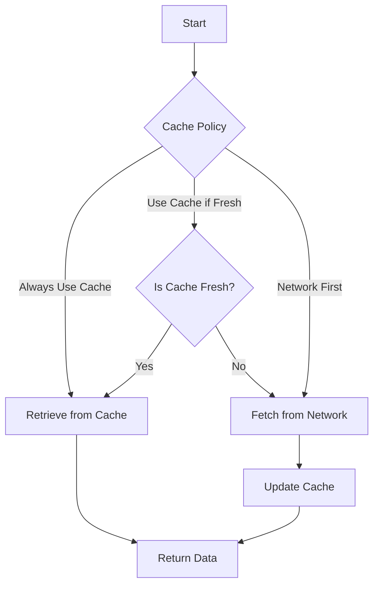

## 14.7 Caching Strategies

In the world of Swift development, optimizing app performance and reducing network usage are paramount. Caching is a crucial technique that allows developers to store data temporarily, enabling quicker access and reducing the need to fetch data repeatedly over the network. This section explores various caching strategies, their implementation, and the tools available in Swift to enhance your app's performance.

### Purpose of Caching

The primary purpose of caching is to improve application performance and user experience by minimizing the time and resources required to access data. Caching can significantly reduce network bandwidth usage and server load, leading to faster response times and a smoother user experience.

### Types of Caching

Caching can be broadly categorized into two types: In-Memory Cache and Disk Cache. Each has its advantages and use cases.

#### In-Memory Cache

**In-Memory Cache** stores data in the device's RAM, allowing for extremely fast access. However, this data is volatile and will be lost when the app is terminated. It's ideal for temporary data that needs to be accessed frequently during the app's lifecycle.

- **Advantages**: Speed, simplicity.
- **Disadvantages**: Limited by device memory, data loss on app termination.

Example of using `NSCache` for in-memory caching:

```swift
import Foundation

class ImageCache {
    private let cache = NSCache<NSString, UIImage>()
    
    func storeImage(_ image: UIImage, forKey key: String) {
        cache.setObject(image, forKey: key as NSString)
    }
    
    func retrieveImage(forKey key: String) -> UIImage? {
        return cache.object(forKey: key as NSString)
    }
}
```

**Key Points**:
- `NSCache` automatically removes objects when memory is low.
- It is thread-safe, making it suitable for concurrent access.

#### Disk Cache

**Disk Cache** stores data on the device's persistent storage, allowing it to survive app restarts. It is suitable for data that needs to be available across sessions, such as images or large datasets.

- **Advantages**: Persistence across sessions, larger storage capacity.
- **Disadvantages**: Slower access compared to in-memory cache.

Example using file system for disk caching:

```swift
import Foundation

class DiskCache {
    private let fileManager = FileManager.default
    private let cacheDirectory: URL
    
    init() {
        let directories = fileManager.urls(for: .cachesDirectory, in: .userDomainMask)
        cacheDirectory = directories.first!
    }
    
    func storeData(_ data: Data, forKey key: String) {
        let fileURL = cacheDirectory.appendingPathComponent(key)
        try? data.write(to: fileURL)
    }
    
    func retrieveData(forKey key: String) -> Data? {
        let fileURL = cacheDirectory.appendingPathComponent(key)
        return try? Data(contentsOf: fileURL)
    }
}
```

**Key Points**:
- Use `FileManager` to handle file operations.
- Consider using a hashing function for keys to avoid illegal filename characters.

### Implementing Caching

Implementing caching involves deciding when to use cached data and ensuring that the cached data remains valid.

#### Cache Policies

**Cache Policies** determine when to use cached data versus fetching fresh data. Common policies include:

- **Always Use Cache**: Use cached data if available, regardless of its age.
- **Use Cache if Fresh**: Use cached data only if it is considered fresh, based on a predefined expiration time.
- **Network First**: Always fetch fresh data, updating the cache in the process.

Implementing a cache policy:

```swift
enum CachePolicy {
    case alwaysUseCache
    case useCacheIfFresh(expiry: TimeInterval)
    case networkFirst
}

class DataFetcher {
    private let cache = DiskCache()
    private let expiryTime: TimeInterval = 60 * 60 // 1 hour
    
    func fetchData(forKey key: String, policy: CachePolicy, completion: @escaping (Data?) -> Void) {
        switch policy {
        case .alwaysUseCache:
            completion(cache.retrieveData(forKey: key))
        case .useCacheIfFresh(let expiry):
            if let data = cache.retrieveData(forKey: key), isDataFresh(data, expiry: expiry) {
                completion(data)
            } else {
                fetchFromNetwork(forKey: key, completion: completion)
            }
        case .networkFirst:
            fetchFromNetwork(forKey: key, completion: completion)
        }
    }
    
    private func isDataFresh(_ data: Data, expiry: TimeInterval) -> Bool {
        // Implement logic to check data freshness
        return true
    }
    
    private func fetchFromNetwork(forKey key: String, completion: @escaping (Data?) -> Void) {
        // Network fetching logic
        // Update cache with new data
    }
}
```

**Key Points**:
- Customize cache policies based on app requirements.
- Consider network conditions and data sensitivity when choosing a policy.

#### Validation

**Validation** ensures that cached data is still valid and relevant. This can involve checking timestamps, data integrity, or even making conditional requests to the server.

Example of validating cache data:

```swift
func isCacheValid(forKey key: String, expiry: TimeInterval) -> Bool {
    let fileURL = cacheDirectory.appendingPathComponent(key)
    let attributes = try? fileManager.attributesOfItem(atPath: fileURL.path)
    if let modificationDate = attributes?[.modificationDate] as? Date {
        return Date().timeIntervalSince(modificationDate) < expiry
    }
    return false
}
```

**Key Points**:
- Use file attributes to check modification dates for disk cache.
- Implement custom validation logic as needed.

### Frameworks and Tools

Swift provides built-in tools and third-party libraries to facilitate caching.

#### NSCache

**NSCache** is a built-in class that provides a fast, in-memory caching mechanism. It automatically removes objects when memory is low, making it ideal for temporary data storage.

- **Thread-Safe**: Suitable for concurrent access.
- **Cost-Based Eviction**: Objects can be evicted based on a cost, allowing for more granular control.

#### Third-Party Libraries

Several third-party libraries offer advanced caching features. One popular library is **Kingfisher**, which is widely used for image caching.

- **Kingfisher**: Provides an easy-to-use API for downloading and caching images. It supports both in-memory and disk caching.

Example of using Kingfisher for image caching:

```swift
import Kingfisher

let imageView = UIImageView()
let url = URL(string: "https://example.com/image.jpg")
imageView.kf.setImage(with: url)
```

**Key Points**:
- Kingfisher handles caching and image downloading efficiently.
- Supports cache cleaning and expiration policies.

### Visualizing Caching Strategies

To better understand the flow of caching strategies, consider the following diagram that illustrates the decision-making process for using cache versus fetching from the network.



**Description**: This diagram shows the decision-making process for using cached data versus fetching fresh data based on different cache policies.

### Knowledge Check

- **What is the primary purpose of caching?**
- **Explain the difference between in-memory and disk caching.**
- **What are cache policies, and why are they important?**
- **How does NSCache differ from using the file system for caching?**

### Try It Yourself

Experiment with the provided code examples by:

- Modifying the cache policy to see how it affects data retrieval.
- Implementing a custom validation logic for cached data.
- Using Kingfisher to cache and display images in a sample app.

### References and Links

- [Apple Developer Documentation on NSCache](https://developer.apple.com/documentation/foundation/nscache)
- [Kingfisher GitHub Repository](https://github.com/onevcat/Kingfisher)
- [Swift.org](https://swift.org/)

### Embrace the Journey

Remember, caching is a powerful tool to enhance app performance. As you implement these strategies, keep experimenting and refining your approach to find the best fit for your application's needs. Stay curious and enjoy the journey of optimizing your Swift applications!

## Quiz Time!



### What is the primary purpose of caching in Swift applications?

- [x] Improve app performance and reduce network usage
- [ ] Increase app size
- [ ] Complicate code structure
- [ ] Enhance user interface design

> **Explanation:** Caching aims to improve app performance by reducing the need to repeatedly fetch data over the network, thus enhancing user experience.

### Which type of cache is stored in the device's RAM?

- [x] In-Memory Cache
- [ ] Disk Cache
- [ ] Cloud Cache
- [ ] Persistent Cache

> **Explanation:** In-Memory Cache stores data in the device's RAM for quick access but is volatile and lost when the app terminates.

### What is a disadvantage of using in-memory cache?

- [x] Data loss on app termination
- [ ] Slow access speed
- [ ] High storage capacity
- [ ] Complex implementation

> **Explanation:** In-memory cache data is volatile and will be lost when the application is closed.

### Which cache policy always fetches fresh data and updates the cache?

- [ ] Always Use Cache
- [ ] Use Cache if Fresh
- [x] Network First
- [ ] Cache Only

> **Explanation:** The Network First policy prioritizes fetching fresh data and updating the cache.

### What is the role of validation in caching?

- [ ] Increase cache size
- [ ] Slow down data retrieval
- [x] Ensure cached data is still valid
- [ ] Enhance data encryption

> **Explanation:** Validation ensures that the cached data remains relevant and accurate.

### Which built-in Swift class provides a fast, in-memory caching mechanism?

- [x] NSCache
- [ ] FileManager
- [ ] URLSession
- [ ] UserDefaults

> **Explanation:** `NSCache` is a built-in class for in-memory caching, providing a fast and efficient way to store temporary data.

### What is a key feature of Kingfisher library?

- [ ] Networking
- [x] Image caching
- [ ] Database management
- [ ] Animation

> **Explanation:** Kingfisher is a popular third-party library for downloading and caching images efficiently.

### How does disk cache differ from in-memory cache?

- [ ] Disk cache is faster
- [x] Disk cache persists across app sessions
- [ ] Disk cache is stored in RAM
- [ ] Disk cache is more volatile

> **Explanation:** Disk cache stores data on the device's storage, allowing it to persist across app sessions.

### Which method is used to store an image in NSCache?

- [x] setObject(_:forKey:)
- [ ] addImage(_:forKey:)
- [ ] cacheImage(_:withKey:)
- [ ] store(_:forKey:)

> **Explanation:** The `setObject(_:forKey:)` method is used to store objects in `NSCache`.

### True or False: NSCache automatically removes objects when memory is low.

- [x] True
- [ ] False

> **Explanation:** `NSCache` is designed to automatically remove objects to free up memory when needed.


